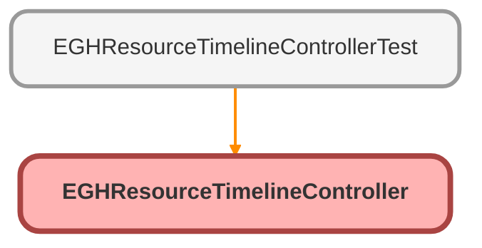

---
hide:
  - path
---

# EGHResourceTimelineController Class

## Class Diagram



<!-- Apex description -->

## Apex Code

```java
public without sharing class EGHResourceTimelineController {
    @AuraEnabled(cacheable=true)
    public static List<BranchUnit> getBranchUnits() {
        String userDivision = getCurrentUserDivision();
        if (String.isBlank(userDivision)) {
            return new List<BranchUnit>();
        }
        
        return [
            SELECT Id, Name 
            FROM BranchUnit 
            WHERE Name = :userDivision 
            AND IsActive = true
        ];
    }

    @AuraEnabled(cacheable=true)
    public static Map<Id, List<EGH_ShowroomVisit__c>> getShowroomVisits() {
        String userDivision = getCurrentUserDivision();
        if (String.isBlank(userDivision)) {
            return new Map<Id, List<EGH_ShowroomVisit__c>>();
        }
        
        Map<Id, List<EGH_ShowroomVisit__c>> branchVisits = new Map<Id, List<EGH_ShowroomVisit__c>>();
        
        // UPDATED QUERY: Added Lead and Account fields to get Name, Email, Mobile
        List<EGH_ShowroomVisit__c> visits = [
            SELECT Id, Name, EGH_StartDateTime__c, EGH_EndDateTime__c, 
                   EGH_RelatedShowroomBranch__c, PurposeVisit__c,EGH_SR_Opportunity__r.Account.PersonMobilePhone,EGH_SR_Opportunity__r.Account.PersonEmail,
                   EGH_LeadLookup__r.Name, EGH_LeadLookup__r.Email, EGH_LeadLookup__r.MobilePhone,
                   EGH_AccountLookup__r.Name, EGH_AccountLookup__r.PersonMobilePhone,EGH_AccountLookup__r.PersonEmail
            FROM EGH_ShowroomVisit__c 
            WHERE EGH_RelatedShowroomBranch__r.Name = :userDivision
            AND EGH_StartDateTime__c != null
            AND EGH_EndDateTime__c != null WITH SYSTEM_MODE
            ORDER BY EGH_StartDateTime__c ];
        
        for (EGH_ShowroomVisit__c visit : visits) {
            Id branchId = visit.EGH_RelatedShowroomBranch__c;
            if (!branchVisits.containsKey(branchId)) {
                branchVisits.put(branchId, new List<EGH_ShowroomVisit__c>());
            }
            branchVisits.get(branchId).add(visit);
        }

        return branchVisits;
    }
    
    private static String getCurrentUserDivision() {
        try {
            User currentUser = [SELECT Division FROM User WHERE Id = :UserInfo.getUserId() LIMIT 1];
            return currentUser.Division;
        } catch (Exception e) {
            System.debug('Error getting user division: ' + e.getMessage());
            return null;
        }
    }
}
```

## Methods
### `getBranchUnits()`

`AURAENABLED`

#### Signature
```apex
public static List<BranchUnit> getBranchUnits()
```

#### Return Type
**List<BranchUnit>**

---

### `getShowroomVisits()`

`AURAENABLED`

#### Signature
```apex
public static Map<Id,List<EGH_ShowroomVisit__c>> getShowroomVisits()
```

#### Return Type
**Map<Id,List<EGH_ShowroomVisit__c>>**

---

### `getCurrentUserDivision()`

#### Signature
```apex
private static String getCurrentUserDivision()
```

#### Return Type
**String**