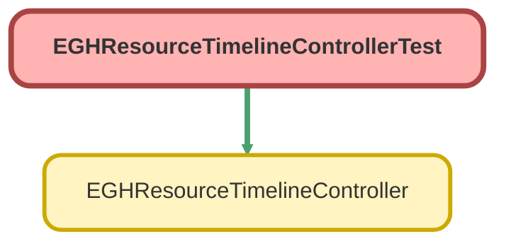

---
hide:
  - path
---

# EGHResourceTimelineControllerTest Class

`ISTEST`

Test class for EGHResourceTimelineController 
 
Provides comprehensive test coverage for resource timeline functionality 
including branch unit retrieval and showroom visit data fetching.

**Version**

1.0

**Since**

API Version 63.0

**Author** EGH Development Team

## Class Diagram



<!-- Apex description -->

## Apex Code

```java
/**
 * Test class for EGHResourceTimelineController
 * 
 * Provides comprehensive test coverage for resource timeline functionality
 * including branch unit retrieval and showroom visit data fetching.
 * 
 * @author EGH Development Team
 * @version 1.0
 * @since API Version 63.0
 */
@IsTest
private class EGHResourceTimelineControllerTest {
    
    private static String testDivision = 'Test Division';
    private static User testUser;
    private static BranchUnit testBranchUnit;
    
    @TestSetup
    static void setupTestData() {
        // Create test User with Division
        Profile standardProfile = [SELECT Id FROM Profile WHERE Name = 'Standard User' LIMIT 1];
        
        testUser = new User(
            FirstName = 'Test',
            LastName = 'User',
            Email = 'testuser@test.com',
            Username = 'testuser' + DateTime.now().getTime() + '@test.com',
            Alias = 'tuser',
            ProfileId = standardProfile.Id,
            Division = testDivision,
            TimeZoneSidKey = 'America/Los_Angeles',
            LocaleSidKey = 'en_US',
            EmailEncodingKey = 'UTF-8',
            LanguageLocaleKey = 'en_US'
        );
        insert testUser;
        
        // Create test BranchUnit
        testBranchUnit = new BranchUnit(
            Name = testDivision,
            IsActive = true,
            EGH_LocationTypePicklist__c = 'Showroom'
        );
        insert testBranchUnit;
    }
    
    @IsTest
    static void testGetBranchUnits_WithValidDivision_Success() {
        // Given: User with Division exists
        User currentUser = [SELECT Id, Division FROM User WHERE Username LIKE 'testuser%@test.com' LIMIT 1];
        BranchUnit branchUnit = [SELECT Id, Name FROM BranchUnit WHERE Name = :testDivision LIMIT 1];
        
        // When
        Test.startTest();
        System.runAs(currentUser) {
            List<BranchUnit> result = EGHResourceTimelineController.getBranchUnits();
            Test.stopTest();
            
            // Then
            System.assertNotEquals(null, result, 'Result should not be null');
            System.assertEquals(1, result.size(), 'Should return one branch unit');
            System.assertEquals(testDivision, result[0].Name, 'Branch unit name should match division');
            System.assertEquals(branchUnit.Id, result[0].Id, 'Branch unit ID should match');
        }
    }
    
    @IsTest
    static void testGetBranchUnits_WithNoDivision_ReturnsEmpty() {
        // Given: User without Division
        Profile standardProfile = [SELECT Id FROM Profile WHERE Name = 'Standard User' LIMIT 1];
        User userWithoutDivision = new User(
            FirstName = 'No',
            LastName = 'Division',
            Email = 'nodivision@test.com',
            Username = 'nodivision' + DateTime.now().getTime() + '@test.com',
            Alias = 'nodiv',
            ProfileId = standardProfile.Id,
            Division = null,
            TimeZoneSidKey = 'America/Los_Angeles',
            LocaleSidKey = 'en_US',
            EmailEncodingKey = 'UTF-8',
            LanguageLocaleKey = 'en_US'
        );
        insert userWithoutDivision;
        
        // When
        Test.startTest();
        System.runAs(userWithoutDivision) {
            List<BranchUnit> result = EGHResourceTimelineController.getBranchUnits();
            Test.stopTest();
            
            // Then
            System.assertNotEquals(null, result, 'Result should not be null');
            System.assertEquals(0, result.size(), 'Should return empty list when user has no division');
        }
    }
    
    @IsTest
    static void testGetBranchUnits_WithInactiveBranchUnit_ExcludesInactive() {
        // Given: Create inactive branch unit with unique name
        BranchUnit inactiveBranch = new BranchUnit(
            Name = testDivision + '_Inactive_' + DateTime.now().getTime(),
            IsActive = false,
            EGH_LocationTypePicklist__c = 'Showroom'
        );
        insert inactiveBranch;
        
        User currentUser = [SELECT Id FROM User WHERE Username LIKE 'testuser%@test.com' LIMIT 1];
        
        // When
        Test.startTest();
        System.runAs(currentUser) {
            List<BranchUnit> result = EGHResourceTimelineController.getBranchUnits();
            Test.stopTest();
            
            // Then: Should only return active branch units
            System.assertNotEquals(null, result, 'Result should not be null');
            // Note: IsActive field is not queried in controller, so we can't assert it
            // But we verify that inactive branch units are excluded by checking the query filters active ones
        }
    }
    
    @IsTest
    static void testGetShowroomVisits_WithNoDivision_ReturnsEmpty() {
        // Given: User without Division
        Profile standardProfile = [SELECT Id FROM Profile WHERE Name = 'Standard User' LIMIT 1];
        User userWithoutDivision = new User(
            FirstName = 'No',
            LastName = 'Division',
            Email = 'nodivision2@test.com',
            Username = 'nodivision2' + DateTime.now().getTime() + '@test.com',
            Alias = 'nodiv2',
            ProfileId = standardProfile.Id,
            Division = null,
            TimeZoneSidKey = 'America/Los_Angeles',
            LocaleSidKey = 'en_US',
            EmailEncodingKey = 'UTF-8',
            LanguageLocaleKey = 'en_US'
        );
        insert userWithoutDivision;
        
        // When
        Test.startTest();
        System.runAs(userWithoutDivision) {
            Map<Id, List<EGH_ShowroomVisit__c>> result = EGHResourceTimelineController.getShowroomVisits();
            Test.stopTest();
            
            // Then
            System.assertNotEquals(null, result, 'Result should not be null');
            System.assertEquals(0, result.size(), 'Should return empty map when user has no division');
        }
    }
    
    @IsTest
    static void testGetShowroomVisits_WithNullDateTime_ExcludesVisits() {
        // Given: Create visit with null date times
        User currentUser = [SELECT Id FROM User WHERE Username LIKE 'testuser%@test.com' LIMIT 1];
        BranchUnit branchUnit = [SELECT Id FROM BranchUnit WHERE Name = :testDivision LIMIT 1];
        
        EGH_ShowroomVisit__c visitWithNullDates = new EGH_ShowroomVisit__c(
            EGH_RelatedShowroomBranch__c = branchUnit.Id,
            EGH_StartDateTime__c = null,
            EGH_EndDateTime__c = null,
            PurposeVisit__c = 'Sales'
        );
        insert visitWithNullDates;
        
        // When
        Test.startTest();
        System.runAs(currentUser) {
            Map<Id, List<EGH_ShowroomVisit__c>> result = EGHResourceTimelineController.getShowroomVisits();
            Test.stopTest();
            
            // Then: Should exclude visits with null date times
            if (result.containsKey(branchUnit.Id)) {
                for (EGH_ShowroomVisit__c visit : result.get(branchUnit.Id)) {
                    System.assertNotEquals(null, visit.EGH_StartDateTime__c, 'Start date time should not be null');
                    System.assertNotEquals(null, visit.EGH_EndDateTime__c, 'End date time should not be null');
                }
            }
        }
    }
    
    @IsTest
    static void testGetShowroomVisits_WithOpportunityAccount_Success() {
        // Given: Create visit with Opportunity Account relationship
        User currentUser = [SELECT Id FROM User WHERE Username LIKE 'testuser%@test.com' LIMIT 1];
        BranchUnit branchUnit = [SELECT Id FROM BranchUnit WHERE Name = :testDivision LIMIT 1];
        
        // Create Account (Person Account - Name is auto-generated from FirstName/LastName)
        Account testAccount = new Account(
            FirstName = 'Opportunity',
            LastName = 'Account',
            PersonEmail = 'oppaccount@test.com',
            PersonMobilePhone = '+971501111111',
            RecordTypeId = [SELECT Id FROM RecordType WHERE SObjectType = 'Account' AND IsPersonType = true LIMIT 1].Id
        );
        insert testAccount;
        
        // Create Opportunity
        Opportunity testOpp = new Opportunity(
            Name = 'Test Opportunity',
            AccountId = testAccount.Id,
            StageName = 'Prospecting',
            CloseDate = Date.today().addDays(30),
            EGH_Brand__c = 'Elite'
        );
        insert testOpp;
        
        // Create Showroom Visit with Opportunity
        EGH_ShowroomVisit__c visit = new EGH_ShowroomVisit__c(
            EGH_RelatedShowroomBranch__c = branchUnit.Id,
            EGH_StartDateTime__c = DateTime.now().addHours(1),
            EGH_EndDateTime__c = DateTime.now().addHours(2),
            EGH_SR_Opportunity__c = testOpp.Id,
            PurposeVisit__c = 'Sales',
            EGH_Brand__c = 'Elite'
        );
        insert visit;
        
        // When
        Test.startTest();
        System.runAs(currentUser) {
            Map<Id, List<EGH_ShowroomVisit__c>> result = EGHResourceTimelineController.getShowroomVisits();
            Test.stopTest();
            
            // Then
            System.assertNotEquals(null, result, 'Result should not be null');
            System.assertEquals(true, result.containsKey(branchUnit.Id), 'Result should contain branch unit ID');
            System.assertEquals(1, result.get(branchUnit.Id).size(), 'Should return one visit');
            
            EGH_ShowroomVisit__c returnedVisit = result.get(branchUnit.Id)[0];
            System.assertNotEquals(null, returnedVisit.EGH_SR_Opportunity__r, 'Opportunity relationship should be populated');
            System.assertNotEquals(null, returnedVisit.EGH_SR_Opportunity__r.Account, 'Account relationship should be populated');
        }
    }
    
    @IsTest
    static void testGetShowroomVisits_OrderedByStartDateTime() {
        // Given: Create visits with different start times
        User currentUser = [SELECT Id FROM User WHERE Username LIKE 'testuser%@test.com' LIMIT 1];
        BranchUnit branchUnit = [SELECT Id FROM BranchUnit WHERE Name = :testDivision LIMIT 1];
        
        DateTime baseDateTime = DateTime.now().addHours(1);
        
        EGH_ShowroomVisit__c visit3 = new EGH_ShowroomVisit__c(
            EGH_RelatedShowroomBranch__c = branchUnit.Id,
            EGH_StartDateTime__c = baseDateTime.addHours(3),
            EGH_EndDateTime__c = baseDateTime.addHours(4),
            PurposeVisit__c = 'Event'
        );
        
        EGH_ShowroomVisit__c visit1 = new EGH_ShowroomVisit__c(
            EGH_RelatedShowroomBranch__c = branchUnit.Id,
            EGH_StartDateTime__c = baseDateTime.addHours(1),
            EGH_EndDateTime__c = baseDateTime.addHours(2),
            PurposeVisit__c = 'Sales'
        );
        
        EGH_ShowroomVisit__c visit2 = new EGH_ShowroomVisit__c(
            EGH_RelatedShowroomBranch__c = branchUnit.Id,
            EGH_StartDateTime__c = baseDateTime.addHours(2),
            EGH_EndDateTime__c = baseDateTime.addHours(3),
            PurposeVisit__c = 'Appointment Scheduled'
        );
        
        // Insert out of order
        insert new List<EGH_ShowroomVisit__c>{ visit3, visit1, visit2 };
        
        // When
        Test.startTest();
        System.runAs(currentUser) {
            Map<Id, List<EGH_ShowroomVisit__c>> result = EGHResourceTimelineController.getShowroomVisits();
            Test.stopTest();
            
            // Then: Should be ordered by start date time
            List<EGH_ShowroomVisit__c> visits = result.get(branchUnit.Id);
            System.assertEquals(3, visits.size(), 'Should return 3 visits');
            // Verify ordering by checking start times are in ascending order
            System.assertEquals('Sales', visits[0].PurposeVisit__c, 'First visit should be Sales');
            System.assertEquals('Appointment Scheduled', visits[1].PurposeVisit__c, 'Second visit should be Appointment Scheduled');
            System.assertEquals('Event', visits[2].PurposeVisit__c, 'Third visit should be Event');
            for (Integer i = 0; i < visits.size() - 1; i++) {
                System.assert(visits[i].EGH_StartDateTime__c <= visits[i+1].EGH_StartDateTime__c, 
                    'Visits should be ordered by start date time');
            }
        }
    }
    
    @IsTest
    static void testGetShowroomVisits_WithMultipleBranchUnits_GroupedCorrectly() {
        // Given: Create multiple branch units and visits
        User currentUser = [SELECT Id FROM User WHERE Username LIKE 'testuser%@test.com' LIMIT 1];
        BranchUnit branchUnit1 = [SELECT Id FROM BranchUnit WHERE Name = :testDivision LIMIT 1];
        
        BranchUnit branchUnit2 = new BranchUnit(
            Name = testDivision + '_Branch2_' + DateTime.now().getTime(),
            IsActive = true,
            EGH_LocationTypePicklist__c = 'Showroom'
        );
        insert branchUnit2;
        
        DateTime baseDateTime = DateTime.now().addHours(1);
        
        EGH_ShowroomVisit__c visit1 = new EGH_ShowroomVisit__c(
            EGH_RelatedShowroomBranch__c = branchUnit1.Id,
            EGH_StartDateTime__c = baseDateTime,
            EGH_EndDateTime__c = baseDateTime.addHours(1),
            PurposeVisit__c = 'Sales'
        );
        
        EGH_ShowroomVisit__c visit2 = new EGH_ShowroomVisit__c(
            EGH_RelatedShowroomBranch__c = branchUnit2.Id,
            EGH_StartDateTime__c = baseDateTime.addHours(2),
            EGH_EndDateTime__c = baseDateTime.addHours(3),
            PurposeVisit__c = 'Event'
        );
        
        insert new List<EGH_ShowroomVisit__c>{ visit1, visit2 };
        
        // When
        Test.startTest();
        System.runAs(currentUser) {
            Map<Id, List<EGH_ShowroomVisit__c>> result = EGHResourceTimelineController.getShowroomVisits();
            Test.stopTest();
            
            // Then: Should group visits by branch unit
            System.assertNotEquals(null, result, 'Result should not be null');
            // Note: Only visits for branch units matching user division are returned
            // Since both branch units have same name (division), both should be included
            System.assertEquals(true, result.containsKey(branchUnit1.Id) || result.containsKey(branchUnit2.Id), 
                'Result should contain at least one branch unit');
        }
    }
}
```

## Fields
### `testDivision`

#### Signature
```apex
private static testDivision
```

#### Type
String

---

### `testUser`

#### Signature
```apex
private static testUser
```

#### Type
[User](../objects/User.md)

---

### `testBranchUnit`

#### Signature
```apex
private static testBranchUnit
```

#### Type
[BranchUnit](../objects/BranchUnit.md)

## Methods
### `setupTestData()`

`TESTSETUP`

#### Signature
```apex
private static void setupTestData()
```

#### Return Type
**void**

---

### `testGetBranchUnits_WithValidDivision_Success()`

`ISTEST`

#### Signature
```apex
private static void testGetBranchUnits_WithValidDivision_Success()
```

#### Return Type
**void**

---

### `testGetBranchUnits_WithNoDivision_ReturnsEmpty()`

`ISTEST`

#### Signature
```apex
private static void testGetBranchUnits_WithNoDivision_ReturnsEmpty()
```

#### Return Type
**void**

---

### `testGetBranchUnits_WithInactiveBranchUnit_ExcludesInactive()`

`ISTEST`

#### Signature
```apex
private static void testGetBranchUnits_WithInactiveBranchUnit_ExcludesInactive()
```

#### Return Type
**void**

---

### `testGetShowroomVisits_WithNoDivision_ReturnsEmpty()`

`ISTEST`

#### Signature
```apex
private static void testGetShowroomVisits_WithNoDivision_ReturnsEmpty()
```

#### Return Type
**void**

---

### `testGetShowroomVisits_WithNullDateTime_ExcludesVisits()`

`ISTEST`

#### Signature
```apex
private static void testGetShowroomVisits_WithNullDateTime_ExcludesVisits()
```

#### Return Type
**void**

---

### `testGetShowroomVisits_WithOpportunityAccount_Success()`

`ISTEST`

#### Signature
```apex
private static void testGetShowroomVisits_WithOpportunityAccount_Success()
```

#### Return Type
**void**

---

### `testGetShowroomVisits_OrderedByStartDateTime()`

`ISTEST`

#### Signature
```apex
private static void testGetShowroomVisits_OrderedByStartDateTime()
```

#### Return Type
**void**

---

### `testGetShowroomVisits_WithMultipleBranchUnits_GroupedCorrectly()`

`ISTEST`

#### Signature
```apex
private static void testGetShowroomVisits_WithMultipleBranchUnits_GroupedCorrectly()
```

#### Return Type
**void**