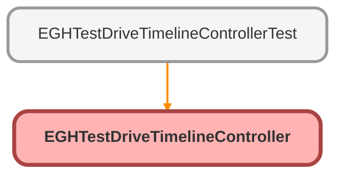

---
hide:
  - path
---

# EGHTestDriveTimelineController Class

## Class Diagram



<!-- Apex description -->

## Apex Code

```java
public with sharing class EGHTestDriveTimelineController {
    @AuraEnabled(cacheable=true)
    public static List<ServiceTerritory> getServiceTerritories() {
        // Get current user's division
        String userDivision = getCurrentUserDivision();
        if (String.isBlank(userDivision)) {
            return new List<ServiceTerritory>();
        }
        
        // First get the BranchUnit that matches the user's division
        List<BranchUnit> matchingBranches = [
            SELECT Id, ServiceTerritoryId
            FROM BranchUnit
            WHERE Name = :userDivision
            AND IsActive = true
            AND ServiceTerritoryId != null
            LIMIT 1
        ];
        
        if (matchingBranches.isEmpty()) {
            return new List<ServiceTerritory>();
        }
        
        // Get the Service Territory associated with this Branch Unit
        return [
            SELECT Id, Name 
            FROM ServiceTerritory 
            WHERE Id = :matchingBranches[0].ServiceTerritoryId
            AND IsActive = true
        ];
    }
    
    private static String getCurrentUserDivision() {
        try {
            User currentUser = [SELECT Division FROM User WHERE Id = :UserInfo.getUserId() LIMIT 1];
            return currentUser.Division;
        } catch (Exception e) {
            System.debug('Error getting user division: ' + e.getMessage());
            return null;
        }
    }

    @AuraEnabled(cacheable=true)
    public static Map<Id, List<ServiceAppointment>> getTestDriveAppointments() {
        Map<Id, List<ServiceAppointment>> territoryAppointments = new Map<Id, List<ServiceAppointment>>();
        
        // Get current user's division
        String userDivision = getCurrentUserDivision();
        if (String.isBlank(userDivision)) {
            return territoryAppointments;
        }
        
        // Get the BranchUnit and its Service Territory
        List<BranchUnit> matchingBranches = [
            SELECT Id, ServiceTerritoryId
            FROM BranchUnit
            WHERE Name = :userDivision
            AND IsActive = true
            AND ServiceTerritoryId != null
            LIMIT 1
        ];
        
        if (matchingBranches.isEmpty()) {
            return territoryAppointments;
        }
        
        Id serviceTerritoryId = matchingBranches[0].ServiceTerritoryId;
        
        // Query service appointments for test drives only for this territory
        List<ServiceAppointment> appointments = [
            SELECT Id, AppointmentNumber, SchedStartTime, SchedEndTime, 
                   ServiceTerritoryId, ServiceTerritory.Name,
                   Subject, Description, Status, AppointmentType,
                   ParentRecordId, ParentRecord.Name,
                   WorkType.Name, WorkType.Id
            FROM ServiceAppointment 
            WHERE SchedStartTime != null
            AND SchedEndTime != null
            AND ServiceTerritoryId = :serviceTerritoryId
            AND (AppointmentType = 'Test Drive' OR WorkType.Name LIKE '%Test Drive%')  // Filter for test drives
            AND SchedStartTime >= :Date.today().addDays(-30)  // Last 30 days + future
            AND SchedStartTime <= :Date.today().addDays(90)   // Next 90 days
            ORDER BY SchedStartTime
            LIMIT 1000
        ];
        
        // Group appointments by territory (though we'll only have one territory)
        for (ServiceAppointment appointment : appointments) {
            if (!territoryAppointments.containsKey(serviceTerritoryId)) {
                territoryAppointments.put(serviceTerritoryId, new List<ServiceAppointment>());
            }
            territoryAppointments.get(serviceTerritoryId).add(appointment);
        }

        return territoryAppointments;
    }
    
    @AuraEnabled(cacheable=true)
    public static Map<String, String> getResourceInfo(Id appointmentId) {
        Map<String, String> resourceInfo = new Map<String, String>();
        
        try {
            // Get assigned resources for the appointment
            List<AssignedResource> resources = [
                SELECT ServiceResourceId, ServiceResource.Name, 
                       ServiceResource.ResourceType, IsPrimaryResource
                FROM AssignedResource 
                WHERE ServiceAppointmentId = :appointmentId
            ];
            
            for (AssignedResource ar : resources) {
                if (ar.ServiceResource.ResourceType == 'T') {
                    resourceInfo.put('driver', ar.ServiceResource.Name);
                } else if (ar.ServiceResource.ResourceType == 'S') {
                    resourceInfo.put('vehicle', ar.ServiceResource.Name);
                }
            }
        } catch (Exception e) {
            System.debug('Error getting resource info: ' + e.getMessage());
        }
        
        return resourceInfo;
    }
}
```

## Methods
### `getServiceTerritories()`

`AURAENABLED`

#### Signature
```apex
public static List<ServiceTerritory> getServiceTerritories()
```

#### Return Type
**List<ServiceTerritory>**

---

### `getCurrentUserDivision()`

#### Signature
```apex
private static String getCurrentUserDivision()
```

#### Return Type
**String**

---

### `getTestDriveAppointments()`

`AURAENABLED`

#### Signature
```apex
public static Map<Id,List<ServiceAppointment>> getTestDriveAppointments()
```

#### Return Type
**Map<Id,List<ServiceAppointment>>**

---

### `getResourceInfo(appointmentId)`

`AURAENABLED`

#### Signature
```apex
public static Map<String,String> getResourceInfo(Id appointmentId)
```

#### Parameters
| Name | Type | Description |
|------|------|-------------|
| appointmentId | Id |  |

#### Return Type
**Map<String,String>**