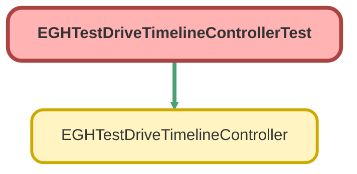

---
hide:
  - path
---

# EGHTestDriveTimelineControllerTest Class

`ISTEST`

## Class Diagram



<!-- Apex description -->

## Apex Code

```java
@isTest
private class EGHTestDriveTimelineControllerTest {
    
@testSetup
static void setupTestData() {
    // Create a test user with Division
    User testUser = new User(
        ProfileId = [SELECT Id FROM Profile WHERE Name = 'Standard User' LIMIT 1].Id,
        LastName = 'TestUser',
        Email = 'testuser@example.com',
        Username = 'testuser' + DateTime.now().getTime() + '@example.com',
        CompanyName = 'Test Company',
        Title = 'Test Title',
        Alias = 'tuser',
        TimeZoneSidKey = 'America/Los_Angeles',
        EmailEncodingKey = 'UTF-8',
        LanguageLocaleKey = 'en_US',
        LocaleSidKey = 'en_US',
        Division = 'Test Division'
    );
    insert testUser;

    // Operating Hours
    OperatingHours oh = new OperatingHours(
        Name = 'Test Operating Hours',
        TimeZone = 'America/Los_Angeles'
    );
    insert oh;

    // Territory
    ServiceTerritory territory = new ServiceTerritory(
        Name = 'Test Territory',
        IsActive = true,
        OperatingHoursId = oh.Id
    );
    insert territory;

    // Branch Unit
    BranchUnit branch = new BranchUnit(
        Name = 'Test Division',
        IsActive = true,
        ServiceTerritoryId = territory.Id,
        EGH_LocationTypePicklist__c = 'Showroom'
    );
    insert branch;

    // WorkType
    WorkType testDriveWorkType = new WorkType(
        Name = 'Test Drive',
        EstimatedDuration = 60,
        DurationType = 'Minutes'
    );
    insert testDriveWorkType;

    // Lead (parent)
    Lead testLead = new Lead(
        LastName = 'Test Lead',
        Company  = 'Test Company',
        Status   = 'Open',
        EGH_BrandListPicklist__c = 'Jetour'
    );
    insert testLead;

    // Service Appointments
    List<ServiceAppointment> appointments = new List<ServiceAppointment>();
    for (Integer i = 0; i < 5; i++) {
        appointments.add(new ServiceAppointment(
            OwnerId            = testUser.Id,
            ParentRecordId     = testLead.Id,
            ServiceTerritoryId = territory.Id,
            WorkTypeId         = testDriveWorkType.Id,
            Subject            = 'Test Drive ' + i,
            SchedStartTime     = DateTime.now().addDays(i),
            SchedEndTime       = DateTime.now().addDays(i).addHours(1),
            Status             = 'Scheduled',
            AppointmentType    = 'Test Drive'
        ));
    }
    insert appointments;

    // Vehicle asset/resource
    Asset vehicleAsset = new Asset(Name = 'Test Vehicle Asset');
    insert vehicleAsset;

    ServiceResource vehicle = new ServiceResource(
        Name          = 'Test Vehicle',
        ResourceType  = 'S', // ensure valid in your org; adjust if needed
        IsActive      = true,
        AssetId       = vehicleAsset.Id
    );

    // Driver resource
    ServiceResource driver = new ServiceResource(
        Name            = 'Test Driver',
        ResourceType    = 'T',
        IsActive        = true,
        RelatedRecordId = testUser.Id
    );
    insert new List<ServiceResource>{ vehicle, driver };

    // **Recommended**: territory membership so scheduling validations pass consistently
    ServiceTerritoryMember stmDriver = new ServiceTerritoryMember(
        ServiceResourceId  = driver.Id,
        ServiceTerritoryId = territory.Id,
        //TerritoryType      = 'Primary',
        EffectiveStartDate = Date.today()
    );
    ServiceTerritoryMember stmVehicle = new ServiceTerritoryMember(
        ServiceResourceId  = vehicle.Id,
        ServiceTerritoryId = territory.Id,
        //TerritoryType      = 'Primary',
        EffectiveStartDate = Date.today()
    );
    insert new List<ServiceTerritoryMember>{ stmDriver, stmVehicle };

    // Assigned Resources (***FIXED*** – driver is required primary)
    List<AssignedResource> assignedResources = new List<AssignedResource>();
    for (ServiceAppointment sa : appointments) {
        assignedResources.add(new AssignedResource(
            ServiceAppointmentId = sa.Id,
            ServiceResourceId    = driver.Id,
            IsPrimaryResource    = true,
            IsRequiredResource   = true
        ));
        assignedResources.add(new AssignedResource(
            ServiceAppointmentId = sa.Id,
            ServiceResourceId    = vehicle.Id
        ));
    }
    insert assignedResources;
}
    
    @isTest
    static void testGetServiceTerritories() {
        User testUser = [SELECT Id FROM User WHERE Division = 'Test Division' LIMIT 1];
        
        Test.startTest();
        System.runAs(testUser) {
            List<ServiceTerritory> territories = EGHTestDriveTimelineController.getServiceTerritories();
            System.assertEquals(1, territories.size(), 'Should return one territory');
            System.assertEquals('Test Territory', territories[0].Name, 'Territory name should match');
        }
        Test.stopTest();
    }
    
    @isTest
    static void testGetServiceTerritoriesNoDivision() {
        // Create user with no division
        User noDivisionUser = new User(
            ProfileId = [SELECT Id FROM Profile WHERE Name = 'Standard User' LIMIT 1].Id,
            LastName = 'NoDivUser',
            Email = 'nodiv@example.com',
            Username = 'nodiv' + DateTime.now().getTime() + '@example.com',
            CompanyName = 'Test Company',
            Title = 'Test Title',
            Alias = 'nodiv',
            TimeZoneSidKey = 'America/Los_Angeles',
            EmailEncodingKey = 'UTF-8',
            LanguageLocaleKey = 'en_US',
            LocaleSidKey = 'en_US'
        );
        insert noDivisionUser;
        
        Test.startTest();
        System.runAs(noDivisionUser) {
            List<ServiceTerritory> territories = EGHTestDriveTimelineController.getServiceTerritories();
            System.assertEquals(0, territories.size(), 'Should return no territories for user without division');
        }
        Test.stopTest();
    }
    
    @isTest
    static void testGetTestDriveAppointments() {
        User testUser = [SELECT Id FROM User WHERE Division = 'Test Division' LIMIT 1];
        
        Test.startTest();
        System.runAs(testUser) {
            Map<Id, List<ServiceAppointment>> appointmentMap = EGHTestDriveTimelineController.getTestDriveAppointments();
            System.assertEquals(1, appointmentMap.size(), 'Should have appointments for one territory');
            
            List<ServiceAppointment> appointments = appointmentMap.values()[0];
            System.assertEquals(5, appointments.size(), 'Should have 5 test drive appointments');
            
            for (ServiceAppointment apt : appointments) {
                System.assertEquals('Test Drive', apt.AppointmentType, 'All appointments should be test drives');
            }
        }
        Test.stopTest();
    }
    
    @isTest
    static void testGetTestDriveAppointmentsNoMatchingBranch() {
        // Create user with different division
        User differentDivUser = new User(
            ProfileId = [SELECT Id FROM Profile WHERE Name = 'Standard User' LIMIT 1].Id,
            LastName = 'DiffDivUser',
            Email = 'diffdiv@example.com',
            Username = 'diffdiv' + DateTime.now().getTime() + '@example.com',
            CompanyName = 'Test Company',
            Title = 'Test Title',
            Alias = 'difdiv',
            TimeZoneSidKey = 'America/Los_Angeles',
            EmailEncodingKey = 'UTF-8',
            LanguageLocaleKey = 'en_US',
            LocaleSidKey = 'en_US',
            Division = 'Different Division'
        );
        insert differentDivUser;
        
        Test.startTest();
        System.runAs(differentDivUser) {
            Map<Id, List<ServiceAppointment>> appointmentMap = EGHTestDriveTimelineController.getTestDriveAppointments();
            System.assertEquals(0, appointmentMap.size(), 'Should have no appointments for non-matching division');
        }
        Test.stopTest();
    }
    
    @isTest
    static void testGetResourceInfo() {
        ServiceAppointment appointment = [SELECT Id FROM ServiceAppointment LIMIT 1];
        
        Test.startTest();
        Map<String, String> resourceInfo = EGHTestDriveTimelineController.getResourceInfo(appointment.Id);
        System.assertEquals('Test Vehicle', resourceInfo.get('vehicle'), 'Should have vehicle name');
        System.assertEquals('Test Driver', resourceInfo.get('driver'), 'Should have driver name');
        Test.stopTest();
    }
    
    @isTest
    static void testGetResourceInfoNoResources() {
        // Create appointment without resources
        Lead testLead = new Lead(LastName = 'No Resource Lead', Company = 'Test', Status = 'Open', EGH_BrandListPicklist__c = 'Jetour');
        insert testLead;
        
        ServiceTerritory territory = [SELECT Id FROM ServiceTerritory LIMIT 1];
        WorkType workType = [SELECT Id FROM WorkType LIMIT 1];
        
        ServiceAppointment appointment = new ServiceAppointment(
            ParentRecordId = testLead.Id,
            ServiceTerritoryId = territory.Id,
            WorkTypeId = workType.Id,
            Subject = 'No Resources',
            SchedStartTime = DateTime.now(),
            SchedEndTime = DateTime.now().addHours(1),
            Status = 'Scheduled'
        );
        insert appointment;
        
        Test.startTest();
        Map<String, String> resourceInfo = EGHTestDriveTimelineController.getResourceInfo(appointment.Id);
        System.assertEquals(0, resourceInfo.size(), 'Should have no resources');
        Test.stopTest();
    }
}
```

## Methods
### `setupTestData()`

`TESTSETUP`

#### Signature
```apex
private static void setupTestData()
```

#### Return Type
**void**

---

### `testGetServiceTerritories()`

`ISTEST`

#### Signature
```apex
private static void testGetServiceTerritories()
```

#### Return Type
**void**

---

### `testGetServiceTerritoriesNoDivision()`

`ISTEST`

#### Signature
```apex
private static void testGetServiceTerritoriesNoDivision()
```

#### Return Type
**void**

---

### `testGetTestDriveAppointments()`

`ISTEST`

#### Signature
```apex
private static void testGetTestDriveAppointments()
```

#### Return Type
**void**

---

### `testGetTestDriveAppointmentsNoMatchingBranch()`

`ISTEST`

#### Signature
```apex
private static void testGetTestDriveAppointmentsNoMatchingBranch()
```

#### Return Type
**void**

---

### `testGetResourceInfo()`

`ISTEST`

#### Signature
```apex
private static void testGetResourceInfo()
```

#### Return Type
**void**

---

### `testGetResourceInfoNoResources()`

`ISTEST`

#### Signature
```apex
private static void testGetResourceInfoNoResources()
```

#### Return Type
**void**