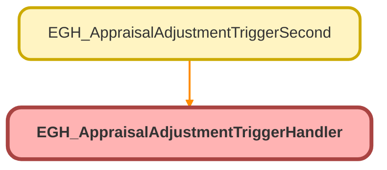

---
hide:
  - path
---

# EGH_AppraisalAdjustmentTriggerHandler Class

## Class Diagram



<!-- Apex description -->

## Apex Code

```java
public class EGH_AppraisalAdjustmentTriggerHandler {
    
    public static void handleAfterInsert(List<AppraisalAdjustment> newAdjustments) {
        Map<Id, Id> appraisalToUserId = new Map<Id, Id>();
        for (AppraisalAdjustment adj : newAdjustments) {
            appraisalToUserId.put(adj.AppraisalId, adj.CreatedById);
        }
        
        List<Appraisal> appraisalsToUpdate = new List<Appraisal>();
        for (Id appraisalId : appraisalToUserId.keySet()) {
            appraisalsToUpdate.add(new Appraisal(
                Id = appraisalId,
                EGH_LastEvaluatorLookup__c = appraisalToUserId.get(appraisalId)
            ));
        }
        update appraisalsToUpdate;
        
        sendAdjustmentNotifications(appraisalToUserId.keySet());
    }
    
    private static void sendAdjustmentNotifications(Set<Id> appraisalIds) {
        CustomNotificationType notificationType = getNotificationType();
        if (notificationType == null) return;
        
        Map<Id, Appraisal> appraisals = new Map<Id, Appraisal>([
            SELECT Id, OwnerId, AppraisalNumber 
            FROM Appraisal 
            WHERE Id IN :appraisalIds
        ]);
        
        Integer notificationCount = 0;
        for (Appraisal appraisal : appraisals.values()) {
            if (notificationCount >= 100) break;
            
            if (isValidUser(appraisal.OwnerId)) {
                try {
                    // Create notification object first
                    Messaging.CustomNotification notification = new Messaging.CustomNotification();
                    
                    // Set properties individually
                    notification.setTitle('Appraisal Adjustment Added');
                    notification.setBody('New adjustment for appraisal: ' + appraisal.AppraisalNumber);
                    notification.setNotificationTypeId(notificationType.Id);
                    notification.setTargetId(appraisal.Id);
                    
                    notification.send(new Set<String>{ appraisal.OwnerId });
                    
                    notificationCount++;
                } catch (Exception e) {
                    System.debug('Notification failed: ' + e.getMessage());
                }
            }
        }
    }
    
    private static CustomNotificationType getNotificationType() {
        List<CustomNotificationType> types = [
            SELECT Id FROM CustomNotificationType 
            WHERE DeveloperName = 'EGH_Visit_Assignment_Notification'
            LIMIT 1
        ];
        return types.isEmpty() ? null : types[0];
    }
    
    private static Boolean isValidUser(Id userId) {
        return userId != null && String.valueOf(userId).startsWith('005');
    }
}
```

## Methods
### `handleAfterInsert(newAdjustments)`

#### Signature
```apex
public static void handleAfterInsert(List<AppraisalAdjustment> newAdjustments)
```

#### Parameters
| Name | Type | Description |
|------|------|-------------|
| newAdjustments | List<AppraisalAdjustment> |  |

#### Return Type
**void**

---

### `sendAdjustmentNotifications(appraisalIds)`

#### Signature
```apex
private static void sendAdjustmentNotifications(Set<Id> appraisalIds)
```

#### Parameters
| Name | Type | Description |
|------|------|-------------|
| appraisalIds | Set<Id> |  |

#### Return Type
**void**

---

### `getNotificationType()`

#### Signature
```apex
private static CustomNotificationType getNotificationType()
```

#### Return Type
**CustomNotificationType**

---

### `isValidUser(userId)`

#### Signature
```apex
private static Boolean isValidUser(Id userId)
```

#### Parameters
| Name | Type | Description |
|------|------|-------------|
| userId | Id |  |

#### Return Type
**Boolean**