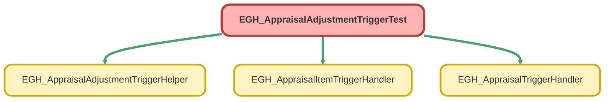

---
hide:
  - path
---

# EGH_AppraisalAdjustmentTriggerTest Class

`ISTEST`

## Class Diagram



<!-- Apex description -->

## Apex Code

```java
@isTest
private class EGH_AppraisalAdjustmentTriggerTest {
    
    @testSetup 
    static void setupTestData() {
        // Create a test account for ReferenceRecordId
        Account testAccount = new Account(Name = 'Test Account');
        insert testAccount;
        
        // Create test appraisals with required fields
        List<Appraisal> appraisals = new List<Appraisal>();
        for (Integer i = 0; i < 5; i++) {
            appraisals.add(new Appraisal(
                Status = 'Cancelled',
                ReferenceRecordId = testAccount.Id,  // Required field
                PurposeType = 'Trade-In',            // Required field - adjust based on your picklist values
                UsageType = 'Automotive',            // Required field - adjust based on your picklist values
                Fee = 100.00 + (i * 50)             // Different fees for update testing
            ));
        }
        insert appraisals;
        
        // Create test appraisal items for each appraisal
        List<AppraisalItem> items = new List<AppraisalItem>();
        for (Appraisal appr : appraisals) {
            items.add(new AppraisalItem(
                AppraisalId = appr.Id,
                CustomerAskingValue = 10000.00 + (items.size() * 1000),
                IdentificationNumber = 'TEST-ITEM-' + items.size(),
                ConditionType = 'Good',           // Required picklist field
                Usage = 50000.0,                 // Required double field  
                Type = 'Vehicle'                 // Required field
            ));
        }
        insert items;
    }
    
    // Test single approved insert
    @isTest
    static void testInsertApprovedAdjustment() {
        List<Appraisal> appraisals = [SELECT Id FROM Appraisal];
        
        Test.startTest();
        AppraisalAdjustment adj = new AppraisalAdjustment(
            Name = 'Test Adjustment 1',
            AppraisalId = appraisals[0].Id,
            Status = 'Approved',
            Type = 'Vehicle Color',
            AdjustmentValue = 1000.00
        );
        insert adj;
        Test.stopTest();
        
        // Verify appraisal status update
        Appraisal updatedAppraisal = [SELECT Id, Status FROM Appraisal WHERE Id = :appraisals[0].Id];
        System.assertEquals('Evaluated', updatedAppraisal.Status, 'Appraisal status should be updated to Evaluated');
    }
    
    // Test bulk approved inserts
    @isTest
    static void testBulkInsertApprovedAdjustments() {
        List<Appraisal> appraisals = [SELECT Id FROM Appraisal];
        List<AppraisalAdjustment> adjustments = new List<AppraisalAdjustment>();
        
        for (Integer i = 0; i < appraisals.size(); i++) {
            adjustments.add(new AppraisalAdjustment(
                Name = 'Bulk Adjustment ' + (i + 1),
                AppraisalId = appraisals[i].Id,
                Status = 'Approved',
                Type = 'Vehicle Color',  // Mix of positive and negative
                AdjustmentValue = (i + 1) * 500.00
            ));
        }
        
        Test.startTest();
        insert adjustments;
        Test.stopTest();
        
        // Verify all appraisals were updated
        List<Appraisal> updatedAppraisals = [SELECT Id, Status FROM Appraisal];
        for (Appraisal appr : updatedAppraisals) {
            System.assertEquals('Evaluated', appr.Status, 'All appraisal statuses should be updated');
        }
    }
    
    // Test status update to Approved
    @isTest
    static void testUpdateToApproved() {
        Appraisal appr = [SELECT Id FROM Appraisal LIMIT 1];
        AppraisalAdjustment adj = new AppraisalAdjustment(
            Name = 'Update Test Adjustment',
            AppraisalId = appr.Id,
            Status = 'InReview',  // Using documented status value
            Type = 'Vehicle Color',
            AdjustmentValue = 750.00
        );
        insert adj;
        
        Test.startTest();
        adj.Status = 'Approved';
        update adj;
        Test.stopTest();
        
        // Verify appraisal status update
        Appraisal updatedAppraisal = [SELECT Id, Status FROM Appraisal WHERE Id = :appr.Id];
        System.assertEquals('Evaluated', updatedAppraisal.Status, 'Appraisal should update when adjustment is approved');
    }
    
    // Test non-approved insert (negative test)
    @isTest
    static void testInsertNonApprovedAdjustment() {
        Appraisal appr = [SELECT Id, Status FROM Appraisal LIMIT 1];
        String originalStatus = appr.Status;
        
        Test.startTest();
        AppraisalAdjustment adj = new AppraisalAdjustment(
            Name = 'Rejected Adjustment',
            AppraisalId = appr.Id,
            Status = 'Rejected',
            Type = 'Vehicle Color',
            AdjustmentValue = -200.00
        );
        insert adj;
        Test.stopTest();
        
        // Verify no status change
        Appraisal unchangedAppraisal = [SELECT Id, Status FROM Appraisal WHERE Id = :appr.Id];
        System.assertEquals(originalStatus, unchangedAppraisal.Status, 'Appraisal status should not change');
    }

    // Test mixed status updates in bulk
    @isTest
    static void testMixedStatusUpdates() {
        List<Appraisal> appraisals = [SELECT Id FROM Appraisal];
        List<AppraisalAdjustment> adjustments = new List<AppraisalAdjustment>();
        
        // Create initial adjustments
        for (Integer i = 0; i < appraisals.size(); i++) {
            adjustments.add(new AppraisalAdjustment(
                Name = 'Mixed Status Adjustment ' + (i + 1),
                AppraisalId = appraisals[i].Id,
                Status = (i < 2) ? 'Approved' : 'InReview', // First 2 approved
                Type = 'Vehicle Color',
                AdjustmentValue = (i + 1) * 100.00
            ));
        }
        insert adjustments;
        
        // Update half to approved
        for (Integer i = 0; i < adjustments.size(); i++) {
            if (i >= 2 && i < 4) { // Update middle 2 to approved
                adjustments[i].Status = 'Approved';
            }
        }
        
        Test.startTest();
        update adjustments;
        Test.stopTest();
        
        // Verify correct status updates
        Map<Id, Appraisal> updatedAppraisals = new Map<Id, Appraisal>([
            SELECT Id, Status FROM Appraisal
        ]);
        
        for (Integer i = 0; i < appraisals.size(); i++) {
            String expectedStatus = (i < 4) ? 'Evaluated' : 'Cancelled';
            System.assertEquals(
                expectedStatus,
                updatedAppraisals.get(appraisals[i].Id).Status,
                'Incorrect status for appraisal ' + i
            );
        }
    }
    
    // Test with negative adjustment values
    @isTest
    static void testNegativeAdjustmentValues() {
        List<Appraisal> appraisals = [SELECT Id FROM Appraisal];
        
        Test.startTest();
        AppraisalAdjustment adj = new AppraisalAdjustment(
            Name = 'Negative Value Adjustment',
            AppraisalId = appraisals[0].Id,
            Status = 'Approved',
            Type = 'Vehicle Color',
            AdjustmentValue = -500.00
        );
        insert adj;
        Test.stopTest();
        
        // Verify appraisal status update even with negative value
        Appraisal updatedAppraisal = [SELECT Id, Status FROM Appraisal WHERE Id = :appraisals[0].Id];
        System.assertEquals('Evaluated', updatedAppraisal.Status, 'Appraisal status should be updated even with negative adjustment');
    }
    
    
    // Test Appraisal Fee Update (EGH_AppraisalTriggerHandler)
    @isTest
    static void testAppraisalFeeUpdate() {
        List<Appraisal> appraisals = [SELECT Id, Fee FROM Appraisal LIMIT 2];
        
        Test.startTest();
        for (Appraisal appr : appraisals) {
            appr.Fee = appr.Fee + 100; // Increase fee to trigger notification
        }
        update appraisals;
        Test.stopTest();
        
        // Simple assertion - verify fee was updated
        List<Appraisal> updated = [SELECT Id, Fee FROM Appraisal WHERE Id IN :appraisals];
        System.assert(updated.size() > 0, 'Appraisals should be updated');
        for (Appraisal appr : updated) {
            System.assert(appr.Fee >= 200, 'Fee should be increased');
        }
    }
    
    // Test Appraisal Non-Fee Update (shouldn't trigger notification)
    @isTest
    static void testAppraisalNonFeeUpdate() {
        Appraisal appr = [SELECT Id, Status, Fee FROM Appraisal LIMIT 1];
        Decimal originalFee = appr.Fee;
        
        Test.startTest();
        appr.Status = 'Evaluated'; // Change status, not fee
        update appr;
        Test.stopTest();
        
        // Verify status changed but fee remained same
        Appraisal updated = [SELECT Id, Status, Fee FROM Appraisal WHERE Id = :appr.Id];
        System.assertEquals('Evaluated', updated.Status, 'Status should be updated');
        System.assertEquals(originalFee, updated.Fee, 'Fee should remain unchanged');
    }
    
    // Test AppraisalItem CustomerAskingValue Update (EGH_AppraisalItemTriggerHandler if implemented)
    @isTest
    static void testAppraisalItemCustomerAskingValueUpdate() {
        AppraisalItem item = [SELECT Id, CustomerAskingValue FROM AppraisalItem LIMIT 1];
        
        Test.startTest();
        try {
            item.CustomerAskingValue = item.CustomerAskingValue + 1000;
            update item;
            // If no trigger exists, this will pass
            System.assert(true, 'Update succeeded - no trigger restriction implemented');
        } catch (Exception e) {
            // If trigger exists and blocks the update
            System.assert(e.getMessage().contains('cannot be modified') || 
                         e.getMessage().contains('read only') ||
                         e.getMessage().contains('Price requested'), 
                         'Expected validation error for CustomerAskingValue update');
        }
        Test.stopTest();
    }
    
    // Test AppraisalItem Other Field Update (should always succeed)
    @isTest
    static void testAppraisalItemOtherFieldUpdate() {
        AppraisalItem item = [SELECT Id, IdentificationNumber FROM AppraisalItem LIMIT 1];
        
        Test.startTest();
        item.IdentificationNumber = 'Updated-' + item.IdentificationNumber;
        update item;
        Test.stopTest();
        
        // Verify identification number was updated
        AppraisalItem updated = [SELECT Id, IdentificationNumber FROM AppraisalItem WHERE Id = :item.Id];
        System.assert(updated.IdentificationNumber.contains('Updated'), 'IdentificationNumber should be updated');
    }
    
    // Test Helper Class Coverage (EGH_AppraisalAdjustmentTriggerHelper)
    @isTest
    static void testHelperClassDirectly() {
        List<Appraisal> appraisals = [SELECT Id FROM Appraisal LIMIT 2];
        Set<Id> appraisalIds = new Set<Id>();
        Map<Id, Id> appraisalToEvaluatorMap = new Map<Id, Id>();
        
        for (Appraisal appr : appraisals) {
            appraisalIds.add(appr.Id);
            appraisalToEvaluatorMap.put(appr.Id, UserInfo.getUserId());
        }
        
        Test.startTest();
        // Directly test the helper method
        EGH_AppraisalAdjustmentTriggerHelper.updateAppraisalRecords(appraisalIds, appraisalToEvaluatorMap);
        Test.stopTest();
        
        // Verify status was updated to Evaluated
        List<Appraisal> updated = [SELECT Id, Status FROM Appraisal WHERE Id IN :appraisalIds];
        for (Appraisal appr : updated) {
            System.assertEquals('Evaluated', appr.Status, 'Status should be Evaluated');
        }
    }
    
    // Test Exception Handling in Helper Class
    @isTest
    static void testHelperClassExceptionHandling() {
        // Test with empty sets to ensure no exceptions
        Set<Id> emptyIds = new Set<Id>();
        Map<Id, Id> emptyMap = new Map<Id, Id>();
        
        Test.startTest();
        try {
            EGH_AppraisalAdjustmentTriggerHelper.updateAppraisalRecords(emptyIds, emptyMap);
            System.assert(true, 'Empty sets should be handled gracefully');
        } catch (Exception e) {
            System.assert(false, 'Should not throw exception with empty data: ' + e.getMessage());
        }
        Test.stopTest();
    }
    
    // Test Both Triggers Together (Comprehensive Integration Test)
    @isTest
    static void testIntegratedWorkflow() {
        List<Appraisal> appraisals = [SELECT Id, Fee FROM Appraisal LIMIT 2];
        
        Test.startTest();
        
        // 1. Insert approved adjustments (triggers AppraisalAdjustment trigger)
        List<AppraisalAdjustment> adjustments = new List<AppraisalAdjustment>();
        for (Appraisal appr : appraisals) {
            adjustments.add(new AppraisalAdjustment(
                Name = 'Integration Test',
                AppraisalId = appr.Id,
                Status = 'Approved',
                Type = 'Vehicle Color',
                AdjustmentValue = 300.00
            ));
        }
        insert adjustments;
        
        // 2. Update fees (triggers Appraisal trigger)
        for (Appraisal appr : appraisals) {
            appr.Fee = appr.Fee + 50;
        }
        update appraisals;
        
        // 3. Try to update AppraisalItem CustomerAskingValue
        List<AppraisalItem> items = [SELECT Id, CustomerAskingValue FROM AppraisalItem WHERE AppraisalId IN :appraisals LIMIT 1];
        if (!items.isEmpty()) {
            try {
                items[0].CustomerAskingValue = items[0].CustomerAskingValue + 100;
                update items[0];
            } catch (Exception e) {
                // Expected if trigger is implemented
                System.debug('AppraisalItem update blocked: ' + e.getMessage());
            }
        }
        
        Test.stopTest();
        
        // Verify final state
        List<Appraisal> finalAppraisals = [SELECT Id, Status FROM Appraisal WHERE Id IN :appraisals];
        for (Appraisal appr : finalAppraisals) {
            System.assertEquals('Evaluated', appr.Status, 'Final status should be Evaluated');
        }
        
        List<AppraisalAdjustment> finalAdjustments = [SELECT Id, Status FROM AppraisalAdjustment WHERE Id IN :adjustments];
        for (AppraisalAdjustment adj : finalAdjustments) {
            System.assertEquals('Approved', adj.Status, 'Adjustment status should remain Approved');
        }
    }
}
```

## Methods
### `setupTestData()`

`TESTSETUP`

#### Signature
```apex
private static void setupTestData()
```

#### Return Type
**void**

---

### `testInsertApprovedAdjustment()`

`ISTEST`

#### Signature
```apex
private static void testInsertApprovedAdjustment()
```

#### Return Type
**void**

---

### `testBulkInsertApprovedAdjustments()`

`ISTEST`

#### Signature
```apex
private static void testBulkInsertApprovedAdjustments()
```

#### Return Type
**void**

---

### `testUpdateToApproved()`

`ISTEST`

#### Signature
```apex
private static void testUpdateToApproved()
```

#### Return Type
**void**

---

### `testInsertNonApprovedAdjustment()`

`ISTEST`

#### Signature
```apex
private static void testInsertNonApprovedAdjustment()
```

#### Return Type
**void**

---

### `testMixedStatusUpdates()`

`ISTEST`

#### Signature
```apex
private static void testMixedStatusUpdates()
```

#### Return Type
**void**

---

### `testNegativeAdjustmentValues()`

`ISTEST`

#### Signature
```apex
private static void testNegativeAdjustmentValues()
```

#### Return Type
**void**

---

### `testAppraisalFeeUpdate()`

`ISTEST`

#### Signature
```apex
private static void testAppraisalFeeUpdate()
```

#### Return Type
**void**

---

### `testAppraisalNonFeeUpdate()`

`ISTEST`

#### Signature
```apex
private static void testAppraisalNonFeeUpdate()
```

#### Return Type
**void**

---

### `testAppraisalItemCustomerAskingValueUpdate()`

`ISTEST`

#### Signature
```apex
private static void testAppraisalItemCustomerAskingValueUpdate()
```

#### Return Type
**void**

---

### `testAppraisalItemOtherFieldUpdate()`

`ISTEST`

#### Signature
```apex
private static void testAppraisalItemOtherFieldUpdate()
```

#### Return Type
**void**

---

### `testHelperClassDirectly()`

`ISTEST`

#### Signature
```apex
private static void testHelperClassDirectly()
```

#### Return Type
**void**

---

### `testHelperClassExceptionHandling()`

`ISTEST`

#### Signature
```apex
private static void testHelperClassExceptionHandling()
```

#### Return Type
**void**

---

### `testIntegratedWorkflow()`

`ISTEST`

#### Signature
```apex
private static void testIntegratedWorkflow()
```

#### Return Type
**void**