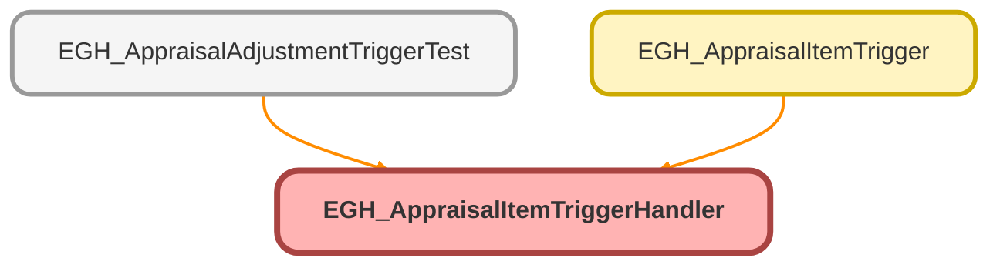

---
hide:
  - path
---

# EGH_AppraisalItemTriggerHandler Class

## Class Diagram



<!-- Apex description -->

## Apex Code

```java
public class EGH_AppraisalItemTriggerHandler {
    
    public static void handleBeforeUpdate(List<AppraisalItem> newItems, Map<Id, AppraisalItem> oldItemMap) {
        validateCustomerAskingValue(newItems, oldItemMap);
    }
    
    private static void validateCustomerAskingValue(List<AppraisalItem> newItems, Map<Id, AppraisalItem> oldItemMap) {
        for (AppraisalItem item : newItems) {
            AppraisalItem oldItem = oldItemMap.get(item.Id);
            
            // Check if CustomerAskingValue is being modified
            if (item.CustomerAskingValue != oldItem.CustomerAskingValue) {
                item.CustomerAskingValue.addError('Price requested by Customer cannot be modified after the record is created.');
            }
        }
    }
}
```

## Methods
### `handleBeforeUpdate(newItems, oldItemMap)`

#### Signature
```apex
public static void handleBeforeUpdate(List<AppraisalItem> newItems, Map<Id,AppraisalItem> oldItemMap)
```

#### Parameters
| Name | Type | Description |
|------|------|-------------|
| newItems | List<AppraisalItem> |  |
| oldItemMap | Map<Id,AppraisalItem> |  |

#### Return Type
**void**

---

### `validateCustomerAskingValue(newItems, oldItemMap)`

#### Signature
```apex
private static void validateCustomerAskingValue(List<AppraisalItem> newItems, Map<Id,AppraisalItem> oldItemMap)
```

#### Parameters
| Name | Type | Description |
|------|------|-------------|
| newItems | List<AppraisalItem> |  |
| oldItemMap | Map<Id,AppraisalItem> |  |

#### Return Type
**void**