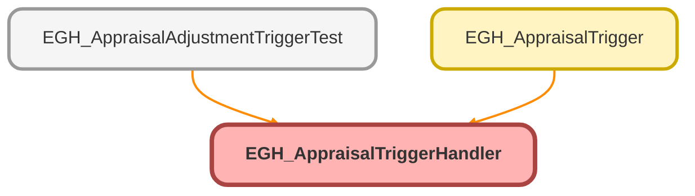

---
hide:
  - path
---

# EGH_AppraisalTriggerHandler Class

## Class Diagram



<!-- Apex description -->

## Apex Code

```java
public class EGH_AppraisalTriggerHandler {
    
    public static void handleAfterUpdate(List<Appraisal> newAppraisals, Map<Id, Appraisal> oldAppraisalMap) {
        List<Appraisal> updatedAppraisals = new List<Appraisal>();
        
        for (Appraisal appraisal : newAppraisals) {
            Appraisal oldAppraisal = oldAppraisalMap.get(appraisal.Id);
            if (appraisal.Fee != oldAppraisal.Fee) {
                updatedAppraisals.add(appraisal);
            }
        }
        
        if (!updatedAppraisals.isEmpty()) {
            sendFeeUpdateNotifications(updatedAppraisals);
        }
    }
    
    private static void sendFeeUpdateNotifications(List<Appraisal> appraisals) {
        CustomNotificationType notificationType = getNotificationType();
        if (notificationType == null) return;
        
        Integer notificationCount = 0;
        for (Appraisal appraisal : appraisals) {
            if (notificationCount >= 100) break;
            
            if (isValidUser(appraisal.OwnerId)) {
                try {
                    // Create notification object first
                    Messaging.CustomNotification notification = new Messaging.CustomNotification();
                    
                    // Set properties individually (no chaining)
                    notification.setTitle('Fee Updated');
                    notification.setBody('Appraisal fee updated: ' + appraisal.AppraisalNumber);
                    notification.setNotificationTypeId(notificationType.Id);
                    notification.setTargetId(appraisal.Id);
                    
                    // Send to specific user
                    notification.send(new Set<String>{ appraisal.OwnerId });
                    
                    notificationCount++;
                } catch (Exception e) {
                    System.debug('Notification failed: ' + e.getMessage());
                }
            }
        }
    }
    
    private static CustomNotificationType getNotificationType() {
        List<CustomNotificationType> types = [
            SELECT Id FROM CustomNotificationType 
            WHERE DeveloperName = 'EGH_Visit_Assignment_Notification'
            LIMIT 1
        ];
        return types.isEmpty() ? null : types[0];
    }
    
    private static Boolean isValidUser(Id userId) {
        return userId != null && String.valueOf(userId).startsWith('005');
    }
}
```

## Methods
### `handleAfterUpdate(newAppraisals, oldAppraisalMap)`

#### Signature
```apex
public static void handleAfterUpdate(List<Appraisal> newAppraisals, Map<Id,Appraisal> oldAppraisalMap)
```

#### Parameters
| Name | Type | Description |
|------|------|-------------|
| newAppraisals | List<Appraisal> |  |
| oldAppraisalMap | Map<Id,Appraisal> |  |

#### Return Type
**void**

---

### `sendFeeUpdateNotifications(appraisals)`

#### Signature
```apex
private static void sendFeeUpdateNotifications(List<Appraisal> appraisals)
```

#### Parameters
| Name | Type | Description |
|------|------|-------------|
| appraisals | List<Appraisal> |  |

#### Return Type
**void**

---

### `getNotificationType()`

#### Signature
```apex
private static CustomNotificationType getNotificationType()
```

#### Return Type
**CustomNotificationType**

---

### `isValidUser(userId)`

#### Signature
```apex
private static Boolean isValidUser(Id userId)
```

#### Parameters
| Name | Type | Description |
|------|------|-------------|
| userId | Id |  |

#### Return Type
**Boolean**