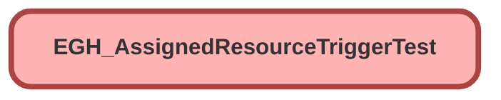

---
hide:
  - path
---

# EGH_AssignedResourceTriggerTest Class

`ISTEST`

## Class Diagram



<!-- Apex description -->

## Apex Code

```java
@isTest
public class EGH_AssignedResourceTriggerTest {
    
    @TestSetup
    static void setupTestData() {
        // Create test account
        Account testAccount = new Account(Name = 'Test Account');
        insert testAccount;
        
        // Create test Vehicles (Assets)
        List<Asset> testVehicles = new List<Asset>();
        for (Integer i = 0; i < 3; i++) {
            testVehicles.add(new Asset(
                Name = 'Test Vehicle ' + i,
                AccountId = testAccount.Id,
                SerialNumber = 'VIN123456789' + i
            ));
        }
        insert testVehicles;
        
        // Create WorkType
        WorkType workType = new WorkType(
            Name = 'Test WorkType',
            DurationType = 'Hours',
            EstimatedDuration = 120
        );
        insert workType;
        
        // Create test users for Service Resources
        List<User> testUsers = [SELECT Id FROM User WHERE IsActive = true LIMIT 3];
        
        // Create Service Resources
        List<ServiceResource> serviceResources = new List<ServiceResource>();
        
        // Service Resource with ResourceType 'S' and Asset (Vehicle 0)
        serviceResources.add(new ServiceResource(
            Name = 'Vehicle Resource 1',
            ResourceType = 'S',
            AssetId = testVehicles[0].Id,
            IsActive = true
        ));
        
        // Service Resource with ResourceType 'S' and Asset (Vehicle 1)
        serviceResources.add(new ServiceResource(
            Name = 'Vehicle Resource 2',
            ResourceType = 'S',
            AssetId = testVehicles[1].Id,
            IsActive = true
        ));
        
        // Service Resource with ResourceType 'T' and User (Technician 1)
        serviceResources.add(new ServiceResource(
            Name = 'Technician Resource 1',
            ResourceType = 'T',
            RelatedRecordId = testUsers[0].Id,
            IsActive = true
        ));
        
        // Service Resource with ResourceType 'T' and User (Technician 2)
        serviceResources.add(new ServiceResource(
            Name = 'Technician Resource 2',
            ResourceType = 'T',
            RelatedRecordId = testUsers[1].Id,
            IsActive = true
        ));
        
        insert serviceResources;
        
        // Create Service Appointments
        List<ServiceAppointment> serviceAppointments = new List<ServiceAppointment>();
        DateTime startTime = DateTime.now().addDays(1);
        
        for (Integer i = 0; i < 5; i++) {
            serviceAppointments.add(new ServiceAppointment(
                ParentRecordId = String.valueOf(testAccount.Id),
                WorkTypeId = workType.Id,
                Status = 'Scheduled',
                City = 'Test City',
                SchedStartTime = startTime.addHours(i+1),
				EarliestStartTime = startTime.addHours(i+1),
                SchedEndTime = startTime.addHours(i + 2),
                EGH_Quick_Scheduled__c = (i == 0) // First one is quick scheduled
            ));
        }
        insert serviceAppointments;
        
        // Create existing VDC record for testing "already has inspection" scenario
        EGH_Vehicle_Damage_Capture__c existingVDC = new EGH_Vehicle_Damage_Capture__c(
            Name = 'Existing VDC',
            EGH_Asset__c = testVehicles[2].Id,
            EGH_Area_of_Damage_Defect__c = 'Existing damage',
            EGH_DateTime_Damage_Defect_Identified__c = DateTime.now()
        );
        insert existingVDC;
        
        // Link existing VDC to one Service Appointment
        ServiceAppointment saWithExistingVDC = serviceAppointments[4];
        saWithExistingVDC.EGH_PostTestDriveInspection__c = existingVDC.Id;
        update saWithExistingVDC;
    }
    
    @isTest
    static void testAutoCreateInspectionWithResourceTypeS() {
        // Get test data
        ServiceResource vehicleResource = [SELECT Id, AssetId FROM ServiceResource WHERE ResourceType = 'S' AND AssetId != null LIMIT 1];
        ServiceAppointment sa = [SELECT Id, SchedStartTime, SchedEndTime, EGH_Quick_Scheduled__c FROM ServiceAppointment WHERE EGH_PostTestDriveInspection__c = null LIMIT 1];
        Asset vehicle = [SELECT Id FROM Asset WHERE Id = :vehicleResource.AssetId];
        
        Test.startTest();
        // Create AssignedResource with ResourceType 'S' and Asset
        AssignedResource ar = new AssignedResource(
            ServiceAppointmentId = sa.Id,
            ServiceResourceId = vehicleResource.Id
        );
        insert ar;
        Test.stopTest();
        
        // Verify inspection was created
        List<EGH_Vehicle_Damage_Capture__c> createdInspections = [
            SELECT Id, Name, EGH_Asset__c, EGH_Vehicle_Condition_Return__c, 
                   EGH_Booking_Start_Datetime__c, EGH_Booking_End_Datetime__c, EGH_Quick_Scheduled__c, EGH_Area_of_Damage_Defect__c
            FROM EGH_Vehicle_Damage_Capture__c 
            WHERE EGH_Asset__c = :vehicle.Id
            AND Name LIKE 'Inspection-%'
            ORDER BY CreatedDate DESC
            LIMIT 1
        ];
        
        System.assertEquals(1, createdInspections.size(), 'Should create 1 inspection');
        
        EGH_Vehicle_Damage_Capture__c inspection = createdInspections[0];
        System.assertEquals(vehicle.Id, inspection.EGH_Asset__c, 'Asset should be linked');
        System.assertEquals('Pending Inspection', inspection.EGH_Vehicle_Condition_Return__c, 'Should set default condition');
        System.assertEquals(sa.SchedStartTime, inspection.EGH_Booking_Start_Datetime__c, 'Start time should match SA');
        System.assertEquals(sa.SchedEndTime, inspection.EGH_Booking_End_Datetime__c, 'End time should match SA');
        System.assertEquals(sa.EGH_Quick_Scheduled__c, inspection.EGH_Quick_Scheduled__c, 'Quick scheduled should match SA');
        System.assertEquals('Auto-created for appointment', inspection.EGH_Area_of_Damage_Defect__c, 'Should set default area');
        System.assert(inspection.Name.startsWith('Inspection-'), 'Name should start with Inspection-');
        
        // Verify Service Appointment was updated with inspection link
        ServiceAppointment updatedSA = [
            SELECT EGH_PostTestDriveInspection__c
            FROM ServiceAppointment 
            WHERE Id = :sa.Id
        ];
        
        System.assertEquals(inspection.Id, updatedSA.EGH_PostTestDriveInspection__c, 'SA should be linked to inspection');
    }
    
    @isTest
    static void testNoInspectionWithResourceTypeT() {
        // Get test data
        ServiceResource technicianResource = [SELECT Id FROM ServiceResource WHERE ResourceType = 'T' LIMIT 1];
        ServiceAppointment sa = [SELECT Id FROM ServiceAppointment WHERE EGH_PostTestDriveInspection__c = null LIMIT 1];
        
        Test.startTest();
        // Create AssignedResource with ResourceType 'T' (not 'S')
        AssignedResource ar = new AssignedResource(
            ServiceAppointmentId = sa.Id,
            ServiceResourceId = technicianResource.Id
        );
        insert ar;
        Test.stopTest();
        
        // Verify no inspection was created
        List<EGH_Vehicle_Damage_Capture__c> createdInspections = [
            SELECT Id FROM EGH_Vehicle_Damage_Capture__c 
            WHERE Name LIKE 'Inspection-%'
        ];
        
        System.assertEquals(0, createdInspections.size(), 'Should not create inspection for ResourceType T');
        
        // Verify Service Appointment was not updated
        ServiceAppointment updatedSA = [
            SELECT EGH_PostTestDriveInspection__c
            FROM ServiceAppointment 
            WHERE Id = :sa.Id
        ];
        
        System.assertEquals(null, updatedSA.EGH_PostTestDriveInspection__c, 'SA should not be linked to inspection');
    }
    
    @isTest
    static void testNoInspectionWithResourceTypeTechnician() {
        // Get test data - use Technician resource (ResourceType = 'T')
        ServiceResource technicianResource = [SELECT Id FROM ServiceResource WHERE ResourceType = 'T' LIMIT 1];
        ServiceAppointment sa = [SELECT Id FROM ServiceAppointment WHERE EGH_PostTestDriveInspection__c = null LIMIT 1];
        
        Test.startTest();
        // Create AssignedResource with ResourceType 'T' (not 'S')
        AssignedResource ar = new AssignedResource(
            ServiceAppointmentId = sa.Id,
            ServiceResourceId = technicianResource.Id
        );
        insert ar;
        Test.stopTest();
        
        // Verify no inspection was created
        List<EGH_Vehicle_Damage_Capture__c> createdInspections = [
            SELECT Id FROM EGH_Vehicle_Damage_Capture__c 
            WHERE Name LIKE 'Inspection-%'
        ];
        
        System.assertEquals(0, createdInspections.size(), 'Should not create inspection for ResourceType T');
        
        // Verify Service Appointment was not updated
        ServiceAppointment updatedSA = [
            SELECT EGH_PostTestDriveInspection__c
            FROM ServiceAppointment 
            WHERE Id = :sa.Id
        ];
        
        System.assertEquals(null, updatedSA.EGH_PostTestDriveInspection__c, 'SA should not be linked to inspection');
    }
    
    @isTest
    static void testNoInspectionWhenSAAlreadyHasInspection() {
        // Get test data
        ServiceResource vehicleResource = [SELECT Id, AssetId FROM ServiceResource WHERE ResourceType = 'S' AND AssetId != null LIMIT 1];
        ServiceAppointment saWithInspection = [SELECT Id FROM ServiceAppointment WHERE EGH_PostTestDriveInspection__c != null LIMIT 1];
        
        // Count existing inspections
        Integer initialInspectionCount = [SELECT COUNT() FROM EGH_Vehicle_Damage_Capture__c];
        
        Test.startTest();
        // Create AssignedResource for SA that already has inspection
        AssignedResource ar = new AssignedResource(
            ServiceAppointmentId = saWithInspection.Id,
            ServiceResourceId = vehicleResource.Id
        );
        insert ar;
        Test.stopTest();
        
        // Verify no new inspection was created
        Integer finalInspectionCount = [SELECT COUNT() FROM EGH_Vehicle_Damage_Capture__c];
        System.assertEquals(initialInspectionCount, finalInspectionCount, 'Should not create new inspection when SA already has one');
        
        // Verify Service Appointment inspection link unchanged
        ServiceAppointment updatedSA = [
            SELECT EGH_PostTestDriveInspection__c
            FROM ServiceAppointment 
            WHERE Id = :saWithInspection.Id
        ];
        
        System.assertNotEquals(null, updatedSA.EGH_PostTestDriveInspection__c, 'SA should still have existing inspection');
    }
    
    @isTest
    static void testBulkAssignedResourceInsert() {
        // Get test data
        List<ServiceResource> vehicleResources = [SELECT Id, AssetId FROM ServiceResource WHERE ResourceType = 'S' AND AssetId != null];
        List<ServiceAppointment> sasWithoutInspection = [SELECT Id FROM ServiceAppointment WHERE EGH_PostTestDriveInspection__c = null LIMIT 2];
        
        List<AssignedResource> assignedResources = new List<AssignedResource>();
        
        // Create multiple AssignedResources
        for (Integer i = 0; i < sasWithoutInspection.size() && i < vehicleResources.size(); i++) {
            assignedResources.add(new AssignedResource(
                ServiceAppointmentId = sasWithoutInspection[i].Id,
                ServiceResourceId = vehicleResources[i].Id
            ));
        }
        
        Test.startTest();
        insert assignedResources;
        Test.stopTest();
        
        // Verify inspections were created for each assignment
        List<EGH_Vehicle_Damage_Capture__c> createdInspections = [
            SELECT Id, EGH_Asset__c FROM EGH_Vehicle_Damage_Capture__c 
            WHERE Name LIKE 'Inspection-%'
        ];
        
        System.assertEquals(assignedResources.size(), createdInspections.size(), 'Should create inspection for each bulk assignment');
        
        // Verify Service Appointments were updated
        List<ServiceAppointment> updatedSAs = [
            SELECT Id, EGH_PostTestDriveInspection__c
            FROM ServiceAppointment 
            WHERE Id IN :sasWithoutInspection
        ];
        
        for (ServiceAppointment sa : updatedSAs) {
            System.assertNotEquals(null, sa.EGH_PostTestDriveInspection__c, 'Each SA should be linked to inspection');
        }
    }
    
    @isTest
    static void testMixedAssignedResourceScenarios() {
        // Get test data
        ServiceResource vehicleResource = [SELECT Id FROM ServiceResource WHERE ResourceType = 'S' AND AssetId != null LIMIT 1];
        ServiceResource techResource = [SELECT Id FROM ServiceResource WHERE ResourceType = 'T' LIMIT 1];
        List<ServiceAppointment> sasWithoutInspection = [SELECT Id FROM ServiceAppointment WHERE EGH_PostTestDriveInspection__c = null LIMIT 2];
        
        List<AssignedResource> assignedResources = new List<AssignedResource>();
        
        // One with vehicle (should create inspection)
        assignedResources.add(new AssignedResource(
            ServiceAppointmentId = sasWithoutInspection[0].Id,
            ServiceResourceId = vehicleResource.Id
        ));
        
        // One with technician (should not create inspection)
        assignedResources.add(new AssignedResource(
            ServiceAppointmentId = sasWithoutInspection[1].Id,
            ServiceResourceId = techResource.Id
        ));
        
        Test.startTest();
        insert assignedResources;
        Test.stopTest();
        
        // Verify only one inspection was created
        List<EGH_Vehicle_Damage_Capture__c> createdInspections = [
            SELECT Id FROM EGH_Vehicle_Damage_Capture__c 
            WHERE Name LIKE 'Inspection-%'
        ];
        
        System.assertEquals(1, createdInspections.size(), 'Should create only 1 inspection for vehicle resource');
        
        // Verify correct Service Appointment was updated
        ServiceAppointment saWithVehicle = [
            SELECT EGH_PostTestDriveInspection__c
            FROM ServiceAppointment 
            WHERE Id = :sasWithoutInspection[0].Id
        ];
        
        ServiceAppointment saWithTech = [
            SELECT EGH_PostTestDriveInspection__c
            FROM ServiceAppointment 
            WHERE Id = :sasWithoutInspection[1].Id
        ];
        
        System.assertNotEquals(null, saWithVehicle.EGH_PostTestDriveInspection__c, 'Vehicle SA should have inspection');
        System.assertEquals(null, saWithTech.EGH_PostTestDriveInspection__c, 'Technician SA should not have inspection');
    }
    
    @isTest
    static void testInspectionNamingConvention() {
        // Get test data
        ServiceResource vehicleResource = [SELECT Id FROM ServiceResource WHERE ResourceType = 'S' AND AssetId != null LIMIT 1];
        ServiceAppointment sa = [SELECT Id FROM ServiceAppointment WHERE EGH_PostTestDriveInspection__c = null LIMIT 1];
        
        Test.startTest();
        AssignedResource ar = new AssignedResource(
            ServiceAppointmentId = sa.Id,
            ServiceResourceId = vehicleResource.Id
        );
        insert ar;
        Test.stopTest();
        
        // Verify inspection name follows convention
        EGH_Vehicle_Damage_Capture__c createdInspection = [
            SELECT Name FROM EGH_Vehicle_Damage_Capture__c 
            WHERE Name LIKE 'Inspection-%'
            LIMIT 1
        ];
        
        String expectedNamePattern = 'Inspection-' + sa.Id + '-';
        System.assert(createdInspection.Name.startsWith(expectedNamePattern), 
                     'Inspection name should follow pattern: Inspection-[SAID]-[Date]');
    }
}
```

## Methods
### `setupTestData()`

`TESTSETUP`

#### Signature
```apex
private static void setupTestData()
```

#### Return Type
**void**

---

### `testAutoCreateInspectionWithResourceTypeS()`

`ISTEST`

#### Signature
```apex
private static void testAutoCreateInspectionWithResourceTypeS()
```

#### Return Type
**void**

---

### `testNoInspectionWithResourceTypeT()`

`ISTEST`

#### Signature
```apex
private static void testNoInspectionWithResourceTypeT()
```

#### Return Type
**void**

---

### `testNoInspectionWithResourceTypeTechnician()`

`ISTEST`

#### Signature
```apex
private static void testNoInspectionWithResourceTypeTechnician()
```

#### Return Type
**void**

---

### `testNoInspectionWhenSAAlreadyHasInspection()`

`ISTEST`

#### Signature
```apex
private static void testNoInspectionWhenSAAlreadyHasInspection()
```

#### Return Type
**void**

---

### `testBulkAssignedResourceInsert()`

`ISTEST`

#### Signature
```apex
private static void testBulkAssignedResourceInsert()
```

#### Return Type
**void**

---

### `testMixedAssignedResourceScenarios()`

`ISTEST`

#### Signature
```apex
private static void testMixedAssignedResourceScenarios()
```

#### Return Type
**void**

---

### `testInspectionNamingConvention()`

`ISTEST`

#### Signature
```apex
private static void testInspectionNamingConvention()
```

#### Return Type
**void**