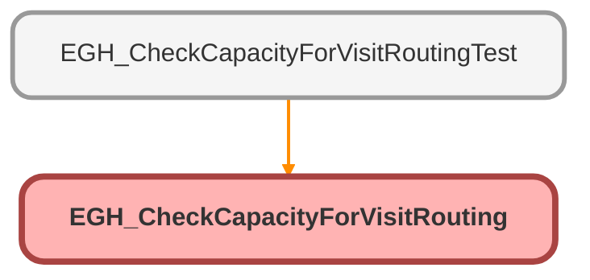

---
hide:
  - path
---

# EGH_CheckCapacityForVisitRouting Class

## Class Diagram



<!-- Apex description -->

## Apex Code

```java
public without sharing class EGH_CheckCapacityForVisitRouting {

    public static final String SHOWROOM_VISIT_SERVICE_CHANNEL = 'Showroom_Visit_Service_Channel';
    public static final String STATUS_OPENED = 'Opened';
    public static final String STATUS_ASSIGNED = 'Assigned';
    public static final String RESOURCE_TYPE_AGENT = 'A';

    public class FlowInput {
        @InvocableVariable(label='Language Skill ID' required=true)
        public String languageSkillId;
        @InvocableVariable(label='Language Skill Level' required=true)
        public Double languageSkillLevel;
        @InvocableVariable(label='Showroom Skill ID' required=true)
        public String showroomSkillId;
        @InvocableVariable(label='Showroom Skill Level' required=true)
        public Double showroomSkillLevel;
    }

    @InvocableMethod(label='Check Capacity for Visit routing' description='Check Agents Capacity before Visit routing to online agents')
    public static List<Boolean> checkCapacityBeforeVisitRoutingToOnlineAgents(List<FlowInput> inputs) {
        if(inputs.isEmpty()) {
            return new List<Boolean>();
        }

        String languageSkillId = inputs[0].languageSkillId;
        Double languageSkillLevel = inputs[0].languageSkillLevel;
        String showroomSkillId = inputs[0].showroomSkillId;
        Double showroomSkillLevel = inputs[0].showroomSkillLevel;


        Map<Id,List<ServiceResourceSkill>> userToSkillsMap = new Map<Id,List<ServiceResourceSkill>>();
        for(ServiceResourceSkill resourceSkill : 
                        [SELECT Id,SkillId, SkillLevel,ServiceResourceId, ServiceResource.RelatedRecordId
                        FROM ServiceResourceSkill 
                        WHERE ServiceResource.ResourceType = :RESOURCE_TYPE_AGENT 
                        AND ServiceResource.IsActive = true 
                        AND (SkillId = :languageSkillId OR SkillId = :showroomSkillId) 
                        WITH SYSTEM_MODE] ) 
        {
            if( (resourceSkill.SkillId == languageSkillId && resourceSkill.SkillLevel < languageSkillLevel) || 
                (resourceSkill.SkillId == showroomSkillId && resourceSkill.SkillLevel < showroomSkillLevel)
            ) {
                continue;
            }

            if(!userToSkillsMap.containsKey(resourceSkill.ServiceResource.RelatedRecordId)) {
                userToSkillsMap.put(resourceSkill.ServiceResource.RelatedRecordId, new List<ServiceResourceSkill>());
            }
            userToSkillsMap.get(resourceSkill.ServiceResource.RelatedRecordId).add(resourceSkill);
        }

        Set<Id> usersWithBothSkills = new Set<Id>();
        for(Id userId : userToSkillsMap.keySet()) {
            if(userToSkillsMap.containsKey(userId) && userToSkillsMap.get(userId).size() >= 2) {
                usersWithBothSkills.add(userId);
            }
        }

        if(usersWithBothSkills.isEmpty()) {
            return new List<Boolean>{false};
        }

        Map<Id,Integer> onlineUsersToCapacityMap = new Map<Id,Integer>();
        for(UserServicePresence userServicePresence : [SELECT Id,ConfiguredCapacity,UserId FROM UserServicePresence WHERE UserId IN :usersWithBothSkills AND IsCurrentState = true WITH SYSTEM_MODE]) {
            onlineUsersToCapacityMap.put(userServicePresence.UserId, userServicePresence.ConfiguredCapacity);
        }

        if(onlineUsersToCapacityMap.isEmpty() && !Test.isRunningTest()) {
            return new List<Boolean>{false};
        }

        if(Test.isRunningTest()) {
            onlineUsersToCapacityMap.put(UserInfo.getUserId(), 3);
            onlineUsersToCapacityMap.get(UserInfo.getUserId());
            onlineUsersToCapacityMap.get(UserInfo.getUserId());
            onlineUsersToCapacityMap.get(UserInfo.getUserId());
            onlineUsersToCapacityMap.get(UserInfo.getUserId());
            onlineUsersToCapacityMap.get(UserInfo.getUserId());
            onlineUsersToCapacityMap.get(UserInfo.getUserId());
            onlineUsersToCapacityMap.get(UserInfo.getUserId());
            onlineUsersToCapacityMap.get(UserInfo.getUserId());
            onlineUsersToCapacityMap.get(UserInfo.getUserId());
            onlineUsersToCapacityMap.get(UserInfo.getUserId());
            onlineUsersToCapacityMap.get(UserInfo.getUserId());
            onlineUsersToCapacityMap.get(UserInfo.getUserId());
            onlineUsersToCapacityMap.get(UserInfo.getUserId());
            onlineUsersToCapacityMap.get(UserInfo.getUserId());
            onlineUsersToCapacityMap.get(UserInfo.getUserId());
            onlineUsersToCapacityMap.get(UserInfo.getUserId());
            onlineUsersToCapacityMap.get(UserInfo.getUserId());
            onlineUsersToCapacityMap.get(UserInfo.getUserId());
            onlineUsersToCapacityMap.get(UserInfo.getUserId());
            onlineUsersToCapacityMap.get(UserInfo.getUserId());
        }


        Id showroomVisitServiceChannelId = [SELECT Id FROM ServiceChannel WHERE DeveloperName = :SHOWROOM_VISIT_SERVICE_CHANNEL LIMIT 1]?.Id;

        Map<Id,List<AgentWork>> onlineUsersToCurrentWork = new Map<Id,List<AgentWork>>();
        for(AgentWork agentWork : [SELECT Id, UserId FROM AgentWork 
                                    WHERE UserId IN :onlineUsersToCapacityMap.keySet() 
                                    AND (Status = :STATUS_OPENED OR Status = :STATUS_ASSIGNED) 
                                    AND ServiceChannelId = :showroomVisitServiceChannelId 
                                    WITH SYSTEM_MODE ]) 
        {

            if(!onlineUsersToCurrentWork.containsKey(agentWork.UserId)) {
                onlineUsersToCurrentWork.put(agentWork.UserId, new List<AgentWork>());
            }
            onlineUsersToCurrentWork.get(agentWork.UserId).add(agentWork);
        }

        if(onlineUsersToCurrentWork.isEmpty()) {
            return new List<Boolean>{true};
        }

        Boolean anyOnlineUserHasCapacity = false;
        for(Id onlineUser : onlineUsersToCapacityMap.keySet()) {
            Integer userCapacity = onlineUsersToCapacityMap.get(onlineUser);
            Integer userCurrentWorkCount = !onlineUsersToCurrentWork.containsKey(onlineUser) ? 0 : onlineUsersToCurrentWork.get(onlineUser).size();
            if(userCurrentWorkCount < userCapacity) {
                anyOnlineUserHasCapacity = true;
                break;
            }
        }

        return new List<Boolean>{anyOnlineUserHasCapacity};
    }
}
```

## Fields
### `SHOWROOM_VISIT_SERVICE_CHANNEL`

#### Signature
```apex
public static final SHOWROOM_VISIT_SERVICE_CHANNEL
```

#### Type
String

---

### `STATUS_OPENED`

#### Signature
```apex
public static final STATUS_OPENED
```

#### Type
String

---

### `STATUS_ASSIGNED`

#### Signature
```apex
public static final STATUS_ASSIGNED
```

#### Type
String

---

### `RESOURCE_TYPE_AGENT`

#### Signature
```apex
public static final RESOURCE_TYPE_AGENT
```

#### Type
String

## Methods
### `checkCapacityBeforeVisitRoutingToOnlineAgents(inputs)`

`INVOCABLEMETHOD`

#### Signature
```apex
public static List<Boolean> checkCapacityBeforeVisitRoutingToOnlineAgents(List<FlowInput> inputs)
```

#### Parameters
| Name | Type | Description |
|------|------|-------------|
| inputs | List<FlowInput> |  |

#### Return Type
**List<Boolean>**

## Classes
### FlowInput Class

#### Fields
##### `languageSkillId`

`INVOCABLEVARIABLE`

###### Signature
```apex
public languageSkillId
```

###### Type
String

---

##### `languageSkillLevel`

`INVOCABLEVARIABLE`

###### Signature
```apex
public languageSkillLevel
```

###### Type
Double

---

##### `showroomSkillId`

`INVOCABLEVARIABLE`

###### Signature
```apex
public showroomSkillId
```

###### Type
String

---

##### `showroomSkillLevel`

`INVOCABLEVARIABLE`

###### Signature
```apex
public showroomSkillLevel
```

###### Type
Double