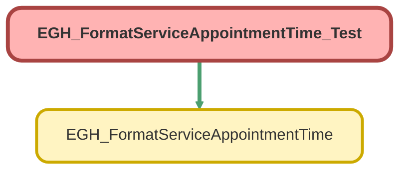

---
hide:
  - path
---

# EGH_FormatServiceAppointmentTime_Test Class

`ISTEST`

## Class Diagram



<!-- Apex description -->

## Apex Code

```java
@IsTest
public class EGH_FormatServiceAppointmentTime_Test {

    @IsTest
    static void testFormatDateAndTimeInUserTimeZone() {

        // Arrange
        Datetime startDt = Datetime.newInstanceGmt(2026, 1, 27, 6, 15, 0); // 10:15 AM Dubai
        Datetime endDt   = Datetime.newInstanceGmt(2026, 1, 27, 6, 45, 0); // 10:45 AM Dubai
        String timeZone  = 'Asia/Dubai';

        EGH_FormatServiceAppointmentTime.Input input = 
            new EGH_FormatServiceAppointmentTime.Input();
        input.startTime = startDt;
        input.endTime   = endDt;
        input.userTimeZone = timeZone;

        List<EGH_FormatServiceAppointmentTime.Input> inputs =
            new List<EGH_FormatServiceAppointmentTime.Input>{ input };

        // Act
        Test.startTest();
        List<EGH_FormatServiceAppointmentTime.Output> results =
            EGH_FormatServiceAppointmentTime.format(inputs);
        Test.stopTest();

        // Assert
        System.assertEquals(1, results.size());

        EGH_FormatServiceAppointmentTime.Output output = results[0];

        System.assertEquals(
            'Tuesday, January 27, 2026',
            output.formattedDate,
            'Date should be formatted in user timezone'
        );

        System.assertEquals(
            '10:15 AM',
            output.formattedStartTime,
            'Start time should be formatted in user timezone'
        );

        System.assertEquals(
            '10:45 AM',
            output.formattedEndTime,
            'End time should be formatted in user timezone'
        );
    }
}
```

## Methods
### `testFormatDateAndTimeInUserTimeZone()`

`ISTEST`

#### Signature
```apex
private static void testFormatDateAndTimeInUserTimeZone()
```

#### Return Type
**void**