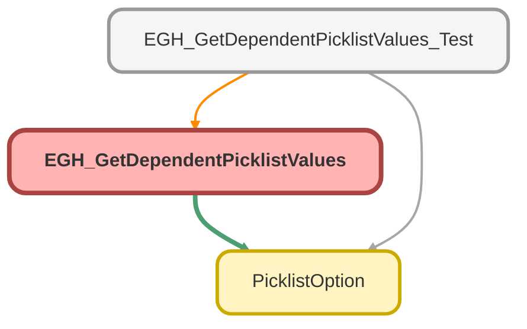

---
hide:
  - path
---

# EGH_GetDependentPicklistValues Class

## Class Diagram



<!-- Apex description -->

## Apex Code

```java
public with sharing class EGH_GetDependentPicklistValues {

    public class FlowInput {
        @InvocableVariable(label='Object API Name' required=true)
        public String objectAPIName;
        @InvocableVariable(label='Dependent Field API Name' required=true)
        public String dependentFieldAPIName;
        @InvocableVariable(label='Controlling Field Value' required=true)
        public String controllingValue;
    }

    @InvocableMethod(label='Get Dependent Picklist Values' description='Returns a list of PicklistOption objects (Label/Value) based on a controlling value.')
    public static List<List<PicklistOption>> getDependentValuesFlow(List<FlowInput> inputs) {
        List<List<PicklistOption>> bulkResults = new List<List<PicklistOption>>();

        for (FlowInput input : inputs) {
            try {
                List<PicklistOption> results = getDependentValues(
                    input.objectAPIName, 
                    input.dependentFieldAPIName, 
                    input.controllingValue
                );
                bulkResults.add(results != null ? results : new List<PicklistOption>());
            } catch (Exception e) {
                bulkResults.add(new List<PicklistOption>());
            }
        }
        return bulkResults;
    }

    private static List<PicklistOption> getDependentValues(String objectAPIName, String dependentFieldAPIName, String controllingValue) {
        Map<String, Schema.SObjectType> globalDescribe = Schema.getGlobalDescribe();
        if (!globalDescribe.containsKey(objectAPIName)) return new List<PicklistOption>();

        Schema.SObjectType objType = globalDescribe.get(objectAPIName);
        Map<String, Schema.SObjectField> fieldMap = objType.getDescribe().fields.getMap();
        
        if (!fieldMap.containsKey(dependentFieldAPIName)) return new List<PicklistOption>();
        
        Schema.SObjectField dependToken = fieldMap.get(dependentFieldAPIName);
        Map<Object, List<PicklistOption>> allDepValues = getDependentPicklistValues(dependToken);
        
        return allDepValues.containsKey(controllingValue) ? allDepValues.get(controllingValue) : new List<PicklistOption>();
    }

    private static Map<Object, List<PicklistOption>> getDependentPicklistValues(Schema.SObjectField dependToken) {
        Schema.DescribeFieldResult depend = dependToken.getDescribe();
        Schema.SObjectField controlToken = depend.getController();
        if (controlToken == null) return new Map<Object, List<PicklistOption>>();

        Schema.DescribeFieldResult control = controlToken.getDescribe();
        List<Schema.PicklistEntry> controlEntries = control.getPicklistValues();
        
        String base64map = 'ABCDEFGHIJKLMNOPQRSTUVWXYZabcdefghijklmnopqrstuvwxyz0123456789+/';
        Map<Object, List<PicklistOption>> dependentPicklistValues = new Map<Object, List<PicklistOption>>();

        for (Schema.PicklistEntry entry : depend.getPicklistValues()) {
            if (entry.isActive()) {
                Map<String, Object> entryMap = (Map<String, Object>) JSON.deserializeUntyped(JSON.serialize(entry));
                String validFor = (String) entryMap.get('validFor');
                
                if (String.isBlank(validFor)) continue;

                PicklistOption currentOption = new PicklistOption(entry.getLabel(), entry.getValue());

                for (Integer i = 0; i < controlEntries.size(); i++) {
                    String ctrlLabel = controlEntries[i].getLabel();
                    String ctrlValue = controlEntries[i].getValue();
                    
                    Integer bitIndex = i / 6;
                    Integer bitShift = 5 - Math.mod(i, 6);
                    
                    if (bitIndex < validFor.length()) {
                        Integer decoded = base64map.indexOf(validFor.substring(bitIndex, bitIndex + 1));
                        if ((decoded & (1 << bitShift)) != 0) {
                            addToMap(dependentPicklistValues, ctrlLabel, currentOption);
                            if (ctrlLabel != ctrlValue) {
                                addToMap(dependentPicklistValues, ctrlValue, currentOption);
                            }
                        }
                    }
                }
            }
        }
        return dependentPicklistValues;
    }

    private static void addToMap(Map<Object, List<PicklistOption>> pMap, Object key, PicklistOption val) {
        if (!pMap.containsKey(key)) pMap.put(key, new List<PicklistOption>());
        pMap.get(key).add(val);
    }
}
```

## Methods
### `getDependentValuesFlow(inputs)`

`OTHER`

#### Signature
```apex
public static List<List<PicklistOption>> getDependentValuesFlow(List<FlowInput> inputs)
```

#### Parameters
| Name | Type | Description |
|------|------|-------------|
| inputs | List<FlowInput> |  |

#### Return Type
**List<List<PicklistOption>>**

---

### `getDependentValues(objectAPIName, dependentFieldAPIName, controllingValue)`

#### Signature
```apex
private static List<PicklistOption> getDependentValues(String objectAPIName, String dependentFieldAPIName, String controllingValue)
```

#### Parameters
| Name | Type | Description |
|------|------|-------------|
| objectAPIName | String |  |
| dependentFieldAPIName | String |  |
| controllingValue | String |  |

#### Return Type
**List<PicklistOption>**

---

### `getDependentPicklistValues(dependToken)`

#### Signature
```apex
private static Map<Object,List<PicklistOption>> getDependentPicklistValues(Schema.SObjectField dependToken)
```

#### Parameters
| Name | Type | Description |
|------|------|-------------|
| dependToken | Schema.SObjectField |  |

#### Return Type
**Map<Object,List<PicklistOption>>**

---

### `addToMap(pMap, key, val)`

#### Signature
```apex
private static void addToMap(Map<Object,List<PicklistOption>> pMap, Object key, PicklistOption val)
```

#### Parameters
| Name | Type | Description |
|------|------|-------------|
| pMap | Map<Object,List<PicklistOption>> |  |
| key | Object |  |
| val | [PicklistOption](PicklistOption.md) |  |

#### Return Type
**void**

## Classes
### FlowInput Class

#### Fields
##### `objectAPIName`

`INVOCABLEVARIABLE`

###### Signature
```apex
public objectAPIName
```

###### Type
String

---

##### `dependentFieldAPIName`

`INVOCABLEVARIABLE`

###### Signature
```apex
public dependentFieldAPIName
```

###### Type
String

---

##### `controllingValue`

`INVOCABLEVARIABLE`

###### Signature
```apex
public controllingValue
```

###### Type
String