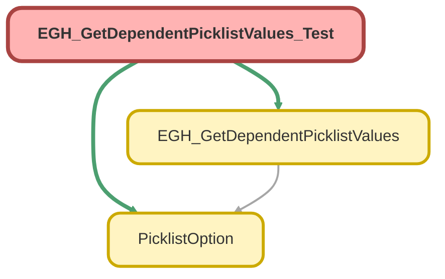

---
hide:
  - path
---

# EGH_GetDependentPicklistValues_Test Class

`ISTEST`

## Class Diagram



<!-- Apex description -->

## Apex Code

```java
@IsTest
public class EGH_GetDependentPicklistValues_Test {

    @IsTest
    static void testGetDependentValuesSuccess() {
        
        EGH_GetDependentPicklistValues.FlowInput input = new EGH_GetDependentPicklistValues.FlowInput();
        input.objectAPIName = 'Lead';
        input.dependentFieldAPIName = 'EGH_Model_of_Interest__c';
        input.controllingValue = 'Jetour'; // Example value

        List<EGH_GetDependentPicklistValues.FlowInput> inputs = new List<EGH_GetDependentPicklistValues.FlowInput>{input};

        Test.startTest();
        List<List<PicklistOption>> results = EGH_GetDependentPicklistValues.getDependentValuesFlow(inputs);
        Test.stopTest();

        // Assertions
        System.assertNotEquals(null, results, 'The result list should not be null');
        System.assertEquals(1, results.size(), 'There should be one result list for the one input provided');
        
        // Since we can't guarantee a dependency exists in every scratch org/sandbox for standard fields,
        // we check that the code didn't crash and returned a valid list (even if empty).
        List<PicklistOption> options = results[0];
        System.assertNotEquals(null, options, 'The options list should be initialized');
    }

    @IsTest
    static void testInvalidObjectOrField() {
        EGH_GetDependentPicklistValues.FlowInput input = new EGH_GetDependentPicklistValues.FlowInput();
        input.objectAPIName = 'Invalid_Object_Name__c';
        input.dependentFieldAPIName = 'No_Field__c';
        input.controllingValue = 'SomeValue';

        List<EGH_GetDependentPicklistValues.FlowInput> inputs = new List<EGH_GetDependentPicklistValues.FlowInput>{input};

        Test.startTest();
        List<List<PicklistOption>> results = EGH_GetDependentPicklistValues.getDependentValuesFlow(inputs);
        Test.stopTest();

        System.assertEquals(1, results.size());
        System.assertEquals(0, results[0].size(), 'Should return an empty list for invalid metadata names');
    }
}
```

## Methods
### `testGetDependentValuesSuccess()`

`ISTEST`

#### Signature
```apex
private static void testGetDependentValuesSuccess()
```

#### Return Type
**void**

---

### `testInvalidObjectOrField()`

`ISTEST`

#### Signature
```apex
private static void testInvalidObjectOrField()
```

#### Return Type
**void**