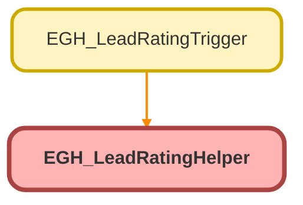

---
hide:
  - path
---

# EGH_LeadRatingHelper Class

## Class Diagram



<!-- Apex description -->

## Apex Code

```java
public class EGH_LeadRatingHelper {
    // Helper method to determine and set the Rating
    public static void setLeadRating(Lead lead) {
        Decimal score = lead.EGH_Total_Lead_Score__c;
        String rating = determineRating(score);
        lead.Rating = rating;
    }

    // Logic to determine the Rating based on the score
    private static String determineRating(Decimal score) {
        if (score == null) {
            return 'Cold'; // Handle null scores as Cold
        }
        if (score >= 10) {
            return 'Hot';
        } else if (score >= 5) {
            return 'Warm';
        } else {
            return 'Cold';
        }
    }
}
```

## Methods
### `setLeadRating(lead)`

#### Signature
```apex
public static void setLeadRating(Lead lead)
```

#### Parameters
| Name | Type | Description |
|------|------|-------------|
| lead | [Lead](../objects/Lead.md) |  |

#### Return Type
**void**

---

### `determineRating(score)`

#### Signature
```apex
private static String determineRating(Decimal score)
```

#### Parameters
| Name | Type | Description |
|------|------|-------------|
| score | Decimal |  |

#### Return Type
**String**