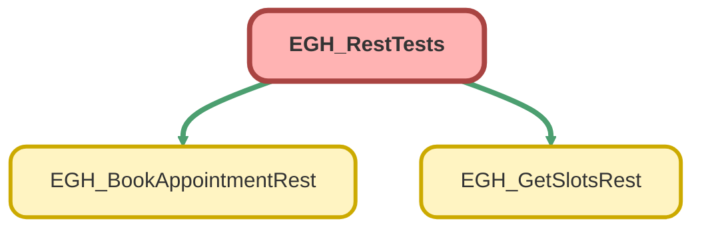

---
hide:
  - path
---

# EGH_RestTests Class

`ISTEST`

## Class Diagram



<!-- Apex description -->

## Apex Code

```java
@IsTest
public class EGH_RestTests {
public class NoVehicleMock implements HttpCalloutMock {
    public HttpResponse respond(HttpRequest req) {
        HttpResponse res = new HttpResponse();
        String endpoint = req.getEndpoint();

        if (endpoint.contains('/scheduling/getAppointmentSlots')) {
            res.setStatusCode(200);
            res.setBody('{"timeSlots":[]}'); // <-- forces "No vehicle slots"
        } else if (endpoint.contains('/connect/scheduling/available-territory-slots')) {
            // still return a valid driver slot so only vehicle side fails
            Id srId   = [SELECT Id FROM ServiceResource WHERE ResourceType='T' LIMIT 1].Id;
            Id terrId = [SELECT Id FROM ServiceTerritory LIMIT 1].Id;
            String body =
                '{"result":{"territorySlots":[{"territoryId":"' + terrId +
                '","slots":[{"startTime":"2025-01-01T10:00:00.000Z","endTime":"2025-01-01T11:00:00.000Z","resources":["' +
                srId + '"]}]}]}}';
            res.setStatusCode(200);
            res.setBody(body);
        } else {
            res.setStatusCode(200);
            res.setBody('{}');
        }
        return res;
    }
}


    // ---------------------------------------------------------------------
    // Test Data Setup (future-safe + real vehicle SR)
    // ---------------------------------------------------------------------
    @TestSetup
    static void setupTestData() {
        // OperatingHours
        OperatingHours oh = new OperatingHours(
            Name = 'Test Operating Hours',
            TimeZone = 'America/Los_Angeles'
        );
        insert oh;

        // Create ServiceTerritory
        ServiceTerritory territory = new ServiceTerritory(
            Name = 'Test Territory',
            IsActive = true,
            OperatingHoursId = oh.Id
        );
        insert territory;

        // Dummy User for FSL
        Profile p = [SELECT Id FROM Profile WHERE Name = 'Standard User' LIMIT 1];
        User testUser = new User(
            Alias = 'tuser',
            Email = 'testuser@example.com',
            EmailEncodingKey = 'UTF-8',
            LastName = 'TestUser',
            LanguageLocaleKey = 'en_US',
            LocaleSidKey = 'en_US',
            ProfileId = p.Id,
            TimeZoneSidKey = 'America/Los_Angeles',
            UserName = 'testuser' + System.currentTimeMillis() + '@example.com'
        );
        insert testUser;

        // Reuse auto-created ServiceResource for this user if exists
        ServiceResource driverResource;
        List<ServiceResource> srs = [
            SELECT Id, Name, ResourceType, IsActive, RelatedRecordId
            FROM ServiceResource
            WHERE RelatedRecordId = :testUser.Id
            LIMIT 1
        ];
        if (!srs.isEmpty()) {
            driverResource = srs[0];
            Boolean upd = false;
            if (driverResource.ResourceType != 'T') { driverResource.ResourceType = 'T'; upd = true; }
            if (driverResource.IsActive != true)    { driverResource.IsActive = true; upd = true; }
            if (upd) update driverResource;
        } else {
            driverResource = new ServiceResource(
                Name = 'Test Driver',
                ResourceType = 'T',
                IsActive = true,
                RelatedRecordId = testUser.Id
            );
            insert driverResource;
        }

        // Create WorkType
        WorkType testDriveWorkType = new WorkType(
            Name = 'Test Drive Work Type',
            EstimatedDuration = 60,
            DurationType = 'Minutes'
        );
        insert testDriveWorkType;

        // Link WorkType to territory
        insert new ServiceTerritoryWorkType(
            ServiceTerritoryId = territory.Id,
            WorkTypeId = testDriveWorkType.Id
        );

        // WorkTypeGroup + member (finder uses it)
        WorkTypeGroup wtg = new WorkTypeGroup(
            Name = 'Test Drive Group',
            Category = 'Test Drive'
        );
        insert wtg;

        insert new WorkTypeGroupMember(
            WorkTypeId = testDriveWorkType.Id,
            WorkTypeGroupId = wtg.Id
        );

        // Vehicle Asset + Vehicle ServiceResource (ResourceType='S')
        Account acc = new Account(Name = 'Test Account');
        insert acc;

        Product2 prod = new Product2(
            Name = 'Test Vehicle',
            Family = 'Test',
            ProductCode = 'TV-' + String.valueOf(Crypto.getRandomInteger()).leftPad(6,'0'),
            IsActive = true
        );
        insert prod;

        Asset vehicleAsset = new Asset(
            Name = 'Test Vehicle Asset',
            Status = 'Active',
            SerialNumber = 'SN-' + String.valueOf(Crypto.getRandomInteger()).leftPad(10,'0'),
            Product2Id = prod.Id,
            AccountId  = acc.Id,
            OwnerId    = UserInfo.getUserId()
        );
        insert vehicleAsset;

        ServiceResource vehicleResource = new ServiceResource(
            Name = 'Test Vehicle SR',
            ResourceType = 'S',
            IsActive = true,
            AssetId = vehicleAsset.Id
        );
        insert vehicleResource;

        // Territory members (future-safe)
        Date effStart = Date.newInstance(2020, 1, 1);
        Date effEnd   = Date.newInstance(2099,12,31);

        insert new ServiceTerritoryMember(
            ServiceTerritoryId = territory.Id,
            ServiceResourceId  = driverResource.Id,
            EffectiveStartDate = effStart,
            EffectiveEndDate   = effEnd
        );

        insert new ServiceTerritoryMember(
            ServiceTerritoryId = territory.Id,
            ServiceResourceId  = vehicleResource.Id,
            EffectiveStartDate = effStart,
            EffectiveEndDate   = effEnd
        );

        // Lead + Opportunity
        insert new Lead(
            FirstName='Test', LastName='Lead', Company='Test Co',
            Email='test@test.com', Phone='1234567890', EGH_BrandListPicklist__c = 'Jetour'
        );

        insert new Opportunity(
            Name='Test Opportunity',
            AccountId=acc.Id,
            StageName='Prospecting',
            CloseDate=Date.today().addDays(30),
			EGH_Brand__c = 'Jetour'
        );
    }

    // ---------------------------------------------------------------------
    // Helper: build tomorrow 10–11am GMT strings for mocks
    // ---------------------------------------------------------------------
    private static Datetime tomorrow10Gmt() {
        Date d = Date.today().addDays(1);
        return Datetime.newInstanceGmt(d, Time.newInstance(10,0,0,0));
    }
    private static Datetime tomorrow11Gmt() {
        return tomorrow10Gmt().addHours(1);
    }

    // ---------------------------------------------------------------------
    // Mocks (dynamic FUTURE slots)
    // ---------------------------------------------------------------------
    public class PassThroughMock implements HttpCalloutMock {
        public HttpResponse respond(HttpRequest req) {
            HttpResponse res = new HttpResponse();
            String endpoint = req.getEndpoint();

            Datetime st = tomorrow10Gmt();
            Datetime en = tomorrow11Gmt();
            String stZ = st.formatGmt('yyyy-MM-dd\'T\'HH:mm:ss.SSS\'Z\'');
            String enZ = en.formatGmt('yyyy-MM-dd\'T\'HH:mm:ss.SSS\'Z\'');

            if (endpoint.contains('/scheduling/getAppointmentSlots')) {
                res.setStatusCode(200);
                res.setBody('{"timeSlots":[{"startTime":"' + stZ + '","endTime":"' + enZ + '"}]}');

            } else if (endpoint.contains('/connect/scheduling/available-territory-slots')) {
                Id srId   = [SELECT Id FROM ServiceResource WHERE ResourceType='T' LIMIT 1].Id;
                Id terrId = [SELECT Id FROM ServiceTerritory LIMIT 1].Id;

                String body =
                    '{"result":{"territorySlots":[{"territoryId":"' + String.valueOf(terrId) +
                    '","slots":[{"startTime":"' + stZ + '","endTime":"' + enZ +
                    '","resources":["' + String.valueOf(srId) + '"]}]}]}}';

                res.setStatusCode(200);
                res.setBody(body);

            } else if (endpoint.contains('/connect/scheduling/service-appointments')) {
                res.setStatusCode(201);
                res.setBody('{"result":{"serviceAppointmentId":"08p000000000XYZ"}}');

            } else if (endpoint.contains('/sobjects/ServiceAppointment/')) {
                res.setStatusCode(204);
                res.setBody('');

            } else {
                res.setStatusCode(200);
                res.setBody('{}');
            }
            return res;
        }
    }

    public class FailingCreateMock implements HttpCalloutMock {
        public HttpResponse respond(HttpRequest req) {
            HttpResponse res = new HttpResponse();
            String endpoint = req.getEndpoint();

            Datetime st = tomorrow10Gmt();
            Datetime en = tomorrow11Gmt();
            String stZ = st.formatGmt('yyyy-MM-dd\'T\'HH:mm:ss.SSS\'Z\'');
            String enZ = en.formatGmt('yyyy-MM-dd\'T\'HH:mm:ss.SSS\'Z\'');

            if (endpoint.contains('/scheduling/getAppointmentSlots')) {
                res.setStatusCode(200);
                res.setBody('{"timeSlots":[{"startTime":"' + stZ + '","endTime":"' + enZ + '"}]}');

            } else if (endpoint.contains('/connect/scheduling/available-territory-slots')) {
                Id srId   = [SELECT Id FROM ServiceResource WHERE ResourceType='T' LIMIT 1].Id;
                Id terrId = [SELECT Id FROM ServiceTerritory LIMIT 1].Id;

                String body =
                    '{"result":{"territorySlots":[{"territoryId":"' + String.valueOf(terrId) +
                    '","slots":[{"startTime":"' + stZ + '","endTime":"' + enZ +
                    '","resources":["' + String.valueOf(srId) + '"]}]}]}}';

                res.setStatusCode(200);
                res.setBody(body);

            } else if (endpoint.contains('/connect/scheduling/service-appointments')) {
                res.setStatusCode(500);
                res.setBody('{"errors":[{"message":"Downstream failure"}]}');

            } else {
                res.setStatusCode(200);
                res.setBody('{}');
            }

            return res;
        }
    }

    // ---------------------------------------------------------------------
    // Tests: EGH_GetSlotsRest
    // ---------------------------------------------------------------------
    @IsTest
    static void testGetSlots_success() {
        Test.startTest();
        Test.setMock(HttpCalloutMock.class, new PassThroughMock());

        Id terrId = [SELECT Id FROM ServiceTerritory LIMIT 1].Id;
        Id vehId  = [SELECT Id FROM ServiceResource WHERE ResourceType='S' LIMIT 1].Id;
        Id wtId   = [SELECT Id FROM WorkType WHERE Name='Test Drive Work Type' LIMIT 1].Id;

        Datetime startWin = tomorrow10Gmt().addHours(-1);
        Datetime endWin   = tomorrow10Gmt().addHours(8);

        RestRequest req = new RestRequest();
        req.requestURI = '/services/apexrest/testdrive/slots';
        req.httpMethod = 'POST';
        req.addHeader('Content-Type', 'application/json');
        req.requestBody = Blob.valueOf(JSON.serialize(new Map<String, Object>{
            'territoryId'       => terrId,
            'vehicleResourceId' => vehId,
            'workTypeId'        => wtId,
            'startTime'         => startWin,
            'endTime'           => endWin
        }));

        RestContext.request  = req;
        RestContext.response = new RestResponse();

        EGH_GetSlotsRest.doPost();

        System.assertEquals(200, RestContext.response.statusCode);
        Map<String, Object> parsed =
            (Map<String, Object>)JSON.deserializeUntyped(RestContext.response.responseBody.toString());
        System.assertEquals(true, parsed.get('success'));
        System.assert(((List<Object>)parsed.get('slots')).size() > 0);

        Test.stopTest();
    }

    @IsTest
    static void testGetSlots_missingFields_400() {
        Test.startTest();
        RestRequest req = new RestRequest();
        req.requestURI = '/services/apexrest/testdrive/slots';
        req.httpMethod = 'POST';
        req.addHeader('Content-Type','application/json');
        req.requestBody = Blob.valueOf('{}');
        RestContext.request=req; RestContext.response=new RestResponse();

        EGH_GetSlotsRest.doPost();
        System.assertEquals(400, RestContext.response.statusCode);
        Test.stopTest();
    }

    // ---------------------------------------------------------------------
    // Tests: EGH_BookAppointmentRest
    // ---------------------------------------------------------------------
    @IsTest
    static void testBookAppointment_success_201() {
        Test.startTest();
        Test.setMock(HttpCalloutMock.class, new PassThroughMock());

        Id terrId = [SELECT Id FROM ServiceTerritory LIMIT 1].Id;
        Id vehId  = [SELECT Id FROM ServiceResource WHERE ResourceType='S' LIMIT 1].Id;
        Id wtId   = [SELECT Id FROM WorkType WHERE Name='Test Drive Work Type' LIMIT 1].Id;
        Id oppId  = [SELECT Id FROM Opportunity LIMIT 1].Id;

        Datetime start = tomorrow10Gmt();
        Datetime endDt = tomorrow11Gmt();

        RestRequest req = new RestRequest();
        req.requestURI = '/services/apexrest/testdrive/bookappointments';
        req.httpMethod = 'POST';
        req.addHeader('Content-Type','application/json');
        req.requestBody = Blob.valueOf(JSON.serialize(new Map<String, Object>{
            'territoryId'       => terrId,
            'vehicleResourceId' => vehId,
            'workTypeId'        => wtId,
            'startTime'         => start,
            'endTime'           => endDt,
            'parentRecordId'    => oppId
        }));

        RestContext.request=req; RestContext.response=new RestResponse();
        EGH_BookAppointmentRest.doPost();

        System.assertEquals(201, RestContext.response.statusCode);

        Map<String,Object> resp =
            (Map<String,Object>)JSON.deserializeUntyped(RestContext.response.responseBody.toString());
        System.assertEquals(true, resp.get('success'));
        System.assertNotEquals(null, resp.get('serviceAppointmentId'));

        Test.stopTest();
    }

    @IsTest
    static void testBookAppointment_missingFields_400() {
        Test.startTest();
        RestRequest req = new RestRequest();
        req.requestURI='/services/apexrest/testdrive/bookappointments';
        req.httpMethod='POST';
        req.addHeader('Content-Type','application/json');
        req.requestBody=Blob.valueOf('{}');
        RestContext.request=req; RestContext.response=new RestResponse();

        EGH_BookAppointmentRest.doPost();
        System.assertEquals(400, RestContext.response.statusCode);
        Test.stopTest();
    }

    @IsTest
static void testBookAppointment_calloutFailure_returns400() {
    Test.startTest();
    Test.setMock(HttpCalloutMock.class, new FailingCreateMock());

    Id terrId = [SELECT Id FROM ServiceTerritory LIMIT 1].Id;
    Id vehId  = [SELECT Id FROM ServiceResource WHERE ResourceType='S' LIMIT 1].Id;
    Id wtId   = [SELECT Id FROM WorkType WHERE Name='Test Drive Work Type' LIMIT 1].Id;
    Id oppId  = [SELECT Id FROM Opportunity LIMIT 1].Id;

    Datetime start = tomorrow10Gmt();
    Datetime endDt = tomorrow11Gmt();

    RestRequest req = new RestRequest();
    req.requestURI='/services/apexrest/testdrive/bookappointments';
    req.httpMethod='POST';
    req.addHeader('Content-Type','application/json');
    req.requestBody=Blob.valueOf(JSON.serialize(new Map<String,Object>{
        'territoryId'       => terrId,
        'vehicleResourceId' => vehId,
        'workTypeId'        => wtId,
        'startTime'         => start,
        'endTime'           => endDt,
        'parentRecordId'    => oppId
    }));

    RestContext.request=req;
    RestContext.response=new RestResponse();

    EGH_BookAppointmentRest.doPost();

    Integer sc = RestContext.response.statusCode;
    System.assert(
        sc == 400 || sc == 500,
        'Expected 400 or 500 for downstream failure, got ' + sc
    );

    Test.stopTest();
}

    @IsTest
static void testGetSlots_emptyBody_400() {
    Test.startTest();

    RestRequest req = new RestRequest();
    req.requestURI = '/services/apexrest/testdrive/slots';
    req.httpMethod = 'POST';
    req.addHeader('Content-Type', 'application/json');
    req.requestBody = Blob.valueOf(''); // empty on purpose

    RestContext.request = req;
    RestContext.response = new RestResponse();

    EGH_GetSlotsRest.doPost();

    System.assertEquals(400, RestContext.response.statusCode,
        'Expected 400 when body is empty');
    System.assert(
        RestContext.response.responseBody.toString().contains('Empty request body'),
        'Should return "Empty request body" message'
    );

    Test.stopTest();
}

@IsTest
static void testGetSlots_functionalError_mapsTo400() {
    Test.startTest();
    Test.setMock(HttpCalloutMock.class, new NoVehicleMock());

    Id terrId = [SELECT Id FROM ServiceTerritory LIMIT 1].Id;
    Id vehId  = [SELECT Id FROM ServiceResource WHERE ResourceType='S' LIMIT 1].Id;
    Id wtId   = [SELECT Id FROM WorkType WHERE Name='Test Drive Work Type' LIMIT 1].Id;

    RestRequest req = new RestRequest();
    req.requestURI = '/services/apexrest/testdrive/slots';
    req.httpMethod = 'POST';
    req.addHeader('Content-Type', 'application/json');
    req.requestBody = Blob.valueOf(JSON.serialize(new Map<String, Object>{
        'territoryId'       => terrId,
        'vehicleResourceId' => vehId,
        'workTypeId'        => wtId,
        'startTime'         => Datetime.now().addDays(1),
        'endTime'           => Datetime.now().addDays(1).addHours(2)
    }));

    RestContext.request = req;
    RestContext.response = new RestResponse();

    EGH_GetSlotsRest.doPost();

    Integer sc = RestContext.response.statusCode;
    System.assert(
        sc == 400 || sc == 500,
        'Expected 400 or 500 for functional error, got ' + sc
    );

    String body = RestContext.response.responseBody.toString();
    System.assert(body.contains('"success":false'));

    Test.stopTest();
}


@IsTest
static void testGetSlots_invalidJson_mapsTo500() {
    Test.startTest();

    RestRequest req = new RestRequest();
    req.requestURI = '/services/apexrest/testdrive/slots';
    req.httpMethod = 'POST';
    req.addHeader('Content-Type', 'application/json');
    req.requestBody = Blob.valueOf('{ invalid json'); // will throw JSON exception

    RestContext.request = req;
    RestContext.response = new RestResponse();

    EGH_GetSlotsRest.doPost();

    System.assertEquals(500, RestContext.response.statusCode,
        'Unexpected errors should map to 500');
    System.assert(
        RestContext.response.responseBody.toString().contains('Failed to retrieve slots'),
        'Should include generic failure message'
    );

    Test.stopTest();
}
}
```

## Methods
### `setupTestData()`

`TESTSETUP`

#### Signature
```apex
private static void setupTestData()
```

#### Return Type
**void**

---

### `tomorrow10Gmt()`

#### Signature
```apex
private static Datetime tomorrow10Gmt()
```

#### Return Type
**Datetime**

---

### `tomorrow11Gmt()`

#### Signature
```apex
private static Datetime tomorrow11Gmt()
```

#### Return Type
**Datetime**

---

### `testGetSlots_success()`

`ISTEST`

#### Signature
```apex
private static void testGetSlots_success()
```

#### Return Type
**void**

---

### `testGetSlots_missingFields_400()`

`ISTEST`

#### Signature
```apex
private static void testGetSlots_missingFields_400()
```

#### Return Type
**void**

---

### `testBookAppointment_success_201()`

`ISTEST`

#### Signature
```apex
private static void testBookAppointment_success_201()
```

#### Return Type
**void**

---

### `testBookAppointment_missingFields_400()`

`ISTEST`

#### Signature
```apex
private static void testBookAppointment_missingFields_400()
```

#### Return Type
**void**

---

### `testBookAppointment_calloutFailure_returns400()`

`ISTEST`

#### Signature
```apex
private static void testBookAppointment_calloutFailure_returns400()
```

#### Return Type
**void**

---

### `testGetSlots_emptyBody_400()`

`ISTEST`

#### Signature
```apex
private static void testGetSlots_emptyBody_400()
```

#### Return Type
**void**

---

### `testGetSlots_functionalError_mapsTo400()`

`ISTEST`

#### Signature
```apex
private static void testGetSlots_functionalError_mapsTo400()
```

#### Return Type
**void**

---

### `testGetSlots_invalidJson_mapsTo500()`

`ISTEST`

#### Signature
```apex
private static void testGetSlots_invalidJson_mapsTo500()
```

#### Return Type
**void**

## Classes
### NoVehicleMock Class

**Implements**

HttpCalloutMock

#### Methods
##### `respond(req)`

###### Signature
```apex
public HttpResponse respond(HttpRequest req)
```

###### Parameters
| Name | Type | Description |
|------|------|-------------|
| req | HttpRequest |  |

###### Return Type
**HttpResponse**

### PassThroughMock Class

**Implements**

HttpCalloutMock

#### Methods
##### `respond(req)`

###### Signature
```apex
public HttpResponse respond(HttpRequest req)
```

###### Parameters
| Name | Type | Description |
|------|------|-------------|
| req | HttpRequest |  |

###### Return Type
**HttpResponse**

### FailingCreateMock Class

**Implements**

HttpCalloutMock

#### Methods
##### `respond(req)`

###### Signature
```apex
public HttpResponse respond(HttpRequest req)
```

###### Parameters
| Name | Type | Description |
|------|------|-------------|
| req | HttpRequest |  |

###### Return Type
**HttpResponse**