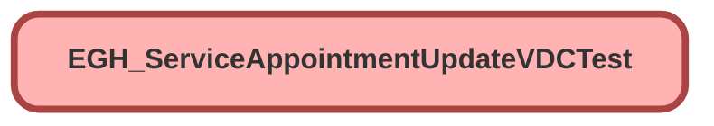

---
hide:
  - path
---

# EGH_ServiceAppointmentUpdateVDCTest Class

`ISTEST`

## Class Diagram



<!-- Apex description -->

## Apex Code

```java
@isTest
public class EGH_ServiceAppointmentUpdateVDCTest {
    
    @TestSetup
    static void setupTestData() {
        // Create test account
        Account testAccount = new Account(Name = 'Test Account');
        insert testAccount;
        
        // Create test Vehicle (Asset)
        Asset testVehicle = new Asset(
            Name = 'Test Vehicle',
            AccountId = testAccount.Id,
            SerialNumber = 'VIN1234567890'
        );
        insert testVehicle;
        
        // Create WorkType
        WorkType workType = new WorkType(
            Name = 'Test WorkType',
            DurationType = 'Hours',
            EstimatedDuration = 120
        );
        insert workType;
        
        // Create WorkTypeGroup with Test Drive category for validation testing
        WorkTypeGroup testDriveGroup = new WorkTypeGroup(
            Name = 'Test Drive Work Group',
            Category = 'Test Drive'
        );
        insert testDriveGroup;
        
        // Create Vehicle Damage Capture records for testing
        List<EGH_Vehicle_Damage_Capture__c> vdcRecords = new List<EGH_Vehicle_Damage_Capture__c>();
        for (Integer i = 0; i < 5; i++) {
            vdcRecords.add(new EGH_Vehicle_Damage_Capture__c(
                Name = 'Test VDC ' + i,
                EGH_Asset__c = testVehicle.Id,
                EGH_Area_of_Damage_Defect__c = 'Area ' + i,
                EGH_DateTime_Damage_Defect_Identified__c = DateTime.now().addDays(-i),
                EGH_Quick_Scheduled__c = false
            ));
        }
        insert vdcRecords;
    }
    
    @isTest
    static void testValidationRequiresPostInspectionOnly() {
        // Get test data
        WorkTypeGroup testDriveGroup = [SELECT Id FROM WorkTypeGroup WHERE Category = 'Test Drive' LIMIT 1];
        Account testAccount = [SELECT Id FROM Account LIMIT 1];
        WorkType workType = [SELECT Id FROM WorkType LIMIT 1];
        
        DateTime startTime = DateTime.now().addDays(1);
        DateTime endTime = startTime.addHours(2);
        
        // Create Service Appointment with Test Drive Work Type Group
        ServiceAppointment sa = new ServiceAppointment(
            ParentRecordId = String.valueOf(testAccount.Id),
            WorkTypeId = workType.Id,
            Status = 'Scheduled',
            City = 'Roma',
            SchedStartTime = startTime,
            SchedEndTime = endTime,
            EGH_WorkTypeGroup__c = testDriveGroup.Id
        );
        insert sa;
        
        Test.startTest();
        // Try to complete without Post-test inspection
        sa.Status = 'Completed';
        
        try {
            update sa;
            System.assert(false, 'Should have thrown validation error');
        } catch (DmlException e) {
            System.assert(e.getMessage().contains('Post-Test Drive Inspection is required'), 
                         'Should show validation error for missing post-test inspection');
        }
        Test.stopTest();
    }
    
    @isTest
    static void testValidationPassesWithPostInspection() {
        // Get test data
        WorkTypeGroup testDriveGroup = [SELECT Id FROM WorkTypeGroup WHERE Category = 'Test Drive' LIMIT 1];
        Account testAccount = [SELECT Id FROM Account LIMIT 1];
        WorkType workType = [SELECT Id FROM WorkType LIMIT 1];
        List<EGH_Vehicle_Damage_Capture__c> vdcRecords = [SELECT Id FROM EGH_Vehicle_Damage_Capture__c LIMIT 1];
        
        DateTime startTime = DateTime.now().addDays(1);
        DateTime endTime = startTime.addHours(2);
        
        // Create Service Appointment with Test Drive Work Type Group and Post inspection
        ServiceAppointment sa = new ServiceAppointment(
            ParentRecordId = String.valueOf(testAccount.Id),
            WorkTypeId = workType.Id,
            Status = 'Scheduled',
            City = 'Roma',
            SchedStartTime = startTime,
            SchedEndTime = endTime,
            EGH_WorkTypeGroup__c = testDriveGroup.Id,
            EGH_PostTestDriveInspection__c = vdcRecords[0].Id
        );
        insert sa;
        
        Test.startTest();
        // Try to complete with Post-test inspection - should succeed
        sa.Status = 'Completed';
        update sa;
        Test.stopTest();
        
        // Verify update succeeded
        ServiceAppointment updatedSA = [SELECT Status FROM ServiceAppointment WHERE Id = :sa.Id];
        System.assertEquals('Completed', updatedSA.Status, 'Should allow completion with post-test inspection');
    }
    
    @isTest
    static void testVDCUpdateOnServiceAppointmentUpdate() {
        // Get test data
        Account testAccount = [SELECT Id FROM Account LIMIT 1];
        WorkType workType = [SELECT Id FROM WorkType LIMIT 1];
        List<EGH_Vehicle_Damage_Capture__c> vdcRecords = [SELECT Id FROM EGH_Vehicle_Damage_Capture__c LIMIT 1];
        
        DateTime startTime = DateTime.now().addDays(1);
        DateTime endTime = startTime.addHours(2);
        
        // Create Service Appointment with post inspection
        ServiceAppointment sa = new ServiceAppointment(
            ParentRecordId = String.valueOf(testAccount.Id),
            WorkTypeId = workType.Id,
            Status = 'Scheduled',
            City = 'Roma',
            SchedStartTime = startTime,
            SchedEndTime = endTime,
            EGH_Quick_Scheduled__c = false,
            EGH_PostTestDriveInspection__c = vdcRecords[0].Id
        );
        insert sa;
        
        // Update the Service Appointment with new times
        DateTime newStartTime = startTime.addHours(1);
        DateTime newEndTime = endTime.addHours(1);
        
        sa.SchedStartTime = newStartTime;
        sa.SchedEndTime = newEndTime;
        sa.EGH_Quick_Scheduled__c = true;
        
        Test.startTest();
        update sa;
        Test.stopTest();
        
        // Verify that VDC record was updated with new values
        EGH_Vehicle_Damage_Capture__c updatedVDC = [
            SELECT Id, EGH_Booking_Start_Datetime__c, EGH_Booking_End_Datetime__c, EGH_Quick_Scheduled__c
            FROM EGH_Vehicle_Damage_Capture__c 
            WHERE Id = :vdcRecords[0].Id
        ];
        
        System.assertEquals(newStartTime, updatedVDC.EGH_Booking_Start_Datetime__c, 'Start time should be updated');
        System.assertEquals(newEndTime, updatedVDC.EGH_Booking_End_Datetime__c, 'End time should be updated');
        System.assertEquals(true, updatedVDC.EGH_Quick_Scheduled__c, 'Quick scheduled should be updated');
    }
    
    @isTest
    static void testVDCUpdateOnServiceAppointmentInsert() {
        // Get test data
        Account testAccount = [SELECT Id FROM Account LIMIT 1];
        WorkType workType = [SELECT Id FROM WorkType LIMIT 1];
        List<EGH_Vehicle_Damage_Capture__c> vdcRecords = [SELECT Id FROM EGH_Vehicle_Damage_Capture__c LIMIT 1];
        
        DateTime startTime = DateTime.now().addDays(1);
        DateTime endTime = startTime.addHours(2);
        
        Test.startTest();
        // Create Service Appointment with post inspection - should update VDC on insert
        ServiceAppointment sa = new ServiceAppointment(
            ParentRecordId = String.valueOf(testAccount.Id),
            WorkTypeId = workType.Id,
            Status = 'Scheduled',
            City = 'Roma',
            SchedStartTime = startTime,
            SchedEndTime = endTime,
            EGH_Quick_Scheduled__c = true,
            EGH_PostTestDriveInspection__c = vdcRecords[0].Id
        );
        insert sa;
        Test.stopTest();
        
        // Verify that VDC record was updated with SA values
        EGH_Vehicle_Damage_Capture__c updatedVDC = [
            SELECT Id, EGH_Booking_Start_Datetime__c, EGH_Booking_End_Datetime__c, EGH_Quick_Scheduled__c
            FROM EGH_Vehicle_Damage_Capture__c 
            WHERE Id = :vdcRecords[0].Id
        ];
        
        System.assertEquals(startTime, updatedVDC.EGH_Booking_Start_Datetime__c, 'Start time should be updated');
        System.assertEquals(endTime, updatedVDC.EGH_Booking_End_Datetime__c, 'End time should be updated');
        System.assertEquals(true, updatedVDC.EGH_Quick_Scheduled__c, 'Quick scheduled should be updated');
    }
    
    @isTest
    static void testVDCUpdateWithUnchangedFields() {
        // Get test data
        Account testAccount = [SELECT Id FROM Account LIMIT 1];
        WorkType workType = [SELECT Id FROM WorkType LIMIT 1];
        List<EGH_Vehicle_Damage_Capture__c> vdcRecords = [SELECT Id FROM EGH_Vehicle_Damage_Capture__c LIMIT 1];
        
        DateTime startTime = DateTime.now().addDays(1);
        DateTime endTime = startTime.addHours(2);
        
        // Create Service Appointment
        ServiceAppointment sa = new ServiceAppointment(
            ParentRecordId = String.valueOf(testAccount.Id),
            WorkTypeId = workType.Id,
            Status = 'Scheduled',
            City = 'Roma',
            SchedStartTime = startTime,
            SchedEndTime = endTime,
            EGH_Quick_Scheduled__c = false,
            EGH_PostTestDriveInspection__c = vdcRecords[0].Id
        );
        insert sa;
        
        // Get initial VDC values
        EGH_Vehicle_Damage_Capture__c initialVDC = [
            SELECT Id, EGH_Booking_Start_Datetime__c, EGH_Booking_End_Datetime__c, EGH_Quick_Scheduled__c
            FROM EGH_Vehicle_Damage_Capture__c 
            WHERE Id = :vdcRecords[0].Id
        ];
        
        // Update Service Appointment with unchanged schedule fields
        sa.City = 'Milano'; // Change a different field
        
        Test.startTest();
        update sa;
        Test.stopTest();
        
        // Verify that VDC record was NOT updated (values should remain the same)
        EGH_Vehicle_Damage_Capture__c finalVDC = [
            SELECT Id, EGH_Booking_Start_Datetime__c, EGH_Booking_End_Datetime__c, EGH_Quick_Scheduled__c
            FROM EGH_Vehicle_Damage_Capture__c 
            WHERE Id = :vdcRecords[0].Id
        ];
        
        System.assertEquals(initialVDC.EGH_Booking_Start_Datetime__c, finalVDC.EGH_Booking_Start_Datetime__c, 'Start time should remain unchanged');
        System.assertEquals(initialVDC.EGH_Booking_End_Datetime__c, finalVDC.EGH_Booking_End_Datetime__c, 'End time should remain unchanged');
        System.assertEquals(initialVDC.EGH_Quick_Scheduled__c, finalVDC.EGH_Quick_Scheduled__c, 'Quick scheduled should remain unchanged');
    }
    
    @isTest
    static void testBulkServiceAppointmentUpdate() {
        // Get test data
        Account testAccount = [SELECT Id FROM Account LIMIT 1];
        WorkType workType = [SELECT Id FROM WorkType LIMIT 1];
        List<EGH_Vehicle_Damage_Capture__c> vdcRecords = [SELECT Id FROM EGH_Vehicle_Damage_Capture__c LIMIT 5];
        
        List<ServiceAppointment> serviceAppointments = new List<ServiceAppointment>();
        DateTime startTime = DateTime.now().addDays(1);
        
        // Create multiple Service Appointments
        for (Integer i = 0; i < 5; i++) {
            ServiceAppointment sa = new ServiceAppointment(
                ParentRecordId = String.valueOf(testAccount.Id),
                WorkTypeId = workType.Id,
                Status = 'Scheduled',
                City = 'Roma',
                SchedStartTime = startTime.addHours(i),
                SchedEndTime = startTime.addHours(i + 2),
                EGH_Quick_Scheduled__c = true,
                EGH_PostTestDriveInspection__c = vdcRecords[i].Id
            );
            serviceAppointments.add(sa);
        }
        
        Test.startTest();
        insert serviceAppointments;
        Test.stopTest();
        
        // Verify all VDC records were updated
        List<EGH_Vehicle_Damage_Capture__c> updatedVDCs = [
            SELECT Id, EGH_Booking_Start_Datetime__c, EGH_Booking_End_Datetime__c, EGH_Quick_Scheduled__c
            FROM EGH_Vehicle_Damage_Capture__c 
            WHERE Id IN :vdcRecords
        ];
        
        System.assertEquals(5, updatedVDCs.size(), 'All VDC records should be updated');
        
        for (EGH_Vehicle_Damage_Capture__c vdc : updatedVDCs) {
            System.assertNotEquals(null, vdc.EGH_Booking_Start_Datetime__c, 'Start time should be set');
            System.assertNotEquals(null, vdc.EGH_Booking_End_Datetime__c, 'End time should be set');
            System.assertEquals(true, vdc.EGH_Quick_Scheduled__c, 'Quick scheduled should be true');
        }
    }
    
    @isTest
    static void testServiceAppointmentWithoutInspections() {
        // Get test data
        Account testAccount = [SELECT Id FROM Account LIMIT 1];
        WorkType workType = [SELECT Id FROM WorkType LIMIT 1];
        
        DateTime startTime = DateTime.now().addDays(1);
        DateTime endTime = startTime.addHours(2);
        
        // Create Service Appointment without any inspections
        ServiceAppointment sa = new ServiceAppointment(
            ParentRecordId = String.valueOf(testAccount.Id),
            WorkTypeId = workType.Id,
            Status = 'Scheduled',
            City = 'Roma',
            SchedStartTime = startTime,
            SchedEndTime = endTime,
            EGH_Quick_Scheduled__c = true
        );
        
        Test.startTest();
        insert sa;
        Test.stopTest();
        
        // This test should pass without errors - no VDC updates should occur
        System.assert(true, 'Service Appointment without inspections should insert successfully');
        
        // Verify no inspection was auto-created (handled by AssignedResource trigger now)
        ServiceAppointment insertedSA = [SELECT Id, EGH_PostTestDriveInspection__c FROM ServiceAppointment WHERE Id = :sa.Id];
        System.assertEquals(null, insertedSA.EGH_PostTestDriveInspection__c, 'No inspection should be auto-created by SA trigger');
    }
    
    @isTest
    static void testVDCDuplicateHandling() {
        // Get test data
        Account testAccount = [SELECT Id FROM Account LIMIT 1];
        WorkType workType = [SELECT Id FROM WorkType LIMIT 1];
        List<EGH_Vehicle_Damage_Capture__c> vdcRecords = [SELECT Id FROM EGH_Vehicle_Damage_Capture__c LIMIT 1];
        
        DateTime startTime = DateTime.now().addDays(1);
        DateTime endTime = startTime.addHours(2);
        
        // Create Service Appointment with same VDC for post inspection
        ServiceAppointment sa = new ServiceAppointment(
            ParentRecordId = String.valueOf(testAccount.Id),
            WorkTypeId = workType.Id,
            Status = 'Scheduled',
            City = 'Roma',
            SchedStartTime = startTime,
            SchedEndTime = endTime,
            EGH_Quick_Scheduled__c = true,
            EGH_PostTestDriveInspection__c = vdcRecords[0].Id
        );
        
        Test.startTest();
        insert sa;
        Test.stopTest();
        
        // Verify that VDC record was updated (should handle any duplicate scenario)
        EGH_Vehicle_Damage_Capture__c updatedVDC = [
            SELECT Id, EGH_Booking_Start_Datetime__c, EGH_Booking_End_Datetime__c, EGH_Quick_Scheduled__c
            FROM EGH_Vehicle_Damage_Capture__c 
            WHERE Id = :vdcRecords[0].Id
        ];
        
        System.assertEquals(startTime, updatedVDC.EGH_Booking_Start_Datetime__c, 'Start time should be set');
        System.assertEquals(endTime, updatedVDC.EGH_Booking_End_Datetime__c, 'End time should be set');
        System.assertEquals(true, updatedVDC.EGH_Quick_Scheduled__c, 'Quick scheduled should be true');
    }
}
```

## Methods
### `setupTestData()`

`TESTSETUP`

#### Signature
```apex
private static void setupTestData()
```

#### Return Type
**void**

---

### `testValidationRequiresPostInspectionOnly()`

`ISTEST`

#### Signature
```apex
private static void testValidationRequiresPostInspectionOnly()
```

#### Return Type
**void**

---

### `testValidationPassesWithPostInspection()`

`ISTEST`

#### Signature
```apex
private static void testValidationPassesWithPostInspection()
```

#### Return Type
**void**

---

### `testVDCUpdateOnServiceAppointmentUpdate()`

`ISTEST`

#### Signature
```apex
private static void testVDCUpdateOnServiceAppointmentUpdate()
```

#### Return Type
**void**

---

### `testVDCUpdateOnServiceAppointmentInsert()`

`ISTEST`

#### Signature
```apex
private static void testVDCUpdateOnServiceAppointmentInsert()
```

#### Return Type
**void**

---

### `testVDCUpdateWithUnchangedFields()`

`ISTEST`

#### Signature
```apex
private static void testVDCUpdateWithUnchangedFields()
```

#### Return Type
**void**

---

### `testBulkServiceAppointmentUpdate()`

`ISTEST`

#### Signature
```apex
private static void testBulkServiceAppointmentUpdate()
```

#### Return Type
**void**

---

### `testServiceAppointmentWithoutInspections()`

`ISTEST`

#### Signature
```apex
private static void testServiceAppointmentWithoutInspections()
```

#### Return Type
**void**

---

### `testVDCDuplicateHandling()`

`ISTEST`

#### Signature
```apex
private static void testVDCDuplicateHandling()
```

#### Return Type
**void**