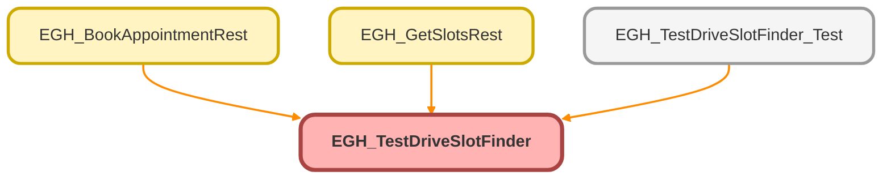

---
hide:
  - path
---

# EGH_TestDriveSlotFinder Class

## Class Diagram



<!-- Apex description -->

## Apex Code

```java
public class EGH_TestDriveSlotFinder {

    // Named Credential for API calls
    private static final String NAMED_CREDENTIAL = 'callout:EGH_Salesforce_FSL_API';
    
    // Wrapper class for time slots returned to UI - Updated for timezone support
    public class TimeSlotWrapper {
        @AuraEnabled public String id;
        @AuraEnabled public Datetime startTime { get; set; }
        @AuraEnabled public Datetime endTime { get; set; }
        @AuraEnabled public String displayText { get; set; }
        
        public TimeSlotWrapper(String slotId, Datetime start, Datetime endDt) {
            this.id = slotId;
            this.startTime = start;
            this.endTime = endDt;
            // Note: displayText will be set by JavaScript based on user timezone
            // Format in GMT for normal users, Dubai timezone if user has "Integration" in name
            
            try {
               
                String userName = UserInfo.getFirstName()+' '+Userinfo.getLastName();
                System.debug('Current user name: ' + userName);
                
                if (userName.containsIgnoreCase('Integration')) {
                    System.debug('User has Integration in name - formatting in Dubai timezone');
                    this.displayText = EGH_TestDriveSlotFinder.formatDateTimeForIntegrationUser(start, endDt);
                } else {
                    System.debug('Normal user - formatting in GMT');
                    this.displayText = formatTimeSlotGmt(start, endDt);
                }
            } catch (Exception e) {
                System.debug('Error checking user name, defaulting to GMT: ' + e.getMessage());
                // Fallback to GMT formatting if user query fails
                this.displayText = formatTimeSlotGmt(start, endDt);
            }
        }
        
        // Keep GMT formatting as fallback - JavaScript will override with user timezone
        private String formatTimeSlotGmt(Datetime start, Datetime endDt) {
            return start.formatGmt('HH:mm') + ' - ' + endDt.formatGmt('HH:mm');
        }
    }
    
    // Wrapper for Lead information
    public class LeadInfo {
        @AuraEnabled public String firstName { get; set; }
        @AuraEnabled public String lastName { get; set; }
        @AuraEnabled public String email { get; set; }
        @AuraEnabled public String phone { get; set; }
        @AuraEnabled public String company { get; set; }
    }
    
    // API Response wrapper classes
    public class VehicleSlot {
        public String startTime { get; set; }
        public String endTime { get; set; }
        
        public Datetime getStartDateTime() {
            return Datetime.valueOfGmt(startTime.replace('T', ' ').replace('Z', ''));
        }
        
        public Datetime getEndDateTime() {
            return Datetime.valueOfGmt(endTime.replace('T', ' ').replace('Z', ''));
        }
    }
    
    public class TerritorySlot {
        public String startTime { get; set; }
        public String endTime { get; set; }
        public List<String> resources { get; set; }
        
        public Datetime getStartDateTime() {
            return Datetime.valueOfGmt(startTime.replace('T', ' ').replace('Z', ''));
        }
        
        public Datetime getEndDateTime() {
            return Datetime.valueOfGmt(endTime.replace('T', ' ').replace('Z', ''));
        }
    }
    
    public class AppointmentSlotsResponse {
        public List<VehicleSlot> timeSlots { get; set; }
    }
    
    public class TerritorySlotGroup {
        public String territoryId { get; set; }
        public List<TerritorySlot> slots { get; set; }
    }
    
    public class AvailableTerritorySlotsResponse {
        public Result result { get; set; }
    }

    public class Result {
        public List<TerritorySlotGroup> territorySlots { get; set; }
    }

    public class SlotException extends Exception {}

    // Helper method to get user timezone
    @AuraEnabled(cacheable=true)
    public static String getUserTimezone() {
        try {
            User currentUser = [SELECT TimeZoneSidKey FROM User WHERE Id = :UserInfo.getUserId() LIMIT 1];
            return currentUser.TimeZoneSidKey;
        } catch (Exception e) {
            System.debug('Error getting user timezone: ' + e.getMessage());
            return 'GMT'; // Fallback to GMT
        }
    }

    // Helper method to format datetime in specific timezone
    @AuraEnabled
    public static String formatDateTimeInTimezone(Datetime dt, String timezoneSid) {
        if (dt == null || String.isBlank(timezoneSid)) {
            return '';
        }
        
        try {
            // Convert to the specified timezone
            String formattedDateTime = dt.format('yyyy-MM-dd HH:mm:ss', timezoneSid);
            return formattedDateTime;
        } catch (Exception e) {
            System.debug('Error formatting datetime in timezone: ' + e.getMessage());
            return dt.formatGmt('yyyy-MM-dd HH:mm:ss');
        }
    }

    // Helper method to format time only in specific timezone
    @AuraEnabled
    public static String formatTimeInTimezone(Datetime dt, String timezoneSid) {
        if (dt == null || String.isBlank(timezoneSid)) {
            return '';
        }
        
        try {
            return dt.format('HH:mm', timezoneSid);
        } catch (Exception e) {
            System.debug('Error formatting time in timezone: ' + e.getMessage());
            return dt.formatGmt('HH:mm');
        }
    }

  
  
    /**
     * Format datetime in Dubai timezone for Integration users
     * @param start Start datetime
     * @param endDt End datetime
     * @return Formatted time string in Dubai timezone (HH:mm - HH:mm)
     */
    public static String formatDateTimeForIntegrationUser(Datetime start, Datetime endDt) {
        if (start == null || endDt == null) {
            return '';
        }
        
        try {
            Timezone tz = Timezone.getTimeZone('Asia/Dubai');
            String tzId = tz.getID();
            System.debug('Formatting in Dubai timezone: ' + tzId);
            System.debug('Start GMT: ' + start.formatGmt('yyyy-MM-dd HH:mm:ss'));
            System.debug('End GMT: ' + endDt.formatGmt('yyyy-MM-dd HH:mm:ss'));
            
            String startFormatted = start.format('HH:mm', tzId);
            String endFormatted = endDt.format('HH:mm', tzId);
            String result = startFormatted + ' - ' + endFormatted;
            
            System.debug('Formatted result: ' + result);
            return result;
        } catch (Exception e) {
            System.debug('Error formatting in Dubai timezone: ' + e.getMessage());
            // Fallback to GMT formatting
            return start.formatGmt('HH:mm') + ' - ' + endDt.formatGmt('HH:mm');
        }
    }


@AuraEnabled(cacheable=true)
public static Map<String, String> getDubaiDefaults() {
    String tz = 'Asia/Dubai';
    Datetime now = System.now();
    
    // 1. Start Time: Send pure UTC. 
    // Salesforce will convert this to the User's Timezone (Dubai) automatically.
    // formatGmt ensures it ends in 'Z', telling the input "This is UTC"
    String startUtc = now.formatGmt('yyyy-MM-dd\'T\'HH:mm:ss\'Z\'');

    // 2. End Time: Calculate Midnight in Dubai, then convert back to UTC
    // Get today's date in Dubai
    String dubaiDateStr = now.format('yyyy-MM-dd', tz);
    Date dubaiDate = Date.valueOf(dubaiDateStr);
    
    // Add 7 days
    Date dubaiEndDate = dubaiDate.addDays(7);
    
    // Create a Datetime for 00:00:00 on that day in Dubai timezone
    // We construct the string "2025-12-23 00:00:00"
    Time midnight = Time.newInstance(0, 0, 0, 0);
    // This method creates a datetime in the local server timezone, which we need to adjust
    // A safer way is to use specific string formatting to parse it as Dubai time
    
    // Construct ISO string for Dubai Midnight: "2025-12-23T00:00:00"
    String dubaiMidnightStr = String.valueOf(dubaiEndDate) + 'T00:00:00';
    
    // We need to return this as a UTC string for the input to read it correctly
    // But since this is a specific logic for midnight, passing the Z-formatted string 
    // calculated from the timezone is complex in Apex alone.
    // SIMPLER APPROACH for End Date:
    // Just send the UTC version of "7 days from now" and let the user adjust exact hours if needed, 
    // OR calculate the offset.
    
    // Robust calculation for "Midnight Dubai in UTC":
    // Dubai is UTC+4. Midnight Dubai (00:00) is 20:00 UTC previous day.
    // We can rely on the user to adjust the exact minute, or:
    
    Datetime endDateTime = Datetime.newInstanceGmt(dubaiEndDate, midnight);
    // Adjust for Dubai Offset (Standard Time is UTC+4)
    // Subtract 4 hours from UTC to match Dubai Midnight
    endDateTime = endDateTime.addHours(-4);
    
    String endUtc = endDateTime.formatGmt('yyyy-MM-dd\'T\'HH:mm:ss\'Z\'');

    return new Map<String, String>{
        'startLocal' => startUtc,
        'endLocal'   => endUtc
    };
}


    @AuraEnabled(cacheable=true)
    public static List<Lead> getAvailableLeads() {
        return [SELECT Id, Name FROM Lead ORDER BY LastName, FirstName LIMIT 100];
    }

    @AuraEnabled(cacheable=true)
    public static List<Map<String, Object>> getAvailableWorkTypes() {
        List<Map<String, Object>> workTypes = new List<Map<String, Object>>();
        
        for (WorkType wt : [
            SELECT Id, Name, DurationType, EstimatedDuration 
            FROM WorkType
            WHERE EstimatedDuration > 0
            ORDER BY Name
            LIMIT 50
        ]) {
            workTypes.add(new Map<String, Object>{
                'id' => wt.Id,
                'name' => wt.Name,
                'duration' => wt.EstimatedDuration
            });
        }
        return workTypes;
    }
    
    /**
     * Main method to get combined available slots for vehicle and drivers
     */
    @AuraEnabled
    public static List<TimeSlotWrapper> getCombinedSlots(
        Id selectedTerritoryId, 
        Id selectedVehicleAssetResourceId, 
        Id testDriveWorkTypeId, 
        Datetime desiredStartDate, 
        Datetime desiredEndDate
    ) {
        try {
            Datetime nowGmt = System.now();
            // If user picked a start in the past, clamp to now.
// This guarantees no past slots are returned.
if (desiredStartDate == null || desiredStartDate < nowGmt) {
    desiredStartDate = nowGmt;
}

// Basic safety
if (desiredEndDate != null && desiredEndDate <= desiredStartDate) {
    throw new SlotException('End date must be after start date.');
}
            // Step 1: Get Vehicle's Available Slots
            List<VehicleSlot> vehicleSlots = getVehicleAvailableSlots(
                selectedTerritoryId, 
                selectedVehicleAssetResourceId, 
                testDriveWorkTypeId, 
                desiredStartDate, 
                desiredEndDate
            );
            
            if (vehicleSlots.isEmpty()) {
                throw new SlotException('No vehicle availability found for the selected time range');
            }
            
            // Step 2: Get All Drivers' Available Slots in Territory
            Map<String, List<String>> driverSlotMap = getDriverAvailableSlots(
                selectedTerritoryId, 
                testDriveWorkTypeId, 
                desiredStartDate, 
                desiredEndDate
            );
            
            if (driverSlotMap.isEmpty()) {
                throw new SlotException('No driver availability found for the selected time range');
            }
            
            // Step 3: Find Intersecting Slots
            List<TimeSlotWrapper> combinedSlots = findIntersectingSlots(vehicleSlots, driverSlotMap);
            
            if (combinedSlots.isEmpty()) {
                throw new SlotException('No matching slots found where both vehicle and driver are available simultaneously');
            }
            
            return combinedSlots;
            
        } catch (SlotException se) {
            System.debug('Slot Exception: ' + se.getMessage());
            //throw new AuraHandledException(se.getMessage());
            throw new SlotException(se.getMessage());
        } catch (Exception e) {
            System.debug('General Error in getCombinedSlots: ' + e.getMessage() + '\n' + e.getStackTraceString());
            //throw new AuraHandledException('Failed to retrieve available slots: ' + e.getMessage());
            throw new SlotException(e.getMessage());
        }
    }
    
    /**
     * Get vehicle available slots using REST API
     */
    private static List<VehicleSlot> getVehicleAvailableSlots(
        Id territoryId, 
        Id vehicleResourceId, 
        Id workTypeId, 
        Datetime startTime, 
        Datetime endTime
    ) {
        String endpoint = NAMED_CREDENTIAL + '/services/data/v63.0/scheduling/getAppointmentSlots';
        
        Map<String, Object> requestBody = new Map<String, Object>{
            'territoryIds' => new List<Id>{territoryId},
            'requiredResourceIds' => new List<Id>{vehicleResourceId},
            'workType' => new Map<String, Object>{'id' => workTypeId},
            'startTime' => startTime.formatGmt('yyyy-MM-dd\'T\'HH:mm:ss.SSS\'Z\''),
            'endTime' => endTime.formatGmt('yyyy-MM-dd\'T\'HH:mm:ss.SSS\'Z\'')
        };
        
        HttpRequest req = new HttpRequest();
        req.setEndpoint(endpoint);
        req.setMethod('POST');
        req.setHeader('Content-Type', 'application/json');
        req.setTimeout(60000);
        req.setBody(JSON.serialize(requestBody));
        
        Http http = new Http();
        HttpResponse res;
        
        try {
            res = http.send(req);
            System.debug('Vehicle API Response Status: ' + res.getStatusCode());
            System.debug('Vehicle API Response Body: ' + res.getBody());
        } catch (System.CalloutException e) {
            System.debug('Vehicle API Callout Error: ' + e.getMessage());
            throw new CalloutException('Vehicle slots API unavailable: ' + e.getMessage());
        }
        
        if (res.getStatusCode() == 200 || res.getStatusCode() == 201) {
            try {
                AppointmentSlotsResponse response = (AppointmentSlotsResponse) JSON.deserialize(
                    res.getBody(), 
                    AppointmentSlotsResponse.class
                );
                return response.timeSlots != null ? response.timeSlots : new List<VehicleSlot>();
            } catch (Exception e) {
                System.debug('JSON Parsing Error: ' + e.getMessage());
                return new List<VehicleSlot>();
            }
        } else {
            System.debug('Vehicle API Error - Status: ' + res.getStatusCode() + ', Body: ' + res.getBody());
            return new List<VehicleSlot>();
        }
    }
    
    /**
     * Get driver available slots using Connect API
     */
    private static Map<String, List<String>> getDriverAvailableSlots(
        Id territoryId, 
        Id workTypeId, 
        Datetime startTime, 
        Datetime endTime
    ) {
        String endpoint = NAMED_CREDENTIAL + '/services/data/v63.0/connect/scheduling/available-territory-slots';
        
        Map<String, Object> requestBody = new Map<String, Object>{
            'territoryIds' => new List<Id>{territoryId},
            'workType' => new Map<String, Object>{'id' => workTypeId},
            'startTime' => startTime.formatGmt('yyyy-MM-dd\'T\'HH:mm:ss.SSS\'Z\''),
            'endTime' => endTime.formatGmt('yyyy-MM-dd\'T\'HH:mm:ss.SSS\'Z\'')
        };
        
        HttpRequest req = new HttpRequest();
        req.setEndpoint(endpoint);
        req.setMethod('POST');
        req.setHeader('Content-Type', 'application/json');
        req.setTimeout(60000);
        req.setBody(JSON.serialize(requestBody));
        
        Http http = new Http();
        HttpResponse res;
        
        try {
            res = http.send(req);
            System.debug('Territory API Response Status: ' + res.getStatusCode());
            System.debug('Territory API Response Body: ' + res.getBody());
        } catch (System.CalloutException e) {
            System.debug('Territory API Callout Error: ' + e.getMessage());
            throw new CalloutException('Territory slots API unavailable: ' + e.getMessage());
        }
        
        if (res.getStatusCode() == 200 || res.getStatusCode() == 201) {
            try {
                System.debug('Raw JSON Response: ' + res.getBody());
                AvailableTerritorySlotsResponse response = 
                    (AvailableTerritorySlotsResponse) JSON.deserialize(
                        res.getBody(), 
                        AvailableTerritorySlotsResponse.class
                    );
                
                List<TerritorySlotGroup> territorySlots = 
                    (response.result != null) ? response.result.territorySlots : null;
                
                System.debug('Deserialized Territory Slots: ' + territorySlots);
                Map<String, List<String>> driverSlotMap = filterDriverSlots(territorySlots);
                return driverSlotMap;
            } catch (Exception e) {
                System.debug('JSON Parsing Error: ' + e.getMessage());
                return new Map<String, List<String>>();
            }
        } else {
            System.debug('Territory API Error - Status: ' + res.getStatusCode() + ', Body: ' + res.getBody());
            return new Map<String, List<String>>();
        }
    }
    
    /**
     * Filter slots to only include drivers (Technicians)
     */
    private static Map<String, List<String>> filterDriverSlots(List<TerritorySlotGroup> territoryGroups) {
        Map<String, List<String>> driverSlotMap = new Map<String, List<String>>();
        if (territoryGroups == null) return driverSlotMap;

        // Step 1: Collect ALL resource IDs first
        Set<Id> allResourceIds = new Set<Id>();
        for (TerritorySlotGroup territoryGroup : territoryGroups) {
            if (territoryGroup.slots != null) {
                for (TerritorySlot slot : territoryGroup.slots) {
                    if (slot.resources != null) {
                        for (String resId : slot.resources) {
                            try {
                                allResourceIds.add(Id.valueOf(resId));
                            } catch (Exception e) {
                                System.debug('Invalid resource ID: ' + resId);
                            }
                        }
                    }
                }
            }
        }

        System.debug('All Resource IDs collected: ' + allResourceIds.size());

        // Step 2: Query for resource types
        Map<Id, String> resourceTypeMap = new Map<Id, String>();
        if (!allResourceIds.isEmpty()) {
            try {
                for (ServiceResource sr : [
                    SELECT Id, ResourceType 
                    FROM ServiceResource 
                    WHERE Id IN :allResourceIds
                ]) {
                    resourceTypeMap.put(sr.Id, sr.ResourceType != null ? sr.ResourceType : 'NULL_TYPE');
                }
                System.debug('Resource types mapped: ' + resourceTypeMap.size());
            } catch (Exception e) {
                System.debug('Error querying ServiceResource types: ' + e.getMessage());
            }
        } else {
            System.debug('No resource IDs found to query');
            return driverSlotMap;
        }

        // Step 3: Process slots and log resource types
        for (TerritorySlotGroup territoryGroup : territoryGroups) {
            if (territoryGroup.slots != null) {
                for (TerritorySlot slot : territoryGroup.slots) {
                    String slotKey = getSlotKey(slot.getStartDateTime(), slot.getEndDateTime());
                    List<String> resourceDetails = new List<String>();
                    List<String> driverIds = new List<String>();
                    
                    if (slot.resources != null) {
                        for (String resId : slot.resources) {
                            try {
                                Id resourceId = Id.valueOf(resId);
                                String resourceType = resourceTypeMap.containsKey(resourceId) 
                                    ? resourceTypeMap.get(resourceId) 
                                    : 'UNKNOWN_TYPE';
                                
                                // Add to debug details
                                resourceDetails.add(resId + '(' + resourceType + ')');
                                
                                // Filter for drivers (Technicians)
                                if (resourceType == 'T' || resourceType == 'A') {
                                    driverIds.add(resId);
                                }
                            } catch (Exception e) {
                                resourceDetails.add(resId + '(INVALID_ID)');
                            }
                        }
                        
                        // Add slot to map only if drivers are available
                        if (!driverIds.isEmpty()) {
                            driverSlotMap.put(slotKey, driverIds);
                        }
                    }
                    
                    // Enhanced debug log with resource types
                    System.debug('Slot: ' + slotKey + 
                        ' | Resources: ' + String.join(resourceDetails, ', ') + 
                        ' | Drivers: ' + driverIds.size());
                }
            }
        }

        System.debug('Final driver slot map size: ' + driverSlotMap.size());
        return driverSlotMap;
    }
    

/**
     * Find intersecting slots where both vehicle and drivers are available
     */
    private static List<TimeSlotWrapper> findIntersectingSlots(
        List<VehicleSlot> vehicleSlots, 
        Map<String, List<String>> driverSlotMap
    ) {
        List<TimeSlotWrapper> combinedSlots = new List<TimeSlotWrapper>();
        
        // Get current system time in GMT to filter out past slots
        Datetime currentDateTime = System.now(); 

        for (VehicleSlot vehicleSlot : vehicleSlots) {
            Datetime vehicleStart = vehicleSlot.getStartDateTime();
            Datetime vehicleEnd = vehicleSlot.getEndDateTime();
            
            // FIX: Skip this slot if the start time is in the past
            if (vehicleStart <= currentDateTime) {
                continue;
            }
            
            // Check if ANY driver slot overlaps with the vehicle slot
            for (String driverSlotKey : driverSlotMap.keySet()) {
                String[] times = driverSlotKey.split('_');
                Datetime driverStart = Datetime.valueOfGmt(times[0].replace('T', ' '));
                Datetime driverEnd = Datetime.valueOfGmt(times[1].replace('T', ' '));
                
                // Check for overlapping time windows
                if (driverStart < vehicleEnd && driverEnd > vehicleStart) {
                    combinedSlots.add(new TimeSlotWrapper(
                        'slot_' + vehicleStart.getTime() + '_' + vehicleEnd.getTime(),
                        vehicleStart,
                        vehicleEnd
                    ));
                    break; // Found at least one driver, move to next vehicle slot
                }
            }
        }
        return combinedSlots;
    }
    
    /**
     * Create unique key for time slot comparison
     */
    private static String getSlotKey(Datetime startTime, Datetime endTime) {
        return startTime.formatGmt('yyyy-MM-dd\'T\'HH:mm:ss.SSS\'Z\'') + '_' + 
               endTime.formatGmt('yyyy-MM-dd\'T\'HH:mm:ss.SSS\'Z\'');
    }
    
    /**
     * Book test drive appointment
     */
    @AuraEnabled
    public static String bookTestDrive(
        Id selectedTerritoryId,
        Id selectedVehicleAssetResourceId,
        Id testDriveWorkTypeId,
        Datetime chosenStartTime,
        Datetime chosenEndTime,
        Id parentRecordId
    ) {
        try {
            Id assignedDriverResourceId = selectAvailableDriver(
                selectedTerritoryId, 
                testDriveWorkTypeId, 
                chosenStartTime, 
                chosenEndTime
            );
            
            if (assignedDriverResourceId == null) {
                //throw new AuraHandledException('No drivers available for the selected time slot.');
                throw new SlotException('No drivers available for the selected time slot.');
            }
            
            String appointmentId = createServiceAppointment(
                selectedTerritoryId,
                selectedVehicleAssetResourceId,
                assignedDriverResourceId,
                testDriveWorkTypeId,
                chosenStartTime,
                chosenEndTime,
                parentRecordId
            );
            
            return appointmentId;
            
        } catch (Exception e) {
            System.debug('Error in bookTestDrive: ' + e.getMessage());
            //throw new AuraHandledException('Failed to book test drive: ' + e.getMessage());
            throw new SlotException('Failed to book test drive: ' + e.getMessage());
        }
    }
    
    /**
     * Select an available driver for the chosen time slot
     */
    private static Id selectAvailableDriver(
        Id territoryId, 
        Id workTypeId, 
        Datetime startTime, 
        Datetime endTime
    ) {
        Map<String, List<String>> driverSlotMap = getDriverAvailableSlots(
            territoryId, 
            workTypeId, 
            startTime, 
            endTime
        );
        
        String slotKey = getSlotKey(startTime, endTime);
        List<String> availableDrivers = driverSlotMap.get(slotKey);
        
        if (availableDrivers != null && !availableDrivers.isEmpty()) {
            // Generate a random index between 0 and availableDrivers.size() - 1
            Integer randomIndex = Math.mod(
                Math.abs(Crypto.getRandomInteger()), 
                availableDrivers.size()
            );
            return Id.valueOf(availableDrivers[randomIndex]); // Random driver
        }
        return null;
    }

    @AuraEnabled(cacheable=true)
    public static List<Map<String, Object>> getWorkTypesForTerritory(Id territoryId) {
        List<Map<String, Object>> workTypes = new List<Map<String, Object>>();
        
        if (territoryId == null) {
            return workTypes; // Early exit if territoryId is null
        }

        String categoryFieldValue = 'Test Drive'; 

        try {
            // Step 1: Get valid WorkType IDs from WorkTypeGroupMember
            Set<Id> validWorkTypeIds = new Set<Id>();
            for (WorkTypeGroupMember wtgm : [
                SELECT WorkTypeId 
                FROM WorkTypeGroupMember 
                WHERE WorkTypeGroup.Category = :categoryFieldValue
            ]) {
                validWorkTypeIds.add(wtgm.WorkTypeId);
            }

            if (validWorkTypeIds.isEmpty()) {
                return workTypes; // Exit if no valid work types
            }

            // Step 2: Query WorkType directly
            for (WorkType wt : [
                SELECT Id, Name, EstimatedDuration
                FROM WorkType
                WHERE Id IN :validWorkTypeIds
                AND EstimatedDuration > 0
                AND Id IN (
                    SELECT WorkTypeId 
                    FROM ServiceTerritoryWorkType 
                    WHERE ServiceTerritoryId = :territoryId
                )
                ORDER BY Name
                LIMIT 50
            ]) {
                workTypes.add(new Map<String, Object>{
                    'id' => wt.Id,
                    'name' => wt.Name,
                    'duration' => wt.EstimatedDuration
                });
            }
        } catch (Exception e) {
            throw new AuraHandledException('Error retrieving work types: ' + e.getMessage());
        }
        
        return workTypes;
    }
    
    /**
     * Create Service Appointment using Connect API with timezone-aware subject and description
     */
    private static String createServiceAppointment(
        Id territoryId,
        Id vehicleResourceId,
        Id driverResourceId,
        Id workTypeId,
        Datetime startTime,
        Datetime endTime,
        Id leadId
    ) {
        // 1. Prepare API endpoint using Named Credential
        String endpoint = NAMED_CREDENTIAL + '/services/data/v64.0/connect/scheduling/service-appointments';
        
        // 2. Get resource names for description and subject
        String vehicleName = getResourceName(vehicleResourceId);
        String driverName = getResourceName(driverResourceId);
        
        // 3. Get customer name for subject line
        String customerName = getCustomerName(leadId);
        
        // 4. Get user timezone for display formatting
        String userTimezone = getUserTimezone();
        
        // 5. Format times in user timezone for display in description
        String formattedStartTime = '';
        String formattedEndTime = '';
        String formattedDate = '';
        
        try {
            formattedStartTime = startTime.format('h:mm a', userTimezone);
            formattedEndTime = endTime.format('h:mm a', userTimezone);
            formattedDate = startTime.format('EEEE, MMMM d, yyyy', userTimezone);
        } catch (Exception e) {
            // Fallback to GMT if timezone formatting fails
            System.debug('Timezone formatting error, falling back to GMT: ' + e.getMessage());
            formattedStartTime = startTime.formatGmt('HH:mm');
            formattedEndTime = endTime.formatGmt('HH:mm');
            formattedDate = startTime.formatGmt('EEEE, MMMM d, yyyy');
        }
        
        // 6. Create base service appointment payload (Connect API supported fields only)
        Map<String, Object> serviceAppointment = new Map<String, Object>{
            'workTypeId' => workTypeId,
            'serviceTerritoryId' => territoryId,
            'schedStartTime' => startTime.formatGmt('yyyy-MM-dd\'T\'HH:mm:ss.SSS\'Z\''),
            'schedEndTime' => endTime.formatGmt('yyyy-MM-dd\'T\'HH:mm:ss.SSS\'Z\''),
            'appointmentType' => 'Test Drive',
            'parentRecordId' => leadId,
            
            // Add subject line
            'subject' => 'Test Drive: ' + vehicleName + 
                        (String.isNotBlank(customerName) ? ' - ' + customerName : ''),
            
            // Add asset/driver details to description with user timezone formatting
            'description' => 'Test Drive Scheduled!\n' +
                             'Vehicle: ' + vehicleName + '\n' +
                             'Driver: ' + driverName + '\n' +
                             'Date: ' + formattedDate + '\n' +
                             'Time: ' + formattedStartTime + ' - ' + formattedEndTime +
                             '\n\nTimezone: ' + userTimezone
        };
        
        
        // 7. Assign resources (vehicle + driver)
        List<Map<String, Object>> assignedResources = new List<Map<String, Object>>{
            // Vehicle - primary resource
            new Map<String, Object>{
                'serviceResourceId' => vehicleResourceId,
                'isRequiredResource' => true,
                'isPrimaryResource' => true
            },
            // Driver - secondary resource
            new Map<String, Object>{
                'serviceResourceId' => driverResourceId,
                'isRequiredResource' => true,
                'isPrimaryResource' => false
            }
        };
        
        // 8. Build final request payload
        Map<String, Object> requestBody = new Map<String, Object>{
            'serviceAppointment' => serviceAppointment,
            'assignedResources' => assignedResources
        };
        
        // 9. Execute API call to create service appointment
        HttpRequest req = new HttpRequest();
        req.setEndpoint(endpoint);
        req.setMethod('POST');
        req.setHeader('Content-Type', 'application/json');
        req.setBody(JSON.serialize(requestBody));
        req.setTimeout(60000);
        
        Http http = new Http();
        HttpResponse res = http.send(req);
        
        System.debug('Create SA Response Status: ' + res.getStatusCode());
        System.debug('Create SA Response Body: ' + res.getBody());
        
        // 10. Handle creation response
        if (res.getStatusCode() == 201) {
            // Parse response to get Service Appointment ID
            Map<String, Object> responseMap = (Map<String, Object>) JSON.deserializeUntyped(res.getBody());
            Map<String, Object> result = (Map<String, Object>) responseMap.get('result');
            String serviceAppointmentId = (String) result.get('serviceAppointmentId');
            
            // 11. Update the Service Appointment to sync dates and set owner
            Id currentUserId = UserInfo.getUserId();
            System.debug('Current User ID: ' + currentUserId);
            System.debug('Current User Name: ' + UserInfo.getName());
            
            String updateEndpoint = NAMED_CREDENTIAL + '/services/data/v64.0/sobjects/ServiceAppointment/' + serviceAppointmentId;
            
            // Build update payload with synced dates and owner
            Map<String, Object> updateBody = new Map<String, Object>{
                // Sync the date fields as required
                'DueDate' => startTime.formatGmt('yyyy-MM-dd\'T\'HH:mm:ss.SSS\'Z\''),
                'EarliestStartTime' => startTime.formatGmt('yyyy-MM-dd\'T\'HH:mm:ss.SSS\'Z\''),
                // Set the owner to current user
                'OwnerId' => currentUserId
            };
            
            System.debug('Updating SA with synced dates - DueDate: ' + updateBody.get('DueDate') + 
                         ', EarliestStartTime: ' + updateBody.get('EarliestStartTime'));
            
            HttpRequest updateReq = new HttpRequest();
            updateReq.setEndpoint(updateEndpoint);
            updateReq.setMethod('PATCH');
            updateReq.setHeader('Content-Type', 'application/json');
            updateReq.setBody(JSON.serialize(updateBody));
            updateReq.setTimeout(60000);
            
            HttpResponse updateRes = http.send(updateReq);
            
            System.debug('Date Sync & Owner Update Response Status: ' + updateRes.getStatusCode());
            System.debug('Date Sync & Owner Update Response Body: ' + updateRes.getBody());
            
            if (updateRes.getStatusCode() == 200 || updateRes.getStatusCode() == 204) {
                System.debug('Successfully updated Service Appointment dates and owner');
            } else {
                System.debug('WARNING: Failed to update Service Appointment dates/owner');
                System.debug('Update Error Details: ' + updateRes.getBody());
                // Don't throw exception - the appointment was created successfully
            }
            
            return serviceAppointmentId;
        } else {
            // Handle API errors
            String errorMsg = 'Service appointment creation failed (' + res.getStatusCode() + '): ';
            try {
                // Try to parse Salesforce API error
                Map<String, Object> errorResponse = (Map<String, Object>) JSON.deserializeUntyped(res.getBody());
                List<Object> errors = (List<Object>) errorResponse.get('errors');
                if (errors != null && !errors.isEmpty()) {
                    Map<String, Object> firstError = (Map<String, Object>) errors[0];
                    errorMsg += (String) firstError.get('message');
                } else {
                    errorMsg += res.getBody();
                }
            } catch (Exception e) {
                errorMsg += res.getBody();
            }
            throw new CalloutException(errorMsg);
        }
    }

    // Helper method to get resource names
    private static String getResourceName(Id resourceId) {
        try {
            ServiceResource sr = [SELECT Name FROM ServiceResource WHERE Id = :resourceId LIMIT 1];
            return sr.Name;
        } catch (Exception e) {
            System.debug('Resource name lookup error: ' + e.getMessage());
            return 'Unknown Resource';
        }
    }

    // Helper method to get customer name
    private static String getCustomerName(Id recordId) {
        try {
            String objectType = recordId.getSObjectType().getDescribe().getName();
            
            if (objectType == 'Lead') {
                Lead lead = [SELECT Name FROM Lead WHERE Id = :recordId LIMIT 1];
                return lead.Name;
            } else if (objectType == 'Account') {
                Account acc = [SELECT Name FROM Account WHERE Id = :recordId LIMIT 1];
                return acc.Name;
            }
            return 'Customer';
        } catch (Exception e) {
            System.debug('Customer name lookup error: ' + e.getMessage());
            return 'Customer';
        }
    }
   
    
   @AuraEnabled
public static List<Map<String, Object>> getAvailableTerritories(Id recordId) {
    List<Map<String, Object>> territories = new List<Map<String, Object>>();
    String sObjectType = recordId.getSObjectType().getDescribe().getName();

    Id territoryId;
    String territoryName;

    if (sObjectType == 'Lead') {
        Lead leadRecord = [
            SELECT EGH_LeadBranchUnitLookup__r.ServiceTerritoryId,
                   EGH_LeadBranchUnitLookup__r.ServiceTerritory.Name
            FROM Lead
            WHERE Id = :recordId
            LIMIT 1
        ];

        if (leadRecord.EGH_LeadBranchUnitLookup__c != null &&
            leadRecord.EGH_LeadBranchUnitLookup__r.ServiceTerritoryId != null) {
            territoryId = leadRecord.EGH_LeadBranchUnitLookup__r.ServiceTerritoryId;
            territoryName = leadRecord.EGH_LeadBranchUnitLookup__r.ServiceTerritory.Name;
        }
    } else if (sObjectType == 'Opportunity') {
        Opportunity oppRecord = [
            SELECT EGH_BranchUnitLookup__r.ServiceTerritoryId,
                   EGH_BranchUnitLookup__r.ServiceTerritory.Name
            FROM Opportunity
            WHERE Id = :recordId
            LIMIT 1
        ];

        if (oppRecord.EGH_BranchUnitLookup__r != null &&
            oppRecord.EGH_BranchUnitLookup__r.ServiceTerritoryId != null) {
            territoryId = oppRecord.EGH_BranchUnitLookup__r.ServiceTerritoryId;
            territoryName = oppRecord.EGH_BranchUnitLookup__r.ServiceTerritory.Name;
        }
    }

    if (territoryId != null) {
        territories.add(new Map<String, Object>{
            'id' => territoryId,
            'name' => territoryName
        });
    }

    return territories;
}


    
    @AuraEnabled
    public static List<Map<String, Object>> getAvailableVehicles(Id territoryId) {
        List<Map<String, Object>> vehicles = new List<Map<String, Object>>();
        
        if (territoryId == null) return vehicles;
        
        List<ServiceTerritoryMember> members = [
            SELECT ServiceResource.Id, ServiceResource.Name 
            FROM ServiceTerritoryMember 
            WHERE ServiceTerritoryId = :territoryId
            AND ServiceResource.ResourceType = 'S'
            AND ServiceResource.IsActive = true
            AND (EffectiveEndDate = null OR EffectiveEndDate >= TODAY)
        ];
        
        for (ServiceTerritoryMember member : members) {
            vehicles.add(new Map<String, Object>{
                'id' => member.ServiceResource.Id,
                'name' => member.ServiceResource.Name
            });
        }
        
        return vehicles;
    }

    /*@AuraEnabled
    public static Id getAccountFromOpportunity(Id opportunityId) {
        try {
            Opportunity opp = [SELECT AccountId FROM Opportunity WHERE Id = :opportunityId LIMIT 1];
            return opp.AccountId;
        } catch (Exception e) {
            throw new AuraHandledException('Failed to fetch account from opportunity: ' + e.getMessage());
        }
    }*/

    @AuraEnabled
    public static Map<String, String> getRecordInfo(Id recordId) {
        try {
            String objectType = recordId.getSObjectType().getDescribe().getName();
            String recordName = '';
            Id finalRecordId = recordId;
            
            if (objectType == 'Lead') {
                Lead lead = [SELECT Name FROM Lead WHERE Id = :recordId LIMIT 1];
                recordName = lead.Name;
            } 
            else if (objectType == 'Account') {
                Account acc = [SELECT Name FROM Account WHERE Id = :recordId LIMIT 1];
                recordName = acc.Name;
                // Keep as Account type
            } 
            else if (objectType == 'Opportunity') {
                Opportunity opp = [SELECT Name, AccountId, Account.Name FROM Opportunity WHERE Id = :recordId LIMIT 1];
                //recordName = opp.Account.Name;
                //objectType = 'Account';
                //finalRecordId = opp.AccountId;
                //Hanane Changes
                recordName = opp.Name;
                finalRecordId = opp.Id;
            }
            else if (objectType == 'PersonAccount') {
                // Handle PersonAccount specifically if needed
                Account pa = [SELECT Name FROM Account WHERE Id = :recordId LIMIT 1];
                recordName = pa.Name;
                objectType = 'Account'; // Treat as regular Account
            }
            
            return new Map<String, String>{
                'recordId' => String.valueOf(finalRecordId),
                'recordName' => recordName,
                'objectType' => objectType
            };
        } catch (Exception e) {
            throw new AuraHandledException('Failed to get record info: ' + e.getMessage());
        }
    }
}
```

## Fields
### `NAMED_CREDENTIAL`

#### Signature
```apex
private static final NAMED_CREDENTIAL
```

#### Type
String

## Methods
### `getUserTimezone()`

`AURAENABLED`

#### Signature
```apex
public static String getUserTimezone()
```

#### Return Type
**String**

---

### `formatDateTimeInTimezone(dt, timezoneSid)`

`AURAENABLED`

#### Signature
```apex
public static String formatDateTimeInTimezone(Datetime dt, String timezoneSid)
```

#### Parameters
| Name | Type | Description |
|------|------|-------------|
| dt | Datetime |  |
| timezoneSid | String |  |

#### Return Type
**String**

---

### `formatTimeInTimezone(dt, timezoneSid)`

`AURAENABLED`

#### Signature
```apex
public static String formatTimeInTimezone(Datetime dt, String timezoneSid)
```

#### Parameters
| Name | Type | Description |
|------|------|-------------|
| dt | Datetime |  |
| timezoneSid | String |  |

#### Return Type
**String**

---

### `formatDateTimeForIntegrationUser(start, endDt)`

Format datetime in Dubai timezone for Integration users

#### Signature
```apex
public static String formatDateTimeForIntegrationUser(Datetime start, Datetime endDt)
```

#### Parameters
| Name | Type | Description |
|------|------|-------------|
| start | Datetime | Start datetime |
| endDt | Datetime | End datetime |

#### Return Type
**String**

Formatted time string in Dubai timezone (HH:mm - HH:mm)

---

### `getDubaiDefaults()`

`AURAENABLED`

#### Signature
```apex
public static Map<String,String> getDubaiDefaults()
```

#### Return Type
**Map<String,String>**

---

### `getAvailableLeads()`

`AURAENABLED`

#### Signature
```apex
public static List<Lead> getAvailableLeads()
```

#### Return Type
**List<Lead>**

---

### `getAvailableWorkTypes()`

`AURAENABLED`

#### Signature
```apex
public static List<Map<String,Object>> getAvailableWorkTypes()
```

#### Return Type
**List<Map<String,Object>>**

---

### `getCombinedSlots(selectedTerritoryId, selectedVehicleAssetResourceId, testDriveWorkTypeId, desiredStartDate, desiredEndDate)`

`AURAENABLED`

Main method to get combined available slots for vehicle and drivers

#### Signature
```apex
public static List<TimeSlotWrapper> getCombinedSlots(Id selectedTerritoryId, Id selectedVehicleAssetResourceId, Id testDriveWorkTypeId, Datetime desiredStartDate, Datetime desiredEndDate)
```

#### Parameters
| Name | Type | Description |
|------|------|-------------|
| selectedTerritoryId | Id |  |
| selectedVehicleAssetResourceId | Id |  |
| testDriveWorkTypeId | Id |  |
| desiredStartDate | Datetime |  |
| desiredEndDate | Datetime |  |

#### Return Type
**List<TimeSlotWrapper>**

---

### `getVehicleAvailableSlots(territoryId, vehicleResourceId, workTypeId, startTime, endTime)`

Get vehicle available slots using REST API

#### Signature
```apex
private static List<VehicleSlot> getVehicleAvailableSlots(Id territoryId, Id vehicleResourceId, Id workTypeId, Datetime startTime, Datetime endTime)
```

#### Parameters
| Name | Type | Description |
|------|------|-------------|
| territoryId | Id |  |
| vehicleResourceId | Id |  |
| workTypeId | Id |  |
| startTime | Datetime |  |
| endTime | Datetime |  |

#### Return Type
**List<VehicleSlot>**

---

### `getDriverAvailableSlots(territoryId, workTypeId, startTime, endTime)`

Get driver available slots using Connect API

#### Signature
```apex
private static Map<String,List<String>> getDriverAvailableSlots(Id territoryId, Id workTypeId, Datetime startTime, Datetime endTime)
```

#### Parameters
| Name | Type | Description |
|------|------|-------------|
| territoryId | Id |  |
| workTypeId | Id |  |
| startTime | Datetime |  |
| endTime | Datetime |  |

#### Return Type
**Map<String,List<String>>**

---

### `filterDriverSlots(territoryGroups)`

Filter slots to only include drivers (Technicians)

#### Signature
```apex
private static Map<String,List<String>> filterDriverSlots(List<TerritorySlotGroup> territoryGroups)
```

#### Parameters
| Name | Type | Description |
|------|------|-------------|
| territoryGroups | List<TerritorySlotGroup> |  |

#### Return Type
**Map<String,List<String>>**

---

### `findIntersectingSlots(vehicleSlots, driverSlotMap)`

Find intersecting slots where both vehicle and drivers are available

#### Signature
```apex
private static List<TimeSlotWrapper> findIntersectingSlots(List<VehicleSlot> vehicleSlots, Map<String,List<String>> driverSlotMap)
```

#### Parameters
| Name | Type | Description |
|------|------|-------------|
| vehicleSlots | List<VehicleSlot> |  |
| driverSlotMap | Map<String,List<String>> |  |

#### Return Type
**List<TimeSlotWrapper>**

---

### `getSlotKey(startTime, endTime)`

Create unique key for time slot comparison

#### Signature
```apex
private static String getSlotKey(Datetime startTime, Datetime endTime)
```

#### Parameters
| Name | Type | Description |
|------|------|-------------|
| startTime | Datetime |  |
| endTime | Datetime |  |

#### Return Type
**String**

---

### `bookTestDrive(selectedTerritoryId, selectedVehicleAssetResourceId, testDriveWorkTypeId, chosenStartTime, chosenEndTime, parentRecordId)`

`AURAENABLED`

Book test drive appointment

#### Signature
```apex
public static String bookTestDrive(Id selectedTerritoryId, Id selectedVehicleAssetResourceId, Id testDriveWorkTypeId, Datetime chosenStartTime, Datetime chosenEndTime, Id parentRecordId)
```

#### Parameters
| Name | Type | Description |
|------|------|-------------|
| selectedTerritoryId | Id |  |
| selectedVehicleAssetResourceId | Id |  |
| testDriveWorkTypeId | Id |  |
| chosenStartTime | Datetime |  |
| chosenEndTime | Datetime |  |
| parentRecordId | Id |  |

#### Return Type
**String**

---

### `selectAvailableDriver(territoryId, workTypeId, startTime, endTime)`

Select an available driver for the chosen time slot

#### Signature
```apex
private static Id selectAvailableDriver(Id territoryId, Id workTypeId, Datetime startTime, Datetime endTime)
```

#### Parameters
| Name | Type | Description |
|------|------|-------------|
| territoryId | Id |  |
| workTypeId | Id |  |
| startTime | Datetime |  |
| endTime | Datetime |  |

#### Return Type
**Id**

---

### `getWorkTypesForTerritory(territoryId)`

`AURAENABLED`

#### Signature
```apex
public static List<Map<String,Object>> getWorkTypesForTerritory(Id territoryId)
```

#### Parameters
| Name | Type | Description |
|------|------|-------------|
| territoryId | Id |  |

#### Return Type
**List<Map<String,Object>>**

---

### `createServiceAppointment(territoryId, vehicleResourceId, driverResourceId, workTypeId, startTime, endTime, leadId)`

Create Service Appointment using Connect API with timezone-aware subject and description

#### Signature
```apex
private static String createServiceAppointment(Id territoryId, Id vehicleResourceId, Id driverResourceId, Id workTypeId, Datetime startTime, Datetime endTime, Id leadId)
```

#### Parameters
| Name | Type | Description |
|------|------|-------------|
| territoryId | Id |  |
| vehicleResourceId | Id |  |
| driverResourceId | Id |  |
| workTypeId | Id |  |
| startTime | Datetime |  |
| endTime | Datetime |  |
| leadId | Id |  |

#### Return Type
**String**

---

### `getResourceName(resourceId)`

#### Signature
```apex
private static String getResourceName(Id resourceId)
```

#### Parameters
| Name | Type | Description |
|------|------|-------------|
| resourceId | Id |  |

#### Return Type
**String**

---

### `getCustomerName(recordId)`

#### Signature
```apex
private static String getCustomerName(Id recordId)
```

#### Parameters
| Name | Type | Description |
|------|------|-------------|
| recordId | Id |  |

#### Return Type
**String**

---

### `getAvailableTerritories(recordId)`

`AURAENABLED`

#### Signature
```apex
public static List<Map<String,Object>> getAvailableTerritories(Id recordId)
```

#### Parameters
| Name | Type | Description |
|------|------|-------------|
| recordId | Id |  |

#### Return Type
**List<Map<String,Object>>**

---

### `getAvailableVehicles(territoryId)`

`AURAENABLED`

#### Signature
```apex
public static List<Map<String,Object>> getAvailableVehicles(Id territoryId)
```

#### Parameters
| Name | Type | Description |
|------|------|-------------|
| territoryId | Id |  |

#### Return Type
**List<Map<String,Object>>**

---

### `getRecordInfo(recordId)`

`AURAENABLED`

#### Signature
```apex
public static Map<String,String> getRecordInfo(Id recordId)
```

#### Parameters
| Name | Type | Description |
|------|------|-------------|
| recordId | Id |  |

#### Return Type
**Map<String,String>**

## Classes
### TimeSlotWrapper Class

#### Fields
##### `id`

`AURAENABLED`

###### Signature
```apex
public id
```

###### Type
String

#### Properties
##### `startTime`

`AURAENABLED`

###### Signature
```apex
public startTime
```

###### Type
Datetime

---

##### `endTime`

`AURAENABLED`

###### Signature
```apex
public endTime
```

###### Type
Datetime

---

##### `displayText`

`AURAENABLED`

###### Signature
```apex
public displayText
```

###### Type
String

#### Constructors
##### `TimeSlotWrapper(slotId, start, endDt)`

###### Signature
```apex
public TimeSlotWrapper(String slotId, Datetime start, Datetime endDt)
```

###### Parameters
| Name | Type | Description |
|------|------|-------------|
| slotId | String |  |
| start | Datetime |  |
| endDt | Datetime |  |

#### Methods
##### `formatTimeSlotGmt(start, endDt)`

###### Signature
```apex
private String formatTimeSlotGmt(Datetime start, Datetime endDt)
```

###### Parameters
| Name | Type | Description |
|------|------|-------------|
| start | Datetime |  |
| endDt | Datetime |  |

###### Return Type
**String**

### LeadInfo Class

#### Properties
##### `firstName`

`AURAENABLED`

###### Signature
```apex
public firstName
```

###### Type
String

---

##### `lastName`

`AURAENABLED`

###### Signature
```apex
public lastName
```

###### Type
String

---

##### `email`

`AURAENABLED`

###### Signature
```apex
public email
```

###### Type
String

---

##### `phone`

`AURAENABLED`

###### Signature
```apex
public phone
```

###### Type
String

---

##### `company`

`AURAENABLED`

###### Signature
```apex
public company
```

###### Type
String

### VehicleSlot Class

#### Properties
##### `startTime`

###### Signature
```apex
public startTime
```

###### Type
String

---

##### `endTime`

###### Signature
```apex
public endTime
```

###### Type
String

#### Methods
##### `getStartDateTime()`

###### Signature
```apex
public Datetime getStartDateTime()
```

###### Return Type
**Datetime**

---

##### `getEndDateTime()`

###### Signature
```apex
public Datetime getEndDateTime()
```

###### Return Type
**Datetime**

### TerritorySlot Class

#### Properties
##### `startTime`

###### Signature
```apex
public startTime
```

###### Type
String

---

##### `endTime`

###### Signature
```apex
public endTime
```

###### Type
String

---

##### `resources`

###### Signature
```apex
public resources
```

###### Type
List<String>

#### Methods
##### `getStartDateTime()`

###### Signature
```apex
public Datetime getStartDateTime()
```

###### Return Type
**Datetime**

---

##### `getEndDateTime()`

###### Signature
```apex
public Datetime getEndDateTime()
```

###### Return Type
**Datetime**

### AppointmentSlotsResponse Class

#### Properties
##### `timeSlots`

###### Signature
```apex
public timeSlots
```

###### Type
List<VehicleSlot>

### TerritorySlotGroup Class

#### Properties
##### `territoryId`

###### Signature
```apex
public territoryId
```

###### Type
String

---

##### `slots`

###### Signature
```apex
public slots
```

###### Type
List<TerritorySlot>

### AvailableTerritorySlotsResponse Class

#### Properties
##### `result`

###### Signature
```apex
public result
```

###### Type
Result

### Result Class

#### Properties
##### `territorySlots`

###### Signature
```apex
public territorySlots
```

###### Type
List<TerritorySlotGroup>

### SlotException Class