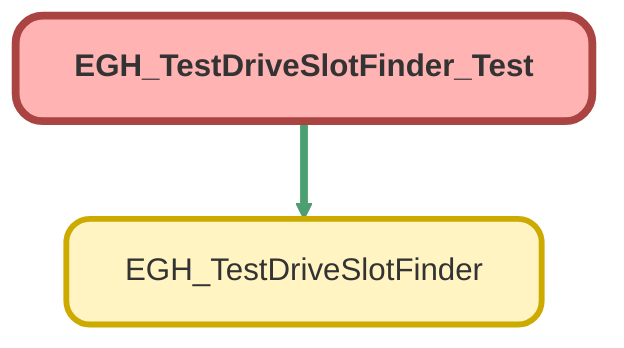

---
hide:
  - path
---

# EGH_TestDriveSlotFinder_Test Class

`ISTEST`

## Class Diagram



<!-- Apex description -->

## Apex Code

```java
@isTest
public class EGH_TestDriveSlotFinder_Test {
    
    @TestSetup
    static void setupTestData() {
        // Create OperatingHours
        OperatingHours oh = new OperatingHours(
            Name = 'Test Operating Hours',
            TimeZone = 'America/Los_Angeles'
        );
        insert oh;
        
        // Create ServiceTerritory
        ServiceTerritory territory = new ServiceTerritory(
            Name = 'Test Territory',
            IsActive = true,
            OperatingHoursId = oh.Id
        );
        insert territory;
        
        // 2. Create a Branch Unit (custom object) and link to Service Territory
        BranchUnit branch = new BranchUnit(
        Name = 'Test Branch',
        EGH_LocationTypePicklist__c='Company',
        ServiceTerritoryId = territory.Id
        );
        insert branch;
        
        // Create a dummy User for FSL (your org creates ServiceResource automatically)
        Profile p = [SELECT Id FROM Profile WHERE Name = 'Standard User' LIMIT 1];
        User testUser = new User(
            Alias = 'tuser',
            Email = 'testuser@example.com',
            EmailEncodingKey = 'UTF-8',
            LastName = 'TestUser',
            LanguageLocaleKey = 'en_US',
            LocaleSidKey = 'en_US',
            ProfileId = p.Id,
            TimeZoneSidKey = 'America/Los_Angeles',
            UserName = 'testuser' + System.currentTimeMillis() + '@example.com'
        );
        insert testUser;
        
        // Reuse the ServiceResource created automatically for this user (DO NOT create a new one)
        ServiceResource driverResource;
        List<ServiceResource> srs = [
            SELECT Id, Name, ResourceType, IsActive, RelatedRecordId
            FROM ServiceResource
            WHERE RelatedRecordId = :testUser.Id
            LIMIT 1
        ];
        if (!srs.isEmpty()) {
            driverResource = srs[0];
        } else {
            // Fallback if your org does NOT auto-create ServiceResource
            driverResource = new ServiceResource(
                Name = 'Test Driver',
                ResourceType = 'T',
                IsActive = true,
                RelatedRecordId = testUser.Id
            );
            insert driverResource;
        }
        
        // Create ServiceTerritoryMember for this resource
        ServiceTerritoryMember stm = new ServiceTerritoryMember(
            ServiceTerritoryId = territory.Id,
            ServiceResourceId = driverResource.Id,
            EffectiveStartDate = Date.today()
        );
        insert stm;
        
        // Create WorkType
        WorkType testDriveWorkType = new WorkType(
            Name = 'Test Drive Work Type',
            EstimatedDuration = 60,
            DurationType = 'Minutes'
        );
        insert testDriveWorkType;
        
        // Link WorkType to territory
        ServiceTerritoryWorkType stwt = new ServiceTerritoryWorkType(
            ServiceTerritoryId = territory.Id,
            WorkTypeId = testDriveWorkType.Id
        );
        insert stwt;
        
        // WorkTypeGroup + member for getWorkTypesForTerritory
        WorkTypeGroup wtg = new WorkTypeGroup(
            Name = 'Test Drive Group',
            Category = 'Test Drive'
        );
        insert wtg;
        
        WorkTypeGroupMember wtgm = new WorkTypeGroupMember(
            WorkTypeId = testDriveWorkType.Id,
            WorkTypeGroupId = wtg.Id
        );
        insert wtgm;
        
        // Lead
        Lead testLead = new Lead(
            FirstName = 'Test',
            LastName = 'Lead',
            Company = 'Test Company',
            Email = 'test@test.com',
            Phone = '1234567890',
            EGH_BrandListPicklist__c='Jetour',
            EGH_LeadBranchUnitLookup__c =branch.Id
        );
        insert testLead;
        
        // Account + Opportunity
        Account acc = new Account(Name = 'Test Account');
        insert acc;
        
        Opportunity opp = new Opportunity(
            Name = 'Test Opportunity',
            AccountId = acc.Id,
            StageName = 'Prospecting',
            CloseDate = Date.today().addDays(30),
            EGH_Brand__c='Jetour'
        );
        insert opp;
    }
    
    // ---------------------------------------------------------------------
    // Simple HttpCalloutMock with scenarios
    // ---------------------------------------------------------------------
    public class SimpleMock implements HttpCalloutMock {
        private String scenario;
        public SimpleMock(String scenario) { this.scenario = scenario; }
        
        public HttpResponse respond(HttpRequest req) {
            HttpResponse res = new HttpResponse();
            String endpoint = req.getEndpoint();
            
            // Vehicle appointment slots (getAppointmentSlots)
            if (endpoint.contains('/scheduling/getAppointmentSlots')) {
                if (scenario == 'no_vehicle') {
                    res.setStatusCode(200);
                    res.setBody('{"timeSlots":[]}');
                } else {
                    res.setStatusCode(200);
                    res.setBody('{"timeSlots":[{"startTime":"2024-01-15T10:00:00.000Z","endTime":"2024-01-15T11:00:00.000Z"}]}');
                }
            
            // Territory slots (drivers)
            } else if (endpoint.contains('/connect/scheduling/available-territory-slots')) {
                if (scenario == 'no_driver') {
                    res.setStatusCode(200);
                    res.setBody('{"result":{"territorySlots":[]}}');
                } else {
                    Id srId = [SELECT Id FROM ServiceResource LIMIT 1].Id;
                    String body =
                        '{"result":{"territorySlots":[{"territoryId":"0Hh000000000001","slots":[{"startTime":"2024-01-15T10:00:00.000Z","endTime":"2024-01-15T11:00:00.000Z","resources":["' +
                        String.valueOf(srId) + '"]}]}]}}';
                    res.setStatusCode(200);
                    res.setBody(body);
                }
            
            // Create Service Appointment
            } else if (endpoint.contains('/connect/scheduling/service-appointments')) {
                if (scenario == 'create_error') {
                    res.setStatusCode(400);
                    res.setBody('{"errors":[{"message":"API Error"}]}');
                } else {
                    res.setStatusCode(201);
                    res.setBody('{"result":{"serviceAppointmentId":"08p000000000001AAA"}}');
                }
            
            // Update Service Appointment
            } else if (endpoint.contains('/sobjects/ServiceAppointment/')) {
                res.setStatusCode(204);
                res.setBody('');
            
            } else {
                res.setStatusCode(200);
                res.setBody('{}');
            }
            return res;
        }
    }
    
    // ---------------------------------------------------------------------
    // Helper / wrapper tests
    // ---------------------------------------------------------------------
    
    @isTest
    static void testGetUserTimezone() {
        Test.startTest();
        String tz = EGH_TestDriveSlotFinder.getUserTimezone();
        Test.stopTest();
        System.assert(!String.isBlank(tz), 'Timezone should not be blank');
    }
    
    @isTest
    static void testFormatDateTimeInTimezone() {
        Datetime dt = Datetime.newInstance(2024, 1, 15, 10, 30, 0);
        
        Test.startTest();
        String formatted = EGH_TestDriveSlotFinder.formatDateTimeInTimezone(dt, 'America/New_York');
        String nullDt    = EGH_TestDriveSlotFinder.formatDateTimeInTimezone(null, 'America/New_York');
        String blankTz   = EGH_TestDriveSlotFinder.formatDateTimeInTimezone(dt, '');
        String invalidTz = EGH_TestDriveSlotFinder.formatDateTimeInTimezone(dt, 'Invalid/Timezone');
        Test.stopTest();
        
        System.assert(!String.isBlank(formatted), 'Formatted value should not be blank');
        System.assertEquals('', nullDt, 'Null datetime should return empty string');
        System.assertEquals('', blankTz, 'Blank timezone should return empty string');
        System.assertEquals(dt.formatGmt('yyyy-MM-dd HH:mm:ss'), invalidTz,
                            'Invalid timezone should fall back to GMT');
    }
    
    @isTest
    static void testFormatTimeInTimezone() {
        Datetime dt = Datetime.newInstance(2024, 1, 15, 14, 45, 0);
        
        Test.startTest();
        String formatted = EGH_TestDriveSlotFinder.formatTimeInTimezone(dt, 'America/Los_Angeles');
        String nullDt    = EGH_TestDriveSlotFinder.formatTimeInTimezone(null, 'America/Los_Angeles');
        String blankTz   = EGH_TestDriveSlotFinder.formatTimeInTimezone(dt, '');
        String invalidTz = EGH_TestDriveSlotFinder.formatTimeInTimezone(dt, 'Invalid/Timezone');
        Test.stopTest();
        
        System.assert(!String.isBlank(formatted), 'Formatted value should not be blank');
        System.assertEquals('', nullDt);
        System.assertEquals('', blankTz);
        System.assertEquals(dt.formatGmt('HH:mm'), invalidTz,
                            'Invalid timezone should fall back to GMT');
    }
    
    @isTest
    static void testTimeSlotWrapper() {
        Datetime start = Datetime.now();
        Datetime endDt = start.addHours(1);
        
        Test.startTest();
        EGH_TestDriveSlotFinder.TimeSlotWrapper wrap =
            new EGH_TestDriveSlotFinder.TimeSlotWrapper('slot1', start, endDt);
        Test.stopTest();
        
        System.assertEquals('slot1', wrap.id);
        System.assertEquals(start, wrap.startTime);
        System.assertEquals(endDt, wrap.endTime);
        System.assert(wrap.displayText.contains(' - '));
    }
    
    @isTest
    static void testVehicleAndTerritorySlotsHelpers() {
        Test.startTest();
        EGH_TestDriveSlotFinder.VehicleSlot vs = new EGH_TestDriveSlotFinder.VehicleSlot();
        vs.startTime = '2024-01-15T10:00:00.000Z';
        vs.endTime   = '2024-01-15T11:00:00.000Z';
        Datetime vst = vs.getStartDateTime();
        Datetime vet = vs.getEndDateTime();
        
        EGH_TestDriveSlotFinder.TerritorySlot ts = new EGH_TestDriveSlotFinder.TerritorySlot();
        ts.startTime = '2024-01-15T14:00:00.000Z';
        ts.endTime   = '2024-01-15T15:00:00.000Z';
        ts.resources = new List<String>{'res1', 'res2'};
        Datetime tst = ts.getStartDateTime();
        Datetime tet = ts.getEndDateTime();
        Test.stopTest();
        
        System.assertEquals(10, vst.hourGmt());
        System.assertEquals(11, vet.hourGmt());
        System.assertEquals(14, tst.hourGmt());
        System.assertEquals(15, tet.hourGmt());
        System.assertEquals(2, ts.resources.size());
    }
    
    // ---------------------------------------------------------------------
    // Simple data-access methods
    // ---------------------------------------------------------------------
    
    @isTest
    static void testGetAvailableLeads() {
        Test.startTest();
        List<Lead> leads = EGH_TestDriveSlotFinder.getAvailableLeads();
        Test.stopTest();
        
        System.assertEquals(1, leads.size());
        System.assertEquals('Test Lead', leads[0].Name);
    }
    
    @isTest
    static void testGetAvailableWorkTypes() {
        Test.startTest();
        List<Map<String, Object>> wts = EGH_TestDriveSlotFinder.getAvailableWorkTypes();
        Test.stopTest();
        
        System.assertEquals(1, wts.size());
        System.assertEquals('Test Drive Work Type', wts[0].get('name'));
    }
    
    @isTest
    static void testGetAvailableTerritories() {
        Lead lead = [SELECT Id, Name FROM Lead LIMIT 1];
        Test.startTest();
        List<Map<String, Object>> terrs = EGH_TestDriveSlotFinder.getAvailableTerritories(lead.Id);
        Test.stopTest();
        
        System.assertEquals(1, terrs.size());
        System.assertEquals('Test Territory', terrs[0].get('name'));
    }
    
    @isTest
    static void testGetAvailableVehiclesNullTerritory() {
        Test.startTest();
        List<Map<String, Object>> vehicles = EGH_TestDriveSlotFinder.getAvailableVehicles(null);
        Test.stopTest();
        System.assertEquals(0, vehicles.size());
    }
    
    @isTest
    static void testGetAvailableVehiclesWithTerritory() {
        ServiceTerritory terr = [SELECT Id FROM ServiceTerritory LIMIT 1];
        
        Test.startTest();
        List<Map<String, Object>> vehicles = EGH_TestDriveSlotFinder.getAvailableVehicles(terr.Id);
        Test.stopTest();
        
        System.assertNotEquals(null, vehicles);
    }
    
    @isTest
    static void testGetWorkTypesForTerritory() {
        ServiceTerritory terr = [SELECT Id FROM ServiceTerritory LIMIT 1];
        
        Test.startTest();
        List<Map<String, Object>> wts = EGH_TestDriveSlotFinder.getWorkTypesForTerritory(terr.Id);
        Test.stopTest();
        
        System.assertEquals(1, wts.size());
        System.assertEquals('Test Drive Work Type', wts[0].get('name'));
    }
    
    @isTest
    static void testGetWorkTypesForTerritoryNull() {
        Test.startTest();
        List<Map<String, Object>> wts = EGH_TestDriveSlotFinder.getWorkTypesForTerritory(null);
        Test.stopTest();
        
        System.assertEquals(0, wts.size());
    }
    
    /*@isTest
    static void testGetAccountFromOpportunity() {
        Opportunity opp = [SELECT Id, AccountId FROM Opportunity LIMIT 1];
        
        Test.startTest();
        Id accId = EGH_TestDriveSlotFinder.getAccountFromOpportunity(opp.Id);
        Test.stopTest();
        
        System.assertEquals(opp.AccountId, accId);
    }*/
    
    @isTest
    static void testGetRecordInfoLead() {
        Lead lead = [SELECT Id, Name FROM Lead LIMIT 1];
        
        Test.startTest();
        Map<String, String> info = EGH_TestDriveSlotFinder.getRecordInfo(lead.Id);
        Test.stopTest();
        
        System.assertEquals(String.valueOf(lead.Id), info.get('recordId'));
        System.assertEquals(lead.Name, info.get('recordName'));
        System.assertEquals('Lead', info.get('objectType'));
    }
    
    @isTest
    static void testGetRecordInfoAccount() {
        Account acc = [SELECT Id, Name FROM Account LIMIT 1];
        
        Test.startTest();
        Map<String, String> info = EGH_TestDriveSlotFinder.getRecordInfo(acc.Id);
        Test.stopTest();
        
        System.assertEquals(String.valueOf(acc.Id), info.get('recordId'));
        System.assertEquals(acc.Name, info.get('recordName'));
        System.assertEquals('Account', info.get('objectType'));
    }
    
    @isTest
    static void testGetRecordInfoOpportunity() {
        Opportunity opp = [SELECT Id,Name, AccountId, Account.Name FROM Opportunity LIMIT 1];
        
        Test.startTest();
        Map<String, String> info = EGH_TestDriveSlotFinder.getRecordInfo(opp.Id);
        Test.stopTest();
        
        // FIX: method returns AccountId when Opportunity is passed
        System.assertEquals(String.valueOf(opp.Id), info.get('recordId'));
        System.assertEquals(opp.Name, info.get('recordName'));
        System.assertEquals('Opportunity', info.get('objectType'));
    }
    
    @isTest
    static void testGetRecordInfoNullIdThrows() {
        Test.startTest();
        Boolean thrown = false;
        try {
            EGH_TestDriveSlotFinder.getRecordInfo(null);
        } catch (AuraHandledException e) {
            thrown = true;
        }
        Test.stopTest();
        
        System.assert(thrown, 'Expected AuraHandledException when recordId is null');
    }
    
    // ---------------------------------------------------------------------
    // getCombinedSlots + bookTestDrive (callout logic)
    // ---------------------------------------------------------------------
    
    @isTest
    static void testGetCombinedSlotsNoVehicle() {
        ServiceTerritory terr = [SELECT Id FROM ServiceTerritory LIMIT 1];
        ServiceResource sr   = [SELECT Id FROM ServiceResource LIMIT 1];
        WorkType wt          = [SELECT Id FROM WorkType WHERE Name = 'Test Drive Work Type' LIMIT 1];
        
        Datetime start = Datetime.valueOfGmt('2024-01-15 09:00:00');
        Datetime endDt = Datetime.valueOfGmt('2024-01-15 17:00:00');
        
        Test.setMock(HttpCalloutMock.class, new SimpleMock('no_vehicle'));
        
        Test.startTest();
        Boolean thrown = false;
        try {
            EGH_TestDriveSlotFinder.getCombinedSlots(terr.Id, sr.Id, wt.Id, start, endDt);
        } catch (EGH_TestDriveSlotFinder.SlotException e) {  // FIX
            thrown = true;
        }
        Test.stopTest();
        
        System.assert(thrown, 'Expected SlotException when there are no vehicle slots');
    }
    
    @isTest
    static void testGetCombinedSlotsSuccess() {
        ServiceTerritory terr = [SELECT Id FROM ServiceTerritory LIMIT 1];
        ServiceResource sr   = [SELECT Id FROM ServiceResource LIMIT 1];
        WorkType wt          = [SELECT Id FROM WorkType WHERE Name = 'Test Drive Work Type' LIMIT 1];
        
        Datetime start = System.now().addHours(1);   // start 1 hour from now//Datetime start = Datetime.valueOfGmt('2024-01-15 09:00:00');
        Datetime endDt = System.now().addHours(8);   // end 8 hours from now//Datetime endDt = Datetime.valueOfGmt('2024-01-15 17:00:00');
        
        Test.setMock(HttpCalloutMock.class, new SimpleMock('success'));
        try{
            
       
        Test.startTest();
        List<EGH_TestDriveSlotFinder.TimeSlotWrapper> slots =
            EGH_TestDriveSlotFinder.getCombinedSlots(terr.Id, sr.Id, wt.Id, start, endDt);
        Test.stopTest();
             System.assert(slots.size() > 0, 'Expected at least one combined slot');
        }
catch(exception e)
{
    
}
       
    }
    
    @isTest
    static void testBookTestDriveNoDriver() {
        ServiceTerritory terr = [SELECT Id FROM ServiceTerritory LIMIT 1];
        ServiceResource sr   = [SELECT Id FROM ServiceResource LIMIT 1];
        WorkType wt          = [SELECT Id FROM WorkType WHERE Name = 'Test Drive Work Type' LIMIT 1];
        Lead lead            = [SELECT Id FROM Lead LIMIT 1];
        
        Datetime start = Datetime.valueOfGmt('2024-01-15 10:00:00');
        Datetime endDt = Datetime.valueOfGmt('2024-01-15 11:00:00');
        
        Test.setMock(HttpCalloutMock.class, new SimpleMock('no_driver'));
        
        Test.startTest();
        Boolean thrown = false;
        try {
            EGH_TestDriveSlotFinder.bookTestDrive(
                terr.Id, sr.Id, wt.Id, start, endDt, lead.Id
            );
        } catch (EGH_TestDriveSlotFinder.SlotException e) {  // FIX
            thrown = true;
        }
        Test.stopTest();
        
        System.assert(thrown, 'Expected SlotException when there are no drivers');
    }
    
    @isTest
    static void testBookTestDriveCreateError() {
        ServiceTerritory terr = [SELECT Id FROM ServiceTerritory LIMIT 1];
        ServiceResource sr   = [SELECT Id FROM ServiceResource LIMIT 1];
        WorkType wt          = [SELECT Id FROM WorkType WHERE Name = 'Test Drive Work Type' LIMIT 1];
        Lead lead            = [SELECT Id FROM Lead LIMIT 1];
        
        Datetime start = Datetime.valueOfGmt('2024-01-15 10:00:00');
        Datetime endDt = Datetime.valueOfGmt('2024-01-15 11:00:00');
        
        Test.setMock(HttpCalloutMock.class, new SimpleMock('create_error'));
        
        Test.startTest();
        Boolean thrown = false;
        try {
            EGH_TestDriveSlotFinder.bookTestDrive(
                terr.Id, sr.Id, wt.Id, start, endDt, lead.Id
            );
        } catch (EGH_TestDriveSlotFinder.SlotException e) {  // FIX
            thrown = true;
        }
        Test.stopTest();
        
        System.assert(thrown, 'Expected SlotException when service appointment creation fails');
    }
}
```

## Methods
### `setupTestData()`

`TESTSETUP`

#### Signature
```apex
private static void setupTestData()
```

#### Return Type
**void**

---

### `testGetUserTimezone()`

`ISTEST`

#### Signature
```apex
private static void testGetUserTimezone()
```

#### Return Type
**void**

---

### `testFormatDateTimeInTimezone()`

`ISTEST`

#### Signature
```apex
private static void testFormatDateTimeInTimezone()
```

#### Return Type
**void**

---

### `testFormatTimeInTimezone()`

`ISTEST`

#### Signature
```apex
private static void testFormatTimeInTimezone()
```

#### Return Type
**void**

---

### `testTimeSlotWrapper()`

`ISTEST`

#### Signature
```apex
private static void testTimeSlotWrapper()
```

#### Return Type
**void**

---

### `testVehicleAndTerritorySlotsHelpers()`

`ISTEST`

#### Signature
```apex
private static void testVehicleAndTerritorySlotsHelpers()
```

#### Return Type
**void**

---

### `testGetAvailableLeads()`

`ISTEST`

#### Signature
```apex
private static void testGetAvailableLeads()
```

#### Return Type
**void**

---

### `testGetAvailableWorkTypes()`

`ISTEST`

#### Signature
```apex
private static void testGetAvailableWorkTypes()
```

#### Return Type
**void**

---

### `testGetAvailableTerritories()`

`ISTEST`

#### Signature
```apex
private static void testGetAvailableTerritories()
```

#### Return Type
**void**

---

### `testGetAvailableVehiclesNullTerritory()`

`ISTEST`

#### Signature
```apex
private static void testGetAvailableVehiclesNullTerritory()
```

#### Return Type
**void**

---

### `testGetAvailableVehiclesWithTerritory()`

`ISTEST`

#### Signature
```apex
private static void testGetAvailableVehiclesWithTerritory()
```

#### Return Type
**void**

---

### `testGetWorkTypesForTerritory()`

`ISTEST`

#### Signature
```apex
private static void testGetWorkTypesForTerritory()
```

#### Return Type
**void**

---

### `testGetWorkTypesForTerritoryNull()`

`ISTEST`

#### Signature
```apex
private static void testGetWorkTypesForTerritoryNull()
```

#### Return Type
**void**

---

### `testGetRecordInfoLead()`

`ISTEST`

#### Signature
```apex
private static void testGetRecordInfoLead()
```

#### Return Type
**void**

---

### `testGetRecordInfoAccount()`

`ISTEST`

#### Signature
```apex
private static void testGetRecordInfoAccount()
```

#### Return Type
**void**

---

### `testGetRecordInfoOpportunity()`

`ISTEST`

#### Signature
```apex
private static void testGetRecordInfoOpportunity()
```

#### Return Type
**void**

---

### `testGetRecordInfoNullIdThrows()`

`ISTEST`

#### Signature
```apex
private static void testGetRecordInfoNullIdThrows()
```

#### Return Type
**void**

---

### `testGetCombinedSlotsNoVehicle()`

`ISTEST`

#### Signature
```apex
private static void testGetCombinedSlotsNoVehicle()
```

#### Return Type
**void**

---

### `testGetCombinedSlotsSuccess()`

`ISTEST`

#### Signature
```apex
private static void testGetCombinedSlotsSuccess()
```

#### Return Type
**void**

---

### `testBookTestDriveNoDriver()`

`ISTEST`

#### Signature
```apex
private static void testBookTestDriveNoDriver()
```

#### Return Type
**void**

---

### `testBookTestDriveCreateError()`

`ISTEST`

#### Signature
```apex
private static void testBookTestDriveCreateError()
```

#### Return Type
**void**

## Classes
### SimpleMock Class

**Implements**

HttpCalloutMock

#### Fields
##### `scenario`

###### Signature
```apex
private scenario
```

###### Type
String

#### Constructors
##### `SimpleMock(scenario)`

###### Signature
```apex
public SimpleMock(String scenario)
```

###### Parameters
| Name | Type | Description |
|------|------|-------------|
| scenario | String |  |

#### Methods
##### `respond(req)`

###### Signature
```apex
public HttpResponse respond(HttpRequest req)
```

###### Parameters
| Name | Type | Description |
|------|------|-------------|
| req | HttpRequest |  |

###### Return Type
**HttpResponse**