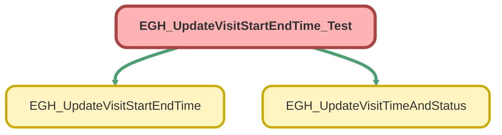

---
hide:
  - path
---

# EGH_UpdateVisitStartEndTime_Test Class

`ISTEST`

## Class Diagram



<!-- Apex description -->

## Apex Code

```java
@isTest
public class EGH_UpdateVisitStartEndTime_Test {
    
    @TestSetup
    static void setupTestData() {
        // Create test EGH_ShowroomVisit__c records
        List<EGH_ShowroomVisit__c> testVisits = new List<EGH_ShowroomVisit__c>();
        
        // Create a visit for start time testing
        EGH_ShowroomVisit__c visit1 = new EGH_ShowroomVisit__c(
            EGH_Status__c = 'New'
        );
        testVisits.add(visit1);
        
        // Create a visit for end time testing
        EGH_ShowroomVisit__c visit2 = new EGH_ShowroomVisit__c(
            EGH_Status__c = 'Assigned',
            EGH_StartDateTime__c = System.now().addHours(-2) // Started 2 hours ago
        );
        testVisits.add(visit2);
        
        // Create a visit for both start and end time testing
        EGH_ShowroomVisit__c visit3 = new EGH_ShowroomVisit__c(
            EGH_Status__c = 'New'
        );
        testVisits.add(visit3);
        
        insert testVisits;
    }
    
    @isTest
    static void testUpdateVisitStartTime() {
        // Get a test visit record
        EGH_ShowroomVisit__c testVisit = [SELECT Id, EGH_StartDateTime__c, EGH_Status__c 
                                         FROM EGH_ShowroomVisit__c 
                                         WHERE EGH_Status__c = 'New' 
                                         LIMIT 1];
        
        // Verify initial state
        System.assertEquals('New', testVisit.EGH_Status__c, 'Initial status should be New');
        System.assertEquals(null, testVisit.EGH_StartDateTime__c, 'Initial start time should be null');
        
        Test.startTest();
        EGH_UpdateVisitTimeAndStatus.updateVisitStartTime(testVisit.Id);
        Test.stopTest();
        
        // Query the updated record
        EGH_ShowroomVisit__c updatedVisit = [SELECT Id, EGH_StartDateTime__c, EGH_Status__c 
                                            FROM EGH_ShowroomVisit__c 
                                            WHERE Id = :testVisit.Id];
        
        // Verify the updates
        System.assertEquals('Assigned', updatedVisit.EGH_Status__c, 'Status should be updated to Assigned');
        System.assertNotEquals(null, updatedVisit.EGH_StartDateTime__c, 'Start time should be set');
    }
    
    @isTest
    static void testUpdateVisitEndTime() {
        // Get a test visit record that already has a start time
        EGH_ShowroomVisit__c testVisit = [SELECT Id, EGH_StartDateTime__c, EGH_EndDateTime__c, EGH_Status__c 
                                         FROM EGH_ShowroomVisit__c 
                                         WHERE EGH_Status__c = 'Assigned' 
                                         LIMIT 1];
        
        // Verify initial state
        System.assertEquals('Assigned', testVisit.EGH_Status__c, 'Initial status should be Assigned');
        System.assertNotEquals(null, testVisit.EGH_StartDateTime__c, 'Should have a start time');
        System.assertEquals(null, testVisit.EGH_EndDateTime__c, 'Initial end time should be null');
        
        Test.startTest();
        EGH_UpdateVisitTimeAndStatus.updateVisitEndTime(testVisit.Id);
        Test.stopTest();
        
        // Query the updated record
        EGH_ShowroomVisit__c updatedVisit = [SELECT Id, EGH_StartDateTime__c, EGH_EndDateTime__c, EGH_Status__c 
                                            FROM EGH_ShowroomVisit__c 
                                            WHERE Id = :testVisit.Id];
        
        // Verify the updates
        System.assertEquals('Ended', updatedVisit.EGH_Status__c, 'Status should be updated to Ended');
        System.assertNotEquals(null, updatedVisit.EGH_EndDateTime__c, 'End time should be set');
        System.assert(updatedVisit.EGH_EndDateTime__c >= updatedVisit.EGH_StartDateTime__c, 'End time should be after start time');
    }
    
    @isTest
    static void testUpdateVisitStartTimeAndEndTime() {
        // Test updating both start and end time on the same record
        EGH_ShowroomVisit__c testVisit = [SELECT Id, EGH_StartDateTime__c, EGH_EndDateTime__c, EGH_Status__c 
                                         FROM EGH_ShowroomVisit__c 
                                         WHERE EGH_Status__c = 'New' 
                                         LIMIT 1];
        
        // Verify initial state
        System.assertEquals('New', testVisit.EGH_Status__c, 'Initial status should be New');
        System.assertEquals(null, testVisit.EGH_StartDateTime__c, 'Initial start time should be null');
        System.assertEquals(null, testVisit.EGH_EndDateTime__c, 'Initial end time should be null');
        
        Test.startTest();
        
        // First update start time
        EGH_UpdateVisitTimeAndStatus.updateVisitStartTime(testVisit.Id);
        
        // Wait a moment to ensure different timestamps
        System.debug('Waiting between start and end time updates');
        
        // Then update end time
        EGH_UpdateVisitTimeAndStatus.updateVisitEndTime(testVisit.Id);
        
        Test.stopTest();
        
        // Query the updated record
        EGH_ShowroomVisit__c updatedVisit = [SELECT Id, EGH_StartDateTime__c, EGH_EndDateTime__c, EGH_Status__c 
                                            FROM EGH_ShowroomVisit__c 
                                            WHERE Id = :testVisit.Id];
        
        // Verify the updates
        System.assertEquals('Ended', updatedVisit.EGH_Status__c, 'Final status should be Ended');
        System.assertNotEquals(null, updatedVisit.EGH_StartDateTime__c, 'Start time should be set');
        System.assertNotEquals(null, updatedVisit.EGH_EndDateTime__c, 'End time should be set');
        System.assert(updatedVisit.EGH_EndDateTime__c >= updatedVisit.EGH_StartDateTime__c, 'End time should be after start time');
    }
    
    @isTest
    static void testUpdateVisitStartTimeWithInvalidId() {
        // Test with an invalid record ID
        Id invalidId = 'a0F000000000000'; // Invalid ID format
        
        Test.startTest();
        try {
            EGH_UpdateVisitTimeAndStatus.updateVisitStartTime(invalidId);
            System.assert(false, 'Expected exception was not thrown');
        } catch (QueryException e) {
            System.assert(true, 'Expected QueryException was thrown: ' + e.getMessage());
        }
        Test.stopTest();
    }
    
    @isTest
    static void testUpdateVisitEndTimeWithInvalidId() {
        // Test with an invalid record ID
        Id invalidId = 'a0F000000000000'; // Invalid ID format
        
        Test.startTest();
        try {
            EGH_UpdateVisitTimeAndStatus.updateVisitEndTime(invalidId);
            System.assert(false, 'Expected exception was not thrown');
        } catch (QueryException e) {
            System.assert(true, 'Expected QueryException was thrown: ' + e.getMessage());
        }
        Test.stopTest();
    }
    
    @isTest
    static void testUpdateVisitStartTimeWithNullId() {
        // Test with null record ID
        Test.startTest();
        try {
            EGH_UpdateVisitTimeAndStatus.updateVisitStartTime(null);
            System.assert(false, 'Expected exception was not thrown');
        } catch (QueryException e) {
            System.assert(true, 'Expected QueryException was thrown: ' + e.getMessage());
        }
        Test.stopTest();
    }
    
    @isTest
    static void testUpdateVisitEndTimeWithNullId() {
        // Test with null record ID
        Test.startTest();
        try {
            EGH_UpdateVisitTimeAndStatus.updateVisitEndTime(null);
            System.assert(false, 'Expected exception was not thrown');
        } catch (QueryException e) {
            System.assert(true, 'Expected QueryException was thrown: ' + e.getMessage());
        }
        Test.stopTest();
    }
    
    @isTest
    static void testUpdateVisitStartTimeBulk() {
        // Test bulk update of start times
        List<EGH_ShowroomVisit__c> testVisits = [SELECT Id, EGH_StartDateTime__c, EGH_Status__c 
                                                FROM EGH_ShowroomVisit__c 
                                                WHERE EGH_Status__c = 'New'];
        
        System.assert(!testVisits.isEmpty(), 'Should have test visits to update');
        
        Test.startTest();
        
        // Update multiple visits
        for (EGH_ShowroomVisit__c visit : testVisits) {
            EGH_UpdateVisitTimeAndStatus.updateVisitStartTime(visit.Id);
        }
        
        Test.stopTest();
        
        // Verify all visits were updated
        List<EGH_ShowroomVisit__c> updatedVisits = [SELECT Id, EGH_StartDateTime__c, EGH_Status__c 
                                                   FROM EGH_ShowroomVisit__c 
                                                   WHERE Id IN :testVisits];
        
        for (EGH_ShowroomVisit__c visit : updatedVisits) {
            System.assertEquals('Assigned', visit.EGH_Status__c, 'All visits should have status Assigned');
            System.assertNotEquals(null, visit.EGH_StartDateTime__c, 'All visits should have start time set');
        }
    }
    
    @isTest
    static void testUpdateVisitEndTimeBulk() {
        // Test bulk update of end times
        List<EGH_ShowroomVisit__c> testVisits = [SELECT Id, EGH_StartDateTime__c, EGH_EndDateTime__c, EGH_Status__c 
                                                FROM EGH_ShowroomVisit__c 
                                                WHERE EGH_Status__c = 'Assigned'];
        
        System.assert(!testVisits.isEmpty(), 'Should have test visits to update');
        
        Test.startTest();
        
        // Update multiple visits
        for (EGH_ShowroomVisit__c visit : testVisits) {
            EGH_UpdateVisitTimeAndStatus.updateVisitEndTime(visit.Id);
        }
        
        Test.stopTest();
        
        // Verify all visits were updated
        List<EGH_ShowroomVisit__c> updatedVisits = [SELECT Id, EGH_StartDateTime__c, EGH_EndDateTime__c, EGH_Status__c 
                                                   FROM EGH_ShowroomVisit__c 
                                                   WHERE Id IN :testVisits];
        
        for (EGH_ShowroomVisit__c visit : updatedVisits) {
            System.assertEquals('Ended', visit.EGH_Status__c, 'All visits should have status Ended');
            System.assertNotEquals(null, visit.EGH_EndDateTime__c, 'All visits should have end time set');
            System.assert(visit.EGH_EndDateTime__c >= visit.EGH_StartDateTime__c, 'End time should be after start time');
        }
    }
}
```

## Methods
### `setupTestData()`

`TESTSETUP`

#### Signature
```apex
private static void setupTestData()
```

#### Return Type
**void**

---

### `testUpdateVisitStartTime()`

`ISTEST`

#### Signature
```apex
private static void testUpdateVisitStartTime()
```

#### Return Type
**void**

---

### `testUpdateVisitEndTime()`

`ISTEST`

#### Signature
```apex
private static void testUpdateVisitEndTime()
```

#### Return Type
**void**

---

### `testUpdateVisitStartTimeAndEndTime()`

`ISTEST`

#### Signature
```apex
private static void testUpdateVisitStartTimeAndEndTime()
```

#### Return Type
**void**

---

### `testUpdateVisitStartTimeWithInvalidId()`

`ISTEST`

#### Signature
```apex
private static void testUpdateVisitStartTimeWithInvalidId()
```

#### Return Type
**void**

---

### `testUpdateVisitEndTimeWithInvalidId()`

`ISTEST`

#### Signature
```apex
private static void testUpdateVisitEndTimeWithInvalidId()
```

#### Return Type
**void**

---

### `testUpdateVisitStartTimeWithNullId()`

`ISTEST`

#### Signature
```apex
private static void testUpdateVisitStartTimeWithNullId()
```

#### Return Type
**void**

---

### `testUpdateVisitEndTimeWithNullId()`

`ISTEST`

#### Signature
```apex
private static void testUpdateVisitEndTimeWithNullId()
```

#### Return Type
**void**

---

### `testUpdateVisitStartTimeBulk()`

`ISTEST`

#### Signature
```apex
private static void testUpdateVisitStartTimeBulk()
```

#### Return Type
**void**

---

### `testUpdateVisitEndTimeBulk()`

`ISTEST`

#### Signature
```apex
private static void testUpdateVisitEndTimeBulk()
```

#### Return Type
**void**