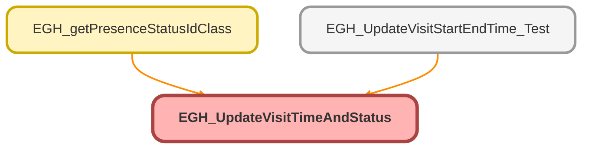

---
hide:
  - path
---

# EGH_UpdateVisitTimeAndStatus Class

## Class Diagram



<!-- Apex description -->

## Apex Code

```java
public class EGH_UpdateVisitTimeAndStatus {

    @AuraEnabled
    public static void updateVisitStartTime(Id recordId) {
      
        EGH_ShowroomVisit__c sv = [SELECT Id, EGH_StartDateTime__c
                                   FROM EGH_ShowroomVisit__c   
                                   WHERE Id = :recordId WITH SYSTEM_MODE 
                                   LIMIT 1];
        sv.EGH_StartDateTime__c = System.now();
        sv.EGH_Status__c = 'Assigned';
        sv.EGH_Visit_Started__c = True;
        Database.update(sv, AccessLevel.USER_MODE);
      }

    
    
       @AuraEnabled
    public static void updateVisitEndTime(Id recordId) {
         EGH_ShowroomVisit__c sv = [SELECT Id, EGH_StartDateTime__c 
                                    FROM EGH_ShowroomVisit__c 
                                    WHERE Id = :recordId WITH SYSTEM_MODE 
                                    LIMIT 1];
        sv.EGH_EndDateTime__c = System.now();
        sv.EGH_Status__c = 'Ended';
        sv.EGH_Visit_Completed__c =TRUE;
        Database.update(sv,AccessLevel.SYSTEM_MODE);
    }


}
```

## Methods
### `updateVisitStartTime(recordId)`

`AURAENABLED`

#### Signature
```apex
public static void updateVisitStartTime(Id recordId)
```

#### Parameters
| Name | Type | Description |
|------|------|-------------|
| recordId | Id |  |

#### Return Type
**void**

---

### `updateVisitEndTime(recordId)`

`AURAENABLED`

#### Signature
```apex
public static void updateVisitEndTime(Id recordId)
```

#### Parameters
| Name | Type | Description |
|------|------|-------------|
| recordId | Id |  |

#### Return Type
**void**