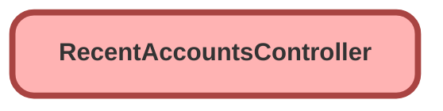

---
hide:
  - path
---

# RecentAccountsController Class

## Class Diagram



<!-- Apex description -->

## Apex Code

```java
public with sharing class RecentAccountsController {
    @AuraEnabled(cacheable=true)
    public static List<Account> getRecentAccounts() {
        return [SELECT Id, Name FROM Account ORDER BY CreatedDate DESC LIMIT 10];
    }
}
```

## Methods
### `getRecentAccounts()`

`AURAENABLED`

#### Signature
```apex
public static List<Account> getRecentAccounts()
```

#### Return Type
**List<Account>**