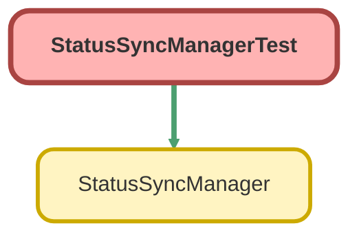

---
hide:
  - path
---

# StatusSyncManagerTest Class

`ISTEST`

## Class Diagram



<!-- Apex description -->

## Apex Code

```java
@isTest
private class StatusSyncManagerTest {
    @testSetup
    static void setupTestData() {
        // Create test custom settings
        Genesys_CC_integration__c sfToGenesysConfig = new Genesys_CC_integration__c(
            Name = 'From SF To Genesys',
            Available_Off_Queue__c = 'Genesys_Available_Id',
            On_Queue__c = 'Genesys_OnQueue_Id',
            Busy__c = 'Genesys_Busy_Id',
            Away__c = 'Genesys_Away_Id',
            Break__c = 'Genesys_Break_Id',
            Meeting__c = 'Genesys_Meeting_Id',
            Training__c = 'Genesys_Training_Id',
            Offline__c = 'Genesys_Offline_Id',
            Busy_Lunch__c = 'Genesys_Lunch_Id'
        );
        insert sfToGenesysConfig;

        Genesys_CC_integration__c genesysToSFConfig = new Genesys_CC_integration__c(
            Name = 'From Genesys to SF',
            Available_Off_Queue__c = 'SF_Available_Id',
            On_Queue__c = 'SF_OnQueue_Id',
            Busy__c = 'SF_Busy_Id',
            Away__c = 'SF_Away_Id',
            Break__c = 'SF_Break_Id',
            Meeting__c = 'SF_Meeting_Id',
            Training__c = 'SF_Training_Id',
            Busy_Lunch__c = 'SF_Lunch_Id'
        );
        insert genesysToSFConfig;
    }
    
    @isTest
    static void testOnGenesysCloudStatusChange() {
        StatusSyncManager manager = new StatusSyncManager();

        String requestData = '{"salesforceStatus":{"targetStatus":{"statusId":"SF_Available_Id"}}, "genesysCloudStatus":{"targetStatus":{"systemPresence":"AVAILABLE"}}}';

        String response = manager.onGenesysCloudStatusChange(requestData);
        System.debug('Response: ' + response);
        
        System.assert(response.contains('SF_Available_Id'), 'Expected Salesforce Available Id in response');
    }
    @isTest
    static void testOnGenesysCloudStatusChangeGenConfigNull() {
        List<Genesys_CC_integration__c> GenesysConfig = [ select Id from Genesys_CC_integration__c];
        delete GenesysConfig;
        StatusSyncManager manager = new StatusSyncManager();
        String requestData = '{"salesforceStatus":{"targetStatus":{"statusId":"SF_Available_Id"}}, "genesysCloudStatus":{"targetStatus":{"systemPresence":"AVAILABLE"}}}';
		String response = manager.onGenesysCloudStatusChange(requestData);
        System.debug('Response: ' + response);
        System.assert(response.contains('ERROR'), 'Expected Salesforce Available Id in response');
    }
     @isTest
    static void testOnGenesysCloudStatusChangeGenBusy() {
        List<Genesys_CC_integration__c> GenesysConfig = [ select Id from Genesys_CC_integration__c];
        delete GenesysConfig;
        StatusSyncManager manager = new StatusSyncManager();
        String requestData = '{"salesforceStatus":{"targetStatus":{"statusId":"SF_Busy_Id"}}, "genesysCloudStatus":{"targetStatus":{"systemPresence":"BUSY"}}}';
		String response = manager.onGenesysCloudStatusChange(requestData);
        System.debug('Response: ' + response);
       // System.assert(response.contains('SF_Busy_Id'), 'Expected Salesforce Available Id in response');
    }
    
     @isTest
    static void testOnGenesysCloudStatusChangeGenOnQueue() {
        StatusSyncManager manager = new StatusSyncManager();
        String requestData = '{"salesforceStatus":{"targetStatus":{"statusId":"SF_OnQueue_Id"}}, "genesysCloudStatus":{"targetStatus":{"systemPresence":"AVAILABLE ON QUEUE"}}}';

        String response = manager.onGenesysCloudStatusChange(requestData);
        System.debug('Response: ' + response);
        
        System.assert(response.contains('SF_OnQueue_Id'), 'Expected Salesforce Available Id in response');
    }
    
     @isTest
    static void testOnGenesysCloudStatusChangeGenAway() {
        StatusSyncManager manager = new StatusSyncManager();
        String requestData = '{"salesforceStatus":{"targetStatus":{"statusId":"SF_Away_Id"}}, "genesysCloudStatus":{"targetStatus":{"systemPresence":"AWAY"}}}';

        String response = manager.onGenesysCloudStatusChange(requestData);
        System.debug('Response: ' + response);
        
        System.assert(response.contains('SF_Away_Id'), 'Expected Salesforce Available Id in response');
    }

     @isTest
    static void testOnGenesysCloudStatusChangeGenBreak() {
        StatusSyncManager manager = new StatusSyncManager();
        String requestData = '{"salesforceStatus":{"targetStatus":{"statusId":"SF_Break_Id"}}, "genesysCloudStatus":{"targetStatus":{"systemPresence":"BREAK"}}}';

        String response = manager.onGenesysCloudStatusChange(requestData);
        System.debug('Response: ' + response);
        
        System.assert(response.contains('SF_Break_Id'), 'Expected Salesforce Available Id in response');
    }
    
     @isTest
    static void testOnGenesysCloudStatusChangeGenMeeting() {
        StatusSyncManager manager = new StatusSyncManager();
        String requestData = '{"salesforceStatus":{"targetStatus":{"statusId":"SF_Meeting_Id"}}, "genesysCloudStatus":{"targetStatus":{"systemPresence":"MEETING"}}}';

        String response = manager.onGenesysCloudStatusChange(requestData);
        System.debug('Response: ' + response);
        
        System.assert(response.contains('SF_Meeting_Id'), 'Expected Salesforce Available Id in response');
    }
    
    
    @isTest
    static void testOnGenesysCloudStatusChangeGenTraining() {
        StatusSyncManager manager = new StatusSyncManager();
        String requestData = '{"salesforceStatus":{"targetStatus":{"statusId":"SF_Training_Id"}}, "genesysCloudStatus":{"targetStatus":{"systemPresence":"TRAINING"}}}';
        
        String response = manager.onGenesysCloudStatusChange(requestData);
        System.debug('Response: ' + response);
        
        System.assert(response.contains('SF_Training_Id'), 'Expected Salesforce Available Id in response');
    }
    
     @isTest
    static void testOnGenesysCloudStatusChangeGenMeal() {
        StatusSyncManager manager = new StatusSyncManager();
        String requestData = '{"salesforceStatus":{"targetStatus":{"statusId":"SF_Lunch_Id"}}, "genesysCloudStatus":{"targetStatus":{"systemPresence":"MEAL"}}}';
        
        String response = manager.onGenesysCloudStatusChange(requestData);
        System.debug('Response: ' + response);
        
        //System.assert(response.contains('SF_Lunch_Id'), 'Expected Salesforce Available Id in response');
    }
    @isTest
    static void testOnSalesforceStatusChangeAvailable() {
        StatusSyncManager manager = new StatusSyncManager();

        String requestData = '{"salesforceStatus":{"targetStatus":{"statusName":"AVAILABLE","statusId":"SF_Available_Id"}}, "genesysCloudStatus":{"targetStatus":{"id":"Genesys_Available_Id"}}}';

        String response = manager.onSalesforceStatusChange(requestData);
        System.debug('Response: ' + response);
        
        System.assert(response.contains('Genesys_Available_Id'), 'Expected Genesys Available Id in response');
    }
    
    @isTest
    static void testOnSalesforceStatusChangeOnQueue() {
        StatusSyncManager manager = new StatusSyncManager();

        String requestData = '{"salesforceStatus":{"targetStatus":{"statusName":"AVAILABLE ON QUEUE","statusId":"SF_OnQueue_Id"}}, "genesysCloudStatus":{"targetStatus":{"id":"Genesys_Available_Id"}}}';

        String response = manager.onSalesforceStatusChange(requestData);
        System.debug('Response: ' + response);
        
        System.assert(response.contains('Genesys_OnQueue_Id'), 'Expected Genesys Available Id in response');
    }
    
    @isTest
    static void testOnSalesforceStatusChangeBusy() {
        StatusSyncManager manager = new StatusSyncManager();
        
        String requestData = '{"salesforceStatus":{"targetStatus":{"statusName":"BUSY","statusId":"Genesys_Busy_Id"}}, "genesysCloudStatus":{"targetStatus":{"id":"Genesys_Available_Id"}}}';
        
        String response = manager.onSalesforceStatusChange(requestData);
        System.debug('Response: ' + response);
        
        System.assert(response.contains('Genesys_Busy_Id'), 'Expected Genesys Available Id in response');
    }
    
    @isTest
    static void testOnSalesforceStatusChangeAway() {
        StatusSyncManager manager = new StatusSyncManager();
        
        String requestData = '{"salesforceStatus":{"targetStatus":{"statusName":"AWAY","statusId":"Genesys_Away_Id"}}, "genesysCloudStatus":{"targetStatus":{"id":"Genesys_Available_Id"}}}';
        
        String response = manager.onSalesforceStatusChange(requestData);
        System.debug('Response: ' + response);
        
        System.assert(response.contains('Genesys_Away_Id'), 'Expected Genesys Available Id in response');
    }
    
    @isTest
    static void testOnSalesforceStatusChangeBreak() {
        StatusSyncManager manager = new StatusSyncManager();
        
        String requestData = '{"salesforceStatus":{"targetStatus":{"statusName":"BREAK","statusId":"Genesys_Break_Id"}}, "genesysCloudStatus":{"targetStatus":{"id":"Genesys_Available_Id"}}}';
        
        String response = manager.onSalesforceStatusChange(requestData);
        System.debug('Response: ' + response);
        
        System.assert(response.contains('Genesys_Break_Id'), 'Expected Genesys Available Id in response');
    }
    
    @isTest
    static void testOnSalesforceStatusChangeMeeting() {
        StatusSyncManager manager = new StatusSyncManager();
        
        String requestData = '{"salesforceStatus":{"targetStatus":{"statusName":"MEETING","statusId":"Genesys_Training_Id"}}, "genesysCloudStatus":{"targetStatus":{"id":"Genesys_Available_Id"}}}';
        
        String response = manager.onSalesforceStatusChange(requestData);
        System.debug('Response: ' + response);
        
        System.assert(response.contains('Genesys_Training_Id'), 'Expected Genesys Available Id in response');
    }
    
    @isTest
    static void testOnSalesforceStatusChangeOffline() {
        StatusSyncManager manager = new StatusSyncManager();
        
        String requestData = '{"salesforceStatus":{"targetStatus":{"statusName":"OFFLINE","statusId":"Genesys_Offline_Id"}}, "genesysCloudStatus":{"targetStatus":{"id":"Genesys_Available_Id"}}}';
        
        String response = manager.onSalesforceStatusChange(requestData);
        System.debug('Response: ' + response);
        
        System.assert(response.contains('Genesys_Offline_Id'), 'Expected Genesys Available Id in response');
    }
    
    @isTest
    static void testOnSalesforceStatusChangeLunch() {
        StatusSyncManager manager = new StatusSyncManager();
        
        String requestData = '{"salesforceStatus":{"targetStatus":{"statusName":"LUNCH","statusId":"Genesys_Lunch_Id"}}, "genesysCloudStatus":{"targetStatus":{"id":"Genesys_Available_Id"}}}';
        
        String response = manager.onSalesforceStatusChange(requestData);
        System.debug('Response: ' + response);
        
        System.assert(response.contains('Genesys_Lunch_Id'), 'Expected Genesys Available Id in response');
    }
    
    @isTest
    static void testOnSalesforceStatusChangeTraining() {
        StatusSyncManager manager = new StatusSyncManager();
        
        String requestData = '{"salesforceStatus":{"targetStatus":{"statusName":"TRAINING","statusId":"Genesys_Training_Id"}}, "genesysCloudStatus":{"targetStatus":{"id":"Genesys_Available_Id"}}}';
        
        String response = manager.onSalesforceStatusChange(requestData);
        System.debug('Response: ' + response);
        
        System.assert(response.contains('Genesys_Training_Id'), 'Expected Genesys Available Id in response');
    }
 
    @isTest
    static void testOnSalesforceCloudStatusGenesysConfig() {
        List<Genesys_CC_integration__c> GenesysConfig = [ select Id from Genesys_CC_integration__c];
        delete GenesysConfig;
        StatusSyncManager manager = new StatusSyncManager();

        String requestData = '{"salesforceStatus":{"targetStatus":{"statusId":"SF_Available_Id"}}, "genesysCloudStatus":{"targetStatus":{"systemPresence":"AVAILABLE"}}}';

        String response = manager.onSalesforceStatusChange(requestData);
        System.debug('Response: ' + response);
        
        System.assert(response.contains('ERROR'), 'Expected Salesforce Available Id in response');
    }
    
    @isTest
    static void testOnSalesforceCloudStatusGenesysNull() {
        List<Genesys_CC_integration__c> GenesysConfig = [ select Id from Genesys_CC_integration__c];
        delete GenesysConfig;
        StatusSyncManager manager = new StatusSyncManager();

        String requestData = '{"salesforceStatus":{"targetStatus":{"statusId":""}}, "genesysCloudStatus":{"targetStatus":{"systemPresence":"AVAILABLE"}}}';

        String response = manager.onSalesforceStatusChange(requestData);
        System.debug('Response: ' + response);
        
        // System.assert(response.contains('Genesys_Offline_Id'), 'Expected Salesforce Available Id in response');
    }
    
    @isTest
    static void testConvertTo15Digit() {
        String id18 = '0012F00000abcdeXYZ';
        String id15 = StatusSyncManager.convertTo15Digit(id18);
        System.assertEquals('0012F00000abcde', id15, 'Conversion to 15-digit ID failed');
    }
}
```

## Methods
### `setupTestData()`

`TESTSETUP`

#### Signature
```apex
private static void setupTestData()
```

#### Return Type
**void**

---

### `testOnGenesysCloudStatusChange()`

`ISTEST`

#### Signature
```apex
private static void testOnGenesysCloudStatusChange()
```

#### Return Type
**void**

---

### `testOnGenesysCloudStatusChangeGenConfigNull()`

`ISTEST`

#### Signature
```apex
private static void testOnGenesysCloudStatusChangeGenConfigNull()
```

#### Return Type
**void**

---

### `testOnGenesysCloudStatusChangeGenBusy()`

`ISTEST`

#### Signature
```apex
private static void testOnGenesysCloudStatusChangeGenBusy()
```

#### Return Type
**void**

---

### `testOnGenesysCloudStatusChangeGenOnQueue()`

`ISTEST`

#### Signature
```apex
private static void testOnGenesysCloudStatusChangeGenOnQueue()
```

#### Return Type
**void**

---

### `testOnGenesysCloudStatusChangeGenAway()`

`ISTEST`

#### Signature
```apex
private static void testOnGenesysCloudStatusChangeGenAway()
```

#### Return Type
**void**

---

### `testOnGenesysCloudStatusChangeGenBreak()`

`ISTEST`

#### Signature
```apex
private static void testOnGenesysCloudStatusChangeGenBreak()
```

#### Return Type
**void**

---

### `testOnGenesysCloudStatusChangeGenMeeting()`

`ISTEST`

#### Signature
```apex
private static void testOnGenesysCloudStatusChangeGenMeeting()
```

#### Return Type
**void**

---

### `testOnGenesysCloudStatusChangeGenTraining()`

`ISTEST`

#### Signature
```apex
private static void testOnGenesysCloudStatusChangeGenTraining()
```

#### Return Type
**void**

---

### `testOnGenesysCloudStatusChangeGenMeal()`

`ISTEST`

#### Signature
```apex
private static void testOnGenesysCloudStatusChangeGenMeal()
```

#### Return Type
**void**

---

### `testOnSalesforceStatusChangeAvailable()`

`ISTEST`

#### Signature
```apex
private static void testOnSalesforceStatusChangeAvailable()
```

#### Return Type
**void**

---

### `testOnSalesforceStatusChangeOnQueue()`

`ISTEST`

#### Signature
```apex
private static void testOnSalesforceStatusChangeOnQueue()
```

#### Return Type
**void**

---

### `testOnSalesforceStatusChangeBusy()`

`ISTEST`

#### Signature
```apex
private static void testOnSalesforceStatusChangeBusy()
```

#### Return Type
**void**

---

### `testOnSalesforceStatusChangeAway()`

`ISTEST`

#### Signature
```apex
private static void testOnSalesforceStatusChangeAway()
```

#### Return Type
**void**

---

### `testOnSalesforceStatusChangeBreak()`

`ISTEST`

#### Signature
```apex
private static void testOnSalesforceStatusChangeBreak()
```

#### Return Type
**void**

---

### `testOnSalesforceStatusChangeMeeting()`

`ISTEST`

#### Signature
```apex
private static void testOnSalesforceStatusChangeMeeting()
```

#### Return Type
**void**

---

### `testOnSalesforceStatusChangeOffline()`

`ISTEST`

#### Signature
```apex
private static void testOnSalesforceStatusChangeOffline()
```

#### Return Type
**void**

---

### `testOnSalesforceStatusChangeLunch()`

`ISTEST`

#### Signature
```apex
private static void testOnSalesforceStatusChangeLunch()
```

#### Return Type
**void**

---

### `testOnSalesforceStatusChangeTraining()`

`ISTEST`

#### Signature
```apex
private static void testOnSalesforceStatusChangeTraining()
```

#### Return Type
**void**

---

### `testOnSalesforceCloudStatusGenesysConfig()`

`ISTEST`

#### Signature
```apex
private static void testOnSalesforceCloudStatusGenesysConfig()
```

#### Return Type
**void**

---

### `testOnSalesforceCloudStatusGenesysNull()`

`ISTEST`

#### Signature
```apex
private static void testOnSalesforceCloudStatusGenesysNull()
```

#### Return Type
**void**

---

### `testConvertTo15Digit()`

`ISTEST`

#### Signature
```apex
private static void testConvertTo15Digit()
```

#### Return Type
**void**