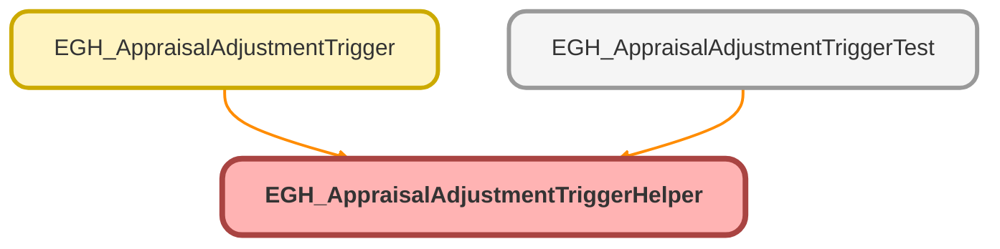

---
hide:
  - path
---

# EGH_AppraisalAdjustmentTriggerHelper Class

## Class Diagram



<!-- Apex description -->

## Apex Code

```java
public class EGH_AppraisalAdjustmentTriggerHelper {
    
    // Helper method to update Appraisal records
    public static void updateAppraisalRecords(Set<Id> appraisalIds, Map<Id, Id> appraisalToEvaluatorMap) {
    
    List<Appraisal> appraisalsToUpdate = new List<Appraisal>();
    
    // Query existing Appraisal records
    for (Appraisal appr : [SELECT Id, Status FROM Appraisal WHERE Id IN :appraisalIds]) {
        
        // Create update record
        Appraisal updateAppr = new Appraisal();
        updateAppr.Id = appr.Id;
        updateAppr.Status = 'Evaluated'; // Change status to Evaluated
        
        // Set Last Evaluator (assuming this field exists)
        // Note: You'll need to add this field to the Appraisal object
        // updateAppr.LastEvaluatorId = appraisalToEvaluatorMap.get(appr.Id);
        
        appraisalsToUpdate.add(updateAppr);
    }
    
    // Perform DML operation
    if (!appraisalsToUpdate.isEmpty()) {
        try {
            update appraisalsToUpdate;
        } catch (DmlException e) {
            System.debug('Error updating Appraisal records: ' + e.getMessage());
            // Handle error appropriately
        }
    }
}}
```

## Methods
### `updateAppraisalRecords(appraisalIds, appraisalToEvaluatorMap)`

#### Signature
```apex
public static void updateAppraisalRecords(Set<Id> appraisalIds, Map<Id,Id> appraisalToEvaluatorMap)
```

#### Parameters
| Name | Type | Description |
|------|------|-------------|
| appraisalIds | Set<Id> |  |
| appraisalToEvaluatorMap | Map<Id,Id> |  |

#### Return Type
**void**