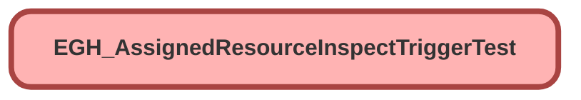

---
hide:
  - path
---

# EGH_AssignedResourceInspectTriggerTest Class

`ISTEST`

## Class Diagram



<!-- Apex description -->

## Apex Code

```java
@isTest
private class EGH_AssignedResourceInspectTriggerTest {

    @testSetup
    static void setup() {
        // Create Assets with the specified brand
        List<Asset> assets = new List<Asset>();
        for(Integer i = 0; i < 2; i++) {
            assets.add(new Asset(
                Name = 'Test Vehicle ' + i,
                EGH_Brand__c = 'Ferrari'
            ));
        }
        insert assets;

        // Create Service Resources for each Asset
        List<ServiceResource> vehicleResources = new List<ServiceResource>();
        for(Asset vehicleAsset : assets) {
            vehicleResources.add(new ServiceResource(
                Name = vehicleAsset.Name + ' Resource',
                ResourceType = 'S',
                AssetId = vehicleAsset.Id,
                IsActive = true
            ));
        }
        insert vehicleResources;

        // Create a test User to act as the technician
        Profile p = [SELECT Id FROM Profile WHERE Name='Standard User' LIMIT 1];
        User testUser = new User(
            Alias = 'testtech', Email='test.technician@example.com',
            EmailEncodingKey='UTF-8', LastName='Technician', LanguageLocaleKey='en_US',
            LocaleSidKey='en_US', ProfileId = p.Id, TimeZoneSidKey='America/Los_Angeles',
            UserName='test.technician.' + System.currentTimeMillis() + '@example.com'
        );
        insert testUser;

        // Create the "Technician" resource and link it to the test User
        insert new ServiceResource(
            Name = 'Test Technician',
            ResourceType = 'T',
            RelatedRecordId = testUser.Id,
            IsActive = true
        );
        
        // Create Operating Hours and Time Slots
        OperatingHours businessHours = new OperatingHours(
            Name = 'Mon-Fri 9am-5pm (Casablanca)',
            TimeZone = 'Africa/Casablanca'
        );
        insert businessHours;
        List<TimeSlot> weeklySlots = new List<TimeSlot>();
        List<String> workDays = new List<String>{'Monday', 'Tuesday', 'Wednesday', 'Thursday', 'Friday'};
        for (String day : workDays) {
            weeklySlots.add(new TimeSlot(
                OperatingHoursId = businessHours.Id, DayOfWeek = day, Type = 'Normal',
                StartTime = Time.newInstance(9, 0, 0, 0), EndTime = Time.newInstance(17, 0, 0, 0)
            ));
        }
        insert weeklySlots;
        
        // Create a Service Territory
        ServiceTerritory territory = new ServiceTerritory(
            Name = 'Test Territory', OperatingHoursId = businessHours.Id, IsActive = true
        );
        insert territory;
        
        // --- FINAL FIX ---
        // 1. Link all created Service Resources to the Service Territory.
        // This makes them valid members and available for assignment within that territory.
        List<ServiceTerritoryMember> members = new List<ServiceTerritoryMember>();
        for(ServiceResource res : [SELECT Id FROM ServiceResource]) {
            members.add(new ServiceTerritoryMember(
                ServiceResourceId = res.Id,
                ServiceTerritoryId = territory.Id,
                EffectiveStartDate = Date.today()
            ));
        }
        insert members;
        // --- END OF FIX ---

        // Create a WorkType
        WorkType workType = new WorkType(
            Name = 'Test Drive', EstimatedDuration = 60, DurationType = 'Minutes'
        );
        insert workType;
        
        // Create a parent Work Order
        WorkOrder wo = new WorkOrder(
            Status = 'New', ServiceTerritoryId = territory.Id, WorkTypeId = workType.Id
        );
        insert wo;
        
        // Create Service Appointments
        List<ServiceAppointment> appointments = new List<ServiceAppointment>();
        for(Integer i = 0; i < 2; i++) {
            appointments.add(new ServiceAppointment(
                ParentRecordId = wo.Id, ServiceTerritoryId = territory.Id,
                SchedStartTime = System.now().addDays(i + 1), SchedEndTime = System.now().addDays(i + 1).addHours(1),
                Status = 'Scheduled', EGH_Quick_Scheduled__c = (i == 0)
            ));
        }
        insert appointments;
    }

    @isTest
    static void testNegative_NoDuplicateInspection() {
        ServiceAppointment appt = [SELECT Id FROM ServiceAppointment LIMIT 1];
        ServiceResource vehicle = [SELECT Id, AssetId FROM ServiceResource WHERE ResourceType = 'S' LIMIT 1];
        
        EGH_Vehicle_Damage_Capture__c existingInspection = new EGH_Vehicle_Damage_Capture__c(
            Name = 'Manual Inspection', EGH_Asset__c = vehicle.AssetId, EGH_Area_of_Damage_Defect__c = 'Test Area'
        );
        insert existingInspection;
        
        appt.EGH_PostTestDriveInspection__c = existingInspection.Id;
        update appt;

        Test.startTest();
        AssignedResource ar = new AssignedResource(
            ServiceAppointmentId = appt.Id,
            ServiceResourceId = vehicle.Id
        );
        insert ar;
        Test.stopTest();
        
        Integer inspectionCount = [SELECT COUNT() FROM EGH_Vehicle_Damage_Capture__c];
        System.assertEquals(1, inspectionCount, 'No new inspection should be created if one already exists.');
    }

    @isTest
    static void testNegative_NoInspectionForTechnician() {
        ServiceAppointment appt = [SELECT Id FROM ServiceAppointment LIMIT 1];
        ServiceResource technician = [SELECT Id FROM ServiceResource WHERE ResourceType = 'T' LIMIT 1];

        Test.startTest();
        AssignedResource ar = new AssignedResource(
            ServiceAppointmentId = appt.Id,
            ServiceResourceId = technician.Id
        );
        insert ar;
        Test.stopTest();
        
        Integer inspectionCount = [SELECT COUNT() FROM EGH_Vehicle_Damage_Capture__c];
        System.assertEquals(0, inspectionCount, 'Inspection should not be created for a Technician.');

        ServiceAppointment updatedAppt = [SELECT EGH_Brand__c FROM ServiceAppointment WHERE Id = :appt.Id];
        System.assertEquals(null, updatedAppt.EGH_Brand__c, 'Brand should not be set for a Technician.');
    }

}
```

## Methods
### `setup()`

`TESTSETUP`

#### Signature
```apex
private static void setup()
```

#### Return Type
**void**

---

### `testNegative_NoDuplicateInspection()`

`ISTEST`

#### Signature
```apex
private static void testNegative_NoDuplicateInspection()
```

#### Return Type
**void**

---

### `testNegative_NoInspectionForTechnician()`

`ISTEST`

#### Signature
```apex
private static void testNegative_NoInspectionForTechnician()
```

#### Return Type
**void**