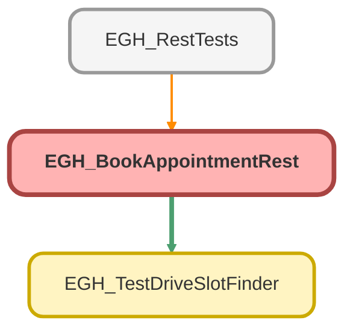

---
hide:
  - path
---

# EGH_BookAppointmentRest Class

`RESTRESOURCE`

## Class Diagram



<!-- Apex description -->

## Apex Code

```java
@RestResource(urlMapping='/testdrive/bookappointments')
global with sharing class EGH_BookAppointmentRest {

    global class BookRequest {
        public Id territoryId;
        public Id vehicleResourceId;
        public Id workTypeId;
        public Datetime startTime;
        public Datetime endTime;
        public Id parentRecordId; // Lead/Account/Opportunity (per existing logic)
    }

    global class BookResponse {
        public Boolean success;
        public String message;
        public String serviceAppointmentId;
    }

    @HttpPost
    global static void doPost() {
        RestRequest req = RestContext.request;
        RestResponse res = RestContext.response;
        res.addHeader('Content-Type', 'application/json');

        BookResponse out = new BookResponse();
        out.success = false;
        out.message = '';
        out.serviceAppointmentId = null;

        try {
            if (req == null || String.isBlank(req.requestBody.toString())) {
                out.message = 'Empty request body';
                writeResponse(res, out, 400);
                return;
            }

            BookRequest body = (BookRequest) JSON.deserialize(req.requestBody.toString(), BookRequest.class);

            // Basic validation
            List<String> missing = new List<String>();
            if (body.territoryId == null) missing.add('territoryId');
            if (body.vehicleResourceId == null) missing.add('vehicleResourceId');
            if (body.workTypeId == null) missing.add('workTypeId');
            if (body.startTime == null) missing.add('startTime');
            if (body.endTime == null) missing.add('endTime');
            if (body.parentRecordId == null) missing.add('parentRecordId');

            if (!missing.isEmpty()) {
                out.message = 'Missing required fields: ' + String.join(missing, ', ');
                writeResponse(res, out, 400);
                return;
            }

            String saId = EGH_TestDriveSlotFinder.bookTestDrive(
                body.territoryId,
                body.vehicleResourceId,
                body.workTypeId,
                body.startTime,
                body.endTime,
                body.parentRecordId
            );

            out.success = true;
            out.serviceAppointmentId = saId;
            out.message = 'Appointment created';
            writeResponse(res, out, 201);

        } catch (Exception e) {
            // Map known functional errors to 400; callout failures to 502; otherwise 500
            String msg = e.getMessage();
            if (e instanceof CalloutException) {
                out.message = msg;
                writeResponse(res, out, 502);
            } else if (msg != null && (msg.contains('No ') || msg.contains('Failed to book'))) {
                out.message = msg;
                writeResponse(res, out, 400);
            } else {
                out.message = 'Failed to book appointment: ' + msg;
                writeResponse(res, out, 500);
            }
        }
    }

    private static void writeResponse(RestResponse res, Object payload, Integer statusCode) {
        res.statusCode = statusCode;
        res.responseBody = Blob.valueOf(JSON.serialize(payload));
    }
}
```

## Methods
### `doPost()`

`HTTPPOST`

#### Signature
```apex
global static void doPost()
```

#### Return Type
**void**

---

### `writeResponse(res, payload, statusCode)`

#### Signature
```apex
private static void writeResponse(RestResponse res, Object payload, Integer statusCode)
```

#### Parameters
| Name | Type | Description |
|------|------|-------------|
| res | RestResponse |  |
| payload | Object |  |
| statusCode | Integer |  |

#### Return Type
**void**

## Classes
### BookRequest Class

#### Fields
##### `territoryId`

###### Signature
```apex
public territoryId
```

###### Type
Id

---

##### `vehicleResourceId`

###### Signature
```apex
public vehicleResourceId
```

###### Type
Id

---

##### `workTypeId`

###### Signature
```apex
public workTypeId
```

###### Type
Id

---

##### `startTime`

###### Signature
```apex
public startTime
```

###### Type
Datetime

---

##### `endTime`

###### Signature
```apex
public endTime
```

###### Type
Datetime

---

##### `parentRecordId`

###### Signature
```apex
public parentRecordId
```

###### Type
Id

### BookResponse Class

#### Fields
##### `success`

###### Signature
```apex
public success
```

###### Type
Boolean

---

##### `message`

###### Signature
```apex
public message
```

###### Type
String

---

##### `serviceAppointmentId`

###### Signature
```apex
public serviceAppointmentId
```

###### Type
String