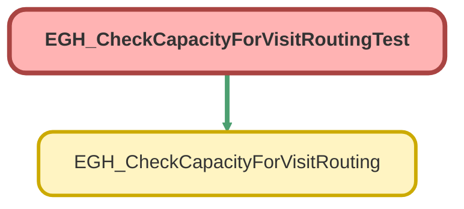

---
hide:
  - path
---

# EGH_CheckCapacityForVisitRoutingTest Class

`ISTEST`

## Class Diagram



<!-- Apex description -->

## Apex Code

```java
@IsTest(SeeAllData=True)
private class EGH_CheckCapacityForVisitRoutingTest {

    @IsTest
    static void testCheckCapacity_HasCapacity() {

        // 1. Create a Test User
        User testUser = new User(
            ProfileId = [SELECT Id FROM Profile WHERE Name = 'EGH Sales Profile' LIMIT 1].Id,
            LastName = 'OmniAgent',
            Email = 'testomni@example.com',
            Username = 'testomni' + DateTime.now().getTime() + '@example.com',
            Alias = 'tomni',
            TimeZoneSidKey = 'America/Los_Angeles',
            EmailEncodingKey = 'UTF-8',
            LanguageLocaleKey = 'en_US',
            LocaleSidKey = 'en_US',
            Division = 'TECI_DXB-ALQZ3-1_Showroom'
        );
        insert testUser;

        // 2. Create Service Resource (Type 'A' for Agent)
        ServiceResource sr = new ServiceResource(
            Name = 'Test Agent Resource',
            RelatedRecordId = UserInfo.getUserId(), //testUser.Id,
            ResourceType = 'A',
            IsActive = true
        );
        insert sr;

        // 3. Create Skills
        
        Skill langSkill = [SELECT Id FROM Skill WHERE MasterLabel = 'English' LIMIT 1]; // Assumes skills exist in Org
        Skill showSkill = [SELECT Id FROM Skill WHERE MasterLabel = 'TECI_DXB-ALQZ3-1_Showroom' LIMIT 1];
        

        // 4. Assign Skills to Resource
        List<ServiceResourceSkill> srSkills = new List<ServiceResourceSkill>();
        srSkills.add(new ServiceResourceSkill(
            ServiceResourceId = sr.Id,
            SkillId = langSkill.Id,
            SkillLevel = 5,
            EffectiveStartDate = System.now().addDays(-1)
        ));
        srSkills.add(new ServiceResourceSkill(
            ServiceResourceId = sr.Id,
            SkillId = showSkill.Id,
            SkillLevel = 5,
            EffectiveStartDate = System.now().addDays(-1)
        ));
        insert srSkills;

        /*

        ServiceChannel sc = [SELECT Id FROM ServiceChannel WHERE DeveloperName = 'Showroom_Visit_Service_Channel' LIMIT 1];

        Agentwork work = new Agentwork();
        work.UserId = UserInfo.getUserId();
        work.Status = 'Opened';
        work.ServiceChannelId = sc.Id;
        insert work;
        */


        // Mocking UserServicePresence is restricted in many Orgs. 
        // We wrap in a try-catch or assume setup allows it.
        // NOTE: In many environments, you must use a 'SeeAllData=true' for Presence 
        // OR rely on existing data because Presence Statuses aren't insertable.
        
        EGH_CheckCapacityForVisitRouting.FlowInput input = new EGH_CheckCapacityForVisitRouting.FlowInput();
        input.languageSkillId = langSkill.Id;
        input.languageSkillLevel = 1.0;
        input.showroomSkillId = showSkill.Id;
        input.showroomSkillLevel = 1.0;

        Test.startTest();
        // This test logic usually fails in Orgs where UserServicePresence 
        // can't be created via DML. We focus on the logic flow.
        List<Boolean> results = EGH_CheckCapacityForVisitRouting.checkCapacityBeforeVisitRoutingToOnlineAgents(
            new List<EGH_CheckCapacityForVisitRouting.FlowInput>{input}
        );
        Test.stopTest();

        // If no UserServicePresence exists in the test context, result will be false.
        // To truly test 'True', an active presence record must be in the DB.
        System.assertNotEquals(null, results);
    }

    @IsTest
    static void testCheckCapacity_EmptyInput() {
        List<Boolean> results = EGH_CheckCapacityForVisitRouting.checkCapacityBeforeVisitRoutingToOnlineAgents(
            new List<EGH_CheckCapacityForVisitRouting.FlowInput>()
        );
        System.assertEquals(0, results.size());
    }
}
```

## Methods
### `testCheckCapacity_HasCapacity()`

`ISTEST`

#### Signature
```apex
private static void testCheckCapacity_HasCapacity()
```

#### Return Type
**void**

---

### `testCheckCapacity_EmptyInput()`

`ISTEST`

#### Signature
```apex
private static void testCheckCapacity_EmptyInput()
```

#### Return Type
**void**