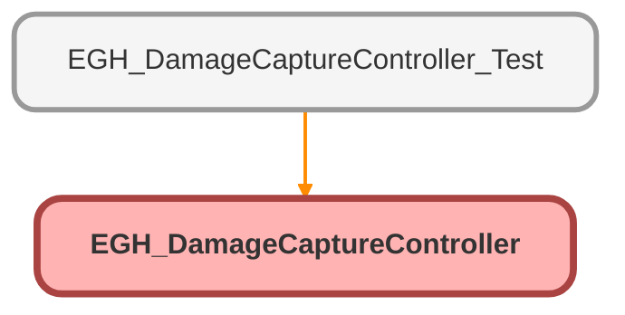

---
hide:
  - path
---

# EGH_DamageCaptureController Class

## Class Diagram



<!-- Apex description -->

## Apex Code

```java
public with sharing class EGH_DamageCaptureController {
    @AuraEnabled
    public static void saveRecord(EGH_Vehicle_Damage_Capture__c record, List<String> fileDataList, List<String> fileNameList) {
        try {
            upsert record;
            
            if (fileDataList != null && !fileDataList.isEmpty()) {
                List<ContentVersion> contentVersions = new List<ContentVersion>();
                for (Integer i = 0; i < fileDataList.size(); i++) {
                    contentVersions.add(new ContentVersion(
                        Title = fileNameList[i],
                        PathOnClient = fileNameList[i],
                        VersionData = EncodingUtil.base64Decode(fileDataList[i]),
                        FirstPublishLocationId = record.Id
                    ));
                }
                insert contentVersions;
            }
        } catch (Exception e) {
            throw new AuraHandledException('Error saving record: ' + e.getMessage());
        }
    }

    @AuraEnabled
    public static Map<String, Object> getRecordWithContext(Id recordId) {
        // Get the VDC record with Asset details
        EGH_Vehicle_Damage_Capture__c vdcRecord = [
            SELECT Id, EGH_Asset__c, EGH_Asset__r.Name, EGH_Asset__r.EGH_Brand__c, 
                   EGH_Area_of_Damage_Defect__c, EGH_Description_of_Damage_Defect__c,
                   EGH_DateTime_Damage_Defect_Identified__c, EGH_Photos_of_Damage_Defect__c,
                   EGH_Additional_Comments__c, EGH_Image_Annotations__c,
                   (SELECT ContentDocumentId FROM ContentDocumentLinks ORDER BY SystemModstamp DESC)
            FROM EGH_Vehicle_Damage_Capture__c 
            WHERE Id = :recordId
        ];
        
        // Find related Service Appointment - Updated to only look for Post-test inspection
        // since EGH_PreTestDriveInspection__c field is being removed
        List<ServiceAppointment> relatedSAs = [
            SELECT Id, AppointmentNumber, SchedStartTime, SchedEndTime, Status
            FROM ServiceAppointment 
            WHERE EGH_PostTestDriveInspection__c = :recordId
            LIMIT 1
        ];
        
        return new Map<String, Object>{
            'vdcRecord' => vdcRecord,
            'serviceAppointment' => relatedSAs.isEmpty() ? null : relatedSAs[0],
            'asset' => vdcRecord.EGH_Asset__r
        };
    }

    @AuraEnabled(cacheable=true)
    public static List<Map<String, String>> getBrandPicklistValues() {
        List<Map<String, String>> options = new List<Map<String, String>>();
        Schema.DescribeFieldResult fieldResult = Asset.EGH_Brand__c.getDescribe();
        for (Schema.PicklistEntry entry : fieldResult.getPicklistValues()) {
            options.add(new Map<String, String>{
                'label' => entry.getLabel(),
                'value' => entry.getValue()
            });
        }
        return options;
    }

    @AuraEnabled
    public static void updateAssetBrand(Id assetId, String newBrand) {
        Asset assetToUpdate = new Asset(Id = assetId, EGH_Brand__c = newBrand);
        update assetToUpdate;
    }

    @AuraEnabled
    public static EGH_Vehicle_Damage_Capture__c getRecord(Id recordId) {
        return [SELECT Id, EGH_Asset__c, EGH_Asset__r.EGH_Brand__c, 
                EGH_Area_of_Damage_Defect__c, EGH_Description_of_Damage_Defect__c,
                EGH_DateTime_Damage_Defect_Identified__c, EGH_Photos_of_Damage_Defect__c,
                EGH_Additional_Comments__c, EGH_Image_Annotations__c,
                (SELECT ContentDocumentId FROM ContentDocumentLinks ORDER BY SystemModstamp DESC)
                FROM EGH_Vehicle_Damage_Capture__c 
                WHERE Id = :recordId];
    }

    @AuraEnabled(cacheable=true)
    public static String getImageData(Id contentDocumentId) {
        try {
            ContentVersion cv = [SELECT VersionData 
                               FROM ContentVersion 
                               WHERE ContentDocumentId = :contentDocumentId 
                               ORDER BY CreatedDate DESC 
                               LIMIT 1];
            return EncodingUtil.base64Encode(cv.VersionData);
        } catch (Exception e) {
            throw new AuraHandledException('Image load error: ' + e.getMessage());
        }
    }
}
```

## Methods
### `saveRecord(record, fileDataList, fileNameList)`

`AURAENABLED`

#### Signature
```apex
public static void saveRecord(EGH_Vehicle_Damage_Capture__c record, List<String> fileDataList, List<String> fileNameList)
```

#### Parameters
| Name | Type | Description |
|------|------|-------------|
| record | [EGH_Vehicle_Damage_Capture__c](../objects/EGH_Vehicle_Damage_Capture__c.md) |  |
| fileDataList | List<String> |  |
| fileNameList | List<String> |  |

#### Return Type
**void**

---

### `getRecordWithContext(recordId)`

`AURAENABLED`

#### Signature
```apex
public static Map<String,Object> getRecordWithContext(Id recordId)
```

#### Parameters
| Name | Type | Description |
|------|------|-------------|
| recordId | Id |  |

#### Return Type
**Map<String,Object>**

---

### `getBrandPicklistValues()`

`AURAENABLED`

#### Signature
```apex
public static List<Map<String,String>> getBrandPicklistValues()
```

#### Return Type
**List<Map<String,String>>**

---

### `updateAssetBrand(assetId, newBrand)`

`AURAENABLED`

#### Signature
```apex
public static void updateAssetBrand(Id assetId, String newBrand)
```

#### Parameters
| Name | Type | Description |
|------|------|-------------|
| assetId | Id |  |
| newBrand | String |  |

#### Return Type
**void**

---

### `getRecord(recordId)`

`AURAENABLED`

#### Signature
```apex
public static EGH_Vehicle_Damage_Capture__c getRecord(Id recordId)
```

#### Parameters
| Name | Type | Description |
|------|------|-------------|
| recordId | Id |  |

#### Return Type
**[EGH_Vehicle_Damage_Capture__c](../objects/EGH_Vehicle_Damage_Capture__c.md)**

---

### `getImageData(contentDocumentId)`

`AURAENABLED`

#### Signature
```apex
public static String getImageData(Id contentDocumentId)
```

#### Parameters
| Name | Type | Description |
|------|------|-------------|
| contentDocumentId | Id |  |

#### Return Type
**String**