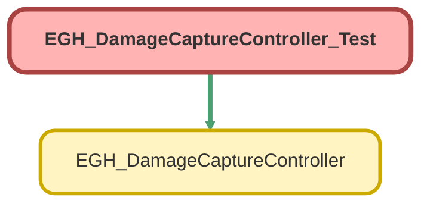

---
hide:
  - path
---

# EGH_DamageCaptureController_Test Class

`ISTEST`

## Class Diagram



<!-- Apex description -->

## Apex Code

```java
@isTest
private class EGH_DamageCaptureController_Test {

    @TestSetup
    static void setupTestData() {
        // Create test data
        Asset testAsset = new Asset(
            Name = 'Test Asset',
            EGH_Brand__c = 'Ferrari'
        );
        insert testAsset;

        EGH_Vehicle_Damage_Capture__c testRecord = new EGH_Vehicle_Damage_Capture__c(
            EGH_Asset__c = testAsset.Id,
            EGH_Area_of_Damage_Defect__c = 'Area1',
            EGH_Description_of_Damage_Defect__c = 'Description1',
            EGH_DateTime_Damage_Defect_Identified__c = System.now(),
            EGH_Additional_Comments__c = 'Comments1'
        );
        insert testRecord;
    }

    @isTest
    static void testSaveRecord() {
        // Retrieve test data
        EGH_Vehicle_Damage_Capture__c testRecord = [SELECT Id FROM EGH_Vehicle_Damage_Capture__c LIMIT 1];

        // Prepare test data for file upload
        List<String> fileDataList = new List<String>{ EncodingUtil.base64Encode(Blob.valueOf('Test Data')) };
        List<String> fileNameList = new List<String>{ 'TestFile.txt' };

        Test.startTest();
        EGH_DamageCaptureController.saveRecord(testRecord, fileDataList, fileNameList);
        Test.stopTest();

        // Verify the record and content versions
        EGH_Vehicle_Damage_Capture__c updatedRecord = [SELECT Id FROM EGH_Vehicle_Damage_Capture__c WHERE Id = :testRecord.Id];
        System.assertEquals(1, [SELECT COUNT() FROM ContentVersion WHERE FirstPublishLocationId = :testRecord.Id], 'ContentVersion should be inserted.');
    }

    @isTest
    static void testSaveRecordWithoutFiles() {
        // Retrieve test data
        EGH_Vehicle_Damage_Capture__c testRecord = [SELECT Id FROM EGH_Vehicle_Damage_Capture__c LIMIT 1];

        Test.startTest();
        EGH_DamageCaptureController.saveRecord(testRecord, null, null);
        Test.stopTest();

        // Verify the record
        EGH_Vehicle_Damage_Capture__c updatedRecord = [SELECT Id FROM EGH_Vehicle_Damage_Capture__c WHERE Id = :testRecord.Id];
        System.assertEquals(0, [SELECT COUNT() FROM ContentVersion WHERE FirstPublishLocationId = :testRecord.Id], 'No ContentVersion should be inserted.');
    }

    @isTest
    static void testGetBrandPicklistValues() {
        Test.startTest();
        List<Map<String, String>> options = EGH_DamageCaptureController.getBrandPicklistValues();
        Test.stopTest();

        System.assert(!options.isEmpty(), 'Options should not be empty.');
    }

    @isTest
    static void testUpdateAssetBrand() {
        // Retrieve test data
        Asset testAsset = [SELECT Id FROM Asset LIMIT 1];

        Test.startTest();
        EGH_DamageCaptureController.updateAssetBrand(testAsset.Id, 'Ferrari');
        Test.stopTest();

        // Verify the asset brand update
        Asset updatedAsset = [SELECT EGH_Brand__c FROM Asset WHERE Id = :testAsset.Id];
        System.assertEquals('Ferrari', updatedAsset.EGH_Brand__c, 'Asset brand should be updated.');
    }

    @isTest
    static void testGetRecord() {
        // Retrieve test data
        EGH_Vehicle_Damage_Capture__c testRecord = [SELECT Id FROM EGH_Vehicle_Damage_Capture__c LIMIT 1];

        Test.startTest();
        EGH_Vehicle_Damage_Capture__c retrievedRecord = EGH_DamageCaptureController.getRecord(testRecord.Id);
        Test.stopTest();

        System.assertEquals(testRecord.Id, retrievedRecord.Id, 'Retrieved record ID should match.');
        System.assertEquals('Area1', retrievedRecord.EGH_Area_of_Damage_Defect__c, 'Retrieved record area should match.');
        System.assertEquals('Description1', retrievedRecord.EGH_Description_of_Damage_Defect__c, 'Retrieved record description should match.');
    }

    @isTest
static void testGetRecordWithContext() {
    // Retrieve test data
    EGH_Vehicle_Damage_Capture__c testRecord = [SELECT Id FROM EGH_Vehicle_Damage_Capture__c LIMIT 1];

    Test.startTest();
    Map<String, Object> contextResult = EGH_DamageCaptureController.getRecordWithContext(testRecord.Id);
    Test.stopTest();

    // Basic assertions
    System.assertNotEquals(null, contextResult, 'Context result should not be null.');
    System.assertNotEquals(null, contextResult.get('vdcRecord'), 'VDC record should not be null.');
    System.assertNotEquals(null, contextResult.get('asset'), 'Asset should not be null.');
}

    @isTest
    static void testGetImageData() {
        // Retrieve test data
        EGH_Vehicle_Damage_Capture__c testRecord = [SELECT Id FROM EGH_Vehicle_Damage_Capture__c LIMIT 1];

        // Prepare test data for file upload
        List<String> fileDataList = new List<String>{ EncodingUtil.base64Encode(Blob.valueOf('Test Data')) };
        List<String> fileNameList = new List<String>{ 'TestFile.txt' };

        // Insert ContentVersion for testing
        ContentVersion cv = new ContentVersion(
            Title = 'TestFile',
            PathOnClient = 'TestFile.txt',
            VersionData = EncodingUtil.base64Decode(fileDataList[0]),
            FirstPublishLocationId = testRecord.Id
        );
        insert cv;

        // Retrieve ContentDocumentId
        ContentDocumentLink cdl = [SELECT ContentDocumentId FROM ContentDocumentLink WHERE LinkedEntityId = :testRecord.Id LIMIT 1];

        Test.startTest();
        String imageData = EGH_DamageCaptureController.getImageData(cdl.ContentDocumentId);
        Test.stopTest();

        System.assertEquals(EncodingUtil.base64Encode(Blob.valueOf('Test Data')), imageData, 'Image data should match.');
    }
}
```

## Methods
### `setupTestData()`

`TESTSETUP`

#### Signature
```apex
private static void setupTestData()
```

#### Return Type
**void**

---

### `testSaveRecord()`

`ISTEST`

#### Signature
```apex
private static void testSaveRecord()
```

#### Return Type
**void**

---

### `testSaveRecordWithoutFiles()`

`ISTEST`

#### Signature
```apex
private static void testSaveRecordWithoutFiles()
```

#### Return Type
**void**

---

### `testGetBrandPicklistValues()`

`ISTEST`

#### Signature
```apex
private static void testGetBrandPicklistValues()
```

#### Return Type
**void**

---

### `testUpdateAssetBrand()`

`ISTEST`

#### Signature
```apex
private static void testUpdateAssetBrand()
```

#### Return Type
**void**

---

### `testGetRecord()`

`ISTEST`

#### Signature
```apex
private static void testGetRecord()
```

#### Return Type
**void**

---

### `testGetRecordWithContext()`

`ISTEST`

#### Signature
```apex
private static void testGetRecordWithContext()
```

#### Return Type
**void**

---

### `testGetImageData()`

`ISTEST`

#### Signature
```apex
private static void testGetImageData()
```

#### Return Type
**void**