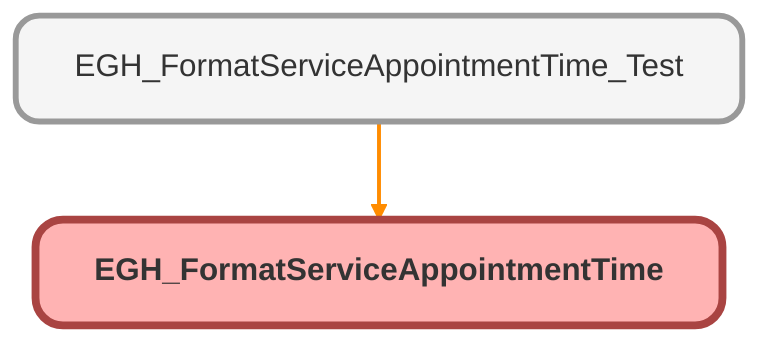

---
hide:
  - path
---

# EGH_FormatServiceAppointmentTime Class

## Class Diagram



<!-- Apex description -->

## Apex Code

```java
public class EGH_FormatServiceAppointmentTime {

    public class Input {
        @InvocableVariable(required=true)
        public Datetime startTime;

        @InvocableVariable(required=true)
        public Datetime endTime;

        @InvocableVariable(required=true)
        public String userTimeZone;
    }

    public class Output {
        @InvocableVariable
        public String formattedDate;

        @InvocableVariable
        public String formattedStartTime;

        @InvocableVariable
        public String formattedEndTime;
    }

    @InvocableMethod(label='Format Date & Time in User Time Zone')
    public static List<Output> format(List<Input> inputs) {
        List<Output> results = new List<Output>();

        for (Input i : inputs) {
            Output o = new Output();
            o.formattedDate      = i.startTime.format('EEEE, MMMM d, yyyy', i.userTimeZone);
            o.formattedStartTime = i.startTime.format('h:mm a', i.userTimeZone);
            o.formattedEndTime   = i.endTime.format('h:mm a', i.userTimeZone);
            results.add(o);
        }
        return results;
    }
}
```

## Methods
### `format(inputs)`

`INVOCABLEMETHOD`

#### Signature
```apex
public static List<Output> format(List<Input> inputs)
```

#### Parameters
| Name | Type | Description |
|------|------|-------------|
| inputs | List<Input> |  |

#### Return Type
**List<Output>**

## Classes
### Input Class

#### Fields
##### `startTime`

`INVOCABLEVARIABLE`

###### Signature
```apex
public startTime
```

###### Type
Datetime

---

##### `endTime`

`INVOCABLEVARIABLE`

###### Signature
```apex
public endTime
```

###### Type
Datetime

---

##### `userTimeZone`

`INVOCABLEVARIABLE`

###### Signature
```apex
public userTimeZone
```

###### Type
String

### Output Class

#### Fields
##### `formattedDate`

`INVOCABLEVARIABLE`

###### Signature
```apex
public formattedDate
```

###### Type
String

---

##### `formattedStartTime`

`INVOCABLEVARIABLE`

###### Signature
```apex
public formattedStartTime
```

###### Type
String

---

##### `formattedEndTime`

`INVOCABLEVARIABLE`

###### Signature
```apex
public formattedEndTime
```

###### Type
String