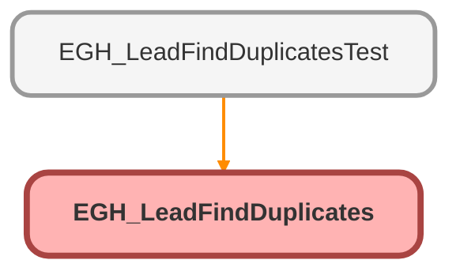

---
hide:
  - path
---

# EGH_LeadFindDuplicates Class

## Class Diagram



<!-- Apex description -->

## Apex Code

```java
public without sharing class EGH_LeadFindDuplicates {

	@TestVisible private static Boolean forceError = false;
    
    @InvocableMethod
    public static List<OutputWrapper> findDuplicateLeads(List<InputWrapper> inputs) {

        List<OutputWrapper> outputs = new List<OutputWrapper>();

        if(inputs.isEmpty()) {
            return outputs;
        }
        
		if (Test.isRunningTest() && forceError) {
            OutputWrapper errOutput = new OutputWrapper();
            errOutput.duplicateErrorFound = true;
            errOutput.matchErrorFound = true;
            errOutput.matchErrorList = new List<String>{'Simulated Matching System Error'};
            errOutput.findDuplicatesErrorList = new List<String>{'Simulated Duplicate System Error'};
            errOutput.duplicateErrorFound = true;
            errOutput.leadMatchRecordSize = 0;
            errOutput.contactMatchRecordSize = 0;
            outputs.add(errOutput);
            return outputs;
        }

        List<Lead> leadsToCheck = new List<Lead>();

        for(InputWrapper input : inputs) {
            Lead newLead = new Lead();
            newLead.FirstName = input.firstName;
            newLead.LastName = input.LastName;
            newLead.Email = input.email;
            newLead.MobilePhone = input.mobilePhone;
            newLead.EGH_BrandListPicklist__c = input.brand;
            leadsToCheck.add(newLead);
        }

        List<Datacloud.FindDuplicatesResult> results = Datacloud.FindDuplicates.findDuplicates(leadsToCheck);

        for(Datacloud.FindDuplicatesResult result : results) {

            OutputWrapper output = new OutputWrapper();

            if(result.isSuccess()) {
                
                for(Datacloud.DuplicateResult dupResult : result.getDuplicateResults()) {
                    for(Datacloud.MatchResult matchResult : dupResult.getMatchResults()) {

                        if(matchResult.isSuccess()) {

                            if(!matchResult.getMatchRecords().isEmpty()) {

                                List<Lead> leadMatchRecordList = new List<Lead>();
                                List<Contact> contactMatchRecordList = new List<Contact>();
                                for(Datacloud.MatchRecord matchRecord : matchResult.getMatchRecords()) {
                                    SObject record = matchRecord.getRecord();
                                    if(record.getSObjectType() == Lead.SObjectType) {
                                        leadMatchRecordList.add((Lead)record);
                                    }
                                    else if(record.getSObjectType() == Contact.SObjectType) {
                                        contactMatchRecordList.add((Contact)record);
                                    }
                                }
                                
                                //output
                                output.duplicatesFound = true;
                                output.leadMatchRecordList = leadMatchRecordList;
                                output.contactMatchRecordList = contactMatchRecordList;
                                output.matchingRuleDeveloperName = matchResult.getRule();
                                output.leadMatchRecordSize = leadMatchRecordList.size();
                                output.contactMatchRecordSize = contactMatchRecordList.size();
                            }
                            else {
                                //output
                                output.duplicatesFound = false;
                                output.matchingRuleDeveloperName = matchResult.getRule();
                                output.leadMatchRecordSize = 0;
                                output.contactMatchRecordSize = 0;
                            }
                        } 
                        else {
                            List<String> matchErrorList = new List<String>();
                            List<Database.Error> errs = matchResult.getErrors();
                            for (Database.Error err : errs) {
                                System.debug(err.getMessage());
                                matchErrorList.add(err.getMessage());
                            }

                            //output
                            output.matchErrorFound = true;
                            output.matchErrorList = matchErrorList;
                            output.leadMatchRecordSize = 0;
                            output.contactMatchRecordSize = 0;
                        }
                    }
                }

            }
            else {
                List<String> duplicateErrorList = new List<String>();
                List<Database.Error> errs = result.getErrors();
                for (Database.Error err : errs) {
                    System.debug(err.getMessage());
                    duplicateErrorList.add(err.getMessage());
                }

                //output
                output.duplicateErrorFound = true;
                output.findDuplicatesErrorList = duplicateErrorList;
                output.leadMatchRecordSize = 0;
                output.contactMatchRecordSize = 0;
            }

            outputs.add(output);
        }

        return outputs;
    }

    public class InputWrapper {
        @InvocableVariable(required=true)
        public String firstName;

        @InvocableVariable(required=true)
        public String lastName;

        @InvocableVariable
        public String email;

        @InvocableVariable(required=true)
        public String mobilePhone;

        @InvocableVariable(required=true)
        public String brand;
    }

    public class OutputWrapper {

        @InvocableVariable
        public List<Lead> leadMatchRecordList = new List<Lead>();

        @InvocableVariable
        public List<Contact> contactMatchRecordList = new List<Contact>();

        @InvocableVariable
        public Integer leadMatchRecordSize;

        @InvocableVariable
        public Integer contactMatchRecordSize;

        @InvocableVariable
        public Boolean duplicatesFound;

        @InvocableVariable
        public Boolean matchErrorFound;

        @InvocableVariable
        public Boolean duplicateErrorFound;

        @InvocableVariable
        public String matchingRuleDeveloperName;

        @InvocableVariable
        public List<String> findDuplicatesErrorList = new List<String>();

        @InvocableVariable
        public List<String> matchErrorList = new List<String>();
    }
}
```

## Fields
### `forceError`

`TESTVISIBLE`

#### Signature
```apex
private static forceError
```

#### Type
Boolean

## Methods
### `findDuplicateLeads(inputs)`

`INVOCABLEMETHOD`

#### Signature
```apex
public static List<OutputWrapper> findDuplicateLeads(List<InputWrapper> inputs)
```

#### Parameters
| Name | Type | Description |
|------|------|-------------|
| inputs | List<InputWrapper> |  |

#### Return Type
**List<OutputWrapper>**

## Classes
### InputWrapper Class

#### Fields
##### `firstName`

`INVOCABLEVARIABLE`

###### Signature
```apex
public firstName
```

###### Type
String

---

##### `lastName`

`INVOCABLEVARIABLE`

###### Signature
```apex
public lastName
```

###### Type
String

---

##### `email`

`INVOCABLEVARIABLE`

###### Signature
```apex
public email
```

###### Type
String

---

##### `mobilePhone`

`INVOCABLEVARIABLE`

###### Signature
```apex
public mobilePhone
```

###### Type
String

---

##### `brand`

`INVOCABLEVARIABLE`

###### Signature
```apex
public brand
```

###### Type
String

### OutputWrapper Class

#### Fields
##### `leadMatchRecordList`

`INVOCABLEVARIABLE`

###### Signature
```apex
public leadMatchRecordList
```

###### Type
List<Lead>

---

##### `contactMatchRecordList`

`INVOCABLEVARIABLE`

###### Signature
```apex
public contactMatchRecordList
```

###### Type
List<Contact>

---

##### `leadMatchRecordSize`

`INVOCABLEVARIABLE`

###### Signature
```apex
public leadMatchRecordSize
```

###### Type
Integer

---

##### `contactMatchRecordSize`

`INVOCABLEVARIABLE`

###### Signature
```apex
public contactMatchRecordSize
```

###### Type
Integer

---

##### `duplicatesFound`

`INVOCABLEVARIABLE`

###### Signature
```apex
public duplicatesFound
```

###### Type
Boolean

---

##### `matchErrorFound`

`INVOCABLEVARIABLE`

###### Signature
```apex
public matchErrorFound
```

###### Type
Boolean

---

##### `duplicateErrorFound`

`INVOCABLEVARIABLE`

###### Signature
```apex
public duplicateErrorFound
```

###### Type
Boolean

---

##### `matchingRuleDeveloperName`

`INVOCABLEVARIABLE`

###### Signature
```apex
public matchingRuleDeveloperName
```

###### Type
String

---

##### `findDuplicatesErrorList`

`INVOCABLEVARIABLE`

###### Signature
```apex
public findDuplicatesErrorList
```

###### Type
List<String>

---

##### `matchErrorList`

`INVOCABLEVARIABLE`

###### Signature
```apex
public matchErrorList
```

###### Type
List<String>