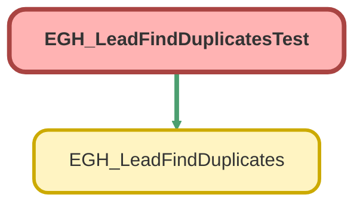

---
hide:
  - path
---

# EGH_LeadFindDuplicatesTest Class

`ISTEST`

## Class Diagram



<!-- Apex description -->

## Apex Code

```java
@isTest
private class EGH_LeadFindDuplicatesTest {

    @testSetup
    static void setupData() {
		
		BranchUnit branch = new BranchUnit();
        branch.Name = 'Jetour - Alquoz 1';
		branch.BranchCode = '1104';
        branch.Type = 'Virtual';
        branch.EGH_LocationTypePicklist__c = 'Company';
        branch.IsActive = true;
        insert branch;
        
        Lead existingLead = new Lead(
            FirstName = 'Jane',
            LastName = 'Smith',
            Company = 'Test Company',
            Email = 'jane.smith@test.com',
            Phone = '+971520606020',
            MobilePhone = '+971520606020',
            IsConverted = false,
            EGH_LeadBranchUnitLookup__c = branch.Id,
			EGH_BranchCode__c = '1104',
            EGH_BrandListPicklist__c = 'Jetour'
        );
        insert existingLead;
    }

    @isTest
    static void testFindDuplicateLeads_WithDuplicates() {
        Id branchId = [SELECT Id FROM BranchUnit LIMIT 1]?.Id;
        EGH_LeadFindDuplicates.InputWrapper input = new EGH_LeadFindDuplicates.InputWrapper();
        input.firstName = 'Jane';
        input.lastName = 'Smith';
        input.email = 'jane.smith@test.com';
        input.mobilePhone = '+971520606020';
        input.brand = 'Jetour';

        List<EGH_LeadFindDuplicates.InputWrapper> inputs = new List<EGH_LeadFindDuplicates.InputWrapper>{input};

        Test.startTest();
        List<EGH_LeadFindDuplicates.OutputWrapper> outputs = EGH_LeadFindDuplicates.findDuplicateLeads(inputs);
        Test.stopTest();

        // Assertions
        System.assertEquals(1, outputs.size(), 'Should return one output wrapper per input');
        
        if(outputs[0].duplicatesFound == true) {
            System.assert(outputs[0].leadMatchRecordSize > 0, 'Should have found at least one lead match');
            System.assertNotEquals(null, outputs[0].leadMatchRecordList, 'Match list should not be null');
        }
    }

    @isTest
    static void testFindDuplicateLeads_NoDuplicates() {
        Id branchId = [SELECT Id FROM BranchUnit LIMIT 1]?.Id;
        EGH_LeadFindDuplicates.InputWrapper input = new EGH_LeadFindDuplicates.InputWrapper();
        input.firstName = 'Jane';
        input.lastName = 'notduplicate';
        input.email = 'jane@test.com';
        input.mobilePhone = '+971123456789';
        input.brand = 'Jetour';

        List<EGH_LeadFindDuplicates.InputWrapper> inputs = new List<EGH_LeadFindDuplicates.InputWrapper>{input};

        Test.startTest();
        List<EGH_LeadFindDuplicates.OutputWrapper> outputs = EGH_LeadFindDuplicates.findDuplicateLeads(inputs);
        Test.stopTest();

        System.assertEquals(1, outputs.size());
        System.assertEquals(false, outputs[0].duplicatesFound, 'Should not find duplicates for unique info');
        System.assertEquals(0, outputs[0].leadMatchRecordSize);
    }


    @isTest
    static void testFindDuplicateLeads_ManualErrorInjection() {
        EGH_LeadFindDuplicates.InputWrapper input = new EGH_LeadFindDuplicates.InputWrapper();
        input.firstName = 'Jane';
        input.lastName = 'notduplicate';
        input.email = 'jane@test.com';
        input.mobilePhone = '+971123456789';
    
        EGH_LeadFindDuplicates.forceError = true;
    
        Test.startTest();
        List<EGH_LeadFindDuplicates.OutputWrapper> outputs = 
            EGH_LeadFindDuplicates.findDuplicateLeads(new List<EGH_LeadFindDuplicates.InputWrapper>{input});
        Test.stopTest();
    
        System.assertEquals(1, outputs.size());
        System.assertEquals(true, outputs[0].duplicateErrorFound, 'The error flag should be true');
    }
    
@isTest
    static void testFindDuplicateLeads_EmptyInput() {
        Test.startTest();
        List<EGH_LeadFindDuplicates.OutputWrapper> outputs = EGH_LeadFindDuplicates.findDuplicateLeads(new List<EGH_LeadFindDuplicates.InputWrapper>());
        Test.stopTest();

        System.assertEquals(0, outputs.size(), 'Empty input should return empty output');
    }
    
}
```

## Methods
### `setupData()`

`TESTSETUP`

#### Signature
```apex
private static void setupData()
```

#### Return Type
**void**

---

### `testFindDuplicateLeads_WithDuplicates()`

`ISTEST`

#### Signature
```apex
private static void testFindDuplicateLeads_WithDuplicates()
```

#### Return Type
**void**

---

### `testFindDuplicateLeads_NoDuplicates()`

`ISTEST`

#### Signature
```apex
private static void testFindDuplicateLeads_NoDuplicates()
```

#### Return Type
**void**

---

### `testFindDuplicateLeads_ManualErrorInjection()`

`ISTEST`

#### Signature
```apex
private static void testFindDuplicateLeads_ManualErrorInjection()
```

#### Return Type
**void**

---

### `testFindDuplicateLeads_EmptyInput()`

`ISTEST`

#### Signature
```apex
private static void testFindDuplicateLeads_EmptyInput()
```

#### Return Type
**void**