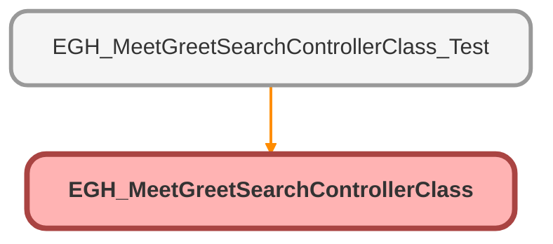

---
hide:
  - path
---

# EGH_MeetGreetSearchControllerClass Class

## Class Diagram



<!-- Apex description -->

## Apex Code

```java
public without sharing class EGH_MeetGreetSearchControllerClass {
    /* Revised Version */
    @InvocableMethod
    public static list<responseClass> queryControllerMethod(list<requestClass> InputRequestList) {
        requestClass InputRequest = InputRequestList[0];
        
        // Ensure the search string is safe (optional but good practice)
        String searchQuery = InputRequest.searchString;
        if(String.isBlank(searchQuery)) {
            return new list<responseClass>{new responseClass()};
        }

        // Added 'EGH_LeadBranchUnitLookup__r.Name' to the Lead RETURNING statement
        // 'IN ALL FIELDS' natively supports searching by Name, Phone, Email, and Sidebar
        List<List<SObject>> searchList = [
            FIND :searchQuery 
            IN ALL FIELDS 
            RETURNING 
            Account (
                Id
                ,Name
                ,Firstname
                ,Lastname
                ,PersonEmail
                ,PersonMobilePhone
                ,Phone
                ,EGH_ContactLanguagePicklist__pc
                ,EGH_ContactNationalityPicklist__pc
                WHERE Id IN (
                    SELECT AccountId FROM Opportunity 
                    WHERE IsClosed = false 
                    AND StageName NOT IN ('Closed Lost','Closed Won') 
                    AND EGH_Brand__c = :InputRequest.brand
                )
            ),
            Lead (
                Id
                ,Name
                ,Firstname
                ,Lastname
                ,Email
                ,Phone
                ,MobilePhone
                ,Status
                ,LeadSource
                ,EGH_BrandListPicklist__c
                ,CreatedDate
                ,EGH_LeadLanguagePicklist__c
                ,EGH_LeadNationalityPicklist__c
                ,EGH_LeadBranchUnitLookup__c
                ,EGH_LeadBranchUnitLookup__r.Name
                ,EGH_Model_of_Interest__c 
                ,EGH_Lead_Owner__c 
                WHERE IsConverted = false
                AND EGH_BrandListPicklist__c = :InputRequest.brand
            )
        ];
    
        list<EGH_MeetGreetSearchControllerClass.responseClass> responseList = new list<EGH_MeetGreetSearchControllerClass.responseClass>();
        EGH_MeetGreetSearchControllerClass.responseClass res = new EGH_MeetGreetSearchControllerClass.responseClass();
        
        if(searchList.isEmpty()) {
        	responseList.add(res);
        	return responseList;
        }
        
        res.accountSize = searchList[0].size();
        res.leadSize = searchList[1].size();
        
        // Handle Accounts
        if (res.accountSize == 1) {
            res.accountSingle = (Account)searchList[0][0];
        } else if (res.accountSize > 1) {
            res.accountList = searchList[0]; 
        }
        
        // Handle Leads
        if (res.leadSize == 1) {
            res.leadSingle = (Lead)searchList[1][0];
        } else if (res.leadSize > 1) {
            res.leadList = searchList[1]; 
        }
       
        responseList.add(res);
        return responseList;
    }
    
    public class requestClass {
        @InvocableVariable
        public String searchString;

        @InvocableVariable
        public String userDivision;
        
        @InvocableVariable
        public String brand;
    }

    public class responseClass {
        @InvocableVariable
        public List<Account> accountList = new list<Account>();
        
        @InvocableVariable
        public Account accountSingle = new Account();
        
        @InvocableVariable
        public Lead leadSingle = new Lead();
        
        @InvocableVariable
        public List<Lead> leadList = new list<Lead>();
        
        @InvocableVariable
        public Integer accountSize = 0;
        
        @InvocableVariable
        public Integer leadSize = 0;
    }
}
```

## Methods
### `queryControllerMethod(InputRequestList)`

`INVOCABLEMETHOD`

#### Signature
```apex
public static list<responseClass> queryControllerMethod(list<requestClass> InputRequestList)
```

#### Parameters
| Name | Type | Description |
|------|------|-------------|
| InputRequestList | list<requestClass> |  |

#### Return Type
**list<responseClass>**

## Classes
### requestClass Class

#### Fields
##### `searchString`

`INVOCABLEVARIABLE`

###### Signature
```apex
public searchString
```

###### Type
String

---

##### `userDivision`

`INVOCABLEVARIABLE`

###### Signature
```apex
public userDivision
```

###### Type
String

---

##### `brand`

`INVOCABLEVARIABLE`

###### Signature
```apex
public brand
```

###### Type
String

### responseClass Class

#### Fields
##### `accountList`

`INVOCABLEVARIABLE`

###### Signature
```apex
public accountList
```

###### Type
List<Account>

---

##### `accountSingle`

`INVOCABLEVARIABLE`

###### Signature
```apex
public accountSingle
```

###### Type
[Account](../objects/Account.md)

---

##### `leadSingle`

`INVOCABLEVARIABLE`

###### Signature
```apex
public leadSingle
```

###### Type
[Lead](../objects/Lead.md)

---

##### `leadList`

`INVOCABLEVARIABLE`

###### Signature
```apex
public leadList
```

###### Type
List<Lead>

---

##### `accountSize`

`INVOCABLEVARIABLE`

###### Signature
```apex
public accountSize
```

###### Type
Integer

---

##### `leadSize`

`INVOCABLEVARIABLE`

###### Signature
```apex
public leadSize
```

###### Type
Integer