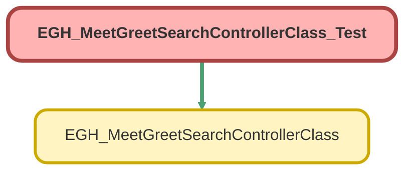

---
hide:
  - path
---

# EGH_MeetGreetSearchControllerClass_Test Class

`ISTEST`

## Class Diagram



<!-- Apex description -->

## Apex Code

```java
@IsTest
public class EGH_MeetGreetSearchControllerClass_Test {

    @TestSetup
    static void setupTestData() {

		//Create Branch Units
		BranchUnit parentBranch = new BranchUnit();
        parentBranch.Name = 'The Elite Cars International TECI';
		parentBranch.BranchCode = 'AE11';
        parentBranch.Type = 'Virtual';
        parentBranch.EGH_LocationTypePicklist__c = 'Company';
        parentBranch.IsActive = true;
        insert parentBranch;
        
		BranchUnit branch = new BranchUnit();
        branch.Name = 'Jetour - Alquoz 1';
		branch.BranchCode = '1104';
        branch.Type = 'Virtual';
        branch.EGH_LocationTypePicklist__c = 'Company';
        branch.IsActive = true;
        branch.ParentBranchUnitId = parentBranch.Id;
        insert branch;

        
        // Create test Person Account with valid phone number (10-12 digits)
        Account testAccount = new Account(
            FirstName = 'John',
            LastName = 'Doe',
            PersonEmail = 'john.doe@test.com',
            Phone = '+971520606020', // Valid: 11 digits with + prefix
            RecordTypeId = [SELECT Id FROM RecordType WHERE SObjectType = 'Account' AND IsPersonType = true LIMIT 1].Id
        );
        insert testAccount;
        
        //Create Opportunity Related to Account
		Opportunity testOpp = new Opportunity(
            Name = 'Opp1',
            CloseDate = System.today().addMonths(1),
            StageName = 'Qualification',
            AccountId = testAccount.Id,
            EGH_How_soon__c = 'Immediate',
            EGH_Source_of_Business__c = 'Email',
            EGH_Brand__c = 'Jetour'
        );
        insert testOpp;
        
        // Create test Lead with valid phone numbers (10-12 digits)
        Lead testLead = new Lead(
            FirstName = 'Jane',
            LastName = 'Smith',
            Company = 'Test Company',
            Email = 'jane.smith@test.com',
            Phone = '+971520606020', // Valid: 10 digits
            MobilePhone = '+971520606020', // Valid: 11 digits with + prefix
            IsConverted = false,
            EGH_LeadBranchUnitLookup__c = branch.Id,
            EGH_BrandListPicklist__c = 'Jetour'
        );
        insert testLead;
    }

    @IsTest
    static void testQueryControllerMethod_NoResults() {
        // Setup: Search for a string that won't match anything
        EGH_MeetGreetSearchControllerClass.requestClass req = new EGH_MeetGreetSearchControllerClass.requestClass();
        req.searchString = 'NonExistentSearchString12345';
		req.userDivision = 'Jetour - Alquoz 1';

        List<EGH_MeetGreetSearchControllerClass.requestClass> requestList = new List<EGH_MeetGreetSearchControllerClass.requestClass>();
        requestList.add(req);

        Test.startTest();
        List<EGH_MeetGreetSearchControllerClass.responseClass> responseList = EGH_MeetGreetSearchControllerClass.queryControllerMethod(requestList);
        Test.stopTest();

        // Verify response structure
        System.assertEquals(1, responseList.size(), 'Response list should contain one element');

        EGH_MeetGreetSearchControllerClass.responseClass res = responseList[0];
        System.assertEquals(0, res.AccountSize, 'AccountSize should be 0 when no accounts are found');
        System.assertEquals(0, res.LeadSize, 'LeadSize should be 0 when no leads are found');
        System.assertEquals(0, res.AccountList.size(), 'AccountList should be empty');
        System.assertEquals(0, res.LeadList.size(), 'LeadList should be empty');
        System.assertEquals(new Account(), res.AccountSingle, 'AccountSingle should be a default Account');
        System.assertEquals(new Lead(), res.LeadSingle, 'LeadSingle should be a default Lead');
    }

    @IsTest
    static void testQueryControllerMethod_WithResults() {
        // Setup: Search for a string that might match our test data
        // Note: SOSL in test context may not always return results, so we test the method structure
        EGH_MeetGreetSearchControllerClass.requestClass req = new EGH_MeetGreetSearchControllerClass.requestClass();
        req.searchString = 'John';

        List<EGH_MeetGreetSearchControllerClass.requestClass> requestList = new List<EGH_MeetGreetSearchControllerClass.requestClass>();
        requestList.add(req);

        Test.startTest();
        List<EGH_MeetGreetSearchControllerClass.responseClass> responseList = EGH_MeetGreetSearchControllerClass.queryControllerMethod(requestList);
        Test.stopTest();

        // Verify response structure - the method should always return a response
        System.assertEquals(1, responseList.size(), 'Response list should contain one element');

        EGH_MeetGreetSearchControllerClass.responseClass res = responseList[0];
        // In test context, SOSL might not find results, so we just verify the response structure
        System.assertNotEquals(null, res.AccountSize, 'AccountSize should not be null');
        System.assertNotEquals(null, res.LeadSize, 'LeadSize should not be null');
        System.assertNotEquals(null, res.AccountList, 'AccountList should not be null');
        System.assertNotEquals(null, res.LeadList, 'LeadList should not be null');
        System.assertNotEquals(null, res.AccountSingle, 'AccountSingle should not be null');
        System.assertNotEquals(null, res.LeadSingle, 'LeadSingle should not be null');
    }

    @IsTest
    static void testQueryControllerMethod_EmptyRequest() {
        // Setup: Test with empty request list
        List<EGH_MeetGreetSearchControllerClass.requestClass> requestList = new List<EGH_MeetGreetSearchControllerClass.requestClass>();

        Test.startTest();
        try {
            List<EGH_MeetGreetSearchControllerClass.responseClass> responseList = EGH_MeetGreetSearchControllerClass.queryControllerMethod(requestList);
            System.assert(false, 'Expected exception was not thrown');
        } catch (ListException e) {
            System.assert(true, 'Expected exception was thrown: ' + e.getMessage());
        }
        Test.stopTest();
    }

    @IsTest
    static void testQueryControllerMethod_NullRequest() {
        // Setup: Test with null request
        Test.startTest();
        try {
            List<EGH_MeetGreetSearchControllerClass.responseClass> responseList = EGH_MeetGreetSearchControllerClass.queryControllerMethod(null);
            System.assert(false, 'Expected exception was not thrown');
        } catch (NullPointerException e) {
            System.assert(true, 'Expected exception was thrown: ' + e.getMessage());
        }
        Test.stopTest();
    }

    @IsTest
    static void testQueryControllerMethod_ResponseStructure() {
        // Test the response structure without relying on SOSL results
        EGH_MeetGreetSearchControllerClass.requestClass req = new EGH_MeetGreetSearchControllerClass.requestClass();
        req.searchString = 'TestSearch';

        List<EGH_MeetGreetSearchControllerClass.requestClass> requestList = new List<EGH_MeetGreetSearchControllerClass.requestClass>();
        requestList.add(req);

        Test.startTest();
        List<EGH_MeetGreetSearchControllerClass.responseClass> responseList = EGH_MeetGreetSearchControllerClass.queryControllerMethod(requestList);
        Test.stopTest();

        // Verify the response structure is correct
        System.assertEquals(1, responseList.size(), 'Should return one response per request');
        
        EGH_MeetGreetSearchControllerClass.responseClass res = responseList[0];
        System.assertNotEquals(null, res, 'Response should not be null');
        System.assertNotEquals(null, res.AccountList, 'AccountList should be initialized');
        System.assertNotEquals(null, res.LeadList, 'LeadList should be initialized');
        System.assertNotEquals(null, res.AccountSingle, 'AccountSingle should be initialized');
        System.assertNotEquals(null, res.LeadSingle, 'LeadSingle should be initialized');
        System.assertNotEquals(null, res.AccountSize, 'AccountSize should be initialized');
        System.assertNotEquals(null, res.LeadSize, 'LeadSize should be initialized');
    }

    @IsTest
    static void testPhoneNumberValidation() {
        // Test that our test data complies with phone validation rules
        Lead testLead = [SELECT Phone, MobilePhone FROM Lead LIMIT 1];
        
        // Verify Phone field validation: 10-12 digits with optional + prefix
        System.assertNotEquals(null, testLead.Phone, 'Phone should not be blank');
        System.assert(Pattern.matches('^\\+?[0-9]{10,12}$', testLead.Phone), 'Phone should match validation pattern: ' + testLead.Phone);
        
        // Verify MobilePhone field validation: 10-12 digits with optional + prefix
        System.assertNotEquals(null, testLead.MobilePhone, 'MobilePhone should not be blank');
        System.assert(Pattern.matches('^\\+?[0-9]{10,12}$', testLead.MobilePhone), 'MobilePhone should match validation pattern: ' + testLead.MobilePhone);
        
        // Verify Account Phone field validation
        Account testAccount = [SELECT Phone FROM Account LIMIT 1];
        System.assertNotEquals(null, testAccount.Phone, 'Account Phone should not be blank');
        System.assert(Pattern.matches('^\\+?[0-9]{10,12}$', testAccount.Phone), 'Account Phone should match validation pattern: ' + testAccount.Phone);
    }
}
```

## Methods
### `setupTestData()`

`TESTSETUP`

#### Signature
```apex
private static void setupTestData()
```

#### Return Type
**void**

---

### `testQueryControllerMethod_NoResults()`

`ISTEST`

#### Signature
```apex
private static void testQueryControllerMethod_NoResults()
```

#### Return Type
**void**

---

### `testQueryControllerMethod_WithResults()`

`ISTEST`

#### Signature
```apex
private static void testQueryControllerMethod_WithResults()
```

#### Return Type
**void**

---

### `testQueryControllerMethod_EmptyRequest()`

`ISTEST`

#### Signature
```apex
private static void testQueryControllerMethod_EmptyRequest()
```

#### Return Type
**void**

---

### `testQueryControllerMethod_NullRequest()`

`ISTEST`

#### Signature
```apex
private static void testQueryControllerMethod_NullRequest()
```

#### Return Type
**void**

---

### `testQueryControllerMethod_ResponseStructure()`

`ISTEST`

#### Signature
```apex
private static void testQueryControllerMethod_ResponseStructure()
```

#### Return Type
**void**

---

### `testPhoneNumberValidation()`

`ISTEST`

#### Signature
```apex
private static void testPhoneNumberValidation()
```

#### Return Type
**void**