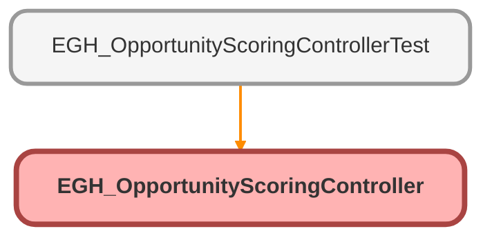

---
hide:
  - path
---

# EGH_OpportunityScoringController Class

## Class Diagram



<!-- Apex description -->

## Apex Code

```java
public with sharing class EGH_OpportunityScoringController {
    @AuraEnabled(cacheable=true)
    public static Map<String, Integer> getAccountScoringData(String accountId) {
        Map<String, Integer> result = new Map<String, Integer>();
        
        // Showroom visits count
        result.put('showroomCount', [SELECT COUNT() FROM EGH_ShowroomVisit__c 
                                     WHERE EGH_AccountLookup__c = :accountId]);
        
        // Service appointment counts
        result.put('totalServiceCount', [SELECT COUNT() FROM ServiceAppointment 
                                        WHERE AccountId = :accountId]);
        
        result.put('completedServiceCount', [SELECT COUNT() FROM ServiceAppointment 
                                            WHERE AccountId = :accountId 
                                            AND Status = 'Completed']);
        
        return result;
    }
}
```

## Methods
### `getAccountScoringData(accountId)`

`AURAENABLED`

#### Signature
```apex
public static Map<String,Integer> getAccountScoringData(String accountId)
```

#### Parameters
| Name | Type | Description |
|------|------|-------------|
| accountId | String |  |

#### Return Type
**Map<String,Integer>**