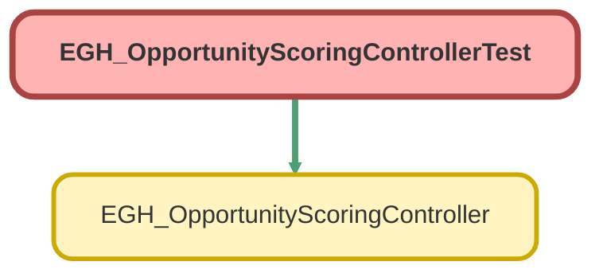

---
hide:
  - path
---

# EGH_OpportunityScoringControllerTest Class

`ISTEST`

## Class Diagram



<!-- Apex description -->

## Apex Code

```java
@isTest
public class EGH_OpportunityScoringControllerTest {
    
    @isTest
    static void testGetAccountScoringData() {
        // Create test Account
        Account testAccount = new Account(Name = 'Test Account');
        insert testAccount;
        
        Test.startTest();
        Map<String, Integer> result = EGH_OpportunityScoringController.getAccountScoringData(testAccount.Id);
        Test.stopTest();
        
        // Basic assertions
        System.assertNotEquals(null, result);
        System.assert(result.containsKey('showroomCount'));
        System.assert(result.containsKey('totalServiceCount'));
        System.assert(result.containsKey('completedServiceCount'));
    }
}
```

## Methods
### `testGetAccountScoringData()`

`ISTEST`

#### Signature
```apex
private static void testGetAccountScoringData()
```

#### Return Type
**void**