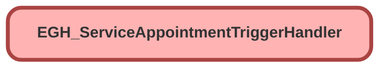

---
hide:
  - path
---

## Class Diagram


```mermaid
graph TD
  EGH_ServiceAppointmentTriggerHandler["EGH_ServiceAppointmentTriggerHandler"]:::mainApexClass
  click EGH_ServiceAppointmentTriggerHandler "/objects/EGH_ServiceAppointmentTriggerHandler/"


classDef apexClass fill:#FFF4C2,stroke:#CCAA00,stroke-width:3px,rx:12px,ry:12px,shadow:drop,color:#333;
classDef apexTestClass fill:#F5F5F5,stroke:#999999,stroke-width:3px,rx:12px,ry:12px,shadow:drop,color:#333;
classDef mainApexClass fill:#FFB3B3,stroke:#A94442,stroke-width:4px,rx:14px,ry:14px,shadow:drop,color:#333,font-weight:bold;

```

<!-- Apex description -->

## Apex Code

```java
public class EGH_ServiceAppointmentTriggerHandler {

}
```

# EGH_ServiceAppointmentTriggerHandler Class