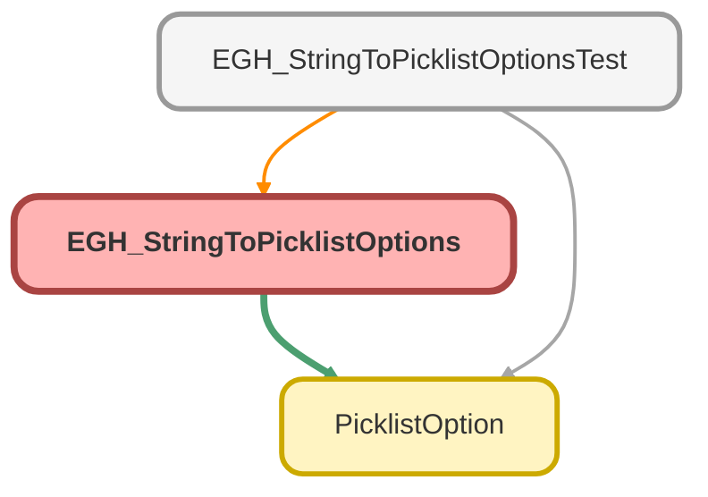

---
hide:
  - path
---

# EGH_StringToPicklistOptions Class

## Class Diagram



<!-- Apex description -->

## Apex Code

```java
public with sharing class EGH_StringToPicklistOptions {

    public class FlowInput {
        @InvocableVariable(label='Semicolon separated String' required=true)
        public String semicolonSeparatedString;
    }

    @InvocableMethod(label='Transform semicolon-separated string values to Picklist Options' description='Splits a semicolon-separated string into a list of PicklistOption objects')
    public static List<List<PicklistOption>> transformToOptions(List<FlowInput> inputs) {
        List<List<PicklistOption>> results = new List<List<PicklistOption>>();

        for (FlowInput input : inputs) {
            List<PicklistOption> picklistOptionsList = new List<PicklistOption>();

            if (String.isNotBlank(input.semicolonSeparatedString)) {                
                for (String val : input.semicolonSeparatedString.split(';')) {
                    picklistOptionsList.add(new PicklistOption(val, val));
                }
            }
            results.add(picklistOptionsList);
        }

        return results;
    }
}
```

## Methods
### `transformToOptions(inputs)`

`INVOCABLEMETHOD`

#### Signature
```apex
public static List<List<PicklistOption>> transformToOptions(List<FlowInput> inputs)
```

#### Parameters
| Name | Type | Description |
|------|------|-------------|
| inputs | List<FlowInput> |  |

#### Return Type
**List<List<PicklistOption>>**

## Classes
### FlowInput Class

#### Fields
##### `semicolonSeparatedString`

`INVOCABLEVARIABLE`

###### Signature
```apex
public semicolonSeparatedString
```

###### Type
String