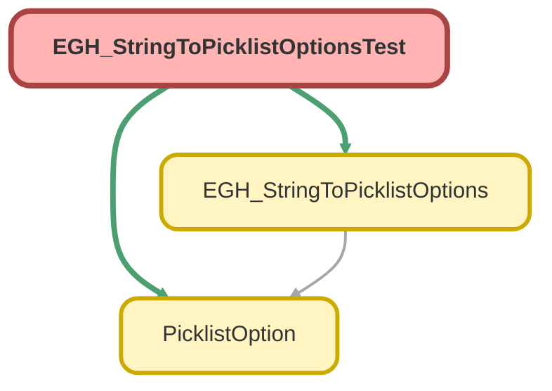

---
hide:
  - path
---

# EGH_StringToPicklistOptionsTest Class

`ISTEST`

## Class Diagram



<!-- Apex description -->

## Apex Code

```java
@IsTest
private class EGH_StringToPicklistOptionsTest {

    @IsTest
    static void testTransformToOptions_Success() {
        EGH_StringToPicklistOptions.FlowInput input = new EGH_StringToPicklistOptions.FlowInput();
        input.semicolonSeparatedString = 'val1;val2;val3';
        
        List<EGH_StringToPicklistOptions.FlowInput> inputs = new List<EGH_StringToPicklistOptions.FlowInput>{input};

        Test.startTest();
        List<List<PicklistOption>> results = EGH_StringToPicklistOptions.transformToOptions(inputs);
        Test.stopTest();

        System.assertEquals(1, results.size(), 'Should return one list of results for one input');
        List<PicklistOption> firstResultList = results[0];
        
        System.assertEquals(3, firstResultList.size(), 'Should have split the string into 3 options');
        System.assertEquals('val1', firstResultList[0].label, 'First label should be val1');
        System.assertEquals('val2', firstResultList[1].value, 'Second value should be val2');
        System.assertEquals('val3', firstResultList[2].value, 'Second value should be val3');
    }
}
```

## Methods
### `testTransformToOptions_Success()`

`ISTEST`

#### Signature
```apex
private static void testTransformToOptions_Success()
```

#### Return Type
**void**