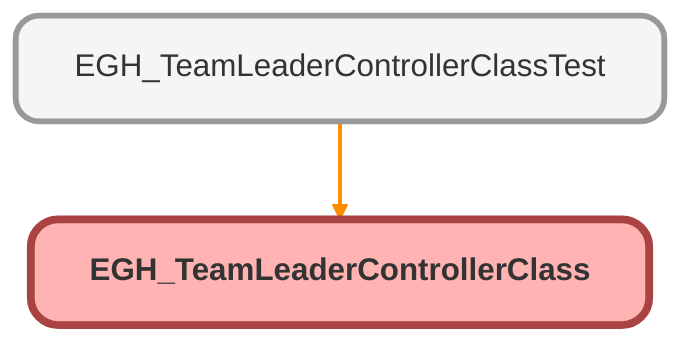

---
hide:
  - path
---

# EGH_TeamLeaderControllerClass Class

## Class Diagram



<!-- Apex description -->

## Apex Code

```java
public with sharing class EGH_TeamLeaderControllerClass {
	public class FindTeamLeaderInput {
		@InvocableVariable(required=true label='Branch Unit Id')
		public Id recordId;
	}

    
	public class FindTeamLeaderOutput {
		@InvocableVariable(label='Team Leader Id')
		public Id teamLeaderId;
	}

	@InvocableMethod(label='Find Team Leader' description='Returns Team Leader User Id for each BranchUnitBusinessMember Id')
	public static List<FindTeamLeaderOutput> findTeamLeader(List<FindTeamLeaderInput> requests) {
		List<FindTeamLeaderOutput> responses = new List<FindTeamLeaderOutput>();
		if (requests == null || requests.isEmpty()) {
			return responses;
		}

		Set<Id> targetIds = new Set<Id>();
		for (FindTeamLeaderInput req : requests) {
			if (req != null && req.recordId != null) {
				targetIds.add(req.recordId);
			}
			responses.add(new FindTeamLeaderOutput());
		}

		if (targetIds.isEmpty()) {
			return responses;
		}

		
		
		String BusinessUnitMemberID='';
        BusinessUnitMemberID= [
            SELECT Id, BusinessUnitMemberId, BusinessUnitMember.UserRole.Name
			FROM BranchUnitBusinessMember
			WHERE BranchUnitId IN :targetIds
            AND isActive = true 
            AND BusinessUnitMember.isActive = true 
			AND BusinessUnitMember.UserRole.Name LIKE 'Showroom Manager%' Limit 1]?.BusinessUnitMemberID;
		
					
		responses[0].teamLeaderId = BusinessUnitMemberID;
		

		return responses;
	}
}
```

## Methods
### `findTeamLeader(requests)`

`INVOCABLEMETHOD`

#### Signature
```apex
public static List<FindTeamLeaderOutput> findTeamLeader(List<FindTeamLeaderInput> requests)
```

#### Parameters
| Name | Type | Description |
|------|------|-------------|
| requests | List<FindTeamLeaderInput> |  |

#### Return Type
**List<FindTeamLeaderOutput>**

## Classes
### FindTeamLeaderInput Class

#### Fields
##### `recordId`

`INVOCABLEVARIABLE`

###### Signature
```apex
public recordId
```

###### Type
Id

### FindTeamLeaderOutput Class

#### Fields
##### `teamLeaderId`

`INVOCABLEVARIABLE`

###### Signature
```apex
public teamLeaderId
```

###### Type
Id