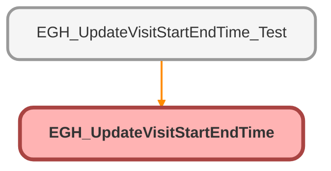

---
hide:
  - path
---

# EGH_UpdateVisitStartEndTime Class

## Class Diagram



<!-- Apex description -->

## Apex Code

```java
public class EGH_UpdateVisitStartEndTime {

    @AuraEnabled
    public static void updateVisitStartTime(Id recordId) {
        // Replace Case with your specific object if needed
        EGH_ShowroomVisit__c svs = [SELECT Id, EGH_StartDateTime__c FROM EGH_ShowroomVisit__c WHERE Id = :recordId LIMIT 1];
        svs.EGH_StartDateTime__c = System.now();
        svs.EGH_Status__c = 'Assigned';
        update svs;
    }
    
    
       @AuraEnabled
    public static void updateVisitEndTime(Id recordId) {
        // Replace Case with your specific object if needed
       EGH_ShowroomVisit__c sve = [SELECT Id, EGH_StartDateTime__c FROM EGH_ShowroomVisit__c WHERE Id = :recordId LIMIT 1];
       sve.EGH_EndDateTime__c = System.now();
      sve.EGH_Status__c = 'Ended';
       update sve;
    }


}
```

## Methods
### `updateVisitStartTime(recordId)`

`AURAENABLED`

#### Signature
```apex
public static void updateVisitStartTime(Id recordId)
```

#### Parameters
| Name | Type | Description |
|------|------|-------------|
| recordId | Id |  |

#### Return Type
**void**

---

### `updateVisitEndTime(recordId)`

`AURAENABLED`

#### Signature
```apex
public static void updateVisitEndTime(Id recordId)
```

#### Parameters
| Name | Type | Description |
|------|------|-------------|
| recordId | Id |  |

#### Return Type
**void**