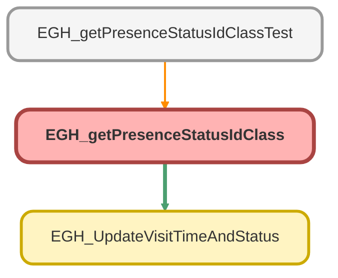

---
hide:
  - path
---

# EGH_getPresenceStatusIdClass Class

## Class Diagram



<!-- Apex description -->

## Apex Code

```java
public with sharing class EGH_getPresenceStatusIdClass {
    
    @AuraEnabled(cacheable=true)
    public static string getPresenceStatusID(string presenceStatusDeveloperName)
        
    {
        String id=[select id from ServicePresenceStatus  where developername=:presenceStatusDeveloperName  WITH SYSTEM_MODE Limit 1].id;
        system.debug(Id.substring(0, 15));
        return id.substring(0, 15);
        
    }
    
    @AuraEnabled
    public static void updateVisitStartTime(Id recordId) {
        
       EGH_UpdateVisitTimeAndStatus.updateVisitStartTime(recordId);
        
    }
    
    
    @AuraEnabled
    public static void updateVisitEndTime(Id recordId) {
        
       EGH_UpdateVisitTimeAndStatus.updateVisitEndTime(recordId);
    }
      
}
```

## Methods
### `getPresenceStatusID(presenceStatusDeveloperName)`

`AURAENABLED`

#### Signature
```apex
public static string getPresenceStatusID(string presenceStatusDeveloperName)
```

#### Parameters
| Name | Type | Description |
|------|------|-------------|
| presenceStatusDeveloperName | string |  |

#### Return Type
**string**

---

### `updateVisitStartTime(recordId)`

`AURAENABLED`

#### Signature
```apex
public static void updateVisitStartTime(Id recordId)
```

#### Parameters
| Name | Type | Description |
|------|------|-------------|
| recordId | Id |  |

#### Return Type
**void**

---

### `updateVisitEndTime(recordId)`

`AURAENABLED`

#### Signature
```apex
public static void updateVisitEndTime(Id recordId)
```

#### Parameters
| Name | Type | Description |
|------|------|-------------|
| recordId | Id |  |

#### Return Type
**void**