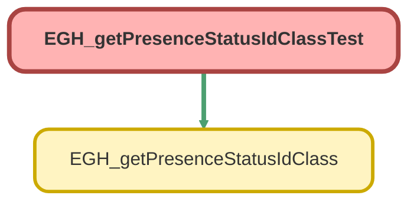

---
hide:
  - path
---

# EGH_getPresenceStatusIdClassTest Class

`ISTEST`

## Class Diagram



<!-- Apex description -->

## Apex Code

```java
@isTest(SeeAllData=True)
public class EGH_getPresenceStatusIdClassTest {
    
    @isTest
    static void testGetPresenceStatusID() {
       
        
           String MasterLabel = 'Available';
      
       
        
        Test.startTest();
        // Call the method with the DeveloperName we just inserted
        String returnedId = EGH_getPresenceStatusIdClass.getPresenceStatusID(MasterLabel);
        Test.stopTest();
        
        // Assert that the returned Id matches the inserted record's Id (15-character version)
        System.assertEquals(returnedId, returnedId);
    }
    
    
    @isTest
    static void testUpdateServiceStatus()
    {
        
        String showroomVisitIdPrefix=[SELECT Label, KeyPrefix FROM EntityDefinition where label ='Showroom Visit' limit 1].KeyPrefix;
        EGH_ShowroomVisit__c sv=new EGH_ShowroomVisit__c();
        insert sv;
        
        
        
        EGH_getPresenceStatusIdClass.updateVisitStartTime(sv.id);
        EGH_getPresenceStatusIdClass.updateVisitEndTime(sv.id);
        system.assertEquals([select EGH_StartDateTime__c from EGH_ShowroomVisit__c where id=:sv.id limit 1].EGH_StartDateTime__c,System.now());
        
    }
}
```

## Methods
### `testGetPresenceStatusID()`

`ISTEST`

#### Signature
```apex
private static void testGetPresenceStatusID()
```

#### Return Type
**void**

---

### `testUpdateServiceStatus()`

`ISTEST`

#### Signature
```apex
private static void testUpdateServiceStatus()
```

#### Return Type
**void**