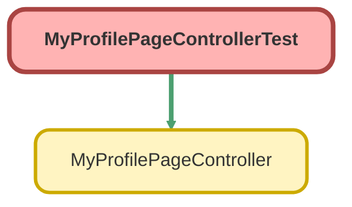

---
hide:
  - path
---

# MyProfilePageControllerTest Class

`ISTEST`

An apex class that updates details of a portal user. 
Guest users are never able to access this page.

## Class Diagram



<!-- Apex description -->

## Apex Code

```java
/**
 * An apex class that updates details of a portal user.
   Guest users are never able to access this page.
 */
@IsTest public with sharing class MyProfilePageControllerTest {

    @IsTest(SeeAllData=true) static void testSave() {
        // Modify the test to query for a portal user that exists in your org
        List<User> existingPortalUsers = [SELECT id, profileId, userRoleId FROM User WHERE UserRoleId <> null AND UserType='CustomerSuccess'];

        if (existingPortalUsers.isEmpty()) {
            User currentUser = [select id, title, firstname, lastname, email, phone, mobilephone, fax, street, city, state, postalcode, country
                                FROM User WHERE id =: UserInfo.getUserId()];
            MyProfilePageController controller = new MyProfilePageController();
            System.assertEquals(currentUser.Id, controller.getUser().Id, 'Did not successfully load the current user');
            System.assert(controller.getIsEdit() == false, 'isEdit should default to false');
            controller.edit();
            System.assert(controller.getIsEdit() == true);
            controller.cancel();
            System.assert(controller.getIsEdit() == false);
            
            System.assert(Page.ChangePassword.getUrl().equals(controller.changePassword().getUrl()));
            
            String randFax = Math.rint(Math.random() * 1000) + '5551234';
            controller.getUser().Fax = randFax;
            controller.save();
            System.assert(controller.getIsEdit() == false);
            
            currentUser = [Select id, fax from User where id =: currentUser.Id];
            System.assert(currentUser.fax == randFax);
        } else {
            User existingPortalUser = existingPortalUsers[0];
            String randFax = Math.rint(Math.random() * 1000) + '5551234';

            System.runAs(existingPortalUser) {
                MyProfilePageController controller = new MyProfilePageController();
                System.assertEquals(existingPortalUser.Id, controller.getUser().Id, 'Did not successfully load the current user');
                System.assert(controller.getIsEdit() == false, 'isEdit should default to false');
                controller.edit();
                System.assert(controller.getIsEdit() == true);

                controller.cancel();
                System.assert(controller.getIsEdit() == false);

                controller.getUser().Fax = randFax;
                controller.save();
                System.assert(controller.getIsEdit() == false);
            }

            // verify that the user was updated
            existingPortalUser = [Select id, fax from User where id =: existingPortalUser.Id];
            System.assert(existingPortalUser.fax == randFax);
        }
    }
}
```

## Methods
### `testSave()`

`ISTEST`

#### Signature
```apex
private static void testSave()
```

#### Return Type
**void**