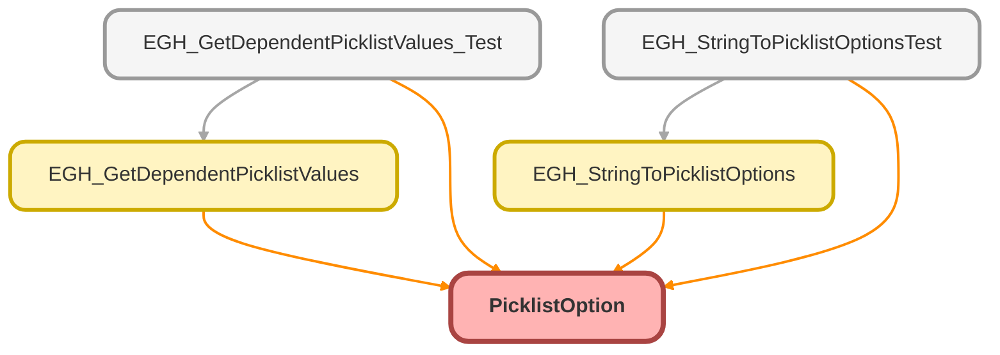

---
hide:
  - path
---

# PicklistOption Class

## Class Diagram



<!-- Apex description -->

## Apex Code

```java
public with sharing class PicklistOption {
        @AuraEnabled
        @InvocableVariable
        public String label;
        @AuraEnabled
        @InvocableVariable
        public String value;

        public PicklistOption(String label, String value) {
            this.label = label;
            this.value = value;
        }
}
```

## Fields
### `label`

`AURAENABLED`
`INVOCABLEVARIABLE`

#### Signature
```apex
public label
```

#### Type
String

---

### `value`

`AURAENABLED`
`INVOCABLEVARIABLE`

#### Signature
```apex
public value
```

#### Type
String

## Constructors
### `PicklistOption(label, value)`

#### Signature
```apex
public PicklistOption(String label, String value)
```

#### Parameters
| Name | Type | Description |
|------|------|-------------|
| label | String |  |
| value | String |  |