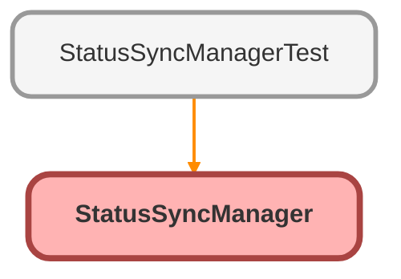

---
hide:
  - path
---

# StatusSyncManager Class

**Implements**

genesyscloud.GenesysSCVExtension.Status

## Class Diagram



<!-- Apex description -->

## Apex Code

```java
// ATTENTION: You will need to find the Genesys presence ids that exist in your org.

// ATTENTION: You will need to find the Salesforce status ids that exist in your org.
// Run this query in your Salesforce org to get the status ids specific to your org. You can use 15 or 18 digit ids.
// SELECT DeveloperName,Id,IsDeleted,MasterLabel FROM ServicePresenceStatus

global with sharing class StatusSyncManager implements genesyscloud.GenesysSCVExtension.Status {
  public String onSalesforceStatusChange(String data) {
    IncomingStatusChange statusUpdate = (IncomingStatusChange) JSON.deserialize(data, IncomingStatusChange.class);
    // -----------------------------------------------------------------------------------------------------------------------------------
    // Examples of how to get current Salesforce Status Variables:
    // String salesforceCurrentStatusApiName = statusUpdate.salesforceStatus.currentStatus.statusApiName;
    // String salesforceCurrentStatusId = statusUpdate.salesforceStatus.currentStatus.statusId;
    // String salesforceCurrentStatusName = statusUpdate.salesforceStatus.currentStatus.statusName;

    // Examples of how to get target Salesforce Status Variables:
    // String salesforceTargetStatusApiName = statusUpdate.salesforceStatus.targetStatus.statusApiName;
    String salesforceTargetStatusId = statusUpdate.salesforceStatus.targetStatus.statusId;
    String salesforceTargetStatusName = statusUpdate.salesforceStatus.targetStatus.statusName;
    // -----------------------------------------------------------------------------------------------------------------------------------
    // Examples of how to get current Genesys Status Variables:
    // String genesysCurrentId = statusUpdate.genesysCloudStatus.currentStatus.id;
    // String genesysCurrentSystemPresence = statusUpdate.genesysCloudStatus.currentStatus.systemPresence;

    // Examples of how to get target Genesys Status Variables:
    String genesysTargetId = statusUpdate.genesysCloudStatus.targetStatus.id;
    // String genesysTargetSystemPresence = statusUpdate.genesysCloudStatus.targetStatus.systemPresence;
    // -----------------------------------------------------------------------------------------------------------------------------------

    // These are the variables that will be changed to update the agent's status.
    // These are default values to be sent back if no changes are made to the target statuses.
    // NOTE: If these values are NOT handled below, NO CHANGES will be made to the target statuses.
    String salesforceResponseTargetStatusId = salesforceTargetStatusId;
    String genesysResponseTargetStatusId = genesysTargetId;

    if (String.isNotEmpty(salesforceTargetStatusName)) {
      salesforceTargetStatusName = salesforceTargetStatusName.toUpperCase();
    }
    // The following customizations for youssef Gad to make genesys status ids dynamic from custom settings 
    Map<String, Genesys_CC_integration__c> configMap = Genesys_CC_integration__c.getAll();
    Genesys_CC_integration__c genesysConfig;
    for (Genesys_CC_integration__c config : configMap.values()) {
      if(config.Name == 'From SF To Genesys'){
        genesysConfig = config;
      }
    }
    if(genesysConfig == null){
      System.debug(logginglevel.WARN, 'Salesforce status NOT HANDLED: ' + salesforceTargetStatusName);
      return 'ERROR';
    }
      system.debug(' >>> salesforceTargetStatusName: ' + salesforceTargetStatusName);
    switch on salesforceTargetStatusName {
        when 'AVAILABLE' {
            genesysResponseTargetStatusId = genesysConfig.Available_Off_Queue__c; 
        }
      when 'AVAILABLE OFF QUEUE' {
          genesysResponseTargetStatusId = genesysConfig.Available_Off_Queue__c; 
      }
      when 'AVAILABLE ON QUEUE' {
          genesysResponseTargetStatusId = genesysConfig.On_Queue__c;
      }
      when 'BUSY' {
          genesysResponseTargetStatusId = genesysConfig.Busy__c;
      }
      when 'AWAY' {
          genesysResponseTargetStatusId = genesysConfig.Away__c;
      }
      when 'BREAK' {
          genesysResponseTargetStatusId = genesysConfig.Break__c;
      }   
      when 'MEETING' {
          genesysResponseTargetStatusId = genesysConfig.Meeting__c;
      }
      when 'TRAINING' {
          genesysResponseTargetStatusId = genesysConfig.Training__c;
      }
      when 'OFFLINE' {
          genesysResponseTargetStatusId = genesysConfig.Offline__c;
      }
      when 'MEAL' {
          genesysResponseTargetStatusId = genesysConfig.Busy_Lunch__c;
      } 
      when null {
          genesysResponseTargetStatusId =  genesysConfig.Offline__c;
      }
      when else {
        System.debug(logginglevel.WARN, 'Salesforce status NOT HANDLED: ' + salesforceTargetStatusName);
      }
    }

    // -----------------------------------------------------------------------------------------------------------------
    // Form response object... shouldn't need to be touched.
    string response = JSON.serialize(new Response(genesysResponseTargetStatusId, salesforceResponseTargetStatusId));
    system.debug(' >>> response: ' + response);
    return response;
  }

  public String onGenesysCloudStatusChange(String data) {
    IncomingStatusChange statusUpdate = (IncomingStatusChange) JSON.deserialize(data, IncomingStatusChange.class);
    // -----------------------------------------------------------------------------------------------------------------------------------
    // Examples of how to get current Salesforce Status Variables:
    // String salesforceCurrentStatusApiName = statusUpdate.salesforceStatus.currentStatus.statusApiName;
    // String salesforceCurrentStatusId = statusUpdate.salesforceStatus.currentStatus.statusId;
    // String salesforceCurrentStatusName = statusUpdate.salesforceStatus.currentStatus.statusName;

    // Examples of how to get target Salesforce Status Variables:
    // String salesforceTargetStatusApiName = statusUpdate.salesforceStatus.targetStatus.statusApiName;
    String salesforceTargetStatusId = statusUpdate.salesforceStatus.targetStatus.statusId;
    // String salesforceTargetStatusName = statusUpdate.salesforceStatus.targetStatus.statusName;
    // -----------------------------------------------------------------------------------------------------------------------------------
    // Examples of how to get current Genesys Status Variables:
    // String genesysCurrentId = statusUpdate.genesysCloudStatus.currentStatus.id;
    // String genesysCurrentSystemPresence = statusUpdate.genesysCloudStatus.currentStatus.systemPresence;

    // Examples of how to get target Genesys Status Variables:
    String genesysTargetId = statusUpdate.genesysCloudStatus.targetStatus.id;
    String genesysTargetSystemPresence = statusUpdate.genesysCloudStatus.targetStatus.systemPresence;
    // -----------------------------------------------------------------------------------------------------------------------------------

    // These are the variables that will be changed to update the agent's status.
    // These are default values to be sent back if no changes are made to the target statuses.
    // NOTE: If these values are NOT handled below, NO CHANGES will be made to the target statuses.
    String salesforceResponseTargetStatusId = salesforceTargetStatusId;
    String genesysResponseTargetStatusId = genesysTargetId;

    if (String.isNotEmpty(genesysTargetSystemPresence)) {
      genesysTargetSystemPresence = genesysTargetSystemPresence.toUpperCase();
    }

    
    // the following block is modified by YG to make the salesforce status ids dynamic from custom settings
    
    Map<String, Genesys_CC_integration__c> configMap = Genesys_CC_integration__c.getAll();
    Genesys_CC_integration__c sfConfig;
    for (Genesys_CC_integration__c config : configMap.values()) {
      if(config.Name == 'From Genesys to SF'){
        sfConfig = config;
      }
    }
    if(sfConfig == null){
      System.debug(logginglevel.WARN, 'Salesforce status NOT HANDLED: ' + genesysTargetSystemPresence);
      return 'ERROR';
    }
    System.debug(' >>> genesysTargetSystemPresence:' + genesysTargetSystemPresence);
    switch on genesysTargetSystemPresence {
      when 'AVAILABLE' {
        salesforceResponseTargetStatusId = convertTo15Digit(sfConfig.Available_Off_Queue__c); // convertTo15Digit(sfConfig.Available__c); //'Available';
      }
      when 'ON_QUEUE' {
        salesforceResponseTargetStatusId = convertTo15Digit(sfConfig.On_Queue__c);
      }
      when 'BUSY' {
        salesforceResponseTargetStatusId = convertTo15Digit(sfConfig.Busy__c);
      }
      when 'AWAY' {
        salesforceResponseTargetStatusId = convertTo15Digit(sfConfig.Away__c);
      }
      when 'IDLE' {
        salesforceResponseTargetStatusId = convertTo15Digit(sfConfig.Away__c);
      }
      when 'BREAK' {
        salesforceResponseTargetStatusId = convertTo15Digit(sfConfig.Break__c); 
      }   
      when 'MEETING' {
        salesforceResponseTargetStatusId = convertTo15Digit(sfConfig.Meeting__c);
      }
      when 'TRAINING' {
        salesforceResponseTargetStatusId = convertTo15Digit(sfConfig.Training__c);
      }
      when 'OFFLINE' {
      //  salesforceResponseTargetStatusId = convertTo15Digit(sfConfig.Available__c);
      }
      when 'MEAL' {
        salesforceResponseTargetStatusId = convertTo15Digit(sfConfig.Lunch__c);
    } 
      when else {
        System.debug(logginglevel.WARN, 'Genesys Cloud status NOT HANDLED: ' + genesysTargetSystemPresence);
      }
    }

    // -----------------------------------------------------------------------------------------------------------------
    // Form response object... shouldn't need to be touched.
    return JSON.serialize(new Response(genesysResponseTargetStatusId, salesforceResponseTargetStatusId));
  }

  public static String convertTo15Digit(String id18) {
      if (id18 != null && id18.length() == 18) {
          return id18.substring(0, 15); // Extract first 15 characters
      }
      return id18; // Return as is if not 18 characters
  }
  // No need to change below --------------------------------------------------------------------------------------------------------
  //#region Response Obj
  public class Response {
    public ResponseGenesysCloudStatusObj genesysCloudStatus;
    public ResponseSalesforceStatusObj salesforceStatus;
    public Response(String genesysResponseTargetStatusId, String salesforceResponseTargetStatusId) {
      this.genesysCloudStatus = new ResponseGenesysCloudStatusObj(genesysResponseTargetStatusId);
      this.salesforceStatus = new ResponseSalesforceStatusObj(salesforceResponseTargetStatusId);
    }
  }
  public class ResponseGenesysCloudStatus {
    public String id;
    public ResponseGenesysCloudStatus(String id) {
      this.id = id;
    }
  } 
  public class ResponseGenesysCloudStatusObj {
    public ResponseGenesysCloudStatus targetStatus;
    public ResponseGenesysCloudStatusObj(String genesysResponseTargetStatusId) {
      this.targetStatus = new ResponseGenesysCloudStatus(genesysResponseTargetStatusId);
    }
  }
  public class ResponseSalesforceStatus {
    public String statusId;
    public ResponseSalesforceStatus(String statusId) {
      this.statusId = statusId;
    }
  }
  public class ResponseSalesforceStatusObj {
    public ResponseSalesforceStatus targetStatus;
    public ResponseSalesforceStatusObj(String salesforceResponseTargetStatusId) {
      this.targetStatus = new ResponseSalesforceStatus(salesforceResponseTargetStatusId);
    }
  }
  //#endregion Response Obj

  //#region IncomingStatusChange Obj
  public class IncomingStatusChange {
    public IncomingSalesforceStatus salesforceStatus;
    public IncomingGenesysCloudStatus genesysCloudStatus;
  }
  public class IncomingSalesforceStatusObj {
    public String statusApiName;
    public String statusId;
    public String statusName;
  }
  public class IncomingSalesforceStatus {
    public IncomingSalesforceStatusObj targetStatus;
    public IncomingSalesforceStatusObj currentStatus;
  }
  public class IncomingGenesysCloudStatusObj {
    public String id;
    public String systemPresence;
  }
  public class IncomingGenesysCloudStatus {
    public IncomingGenesysCloudStatusObj targetStatus;
    public IncomingGenesysCloudStatusObj currentStatus;
  }
  //#endregion IncomingStatusChange Obj
  // -----------------------------------------------------------------------------------------------------------------
}
```

## Methods
### `onSalesforceStatusChange(data)`

#### Signature
```apex
public String onSalesforceStatusChange(String data)
```

#### Parameters
| Name | Type | Description |
|------|------|-------------|
| data | String |  |

#### Return Type
**String**

---

### `onGenesysCloudStatusChange(data)`

#### Signature
```apex
public String onGenesysCloudStatusChange(String data)
```

#### Parameters
| Name | Type | Description |
|------|------|-------------|
| data | String |  |

#### Return Type
**String**

---

### `convertTo15Digit(id18)`

#### Signature
```apex
public static String convertTo15Digit(String id18)
```

#### Parameters
| Name | Type | Description |
|------|------|-------------|
| id18 | String |  |

#### Return Type
**String**

## Classes
### Response Class

#### Fields
##### `genesysCloudStatus`

###### Signature
```apex
public genesysCloudStatus
```

###### Type
ResponseGenesysCloudStatusObj

---

##### `salesforceStatus`

###### Signature
```apex
public salesforceStatus
```

###### Type
ResponseSalesforceStatusObj

#### Constructors
##### `Response(genesysResponseTargetStatusId, salesforceResponseTargetStatusId)`

###### Signature
```apex
public Response(String genesysResponseTargetStatusId, String salesforceResponseTargetStatusId)
```

###### Parameters
| Name | Type | Description |
|------|------|-------------|
| genesysResponseTargetStatusId | String |  |
| salesforceResponseTargetStatusId | String |  |

### ResponseGenesysCloudStatus Class

#### Fields
##### `id`

###### Signature
```apex
public id
```

###### Type
String

#### Constructors
##### `ResponseGenesysCloudStatus(id)`

###### Signature
```apex
public ResponseGenesysCloudStatus(String id)
```

###### Parameters
| Name | Type | Description |
|------|------|-------------|
| id | String |  |

### ResponseGenesysCloudStatusObj Class

#### Fields
##### `targetStatus`

###### Signature
```apex
public targetStatus
```

###### Type
ResponseGenesysCloudStatus

#### Constructors
##### `ResponseGenesysCloudStatusObj(genesysResponseTargetStatusId)`

###### Signature
```apex
public ResponseGenesysCloudStatusObj(String genesysResponseTargetStatusId)
```

###### Parameters
| Name | Type | Description |
|------|------|-------------|
| genesysResponseTargetStatusId | String |  |

### ResponseSalesforceStatus Class

#### Fields
##### `statusId`

###### Signature
```apex
public statusId
```

###### Type
String

#### Constructors
##### `ResponseSalesforceStatus(statusId)`

###### Signature
```apex
public ResponseSalesforceStatus(String statusId)
```

###### Parameters
| Name | Type | Description |
|------|------|-------------|
| statusId | String |  |

### ResponseSalesforceStatusObj Class

#### Fields
##### `targetStatus`

###### Signature
```apex
public targetStatus
```

###### Type
ResponseSalesforceStatus

#### Constructors
##### `ResponseSalesforceStatusObj(salesforceResponseTargetStatusId)`

###### Signature
```apex
public ResponseSalesforceStatusObj(String salesforceResponseTargetStatusId)
```

###### Parameters
| Name | Type | Description |
|------|------|-------------|
| salesforceResponseTargetStatusId | String |  |

### IncomingStatusChange Class

#### Fields
##### `salesforceStatus`

###### Signature
```apex
public salesforceStatus
```

###### Type
IncomingSalesforceStatus

---

##### `genesysCloudStatus`

###### Signature
```apex
public genesysCloudStatus
```

###### Type
IncomingGenesysCloudStatus

### IncomingSalesforceStatusObj Class

#### Fields
##### `statusApiName`

###### Signature
```apex
public statusApiName
```

###### Type
String

---

##### `statusId`

###### Signature
```apex
public statusId
```

###### Type
String

---

##### `statusName`

###### Signature
```apex
public statusName
```

###### Type
String

### IncomingSalesforceStatus Class

#### Fields
##### `targetStatus`

###### Signature
```apex
public targetStatus
```

###### Type
IncomingSalesforceStatusObj

---

##### `currentStatus`

###### Signature
```apex
public currentStatus
```

###### Type
IncomingSalesforceStatusObj

### IncomingGenesysCloudStatusObj Class

#### Fields
##### `id`

###### Signature
```apex
public id
```

###### Type
String

---

##### `systemPresence`

###### Signature
```apex
public systemPresence
```

###### Type
String

### IncomingGenesysCloudStatus Class

#### Fields
##### `targetStatus`

###### Signature
```apex
public targetStatus
```

###### Type
IncomingGenesysCloudStatusObj

---

##### `currentStatus`

###### Signature
```apex
public currentStatus
```

###### Type
IncomingGenesysCloudStatusObj