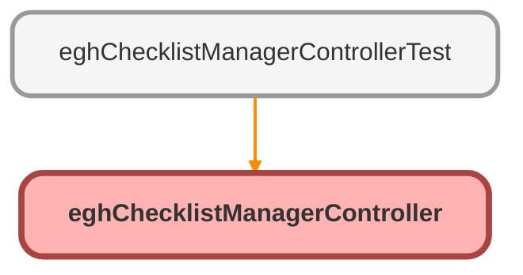

---
hide:
  - path
---

# eghChecklistManagerController Class

## Class Diagram



<!-- Apex description -->

## Apex Code

```java
public with sharing class eghChecklistManagerController {

    @AuraEnabled(cacheable=true)
    public static List<EGHChecklist_Item__c> getChecklistItems(String parentRecordId) {
        // Security check - Ensure user has Read access
        if (!Schema.SObjectType.EGHChecklist_Item__c.isAccessible()) {
            throw new AuraHandledException('You don\'t have access to view checklist items.');
        }

        // Validate parentRecordId to prevent empty queries
        if (String.isBlank(parentRecordId)) {
            // Return an empty list or throw an error depending on desired behavior
            return new List<EGHChecklist_Item__c>();
            // Or: throw new AuraHandledException('Parent Record ID is required.');
        }

        try {
            // Query items for this record - Removed the logic to auto-create predefined items
            List<EGHChecklist_Item__c> items = [
                SELECT Id, Name, IsCompleted__c, Order__c, IsPredefined__c, ParentRecordId__c
                FROM EGHChecklist_Item__c
                WHERE ParentRecordId__c = :parentRecordId
                ORDER BY Order__c ASC
            ];
            
            return items; // Return whatever is found, even if empty

        } catch (Exception e) {
            // Log the exception internally if possible
            System.debug('Error in getChecklistItems: ' + e.getMessage() + ' Stack: ' + e.getStackTraceString());
            throw new AuraHandledException('An error occurred while retrieving checklist items: ' + e.getMessage());
        }
    }

    @AuraEnabled
    public static EGHChecklist_Item__c saveChecklistItem(String name, String parentRecordId, Decimal order, Boolean isPredefined) {
        // Security check - Ensure user has Create access
        if (!Schema.SObjectType.EGHChecklist_Item__c.isCreateable()) {
            throw new AuraHandledException('You don\'t have permission to create checklist items.');
        }

        // Basic validation
        if (String.isBlank(name) || String.isBlank(parentRecordId)) {
             throw new AuraHandledException('Required information is missing to save the checklist item.');
        }

        try {
            // Get the next available order number if not provided or to avoid duplicates
            Decimal nextOrderNumber = determineNextOrderNumber(parentRecordId, order);
            
            EGHChecklist_Item__c item = new EGHChecklist_Item__c(
                Name = name.trim(), // Ensure name is trimmed
                ParentRecordId__c = parentRecordId,
                IsCompleted__c = false, // New items always start as incomplete
                Order__c = nextOrderNumber,
                IsPredefined__c = isPredefined != null ? isPredefined : false // Use the passed-in value or default to false
            );

            insert item;
            return item; // Return the created item (useful for LWC if needed later)

        } catch (Exception e) {
             System.debug('Error in saveChecklistItem: ' + e.getMessage() + ' Stack: ' + e.getStackTraceString());
            throw new AuraHandledException('An error occurred while saving the checklist item: ' + e.getMessage());
        }
    }
    
    // Helper method to determine the next available order number
    private static Decimal determineNextOrderNumber(String parentRecordId, Decimal requestedOrder) {
        // Find the highest existing order number for this parent record
        AggregateResult result = [
            SELECT MAX(Order__c) maxOrder
            FROM EGHChecklist_Item__c
            WHERE ParentRecordId__c = :parentRecordId
        ];
        
        Decimal highestOrder = (Decimal)result.get('maxOrder');
        
        // If no items exist yet or the max is null, start with 1
        if (highestOrder == null) {
            return 1;
        }
        
        // If a specific order was requested and it's greater than the highest existing order
        // we can use it directly (this preserves behavior when adding to the end)
        if (requestedOrder != null && requestedOrder > highestOrder) {
            return requestedOrder;
        }
        
        // Otherwise, use the next available number
        return highestOrder + 1;
    }

    @AuraEnabled
    public static void updateItemStatus(String itemId, Boolean isCompleted) {
        // Security check - Ensure user has Update access
        if (!Schema.SObjectType.EGHChecklist_Item__c.isUpdateable()) {
            throw new AuraHandledException('You don\'t have permission to update checklist items.');
        }
         if (String.isBlank(itemId)) {
             throw new AuraHandledException('Item ID is required to update status.');
        }

        try {
            // Query minimal fields needed for update, including Id for context
            // Although not strictly necessary for update DML, confirming record exists can be good practice
            List<EGHChecklist_Item__c> itemsToUpdate = [SELECT Id FROM EGHChecklist_Item__c WHERE Id = :itemId LIMIT 1];

            if(itemsToUpdate.isEmpty()){
                 throw new AuraHandledException('Checklist item not found.');
            }

            EGHChecklist_Item__c item = new EGHChecklist_Item__c(
                Id = itemId,
                IsCompleted__c = isCompleted
            );

            update item;

        } catch (Exception e) {
             System.debug('Error in updateItemStatus: ' + e.getMessage() + ' Stack: ' + e.getStackTraceString());
            throw new AuraHandledException('An error occurred while updating the checklist item status: ' + e.getMessage());
        }
    }

    @AuraEnabled
    public static void deleteChecklistItem(String itemId) {
        // Security check - Ensure user has Delete access
        if (!Schema.SObjectType.EGHChecklist_Item__c.isDeletable()) {
            throw new AuraHandledException('You don\'t have permission to delete checklist items.');
        }
         if (String.isBlank(itemId)) {
             throw new AuraHandledException('Item ID is required to delete.');
        }

        try {
            // Query the item AND the IsPredefined__c field for server-side validation
            List<EGHChecklist_Item__c> itemsToDelete = [
                SELECT Id, IsPredefined__c
                FROM EGHChecklist_Item__c
                WHERE Id = :itemId
                LIMIT 1
            ];

             if(itemsToDelete.isEmpty()){
                 // Item already deleted or never existed, consider this success or specific message
                  // throw new AuraHandledException('Checklist item not found.');
                  System.debug('Item deletion requested for non-existent ID: ' + itemId);
                  return; // Or throw as needed
            }

            EGHChecklist_Item__c item = itemsToDelete[0];

            // SERVER-SIDE check: Prevent deletion of predefined items
            if (item.IsPredefined__c) {
                throw new AuraHandledException('Predefined checklist items cannot be deleted.');
            }

            delete item;

        } catch (Exception e) {
             System.debug('Error in deleteChecklistItem: ' + e.getMessage() + ' Stack: ' + e.getStackTraceString());
            // Avoid exposing potentially sensitive info from e.getMessage() if it's a system error
             if (e instanceof AuraHandledException) {
                 throw e; // Re-throw exceptions we generated intentionally
             } else {
                 throw new AuraHandledException('An error occurred while deleting the checklist item.');
             }
        }
    }
}
```

## Methods
### `getChecklistItems(parentRecordId)`

`AURAENABLED`

#### Signature
```apex
public static List<EGHChecklist_Item__c> getChecklistItems(String parentRecordId)
```

#### Parameters
| Name | Type | Description |
|------|------|-------------|
| parentRecordId | String |  |

#### Return Type
**List<EGHChecklist_Item__c>**

---

### `saveChecklistItem(name, parentRecordId, order, isPredefined)`

`AURAENABLED`

#### Signature
```apex
public static EGHChecklist_Item__c saveChecklistItem(String name, String parentRecordId, Decimal order, Boolean isPredefined)
```

#### Parameters
| Name | Type | Description |
|------|------|-------------|
| name | String |  |
| parentRecordId | String |  |
| order | Decimal |  |
| isPredefined | Boolean |  |

#### Return Type
**[EGHChecklist_Item__c](../objects/EGHChecklist_Item__c.md)**

---

### `determineNextOrderNumber(parentRecordId, requestedOrder)`

#### Signature
```apex
private static Decimal determineNextOrderNumber(String parentRecordId, Decimal requestedOrder)
```

#### Parameters
| Name | Type | Description |
|------|------|-------------|
| parentRecordId | String |  |
| requestedOrder | Decimal |  |

#### Return Type
**Decimal**

---

### `updateItemStatus(itemId, isCompleted)`

`AURAENABLED`

#### Signature
```apex
public static void updateItemStatus(String itemId, Boolean isCompleted)
```

#### Parameters
| Name | Type | Description |
|------|------|-------------|
| itemId | String |  |
| isCompleted | Boolean |  |

#### Return Type
**void**

---

### `deleteChecklistItem(itemId)`

`AURAENABLED`

#### Signature
```apex
public static void deleteChecklistItem(String itemId)
```

#### Parameters
| Name | Type | Description |
|------|------|-------------|
| itemId | String |  |

#### Return Type
**void**