# EGH - Auto Complete Case Milestones

## Flow Diagram

```mermaid
%% If you read this, your Markdown visualizer does not handle MermaidJS syntax.
%% - If you are in VS Code, install extension `Markdown Preview Mermaid Support` at https://marketplace.visualstudio.com/items?itemName=bierner.markdown-mermaid
%% - If you are using sfdx-hardis, try to define env variable `MERMAID_MODES=cli,docker` ,then run again the command to regenerate markdown with SVG images.
%% - If you are within mkdocs-material, define mermaid plugin in `mkdocs.yml` as described in https://squidfunk.github.io/mkdocs-material/extensions/mermaid/
%% - As a last resort, you can copy-paste this MermaidJS code into https://mermaid.live/ to see the flow diagram

flowchart TB
START(["START<br/><b>AutoLaunched Flow</b></br>Type: <b> Record After Save</b>"]):::startClass
click START "#general-information" "475020719"

Assign_acknowledgement_milestones[\"🟰 <em></em><br/>Assign acknowledgement milestones"/]:::assignments
click Assign_acknowledgement_milestones "#assign_acknowledgement_milestones" "2682070057"

Copy_1_of_Add_milestone_type_Id_to_collection[\"🟰 <em></em><br/>Add milestone type Id to collection"/]:::assignments
click Copy_1_of_Add_milestone_type_Id_to_collection "#copy_1_of_add_milestone_type_id_to_collection" "2189964809"

Copy_3_of_Add_milestone_type_Id_to_collection[\"🟰 <em></em><br/>Add milestone type Id to collection"/]:::assignments
click Copy_3_of_Add_milestone_type_Id_to_collection "#copy_3_of_add_milestone_type_id_to_collection" "3328190192"

Copy_4_of_Add_milestone_type_Id_to_collection[\"🟰 <em></em><br/>Add milestone type Id to collection"/]:::assignments
click Copy_4_of_Add_milestone_type_Id_to_collection "#copy_4_of_add_milestone_type_id_to_collection" "4058050208"

Copy_5_of_Add_milestone_type_Id_to_collection[\"🟰 <em></em><br/>Add milestone type Id to collection"/]:::assignments
click Copy_5_of_Add_milestone_type_Id_to_collection "#copy_5_of_add_milestone_type_id_to_collection" "610809508"

Copy_6_of_Add_milestone_type_Id_to_collection[\"🟰 <em></em><br/>Add milestone type Id to collection"/]:::assignments
click Copy_6_of_Add_milestone_type_Id_to_collection "#copy_6_of_add_milestone_type_id_to_collection" "4294451839"

Copy_7_of_Add_milestone_type_Id_to_collection[\"🟰 <em></em><br/>Add milestone type Id to collection"/]:::assignments
click Copy_7_of_Add_milestone_type_Id_to_collection "#copy_7_of_add_milestone_type_id_to_collection" "965837454"

Check_New_status_changes{"🔀 <em></em><br/>Check New status changes"}:::decisions
click Check_New_status_changes "#check_new_status_changes" "4036781408"

Check_Status_Changed{"🔀 <em></em><br/>Check Status Changed"}:::decisions
click Check_Status_Changed "#check_status_changed" "1163292501"

Investigation_status_changes{"🔀 <em></em><br/>Investigation  status changes"}:::decisions
click Investigation_status_changes "#investigation_status_changes" "2758190995"

Acknowledgment_Investigation_milestone_Ids{{"🔁 <em></em><br/>Acknowledgment/ Investigation milestone Ids"}}:::loops
click Acknowledgment_Investigation_milestone_Ids "#acknowledgment_investigation_milestone_ids" "3700368836"

Acknowledgment_Investigation_Resolution_milestone_Ids{{"🔁 <em></em><br/>Acknowledgment/ Investigation/Resolution milestone Ids"}}:::loops
click Acknowledgment_Investigation_Resolution_milestone_Ids "#acknowledgment_investigation_resolution_milestone_ids" "2338391799"

Copy_2_of_Acknowledgment_milestone_Ids{{"🔁 <em></em><br/>Acknowledgment milestone Ids"}}:::loops
click Copy_2_of_Acknowledgment_milestone_Ids "#copy_2_of_acknowledgment_milestone_ids" "518799701"

Investihation_milestone_Ids{{"🔁 <em></em><br/>Investihation milestone Ids"}}:::loops
click Investihation_milestone_Ids "#investihation_milestone_ids" "2940290917"

Investihation_Resolution_milestone_Ids{{"🔁 <em></em><br/>Investihation/Resolution milestone Ids"}}:::loops
click Investihation_Resolution_milestone_Ids "#investihation_resolution_milestone_ids" "2938448688"

Loop_through_acknowledgement_milestones{{"🔁 <em></em><br/>Loop through acknowledgement milestones"}}:::loops
click Loop_through_acknowledgement_milestones "#loop_through_acknowledgement_milestones" "2668428540"

Resolution_milestone_Ids{{"🔁 <em></em><br/>Resolution milestone Ids"}}:::loops
click Resolution_milestone_Ids "#resolution_milestone_ids" "3066795623"

Copy_1_of_Get_Acknowledgment_milestone_Ids[("🔍 <em></em><br/>Get Acknowledgment milestone Ids")]:::recordLookups
click Copy_1_of_Get_Acknowledgment_milestone_Ids "#copy_1_of_get_acknowledgment_milestone_ids" "2389930179"

Get_Acknowledgment_Investigation_milestone_Ids[("🔍 <em></em><br/>Get Acknowledgment/Investigation milestone Ids")]:::recordLookups
click Get_Acknowledgment_Investigation_milestone_Ids "#get_acknowledgment_investigation_milestone_ids" "911417930"

Get_Acknowledgment_Investigation_Reslution_milestone_Ids[("🔍 <em></em><br/>Get Acknowledgment/Investigation/Reslution milestone Ids")]:::recordLookups
click Get_Acknowledgment_Investigation_Reslution_milestone_Ids "#get_acknowledgment_investigation_reslution_milestone_ids" "1130864845"

Get_Case_related_Milestones[("🔍 <em></em><br/>Get Case related Milestones")]:::recordLookups
click Get_Case_related_Milestones "#get_case_related_milestones" "1362773920"

Get_Investigation_milestone_Ids1[("🔍 <em></em><br/>Get Investigation milestone Ids")]:::recordLookups
click Get_Investigation_milestone_Ids1 "#get_investigation_milestone_ids1" "1660184950"

Get_Investigation_Resoltion_milestone_Ids[("🔍 <em></em><br/>Get Investigation/Resoltion milestone Ids")]:::recordLookups
click Get_Investigation_Resoltion_milestone_Ids "#get_investigation_resoltion_milestone_ids" "756999721"

Get_Resolution_milestone_Ids[("🔍 <em></em><br/>Get Resolution milestone Ids")]:::recordLookups
click Get_Resolution_milestone_Ids "#get_resolution_milestone_ids" "3038022257"

EGH_Auto_Complete_Milestonnes[["🔗 <em>Subflow</em><br/>EGH_Auto_Complete_Milestonnes"]]:::subflows
click EGH_Auto_Complete_Milestonnes "#egh_auto_complete_milestonnes" "1904373388"

Assign_acknowledgement_milestones --> Loop_through_acknowledgement_milestones
Copy_1_of_Add_milestone_type_Id_to_collection --> Acknowledgment_Investigation_Resolution_milestone_Ids
Copy_3_of_Add_milestone_type_Id_to_collection --> Resolution_milestone_Ids
Copy_4_of_Add_milestone_type_Id_to_collection --> Copy_2_of_Acknowledgment_milestone_Ids
Copy_5_of_Add_milestone_type_Id_to_collection --> Acknowledgment_Investigation_milestone_Ids
Copy_6_of_Add_milestone_type_Id_to_collection --> Investihation_Resolution_milestone_Ids
Copy_7_of_Add_milestone_type_Id_to_collection --> Investihation_milestone_Ids
Check_New_status_changes --> |"New to Investigation"| Copy_1_of_Get_Acknowledgment_milestone_Ids
Check_New_status_changes --> |"New to In progress"| Get_Acknowledgment_Investigation_milestone_Ids
Check_New_status_changes --> |"New To Closed"| Get_Acknowledgment_Investigation_Reslution_milestone_Ids
Check_New_status_changes --> |"Default Outcome"| END_Check_New_status_changes
Check_Status_Changed --> |"New To Investigation"| Check_New_status_changes
Check_Status_Changed --> |"Investigation To In Progress"| Investigation_status_changes
Check_Status_Changed --> |"In progress To Closed"| Get_Resolution_milestone_Ids
Check_Status_Changed --> |"Default Outcome"| END_Check_Status_Changed
Investigation_status_changes --> |"Investigation to In Progress"| Get_Investigation_milestone_Ids1
Investigation_status_changes --> |"Investigation to closed"| Get_Investigation_Resoltion_milestone_Ids
Investigation_status_changes --> |"Default Outcome"| END_Investigation_status_changes
Acknowledgment_Investigation_milestone_Ids --> |"For Each"|Copy_5_of_Add_milestone_type_Id_to_collection
Acknowledgment_Investigation_milestone_Ids ---> |"After Last"|Get_Case_related_Milestones
Acknowledgment_Investigation_Resolution_milestone_Ids --> |"For Each"|Copy_1_of_Add_milestone_type_Id_to_collection
Acknowledgment_Investigation_Resolution_milestone_Ids ---> |"After Last"|Get_Case_related_Milestones
Copy_2_of_Acknowledgment_milestone_Ids --> |"For Each"|Copy_4_of_Add_milestone_type_Id_to_collection
Copy_2_of_Acknowledgment_milestone_Ids ---> |"After Last"|Get_Case_related_Milestones
Investihation_milestone_Ids --> |"For Each"|Copy_7_of_Add_milestone_type_Id_to_collection
Investihation_milestone_Ids ---> |"After Last"|Get_Case_related_Milestones
Investihation_Resolution_milestone_Ids --> |"For Each"|Copy_6_of_Add_milestone_type_Id_to_collection
Investihation_Resolution_milestone_Ids ---> |"After Last"|Get_Case_related_Milestones
Loop_through_acknowledgement_milestones --> |"For Each"|Assign_acknowledgement_milestones
Loop_through_acknowledgement_milestones ---> |"After Last"|EGH_Auto_Complete_Milestonnes
Resolution_milestone_Ids --> |"For Each"|Copy_3_of_Add_milestone_type_Id_to_collection
Resolution_milestone_Ids ---> |"After Last"|Get_Case_related_Milestones
Copy_1_of_Get_Acknowledgment_milestone_Ids --> Copy_2_of_Acknowledgment_milestone_Ids
Get_Acknowledgment_Investigation_milestone_Ids --> Acknowledgment_Investigation_milestone_Ids
Get_Acknowledgment_Investigation_Reslution_milestone_Ids --> Acknowledgment_Investigation_Resolution_milestone_Ids
Get_Case_related_Milestones --> Loop_through_acknowledgement_milestones
Get_Investigation_milestone_Ids1 --> Investihation_milestone_Ids
Get_Investigation_Resoltion_milestone_Ids --> Investihation_Resolution_milestone_Ids
Get_Resolution_milestone_Ids --> Resolution_milestone_Ids
START -->  Check_Status_Changed
EGH_Auto_Complete_Milestonnes --> END_EGH_Auto_Complete_Milestonnes
END_Check_New_status_changes(( END )):::endClass
END_Check_Status_Changed(( END )):::endClass
END_Investigation_status_changes(( END )):::endClass
END_EGH_Auto_Complete_Milestonnes(( END )):::endClass


classDef actionCalls fill:#D4E4FC,color:black,text-decoration:none,max-height:100px
classDef assignments fill:#FBEED7,color:black,text-decoration:none,max-height:100px
classDef collectionProcessors fill:#F0E3FA,color:black,text-decoration:none,max-height:100px
classDef customErrors fill:#FFE9E9,color:black,text-decoration:none,max-height:100px
classDef decisions fill:#FDEAF6,color:black,text-decoration:none,max-height:100px
classDef loops fill:#FDEAF6,color:black,text-decoration:none,max-height:100px
classDef recordCreates fill:#FFF8C9,color:black,text-decoration:none,max-height:100px
classDef recordDeletes fill:#FFF8C9,color:black,text-decoration:none,max-height:100px
classDef recordLookups fill:#EDEAFF,color:black,text-decoration:none,max-height:100px
classDef recordUpdates fill:#FFF8C9,color:black,text-decoration:none,max-height:100px
classDef screens fill:#DFF6FF,color:black,text-decoration:none,max-height:100px
classDef subflows fill:#D4E4FC,color:black,text-decoration:none,max-height:100px
classDef startClass fill:#D9F2E6,color:black,text-decoration:none,max-height:100px
classDef endClass fill:#F9BABA,color:black,text-decoration:none,max-height:100px
classDef transforms fill:#FDEAF6,color:black,text-decoration:none,max-height:100px


```

<!-- Flow description -->

## General Information

|<!-- -->|<!-- -->|
|:---|:---|
|Object|Case|
|Process Type| Auto Launched Flow|
|Trigger Type| Record After Save|
|Record Trigger Type| Update|
|Label|EGH - Auto Complete Case Milestones|
|Status|Active|
|Environments|Default|
|Interview Label|EGH - Auto Complete Case Milestones {!$Flow.CurrentDateTime}|
| Builder Type (PM)|LightningFlowBuilder|
| Canvas Mode (PM)|AUTO_LAYOUT_CANVAS|
| Origin Builder Type (PM)|LightningFlowBuilder|
|Connector|[Check_Status_Changed](#check_status_changed)|
|Next Node|[Check_Status_Changed](#check_status_changed)|

#### Filters (logic: **and**)

|Filter Id|Field|Operator|Value|
|:-- |:-- |:--:|:--: |
|1|Status| Is Changed|✅|

## Variables

|Name|Data Type|Is Collection|Is Input|Is Output|Object Type|Description|
|:-- |:--:|:--:|:--:|:--:|:--:|:--  |
|ConfiguredMilestonneIds|String|✅|⬜|⬜|<!-- -->|<!-- -->|
|iDS1|String|✅|✅|✅|<!-- -->|<!-- -->|
|MilestoneTypeIds|String|✅|⬜|⬜|<!-- -->|<!-- -->|
|RelatedMilestonesIds|String|✅|✅|✅|<!-- -->|<!-- -->|

## Formulas

|Name|Data Type|Expression|Description|
|:-- |:--:|:-- |:--  |
|currentDateTime|DateTime|NOW()|<!-- -->|

## Flow Nodes Details

### Assign_acknowledgement_milestones

|<!-- -->|<!-- -->|
|:---|:---|
|Type|Assignment|
|Label|Assign acknowledgement milestones|
|Connector|[Loop_through_acknowledgement_milestones](#loop_through_acknowledgement_milestones)|

#### Assignments

|Assign To Reference|Operator|Value|
|:-- |:--:|:--: |
|RelatedMilestonesIds| Add|Loop_through_acknowledgement_milestones.Id|

### Copy_1_of_Add_milestone_type_Id_to_collection

|<!-- -->|<!-- -->|
|:---|:---|
|Type|Assignment|
|Label|Add milestone type Id to collection|
|Connector|[Acknowledgment_Investigation_Resolution_milestone_Ids](#acknowledgment_investigation_resolution_milestone_ids)|

#### Assignments

|Assign To Reference|Operator|Value|
|:-- |:--:|:--: |
|ConfiguredMilestonneIds| Add|Acknowledgment_Investigation_Resolution_milestone_Ids.Id|

### Copy_3_of_Add_milestone_type_Id_to_collection

|<!-- -->|<!-- -->|
|:---|:---|
|Type|Assignment|
|Label|Add milestone type Id to collection|
|Connector|[Resolution_milestone_Ids](#resolution_milestone_ids)|

#### Assignments

|Assign To Reference|Operator|Value|
|:-- |:--:|:--: |
|ConfiguredMilestonneIds| Add|Resolution_milestone_Ids.Id|

### Copy_4_of_Add_milestone_type_Id_to_collection

|<!-- -->|<!-- -->|
|:---|:---|
|Type|Assignment|
|Label|Add milestone type Id to collection|
|Connector|[Copy_2_of_Acknowledgment_milestone_Ids](#copy_2_of_acknowledgment_milestone_ids)|

#### Assignments

|Assign To Reference|Operator|Value|
|:-- |:--:|:--: |
|ConfiguredMilestonneIds| Add|Copy_2_of_Acknowledgment_milestone_Ids.Id|

### Copy_5_of_Add_milestone_type_Id_to_collection

|<!-- -->|<!-- -->|
|:---|:---|
|Type|Assignment|
|Label|Add milestone type Id to collection|
|Connector|[Acknowledgment_Investigation_milestone_Ids](#acknowledgment_investigation_milestone_ids)|

#### Assignments

|Assign To Reference|Operator|Value|
|:-- |:--:|:--: |
|ConfiguredMilestonneIds| Add|Acknowledgment_Investigation_milestone_Ids.Id|

### Copy_6_of_Add_milestone_type_Id_to_collection

|<!-- -->|<!-- -->|
|:---|:---|
|Type|Assignment|
|Label|Add milestone type Id to collection|
|Connector|[Investihation_Resolution_milestone_Ids](#investihation_resolution_milestone_ids)|

#### Assignments

|Assign To Reference|Operator|Value|
|:-- |:--:|:--: |
|ConfiguredMilestonneIds| Add|Investihation_Resolution_milestone_Ids.Id|

### Copy_7_of_Add_milestone_type_Id_to_collection

|<!-- -->|<!-- -->|
|:---|:---|
|Type|Assignment|
|Label|Add milestone type Id to collection|
|Connector|[Investihation_milestone_Ids](#investihation_milestone_ids)|

#### Assignments

|Assign To Reference|Operator|Value|
|:-- |:--:|:--: |
|ConfiguredMilestonneIds| Add|Investihation_milestone_Ids.Id|

### Check_New_status_changes

|<!-- -->|<!-- -->|
|:---|:---|
|Type|Decision|
|Label|Check New status changes|
|Default Connector Label|Default Outcome|

#### Rule New_to_Investigation1 (New to Investigation)

|<!-- -->|<!-- -->|
|:---|:---|
|Connector|[Copy_1_of_Get_Acknowledgment_milestone_Ids](#copy_1_of_get_acknowledgment_milestone_ids)|
|Condition Logic|and|

|Condition Id|Left Value Reference|Operator|Right Value|
|:-- |:-- |:--:|:--: |
|1|$Record__Prior.Status| Equal To|New|
|2|$Record.Status| Equal To|Investigation|

#### Rule New_to_In_progress (New to In progress)

|<!-- -->|<!-- -->|
|:---|:---|
|Connector|[Get_Acknowledgment_Investigation_milestone_Ids](#get_acknowledgment_investigation_milestone_ids)|
|Condition Logic|and|

|Condition Id|Left Value Reference|Operator|Right Value|
|:-- |:-- |:--:|:--: |
|1|$Record__Prior.Status| Equal To|New|
|2|$Record.Status| Equal To|In Progress|

#### Rule New_To_Closed (New To Closed)

|<!-- -->|<!-- -->|
|:---|:---|
|Connector|[Get_Acknowledgment_Investigation_Reslution_milestone_Ids](#get_acknowledgment_investigation_reslution_milestone_ids)|
|Condition Logic|and|

|Condition Id|Left Value Reference|Operator|Right Value|
|:-- |:-- |:--:|:--: |
|1|$Record__Prior.Status| Equal To|New|
|2|$Record.Status| Equal To|Closed|

### Check_Status_Changed

|<!-- -->|<!-- -->|
|:---|:---|
|Type|Decision|
|Label|Check Status Changed|
|Default Connector Label|Default Outcome|

#### Rule New_To_Investigation (New To Investigation)

|<!-- -->|<!-- -->|
|:---|:---|
|Connector|[Check_New_status_changes](#check_new_status_changes)|
|Condition Logic|1 AND (2 OR 3 OR 4)|

|Condition Id|Left Value Reference|Operator|Right Value|
|:-- |:-- |:--:|:--: |
|1|$Record__Prior.Status| Equal To|New|
|2|$Record.Status| Equal To|Investigation|
|3|$Record.Status| Equal To|In Progress|
|4|$Record.Status| Equal To|Closed|

#### Rule Investigation_To_In_Progress (Investigation To In Progress)

|<!-- -->|<!-- -->|
|:---|:---|
|Connector|[Investigation_status_changes](#investigation_status_changes)|
|Condition Logic|1 AND (2 OR 3)|

|Condition Id|Left Value Reference|Operator|Right Value|
|:-- |:-- |:--:|:--: |
|1|$Record__Prior.Status| Equal To|Investigation|
|2|$Record.Status| Equal To|In Progress|
|3|$Record.Status| Equal To|Closed|

#### Rule In_progress_To_Closed (In progress To Closed)

|<!-- -->|<!-- -->|
|:---|:---|
|Connector|[Get_Resolution_milestone_Ids](#get_resolution_milestone_ids)|
|Condition Logic|and|

|Condition Id|Left Value Reference|Operator|Right Value|
|:-- |:-- |:--:|:--: |
|1|$Record__Prior.Status| Equal To|In Progress|
|2|$Record.Status| Equal To|Closed|

### Investigation_status_changes

|<!-- -->|<!-- -->|
|:---|:---|
|Type|Decision|
|Label|Investigation  status changes|
|Default Connector Label|Default Outcome|

#### Rule Investigation_to_In_Progress1 (Investigation to In Progress)

|<!-- -->|<!-- -->|
|:---|:---|
|Connector|[Get_Investigation_milestone_Ids1](#get_investigation_milestone_ids1)|
|Condition Logic|and|

|Condition Id|Left Value Reference|Operator|Right Value|
|:-- |:-- |:--:|:--: |
|1|$Record__Prior.Status| Equal To|Investigation|
|2|$Record.Status| Equal To|In Progress|

#### Rule Investigation_to_closed (Investigation to closed)

|<!-- -->|<!-- -->|
|:---|:---|
|Connector|[Get_Investigation_Resoltion_milestone_Ids](#get_investigation_resoltion_milestone_ids)|
|Condition Logic|and|

|Condition Id|Left Value Reference|Operator|Right Value|
|:-- |:-- |:--:|:--: |
|1|$Record__Prior.Status| Equal To|Investigation|
|2|$Record.Status| Equal To|Closed|

### Acknowledgment_Investigation_milestone_Ids

|<!-- -->|<!-- -->|
|:---|:---|
|Type|Loop|
|Label|Acknowledgment/ Investigation milestone Ids|
|Collection Reference|[Get_Acknowledgment_Investigation_milestone_Ids](#get_acknowledgment_investigation_milestone_ids)|
|Iteration Order|Asc|
|Next Value Connector|[Copy_5_of_Add_milestone_type_Id_to_collection](#copy_5_of_add_milestone_type_id_to_collection)|
|No More Values Connector|[Get_Case_related_Milestones](#get_case_related_milestones)|

### Acknowledgment_Investigation_Resolution_milestone_Ids

|<!-- -->|<!-- -->|
|:---|:---|
|Type|Loop|
|Label|Acknowledgment/ Investigation/Resolution milestone Ids|
|Collection Reference|[Get_Acknowledgment_Investigation_Reslution_milestone_Ids](#get_acknowledgment_investigation_reslution_milestone_ids)|
|Iteration Order|Asc|
|Next Value Connector|[Copy_1_of_Add_milestone_type_Id_to_collection](#copy_1_of_add_milestone_type_id_to_collection)|
|No More Values Connector|[Get_Case_related_Milestones](#get_case_related_milestones)|

### Copy_2_of_Acknowledgment_milestone_Ids

|<!-- -->|<!-- -->|
|:---|:---|
|Type|Loop|
|Label|Acknowledgment milestone Ids|
|Collection Reference|[Copy_1_of_Get_Acknowledgment_milestone_Ids](#copy_1_of_get_acknowledgment_milestone_ids)|
|Iteration Order|Asc|
|Next Value Connector|[Copy_4_of_Add_milestone_type_Id_to_collection](#copy_4_of_add_milestone_type_id_to_collection)|
|No More Values Connector|[Get_Case_related_Milestones](#get_case_related_milestones)|

### Investihation_milestone_Ids

|<!-- -->|<!-- -->|
|:---|:---|
|Type|Loop|
|Label|Investihation milestone Ids|
|Collection Reference|[Get_Investigation_milestone_Ids1](#get_investigation_milestone_ids1)|
|Iteration Order|Asc|
|Next Value Connector|[Copy_7_of_Add_milestone_type_Id_to_collection](#copy_7_of_add_milestone_type_id_to_collection)|
|No More Values Connector|[Get_Case_related_Milestones](#get_case_related_milestones)|

### Investihation_Resolution_milestone_Ids

|<!-- -->|<!-- -->|
|:---|:---|
|Type|Loop|
|Label|Investihation/Resolution milestone Ids|
|Collection Reference|[Get_Investigation_Resoltion_milestone_Ids](#get_investigation_resoltion_milestone_ids)|
|Iteration Order|Asc|
|Next Value Connector|[Copy_6_of_Add_milestone_type_Id_to_collection](#copy_6_of_add_milestone_type_id_to_collection)|
|No More Values Connector|[Get_Case_related_Milestones](#get_case_related_milestones)|

### Loop_through_acknowledgement_milestones

|<!-- -->|<!-- -->|
|:---|:---|
|Type|Loop|
|Label|Loop through acknowledgement milestones|
|Collection Reference|[Get_Case_related_Milestones](#get_case_related_milestones)|
|Iteration Order|Asc|
|Next Value Connector|[Assign_acknowledgement_milestones](#assign_acknowledgement_milestones)|
|No More Values Connector|[EGH_Auto_Complete_Milestonnes](#egh_auto_complete_milestonnes)|

### Resolution_milestone_Ids

|<!-- -->|<!-- -->|
|:---|:---|
|Type|Loop|
|Label|Resolution milestone Ids|
|Collection Reference|[Get_Resolution_milestone_Ids](#get_resolution_milestone_ids)|
|Iteration Order|Asc|
|Next Value Connector|[Copy_3_of_Add_milestone_type_Id_to_collection](#copy_3_of_add_milestone_type_id_to_collection)|
|No More Values Connector|[Get_Case_related_Milestones](#get_case_related_milestones)|

### Copy_1_of_Get_Acknowledgment_milestone_Ids

|<!-- -->|<!-- -->|
|:---|:---|
|Type|Record Lookup|
|Object|MilestoneType|
|Label|Get Acknowledgment milestone Ids|
|Assign Null Values If No Records Found|⬜|
|Get First Record Only|⬜|
|Store Output Automatically|✅|
|Connector|[Copy_2_of_Acknowledgment_milestone_Ids](#copy_2_of_acknowledgment_milestone_ids)|

#### Filters (logic: **or**)

|Filter Id|Field|Operator|Value|
|:-- |:-- |:--:|:--: |
|1|Name| Contains|Acknowledgment|

### Get_Acknowledgment_Investigation_milestone_Ids

|<!-- -->|<!-- -->|
|:---|:---|
|Type|Record Lookup|
|Object|MilestoneType|
|Label|Get Acknowledgment/Investigation milestone Ids|
|Assign Null Values If No Records Found|⬜|
|Get First Record Only|⬜|
|Store Output Automatically|✅|
|Connector|[Acknowledgment_Investigation_milestone_Ids](#acknowledgment_investigation_milestone_ids)|

#### Filters (logic: **or**)

|Filter Id|Field|Operator|Value|
|:-- |:-- |:--:|:--: |
|1|Name| Contains|Acknowledgment|
|2|Name| Contains|Investigation|

### Get_Acknowledgment_Investigation_Reslution_milestone_Ids

|<!-- -->|<!-- -->|
|:---|:---|
|Type|Record Lookup|
|Object|MilestoneType|
|Label|Get Acknowledgment/Investigation/Reslution milestone Ids|
|Assign Null Values If No Records Found|⬜|
|Get First Record Only|⬜|
|Store Output Automatically|✅|
|Connector|[Acknowledgment_Investigation_Resolution_milestone_Ids](#acknowledgment_investigation_resolution_milestone_ids)|

#### Filters (logic: **or**)

|Filter Id|Field|Operator|Value|
|:-- |:-- |:--:|:--: |
|1|Name| Contains|Acknowledgment|
|2|Name| Contains|Investigation|
|3|Name| Contains|Resolution|

### Get_Case_related_Milestones

|<!-- -->|<!-- -->|
|:---|:---|
|Type|Record Lookup|
|Object|CaseMilestone|
|Label|Get Case related Milestones|
|Assign Null Values If No Records Found|⬜|
|Get First Record Only|⬜|
|Store Output Automatically|✅|
|Connector|[Loop_through_acknowledgement_milestones](#loop_through_acknowledgement_milestones)|

#### Filters (logic: **and**)

|Filter Id|Field|Operator|Value|
|:-- |:-- |:--:|:--: |
|1|CaseId| Equal To|$Record.Id|
|2|MilestoneTypeId| In|ConfiguredMilestonneIds|

### Get_Investigation_milestone_Ids1

|<!-- -->|<!-- -->|
|:---|:---|
|Type|Record Lookup|
|Object|MilestoneType|
|Label|Get Investigation milestone Ids|
|Assign Null Values If No Records Found|⬜|
|Get First Record Only|⬜|
|Store Output Automatically|✅|
|Connector|[Investihation_milestone_Ids](#investihation_milestone_ids)|

#### Filters (logic: **or**)

|Filter Id|Field|Operator|Value|
|:-- |:-- |:--:|:--: |
|1|Name| Contains|Investigation|

### Get_Investigation_Resoltion_milestone_Ids

|<!-- -->|<!-- -->|
|:---|:---|
|Type|Record Lookup|
|Object|MilestoneType|
|Label|Get Investigation/Resoltion milestone Ids|
|Assign Null Values If No Records Found|⬜|
|Get First Record Only|⬜|
|Store Output Automatically|✅|
|Connector|[Investihation_Resolution_milestone_Ids](#investihation_resolution_milestone_ids)|

#### Filters (logic: **or**)

|Filter Id|Field|Operator|Value|
|:-- |:-- |:--:|:--: |
|1|Name| Contains|Investigation|
|2|Name| Contains|Resolution|

### Get_Resolution_milestone_Ids

|<!-- -->|<!-- -->|
|:---|:---|
|Type|Record Lookup|
|Object|MilestoneType|
|Label|Get Resolution milestone Ids|
|Assign Null Values If No Records Found|⬜|
|Get First Record Only|⬜|
|Store Output Automatically|✅|
|Connector|[Resolution_milestone_Ids](#resolution_milestone_ids)|

#### Filters (logic: **and**)

|Filter Id|Field|Operator|Value|
|:-- |:-- |:--:|:--: |
|1|Name| Contains|Resolution|

### EGH_Auto_Complete_Milestonnes

|<!-- -->|<!-- -->|
|:---|:---|
|Type|Subflow|
|Label|[EGH_Auto_Complete_Milestonnes](#egh_auto_complete_milestonnes)|
|Flow Name|[EGH_Auto_Complete_Milestonnes](#egh_auto_complete_milestonnes)|

#### Input Assignments

|Field|Value|
|:-- |:--: |
|<!-- -->|$Record.Id|
|<!-- -->|RelatedMilestonesIds|

___

_Documentation generated from branch null by [sfdx-hardis](https://sfdx-hardis.cloudity.com), featuring [salesforce-flow-visualiser](https://github.com/toddhalfpenny/salesforce-flow-visualiser)_