# EGH Campaign User Entry Check Flow

## Flow Diagram

```mermaid
%% If you read this, your Markdown visualizer does not handle MermaidJS syntax.
%% - If you are in VS Code, install extension `Markdown Preview Mermaid Support` at https://marketplace.visualstudio.com/items?itemName=bierner.markdown-mermaid
%% - If you are using sfdx-hardis, try to define env variable `MERMAID_MODES=cli,docker` ,then run again the command to regenerate markdown with SVG images.
%% - If you are within mkdocs-material, define mermaid plugin in `mkdocs.yml` as described in https://squidfunk.github.io/mkdocs-material/extensions/mermaid/
%% - As a last resort, you can copy-paste this MermaidJS code into https://mermaid.live/ to see the flow diagram

flowchart TB
START(["START<br/><b>AutoLaunched Flow</b></br>Type: <b> Record Before Save</b>"]):::startClass
click START "#general-information" "1028461585"

Throw_Record_Exist_Error("🚫 <em></em><br/>Throw Record Exist Error"):::customErrors
click Throw_Record_Exist_Error "#throw_record_exist_error" "1295730256"

Decission{"🔀 <em></em><br/>Decission"}:::decisions
click Decission "#decission" "4094897415"

Check_Existing_Campaign_User_Records[("🔍 <em></em><br/>Check Existing Campaign User Records")]:::recordLookups
click Check_Existing_Campaign_User_Records "#check_existing_campaign_user_records" "3283328725"

Throw_Record_Exist_Error --> END_Throw_Record_Exist_Error
Decission --> |"Records  Exist"| Throw_Record_Exist_Error
Decission --> |"Default Outcome"| END_Decission
Check_Existing_Campaign_User_Records --> Decission
START -->  Check_Existing_Campaign_User_Records
END_Throw_Record_Exist_Error(( END )):::endClass
END_Decission(( END )):::endClass


classDef actionCalls fill:#D4E4FC,color:black,text-decoration:none,max-height:100px
classDef assignments fill:#FBEED7,color:black,text-decoration:none,max-height:100px
classDef collectionProcessors fill:#F0E3FA,color:black,text-decoration:none,max-height:100px
classDef customErrors fill:#FFE9E9,color:black,text-decoration:none,max-height:100px
classDef decisions fill:#FDEAF6,color:black,text-decoration:none,max-height:100px
classDef loops fill:#FDEAF6,color:black,text-decoration:none,max-height:100px
classDef recordCreates fill:#FFF8C9,color:black,text-decoration:none,max-height:100px
classDef recordDeletes fill:#FFF8C9,color:black,text-decoration:none,max-height:100px
classDef recordLookups fill:#EDEAFF,color:black,text-decoration:none,max-height:100px
classDef recordUpdates fill:#FFF8C9,color:black,text-decoration:none,max-height:100px
classDef screens fill:#DFF6FF,color:black,text-decoration:none,max-height:100px
classDef subflows fill:#D4E4FC,color:black,text-decoration:none,max-height:100px
classDef startClass fill:#D9F2E6,color:black,text-decoration:none,max-height:100px
classDef endClass fill:#F9BABA,color:black,text-decoration:none,max-height:100px
classDef transforms fill:#FDEAF6,color:black,text-decoration:none,max-height:100px


```

<!-- Flow description -->

## General Information

|<!-- -->|<!-- -->|
|:---|:---|
|Object|EGH_Campaign_User__c|
|Process Type| Auto Launched Flow|
|Trigger Type| Record Before Save|
|Record Trigger Type| Create And Update|
|Label|EGH Campaign User Entry Check Flow|
|Status|Active|
|Description|This flow checks if there ia already a User associated with the campaign then he should not be associated with another campaign|
|Environments|Default|
|Interview Label|EGH Campaign User Entry Check Flow {!$Flow.CurrentDateTime}|
| Builder Type (PM)|LightningFlowBuilder|
| Canvas Mode (PM)|AUTO_LAYOUT_CANVAS|
| Origin Builder Type (PM)|LightningFlowBuilder|
|Connector|[Check_Existing_Campaign_User_Records](#check_existing_campaign_user_records)|
|Next Node|[Check_Existing_Campaign_User_Records](#check_existing_campaign_user_records)|

## Flow Nodes Details

### Throw_Record_Exist_Error

|<!-- -->|<!-- -->|
|:---|:---|
|Type|Custom Error|
|Label|Throw Record Exist Error|
|Custom Error Messages|errorMessage: This User is already Associated with existing Campaign Record. isFieldError: false |

### Decission

|<!-- -->|<!-- -->|
|:---|:---|
|Type|Decision|
|Label|[Decission](#decission)|
|Default Connector Label|Default Outcome|

#### Rule Records_Exist (Records  Exist)

|<!-- -->|<!-- -->|
|:---|:---|
|Connector|[Throw_Record_Exist_Error](#throw_record_exist_error)|
|Condition Logic|and|

|Condition Id|Left Value Reference|Operator|Right Value|
|:-- |:-- |:--:|:--: |
|1|[Check_Existing_Campaign_User_Records](#check_existing_campaign_user_records)| Is Null|⬜|

### Check_Existing_Campaign_User_Records

|<!-- -->|<!-- -->|
|:---|:---|
|Type|Record Lookup|
|Object|EGH_Campaign_User__c|
|Label|Check Existing Campaign User Records|
|Assign Null Values If No Records Found|⬜|
|Get First Record Only|⬜|
|Store Output Automatically|✅|
|Connector|[Decission](#decission)|

#### Filters (logic: **1  AND 2 AND 3**)

|Filter Id|Field|Operator|Value|
|:-- |:-- |:--:|:--: |
|1|EGH_Campaign_User__c| Equal To|$Record.EGH_Campaign_User__c|
|2|EGH_Campaign_End_Date_Time__c| Greater Than Or Equal To|$Record.EGH_Associated_Campaign__r.EGH_Campaign_Start_Date_Time__c|
|3|Campaign_Start_Date_Time__c| Less Than Or Equal To|$Record.EGH_Associated_Campaign__r.EGH_Campaign_End_Date_Time__c|

___

_Documentation generated from branch null by [sfdx-hardis](https://sfdx-hardis.cloudity.com), featuring [salesforce-flow-visualiser](https://github.com/toddhalfpenny/salesforce-flow-visualiser)_