# Case - Create Feedback Case For Poor Score Surveys

## Flow Diagram

```mermaid
%% If you read this, your Markdown visualizer does not handle MermaidJS syntax.
%% - If you are in VS Code, install extension `Markdown Preview Mermaid Support` at https://marketplace.visualstudio.com/items?itemName=bierner.markdown-mermaid
%% - If you are using sfdx-hardis, try to define env variable `MERMAID_MODES=cli,docker` ,then run again the command to regenerate markdown with SVG images.
%% - If you are within mkdocs-material, define mermaid plugin in `mkdocs.yml` as described in https://squidfunk.github.io/mkdocs-material/extensions/mermaid/
%% - As a last resort, you can copy-paste this MermaidJS code into https://mermaid.live/ to see the flow diagram

flowchart TB
START(["START<br/><b>AutoLaunched Flow</b></br>Type: <b> Record After Save</b>"]):::startClass
click START "#general-information" "90974625"

Case_related_to_an_Account{"🔀 <em></em><br/>Case related to an Account?"}:::decisions
click Case_related_to_an_Account "#case_related_to_an_account" "2411916526"

Check_score{"🔀 <em></em><br/>Check score"}:::decisions
click Check_score "#check_score" "2619809953"

SearchLowScoreLoop{{"🔁 <em></em><br/>Search Low Score"}}:::loops
click SearchLowScoreLoop "#searchlowscoreloop" "4128382822"

Create_Feedback_Case[("➕ <em></em><br/>Create Feedback Case")]:::recordCreates
click Create_Feedback_Case "#create_feedback_case" "2493127874"

Create_Feedback_Case_Lead[("➕ <em></em><br/>Create Feedback Case for a Lead")]:::recordCreates
click Create_Feedback_Case_Lead "#create_feedback_case_lead" "2864743092"

Get_Questions_Responses[("🔍 <em></em><br/>Get Questions Responses")]:::recordLookups
click Get_Questions_Responses "#get_questions_responses" "1410591170"

Get_Queue_ID[("🔍 <em></em><br/>Get Queue ID")]:::recordLookups
click Get_Queue_ID "#get_queue_id" "3486970251"

Get_Record_Type_ID[("🔍 <em></em><br/>Get Record Type ID")]:::recordLookups
click Get_Record_Type_ID "#get_record_type_id" "1703184542"

Get_Survey_Name[("🔍 <em></em><br/>Get Survey")]:::recordLookups
click Get_Survey_Name "#get_survey_name" "2447143183"

Get_Survey_Response[("🔍 <em></em><br/>Get Survey Response")]:::recordLookups
click Get_Survey_Response "#get_survey_response" "3333618957"

Case_related_to_an_Account --> |"YES"| Create_Feedback_Case
Case_related_to_an_Account --> |"NO"| Create_Feedback_Case_Lead
Check_score --> |"Score low"| Case_related_to_an_Account
Check_score --> |"Good Score"| SearchLowScoreLoop
SearchLowScoreLoop --> |"For Each"|Check_score
SearchLowScoreLoop ---> |"After Last"|END
Create_Feedback_Case --> END_Create_Feedback_Case
Create_Feedback_Case_Lead --> END_Create_Feedback_Case_Lead
Get_Questions_Responses --> SearchLowScoreLoop
Get_Queue_ID --> Get_Record_Type_ID
Get_Record_Type_ID --> Get_Survey_Name
Get_Survey_Name --> Get_Survey_Response
Get_Survey_Response --> Get_Questions_Responses
START -->  Get_Queue_ID
END_Create_Feedback_Case(( END )):::endClass
END_Create_Feedback_Case_Lead(( END )):::endClass


classDef actionCalls fill:#D4E4FC,color:black,text-decoration:none,max-height:100px
classDef assignments fill:#FBEED7,color:black,text-decoration:none,max-height:100px
classDef collectionProcessors fill:#F0E3FA,color:black,text-decoration:none,max-height:100px
classDef customErrors fill:#FFE9E9,color:black,text-decoration:none,max-height:100px
classDef decisions fill:#FDEAF6,color:black,text-decoration:none,max-height:100px
classDef loops fill:#FDEAF6,color:black,text-decoration:none,max-height:100px
classDef recordCreates fill:#FFF8C9,color:black,text-decoration:none,max-height:100px
classDef recordDeletes fill:#FFF8C9,color:black,text-decoration:none,max-height:100px
classDef recordLookups fill:#EDEAFF,color:black,text-decoration:none,max-height:100px
classDef recordUpdates fill:#FFF8C9,color:black,text-decoration:none,max-height:100px
classDef screens fill:#DFF6FF,color:black,text-decoration:none,max-height:100px
classDef subflows fill:#D4E4FC,color:black,text-decoration:none,max-height:100px
classDef startClass fill:#D9F2E6,color:black,text-decoration:none,max-height:100px
classDef endClass fill:#F9BABA,color:black,text-decoration:none,max-height:100px
classDef transforms fill:#FDEAF6,color:black,text-decoration:none,max-height:100px


```

<!-- Flow description -->

## General Information

|<!-- -->|<!-- -->|
|:---|:---|
|Object|SurveyInvitation|
|Process Type| Auto Launched Flow|
|Trigger Type| Record After Save|
|Record Trigger Type| Update|
|Label|Case - Create Feedback Case For Poor Score Surveys|
|Status|Active|
|Does Require Record Changed To Meet Criteria|✅|
|Description|Create Feedback Case For Poor Score Surveys using Platform Event. Update Reason Code and Category.|
|Environments|Default|
|Interview Label|Case - Create Feedback Case For Poor Score Surveys {!$Flow.CurrentDateTime}|
| Builder Type (PM)|LightningFlowBuilder|
| Canvas Mode (PM)|AUTO_LAYOUT_CANVAS|
| Origin Builder Type (PM)|LightningFlowBuilder|
|Connector|[Get_Queue_ID](#get_queue_id)|
|Next Node|[Get_Queue_ID](#get_queue_id)|

#### Filters (logic: **and**)

|Filter Id|Field|Operator|Value|
|:-- |:-- |:--:|:--: |
|1|ResponseStatus| Equal To|Completed|

## Variables

|Name|Data Type|Is Collection|Is Input|Is Output|Object Type|Description|
|:-- |:--:|:--:|:--:|:--:|:--:|:--  |
|FlagToCreateCase|Boolean|⬜|⬜|⬜|<!-- -->|Flag to indicate that a Feedback Case needs to be created|
|SurveyName|String|⬜|⬜|⬜|<!-- -->|SurveyName|

## Formulas

|Name|Data Type|Expression|Description|
|:-- |:--:|:-- |:--  |
|FeedbackCaseSubject|String|{!Get_Survey_Name.Name} & " response has low score"|Subject for the Feedback Case|
|varDescriptionFormulaBased|String|{!Get_Survey_Name.Name} & " response has low score." + "Click the link to see the response    "  +   IF(CONTAINS({!varEnterpriseURL},'site'),SUBSTITUTE({!varEnterpriseURL},'site','salesforce'),{!varEnterpriseURL})|<!-- -->|
|varEnterpriseURL|String|LEFT( {!$Api.Enterprise_Server_URL_640},     FIND("/",{!$Api.Enterprise_Server_URL_640}, 9) - 1 ) +'/'+{!Get_Survey_Response.Id}|<!-- -->|

## Flow Nodes Details

### Case_related_to_an_Account

|<!-- -->|<!-- -->|
|:---|:---|
|Type|Decision|
|Label|Case related to an Account?|
|Description|Case related to an Account?|
|Default Connector|[Create_Feedback_Case_Lead](#create_feedback_case_lead)|
|Default Connector Label|NO|

#### Rule YES (YES)

|<!-- -->|<!-- -->|
|:---|:---|
|Connector|[Create_Feedback_Case](#create_feedback_case)|
|Condition Logic|and|

|Condition Id|Left Value Reference|Operator|Right Value|
|:-- |:-- |:--:|:--: |
|1|Get_Survey_Response.SubmitterId| Starts With|1|

### Check_score

|<!-- -->|<!-- -->|
|:---|:---|
|Type|Decision|
|Label|Check score|
|Description|Check score|
|Default Connector|[SearchLowScoreLoop](#searchlowscoreloop)|
|Default Connector Label|Good Score|

#### Rule Score_low (Score low)

|<!-- -->|<!-- -->|
|:---|:---|
|Connector|[Case_related_to_an_Account](#case_related_to_an_account)|
|Condition Logic|and|

|Condition Id|Left Value Reference|Operator|Right Value|
|:-- |:-- |:--:|:--: |
|1|SearchLowScoreLoop.NumberValue| Less Than|6|

### SearchLowScoreLoop

|<!-- -->|<!-- -->|
|:---|:---|
|Type|Loop|
|Label|Search Low Score|
|Description|Search Low Score in the responses|
|Collection Reference|[Get_Questions_Responses](#get_questions_responses)|
|Iteration Order|Asc|
|Next Value Connector|[Check_score](#check_score)|

### Create_Feedback_Case

|<!-- -->|<!-- -->|
|:---|:---|
|Type|Record Create|
|Object|Case|
|Label|Create Feedback Case|
|Description|Create Feedback Case if the score is poor|
|Store Output Automatically|✅|

#### Input Assignments

|Field|Value|
|:-- |:--: |
|Description|varDescriptionFormulaBased|
|EGH_Category__c|Low Score|
|EGH_Source__c|Customer|
|Origin|Survey|
|OwnerId|Get_Queue_ID.Id|
|Reason|Negative Feedback|
|RecordTypeId|Get_Record_Type_ID.Id|
|Status|New|
|Subject|FeedbackCaseSubject|
|SuppliedEmail|$Record.EGH_AccountLookup__r.PersonEmail|
|SuppliedPhone|$Record.EGH_AccountLookup__r.PersonContact.MobilePhone|

### Create_Feedback_Case_Lead

|<!-- -->|<!-- -->|
|:---|:---|
|Type|Record Create|
|Object|Case|
|Label|Create Feedback Case for a Lead|
|Description|Create Feedback Case if the score is poor|
|Store Output Automatically|✅|

#### Input Assignments

|Field|Value|
|:-- |:--: |
|Description|varDescriptionFormulaBased|
|EGH_Category__c|Low Score|
|EGH_Source__c|Customer|
|Origin|Survey|
|OwnerId|Get_Queue_ID.Id|
|Reason|Negative Feedback|
|RecordTypeId|Get_Record_Type_ID.Id|
|Status|New|
|Subject|FeedbackCaseSubject|
|SuppliedEmail|$Record.Lead.Email|
|SuppliedPhone|$Record.Lead.MobilePhone|

### Get_Questions_Responses

|<!-- -->|<!-- -->|
|:---|:---|
|Type|Record Lookup|
|Object|SurveyQuestionResponse|
|Label|Get Questions Responses|
|Description|Get the questions responses to analyze|
|Assign Null Values If No Records Found|⬜|
|Get First Record Only|⬜|
|Store Output Automatically|✅|
|Connector|[SearchLowScoreLoop](#searchlowscoreloop)|

#### Filters (logic: **and**)

|Filter Id|Field|Operator|Value|
|:-- |:-- |:--:|:--: |
|1|ResponseId| Equal To|Get_Survey_Response.Id|
|2|NumberValue| Is Null|<!-- -->|

### Get_Queue_ID

|<!-- -->|<!-- -->|
|:---|:---|
|Type|Record Lookup|
|Object|Group|
|Label|Get Queue ID|
|Description|Get CSI Queue ID to use it later|
|Assign Null Values If No Records Found|⬜|
|Get First Record Only|✅|
|Store Output Automatically|✅|
|Connector|[Get_Record_Type_ID](#get_record_type_id)|

#### Filters (logic: **and**)

|Filter Id|Field|Operator|Value|
|:-- |:-- |:--:|:--: |
|1|Type| Equal To|Queue|
|2|DeveloperName| Equal To|EGH_CSI_Queue|

### Get_Record_Type_ID

|<!-- -->|<!-- -->|
|:---|:---|
|Type|Record Lookup|
|Object|RecordType|
|Label|Get Record Type ID|
|Description|Get Record Type ID of Feedback Cases|
|Assign Null Values If No Records Found|⬜|
|Get First Record Only|✅|
|Store Output Automatically|✅|
|Connector|[Get_Survey_Name](#get_survey_name)|

#### Filters (logic: **and**)

|Filter Id|Field|Operator|Value|
|:-- |:-- |:--:|:--: |
|1|SobjectType| Equal To|Case|
|2|Name| Equal To|Feedback|

### Get_Survey_Name

|<!-- -->|<!-- -->|
|:---|:---|
|Type|Record Lookup|
|Object|Survey|
|Label|Get Survey|
|Description|Get Survey Name|
|Assign Null Values If No Records Found|⬜|
|Get First Record Only|✅|
|Store Output Automatically|✅|
|Connector|[Get_Survey_Response](#get_survey_response)|

#### Filters (logic: **and**)

|Filter Id|Field|Operator|Value|
|:-- |:-- |:--:|:--: |
|1|SurveyType| Equal To|Survey|
|2|Id| Equal To|$Record.Survey.Id|

### Get_Survey_Response

|<!-- -->|<!-- -->|
|:---|:---|
|Type|Record Lookup|
|Object|SurveyResponse|
|Label|Get Survey Response|
|Description|Get Survey Response for the Survey Invitation|
|Assign Null Values If No Records Found|⬜|
|Get First Record Only|✅|
|Store Output Automatically|✅|
|Connector|[Get_Questions_Responses](#get_questions_responses)|

#### Filters (logic: **and**)

|Filter Id|Field|Operator|Value|
|:-- |:-- |:--:|:--: |
|1|InvitationId| Equal To|$Record.Id|

___

_Documentation generated from branch null by [sfdx-hardis](https://sfdx-hardis.cloudity.com), featuring [salesforce-flow-visualiser](https://github.com/toddhalfpenny/salesforce-flow-visualiser)_