# EGH Case Action Notification After 5 Hour

## Flow Diagram

```mermaid
%% If you read this, your Markdown visualizer does not handle MermaidJS syntax.
%% - If you are in VS Code, install extension `Markdown Preview Mermaid Support` at https://marketplace.visualstudio.com/items?itemName=bierner.markdown-mermaid
%% - If you are using sfdx-hardis, try to define env variable `MERMAID_MODES=cli,docker` ,then run again the command to regenerate markdown with SVG images.
%% - If you are within mkdocs-material, define mermaid plugin in `mkdocs.yml` as described in https://squidfunk.github.io/mkdocs-material/extensions/mermaid/
%% - As a last resort, you can copy-paste this MermaidJS code into https://mermaid.live/ to see the flow diagram

flowchart TB
START(["START<br/><b>AutoLaunched Flow</b></br>"]):::startClass
click START "#general-information" "1101733043"

Send_Email("📧 <em></em><br/>Send Email"):::actionCalls
click Send_Email "#send_email" "2743758291"

Set_Owner_Name_as_Queue[\"🟰 <em></em><br/>Set Owner Name as Queue"/]:::assignments
click Set_Owner_Name_as_Queue "#set_owner_name_as_queue" "4030459241"

Set_Owner_Name_as_User[\"🟰 <em></em><br/>Set Owner Name as User"/]:::assignments
click Set_Owner_Name_as_User "#set_owner_name_as_user" "605914385"

Owner_is_User{"🔀 <em></em><br/>Owner is User?"}:::decisions
click Owner_is_User "#owner_is_user" "953150182"

Get_Active_Case_Milestone[("🔍 <em></em><br/>Get Active Case Milestone")]:::recordLookups
click Get_Active_Case_Milestone "#get_active_case_milestone" "3736071974"

Get_Case[("🔍 <em></em><br/>Get Case")]:::recordLookups
click Get_Case "#get_case" "2767213890"

Get_Case_Owners_Manager_Email[("🔍 <em></em><br/>Get Case Owners Manager Email")]:::recordLookups
click Get_Case_Owners_Manager_Email "#get_case_owners_manager_email" "3341542905"

Get_Owner_Name[("🔍 <em></em><br/>Get Owner Name")]:::recordLookups
click Get_Owner_Name "#get_owner_name" "2690403719"

Get_Queue_Name[("🔍 <em></em><br/>Get Queue Name")]:::recordLookups
click Get_Queue_Name "#get_queue_name" "3409728762"

Get_First_Level_Of_Escalation[["🔗 <em>Subflow</em><br/>Get First Level Of Escalation"]]:::subflows
click Get_First_Level_Of_Escalation "#get_first_level_of_escalation" "3036461548"

Get_Second_Level_Of_Escalation[["🔗 <em>Subflow</em><br/>Get Second Level Of Escalation"]]:::subflows
click Get_Second_Level_Of_Escalation "#get_second_level_of_escalation" "509227243"

Send_Email --> END_Send_Email
Set_Owner_Name_as_Queue --> Get_Case_Owners_Manager_Email
Set_Owner_Name_as_User --> Get_Case_Owners_Manager_Email
Owner_is_User --> |"True"| Get_Owner_Name
Owner_is_User --> |"Default Outcome"| Get_Queue_Name
Get_Active_Case_Milestone --> Get_First_Level_Of_Escalation
Get_Case --> Owner_is_User
Get_Case_Owners_Manager_Email --> Get_Active_Case_Milestone
Get_Owner_Name --> Set_Owner_Name_as_User
Get_Queue_Name --> Set_Owner_Name_as_Queue
START -->  Get_Case
Get_First_Level_Of_Escalation --> Get_Second_Level_Of_Escalation
Get_Second_Level_Of_Escalation --> Send_Email
END_Send_Email(( END )):::endClass


classDef actionCalls fill:#D4E4FC,color:black,text-decoration:none,max-height:100px
classDef assignments fill:#FBEED7,color:black,text-decoration:none,max-height:100px
classDef collectionProcessors fill:#F0E3FA,color:black,text-decoration:none,max-height:100px
classDef customErrors fill:#FFE9E9,color:black,text-decoration:none,max-height:100px
classDef decisions fill:#FDEAF6,color:black,text-decoration:none,max-height:100px
classDef loops fill:#FDEAF6,color:black,text-decoration:none,max-height:100px
classDef recordCreates fill:#FFF8C9,color:black,text-decoration:none,max-height:100px
classDef recordDeletes fill:#FFF8C9,color:black,text-decoration:none,max-height:100px
classDef recordLookups fill:#EDEAFF,color:black,text-decoration:none,max-height:100px
classDef recordUpdates fill:#FFF8C9,color:black,text-decoration:none,max-height:100px
classDef screens fill:#DFF6FF,color:black,text-decoration:none,max-height:100px
classDef subflows fill:#D4E4FC,color:black,text-decoration:none,max-height:100px
classDef startClass fill:#D9F2E6,color:black,text-decoration:none,max-height:100px
classDef endClass fill:#F9BABA,color:black,text-decoration:none,max-height:100px
classDef transforms fill:#FDEAF6,color:black,text-decoration:none,max-height:100px


```

<!-- Flow description -->

## General Information

|<!-- -->|<!-- -->|
|:---|:---|
|Process Type| Auto Launched Flow|
|Label|EGH Case Action Notification After 5 Hour|
|Status|Active|
|Environments|Default|
|Interview Label|EGH Case Notification After 5 Hour {!$Flow.CurrentDateTime}|
|Run In Mode| System Mode Without Sharing|
| Builder Type (PM)|LightningFlowBuilder|
| Canvas Mode (PM)|AUTO_LAYOUT_CANVAS|
| Origin Builder Type (PM)|LightningFlowBuilder|
|Connector|[Get_Case](#get_case)|
|Next Node|[Get_Case](#get_case)|

## Variables

|Name|Data Type|Is Collection|Is Input|Is Output|Object Type|Description|
|:-- |:--:|:--:|:--:|:--:|:--:|:--  |
|case_id|String|⬜|✅|⬜|<!-- -->|Case Id|
|recordId|String|⬜|✅|⬜|<!-- -->|<!-- -->|
|varCCEmailIdList|String|✅|⬜|⬜|<!-- -->|<!-- -->|
|varCurrentOwner|String|⬜|⬜|⬜|<!-- -->|<!-- -->|
|varToMailIdList|String|✅|⬜|⬜|<!-- -->|<!-- -->|

## Formulas

|Name|Data Type|Expression|Description|
|:-- |:--:|:-- |:--  |
|varCurrentDateTime|DateTime|{!$Flow.CurrentDateTime}|<!-- -->|
|varElapsedTime|Number|({!$Flow.CurrentDateTime}-{!Get_Active_Case_Milestone.StartDate}) *24|<!-- -->|
|varLevelOneSLABreachTime|DateTime|{!Get_Active_Case_Milestone.StartDate}+4/24|<!-- -->|
|varLevelTwoSLABreachTime|Number|({!$Flow.CurrentDateTime}-{!Get_Active_Case_Milestone.StartDate}) *24|<!-- -->|

## Text Templates

|Name|Text|Description|
|:-- |:-- |:--  |
|varEmailBody|
Dear <strong>Head of Customer Excellence Team</strong>

We have to escalate <strong>Case {!Get_Case.CaseNumber}</strong>, which has now **exceeded the Level 2 SLA threshold** despite Level 1 escalation and initial follow-up.

 
<h3><strong>ℹ️ Escalation Summary</strong></h3><table class="ql-table-blob" border="0" style="font-family: Arial, sans-serif; font-size: 14px; background-color: rgb(249, 249, 249); border-collapse: collapse; white-space: pre;" width="100%">    <tbody style="white-space: pre;">        <tr style="white-space: pre;">            <td width="35%" style="padding: 10px; border-bottom: 1px solid #eeeeee; vertical-align: top;"><strong>Initial SLA Breach (Level 1):</strong></td>              <td width="35%" style="padding: 10px; border-bottom: 1px solid #eeeeee; vertical-align: top;"><strong>{!varLevelOneSLABreachTime}</strong></td>                       </tr>           <tr style="white-space: pre;">            <td style="padding: 10px; border-bottom: 1px solid #eeeeee;"><strong>Current Level 2 SLA Breach:</strong></td>            <td style="padding: 10px; border-bottom: 1px solid #eeeeee;"><strong>{!varLevelTwoSLABreachTime} Hrs</strong></td>        </tr>        <tr style="white-space: pre;">            <td style="padding: 10px; border-bottom: 1px solid #eeeeee;"><strong>Total Time Exceeded:</strong></td>            <td style="padding: 10px; border-bottom: 1px solid #eeeeee;"><strong>{!varLevelTwoSLABreachTime} Hrs</strong></td>        </tr>    </tbody></table>
 

 
<h3><strong>ℹ️ Case Information</strong></h3>
 
<table class="ql-table-blob" border="0" style="font-family: Arial, sans-serif; font-size: 14px; background-color: rgb(249, 249, 249); border-collapse: collapse; white-space: pre;" width="100%">    <tbody style="white-space: pre;">        <tr style="white-space: pre;">            <td width="35%" style="padding: 10px; border-bottom: 1px solid #eeeeee;"><strong>Customer:</strong></td>            <td style="padding: 10px; border-bottom: 1px solid #eeeeee;"><strong>{!Get_Case.Account.Name}</strong></td>        </tr>        <tr style="white-space: pre;">            <td style="padding: 10px; border-bottom: 1px solid #eeeeee;"><strong>Case Type:</strong></td>            <td style="padding: 10px; border-bottom: 1px solid #eeeeee;"><strong>{!Get_Case.Type}</strong></td>        </tr>        <tr style="white-space: pre;">            <td style="padding: 10px; border-bottom: 1px solid #eeeeee;"><strong>Primary Concern:</strong></td>            <td style="padding: 10px; border-bottom: 1px solid #eeeeee;"><strong>{!Get_Case.Description}</strong></td>        </tr>        <tr style="white-space: pre;">            <td style="padding: 10px; border-bottom: 1px solid #eeeeee;"><strong>Pending With:</strong></td>            <td style="padding: 10px; border-bottom: 1px solid #eeeeee;"><strong>{!varCurrentOwner}</strong></td>        </tr>        <tr style="white-space: pre;">            <td style="padding: 10px; border-bottom: 1px solid #eeeeee;"><strong>Customer Impact:</strong></td>            <td style="padding: 10px; border-bottom: 1px solid #eeeeee;"><strong>{!Get_Case.Priority}</strong></td>        </tr>    </tbody></table>
 

 

 
<h3><strong>Support Required:</strong></h3>
We request your intervention to ensure **immediate resolution** and avoid any potential customer dissatisfaction or reputational risk. Kindly advise on next steps or provide directions to expedite closure. Your prompt intervention on this escalation is highly appreciated.
|<!-- -->|
|varSubject|Level 2 SLA Threshold breached for {!Get_Case.CaseNumber}|<!-- -->|

## Flow Nodes Details

### Send_Email

|<!-- -->|<!-- -->|
|:---|:---|
|Type|Action Call|
|Label|Send Email|
|Action Type|Email Simple|
|Action Name|emailSimple|
|Flow Transaction Model|CurrentTransaction|
|Name Segment|emailSimple|
|Offset|0|
|Email Addresses Array (input)|varToMailIdList|
|Cc Recipient Address Collection (input)|varCCEmailIdList|
|Sender Type (input)|OrgWideEmailAddress|
|Sender Address (input)|abhi.chauhan@salesforce.com|
|Email Subject (input)|varSubject|
|Email Body (input)|varEmailBody|
|Send Rich Body (input)|✅|
|Use Line Breaks (input)|✅|

### Set_Owner_Name_as_Queue

|<!-- -->|<!-- -->|
|:---|:---|
|Type|Assignment|
|Label|Set Owner Name as Queue|
|Connector|[Get_Case_Owners_Manager_Email](#get_case_owners_manager_email)|

#### Assignments

|Assign To Reference|Operator|Value|
|:-- |:--:|:--: |
|varCurrentOwner| Assign|Get_Queue_Name.Name|

### Set_Owner_Name_as_User

|<!-- -->|<!-- -->|
|:---|:---|
|Type|Assignment|
|Label|Set Owner Name as User|
|Connector|[Get_Case_Owners_Manager_Email](#get_case_owners_manager_email)|

#### Assignments

|Assign To Reference|Operator|Value|
|:-- |:--:|:--: |
|varCurrentOwner| Assign|Get_Owner_Name.Name|

### Owner_is_User

|<!-- -->|<!-- -->|
|:---|:---|
|Type|Decision|
|Label|Owner is User?|
|Default Connector|[Get_Queue_Name](#get_queue_name)|
|Default Connector Label|Default Outcome|

#### Rule True (True)

|<!-- -->|<!-- -->|
|:---|:---|
|Connector|[Get_Owner_Name](#get_owner_name)|
|Condition Logic|and|

|Condition Id|Left Value Reference|Operator|Right Value|
|:-- |:-- |:--:|:--: |
|1|Get_Case.Owner:User.Id| Is Null|⬜|

### Get_Active_Case_Milestone

|<!-- -->|<!-- -->|
|:---|:---|
|Type|Record Lookup|
|Object|CaseMilestone|
|Label|Get Active Case Milestone|
|Assign Null Values If No Records Found|⬜|
|Get First Record Only|✅|
|Store Output Automatically|✅|
|Connector|[Get_First_Level_Of_Escalation](#get_first_level_of_escalation)|

#### Filters (logic: **(1 OR 2) AND 3**)

|Filter Id|Field|Operator|Value|
|:-- |:-- |:--:|:--: |
|1|CaseId| Equal To|recordId|
|2|CaseId| Equal To|case_id|
|3|IsCompleted| Equal To|⬜|

### Get_Case

|<!-- -->|<!-- -->|
|:---|:---|
|Type|Record Lookup|
|Object|Case|
|Label|Get Case|
|Assign Null Values If No Records Found|⬜|
|Get First Record Only|✅|
|Store Output Automatically|✅|
|Connector|[Owner_is_User](#owner_is_user)|

#### Filters (logic: **or**)

|Filter Id|Field|Operator|Value|
|:-- |:-- |:--:|:--: |
|1|Id| Equal To|case_id|
|2|Id| Equal To|recordId|

### Get_Case_Owners_Manager_Email

|<!-- -->|<!-- -->|
|:---|:---|
|Type|Record Lookup|
|Object|User|
|Label|Get Case Owners Manager Email|
|Assign Null Values If No Records Found|⬜|
|Get First Record Only|✅|
|Store Output Automatically|✅|
|Connector|[Get_Active_Case_Milestone](#get_active_case_milestone)|

#### Filters (logic: **and**)

|Filter Id|Field|Operator|Value|
|:-- |:-- |:--:|:--: |
|1|Id| Equal To|Get_Case.Owner:User.Manager.Id|

### Get_Owner_Name

|<!-- -->|<!-- -->|
|:---|:---|
|Type|Record Lookup|
|Object|User|
|Label|Get Owner Name|
|Assign Null Values If No Records Found|⬜|
|Get First Record Only|✅|
|Store Output Automatically|✅|
|Connector|[Set_Owner_Name_as_User](#set_owner_name_as_user)|

#### Filters (logic: **and**)

|Filter Id|Field|Operator|Value|
|:-- |:-- |:--:|:--: |
|1|Id| Equal To|Get_Case.Owner:User.Id|

### Get_Queue_Name

|<!-- -->|<!-- -->|
|:---|:---|
|Type|Record Lookup|
|Object|Group|
|Label|Get Queue Name|
|Assign Null Values If No Records Found|⬜|
|Get First Record Only|✅|
|Store Output Automatically|✅|
|Connector|[Set_Owner_Name_as_Queue](#set_owner_name_as_queue)|

#### Filters (logic: **and**)

|Filter Id|Field|Operator|Value|
|:-- |:-- |:--:|:--: |
|1|Id| Equal To|Get_Case.Owner:Group.Id|

### Get_First_Level_Of_Escalation

|<!-- -->|<!-- -->|
|:---|:---|
|Type|Subflow|
|Label|Get First Level Of Escalation|
|Flow Name|EGH_Collect_Emails_For_Escalation_Flow|
|Output Assignments|assignToReference: varCCEmailIdList name: varEmailList |
|Connector|[Get_Second_Level_Of_Escalation](#get_second_level_of_escalation)|

#### Input Assignments

|Field|Value|
|:-- |:--: |
|<!-- -->|$Label.EGHFirstLevelEscalationLeadershipRole|

### Get_Second_Level_Of_Escalation

|<!-- -->|<!-- -->|
|:---|:---|
|Type|Subflow|
|Label|Get Second Level Of Escalation|
|Flow Name|EGH_Collect_Emails_For_Escalation_Flow|
|Output Assignments|assignToReference: varToMailIdList name: varEmailList |
|Connector|[Send_Email](#send_email)|

#### Input Assignments

|Field|Value|
|:-- |:--: |
|<!-- -->|$Label.EGHSecondLevelEscalationLeadershipRole|

___

_Documentation generated from branch null by [sfdx-hardis](https://sfdx-hardis.cloudity.com), featuring [salesforce-flow-visualiser](https://github.com/toddhalfpenny/salesforce-flow-visualiser)_